# Optimos V2

The next generation of [Optimos](https://github.com/AutomatedProcessImprovement/roptimus-prime). A Resource, Roster and Batching optimizer using Prosimos simulator.

# Evaluation

## Overview

This report includes data for the following **agents**, **models**, and **modes**. Click on a model to jump to its section.

### Agents

- Proximal Policy Optimization
- Proximal Policy Optimization Random
- Simulated Annealing
- Simulated Annealing Random
- Tabu Search
- Tabu Search Random

### Models

- [Bpi Challenge 2012](#bpi-challenge-2012)
- [Bpi Challenge 2017](#bpi-challenge-2017)
- [Bpic2019 Das](#bpic2019-das)
- [Callcentre](#callcentre)
- [Consulta Data Mining](#consulta-data-mining)
- [Gov](#gov)
- [Insurance](#insurance)
- [Production](#production)
- [Purchasing Example](#purchasing-example)
- [Sepsis Das](#sepsis-das)
- [Trafic Das](#trafic-das)

### Modes

- Easy
- Hard
- Mid

---

## Metrics Explanation

Below is an explanation of the metrics used in this report. Note that one simulation (or 'Solution') corresponds to one step on the x-axis.

<ul>
<li><strong>Pareto Front Size:</strong> Number of solutions in the current Pareto Front.</li>
<li><strong>Explored Solutions:</strong> Total number of solutions for which all neighbors have been explored.</li>
<li><strong>New Base Solutions (Radius):</strong> Potential new base solution within a small radius. Only relevant for Tabu Search/Hill-Climbing to mitigate simulation error/variance.</li>
<li><strong>New Base Solutions (Temperature):</strong> Potential new base solutions within the temperature radius. Only relevant for Simulated Annealing.</li>
<li><strong>Median Batch Processing Time:</strong> Median task processing time per batch instance.</li>
<li><strong>Median Wait+Idle Time:</strong> Median waiting plus idle time per task instance.</li>
<li><strong>Min Wait+Idle Time:</strong> Minimum waiting plus idle time per task instance.</li>
<li><strong>Min Batch Processing Time:</strong> Minimum processing time per batch instance.</li>
<li><strong>Average Cycle Time:</strong> Average cycle time (from first enablement to the end of last activity) of all solutions in the current Pareto Front.</li>
<li><strong>Min Cycle Time:</strong> Minimum cycle time among all solutions in the current Pareto Front.</li>
<li><strong>Iteration Number:</strong> In one iteration, multiple mutations are performed. Depending on the agent, the solutions will be treated differently. Note that the number of solutions per iteration is not the same for all agents.</li>
</ul>

### Bpi Challenge 2012

#### Analyzer Overview

##### Pareto Size

| Agent / Reference | Easy  | Mid   | Hard  |
| ----------------- | ----- | ----- | ----- |
| Reference         | 58,00 | 46,00 | 38,00 |
| Reference Random  | 37,00 | 39,00 | 33,00 |
| Reference Optimos | 53,00 | 40,00 | 35,00 |
| SA                | 39,00 | 35,00 | 26,00 |
| Tabu Search       | 35,00 | 17,00 | 25,00 |
| PPO               | 46,00 | 41,00 | 22,00 |
| Tabu Random       | 8,00  | 15,00 | 16,00 |
| SA Random         | 26,00 | 20,00 | 18,00 |
| PPO Random        | 41,00 | 38,00 | 28,00 |

 

##### Hyperarea Ratio

| Agent / Reference | Easy | Mid  | Hard |
| ----------------- | ---- | ---- | ---- |
| Reference Random  | 0,98 | 1,00 | 1,00 |
| Reference Optimos | 1,00 | 0,99 | 1,00 |
| SA                | 0,96 | 0,97 | 1,00 |
| Tabu Search       | 0,92 | 0,94 | 1,00 |
| PPO               | 1,00 | 0,99 | 1,00 |
| Tabu Random       | 0,68 | 0,95 | 1,00 |
| SA Random         | 0,86 | 0,95 | 1,00 |
| PPO Random        | 0,98 | 1,00 | 1,00 |

 

##### Hausdorff

| Agent / Reference | Easy      | Mid      | Hard      |
| ----------------- | --------- | -------- | --------- |
| Reference Random  | 9.987,18  | 3.703,22 | 3.415,36  |
| Reference Optimos | 272,36    | 5.523,63 | 10.161,03 |
| SA                | 15.408,62 | 5.939,53 | 29.585,14 |
| Tabu Search       | 9.883,80  | 6.427,54 | 29.616,95 |
| PPO               | 306,40    | 5.514,86 | 10.727,28 |
| Tabu Random       | 15.738,85 | 7.246,00 | 15.877,69 |
| SA Random         | 17.805,24 | 6.174,27 | 22.952,28 |
| PPO Random        | 9.989,72  | 3.703,29 | 11.101,33 |

 

##### Delta

| Agent / Reference | Easy | Mid  | Hard |
| ----------------- | ---- | ---- | ---- |
| Reference Random  | 0,99 | 1,25 | 1,23 |
| Reference Optimos | 1,66 | 1,15 | 1,16 |
| SA                | 1,03 | 1,04 | 1,04 |
| Tabu Search       | 1,03 | 1,16 | 1,01 |
| PPO               | 1,64 | 1,14 | 1,01 |
| Tabu Random       | 1,19 | 1,05 | 1,44 |
| SA Random         | 1,27 | 1,12 | 1,03 |
| PPO Random        | 1,00 | 1,25 | 1,13 |

 

##### Purity

| Agent / Reference | Easy | Mid  | Hard |
| ----------------- | ---- | ---- | ---- |
| Reference Random  | 0,28 | 0,46 | 0,37 |
| Reference Optimos | 0,72 | 0,54 | 0,63 |
| SA                | 0,19 | 0,24 | 0,24 |
| Tabu Search       | 0,17 | 0,09 | 0,34 |
| PPO               | 0,33 | 0,22 | 0,05 |
| Tabu Random       | 0,00 | 0,00 | 0,11 |
| SA Random         | 0,00 | 0,00 | 0,08 |
| PPO Random        | 0,26 | 0,46 | 0,18 |

 

##### Avg Cycle Time

| Agent / Reference | Easy         | Mid          | Hard         |
| ----------------- | ------------ | ------------ | ------------ |
| Base              | 1.218.264,58 | 1.218.354,45 | 1.218.264,60 |
| Reference         | 1.231.617,45 | 1.393.767,17 | 2.425.820,43 |
| Reference Random  | 1.212.931,15 | 1.436.835,71 | 3.367.277,38 |
| Reference Optimos | 1.233.554,65 | 1.435.539,34 | 5.363.983,24 |
| SA                | 1.304.858,77 | 1.369.175,11 | 1.426.754,04 |
| Tabu Search       | 1.228.740,83 | 1.356.749,39 | 1.568.009,15 |
| PPO               | 1.221.187,53 | 1.431.114,38 | 6.589.850,99 |
| Tabu Random       | 1.259.535,84 | 1.370.966,56 | 1.784.573,13 |
| SA Random         | 1.353.113,82 | 1.371.905,30 | 1.606.825,51 |
| PPO Random        | 1.212.012,24 | 1.433.278,06 | 4.959.761,62 |

 

##### Best Cycle Time

| Agent / Reference | Easy         | Mid          | Hard         |
| ----------------- | ------------ | ------------ | ------------ |
| Base              | 1.218.264,58 | 1.218.354,45 | 1.218.264,60 |
| Reference         | 1.166.893,73 | 1.170.000,00 | 1.166.304,58 |
| Reference Random  | 1.163.321,38 | 1.170.000,00 | 1.166.304,58 |
| Reference Optimos | 1.163.504,07 | 1.210.386,51 | 1.170.135,16 |
| SA                | 1.209.128,12 | 1.213.770,44 | 1.210.526,41 |
| Tabu Search       | 1.211.702,72 | 1.213.581,21 | 1.217.329,58 |
| PPO               | 1.163.504,07 | 1.170.003,63 | 1.170.000,00 |
| Tabu Random       | 1.170.000,00 | 1.170.000,00 | 1.211.329,39 |
| SA Random         | 1.170.000,00 | 1.170.000,00 | 1.211.040,39 |
| PPO Random        | 1.163.321,38 | 1.170.000,00 | 1.166.304,58 |

 

#### Easy

##### Metric Plots

<table>
<tr><td><strong>Pareto Front Size</strong> 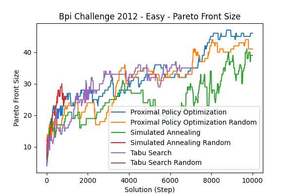 <em>Solution = Step</em></td><td><strong>Explored Solutions</strong> 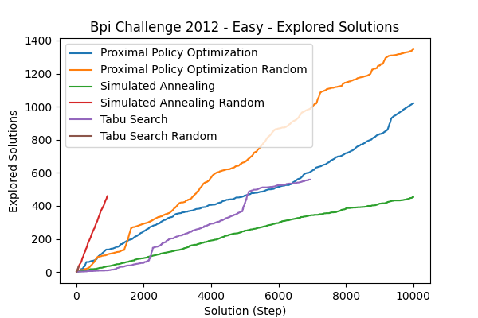 <em>Solution = Step</em></td><td><strong>New Base Solutions (Radius)</strong> 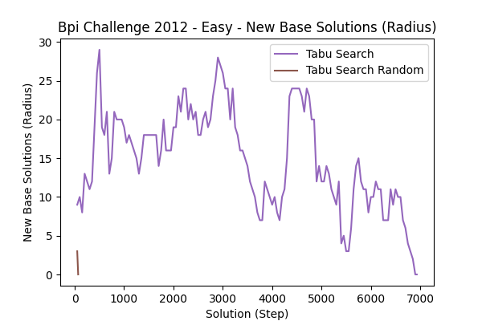 <em>Solution = Step</em></td></tr>
<tr><td><strong>New Base Solutions (Temperature)</strong> 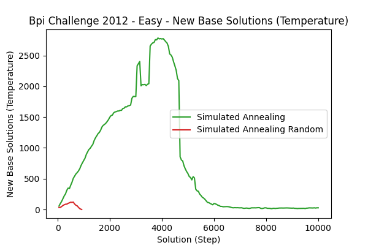 <em>Solution = Step</em></td><td><strong>Median Batch Processing Time</strong> 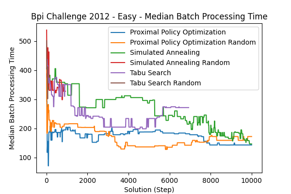 <em>Solution = Step</em></td><td><strong>Median Wait+Idle Time</strong> 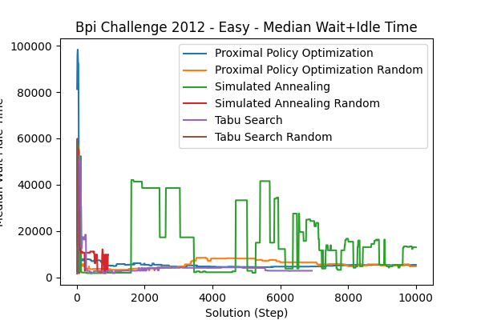 <em>Solution = Step</em></td></tr>
<tr><td><strong>Min Wait+Idle Time</strong> 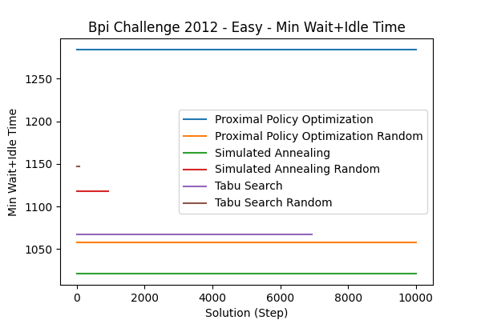 <em>Solution = Step</em></td><td><strong>Min Batch Processing Time</strong> 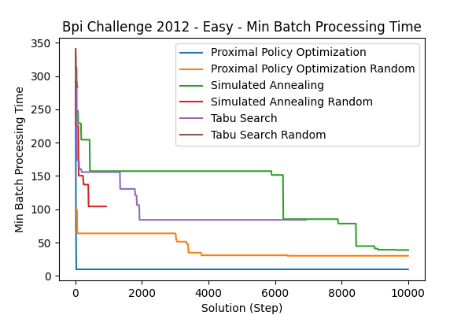 <em>Solution = Step</em></td><td><strong>Average Cycle Time</strong> 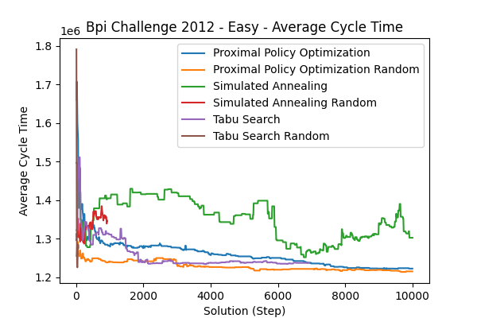 <em>Solution = Step</em></td></tr>
<tr><td><strong>Min Cycle Time</strong> 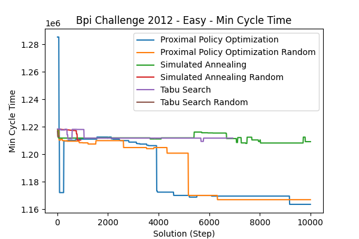 <em>Solution = Step</em></td><td><strong>Iteration Number</strong>  <em>Solution = Step</em></td><td></td></tr>
</table>

##### Summary Table (Final Values)

| Agent                               | Explored Solutions | New Base Solutions (Radius) | New Base Solutions (Temperature) | Median Batch Processing Time | Median Wait+Idle Time | Min Wait+Idle Time | Min Batch Processing Time | Average Cycle Time | Min Cycle Time | Iteration Number |
| :---------------------------------- | -----------------: | --------------------------: | -------------------------------: | ---------------------------: | --------------------: | -----------------: | ------------------------: | -----------------: | -------------: | ---------------: |
| Tabu Search                         |                559 |                           0 |                                  |                      271.506 |               2876.58 |            1066.82 |                   84.1198 |        1.23741e+06 |     1.2117e+06 |              390 |
| Simulated Annealing                 |                454 |                             |                               27 |                      146.801 |               12994.7 |            1021.14 |                   38.8925 |        1.30261e+06 |    1.20913e+06 |              602 |
| Proximal Policy Optimization        |               1020 |                             |                                  |                      143.251 |               5429.32 |            1284.11 |                   9.84884 |        1.22262e+06 |     1.1635e+06 |            10000 |
| Proximal Policy Optimization Random |               1347 |                             |                                  |                      172.202 |               4790.51 |            1057.49 |                    30.207 |        1.21544e+06 |    1.16689e+06 |            10000 |
| Tabu Search Random                  |                 35 |                           0 |                                  |                      410.999 |               1849.46 |            1146.99 |                   283.828 |        1.27674e+06 |    1.21298e+06 |               22 |
| Simulated Annealing Random          |                459 |                             |                                0 |                      327.659 |               9863.57 |            1117.53 |                   104.251 |         1.3469e+06 |    1.21027e+06 |              307 |

##### Pareto Front Images

<table><tr>
<th>Tabu Search</th>
<th>Simulated Annealing</th>
<th>Proximal Policy Optimization</th>
<th>Proximal Policy Optimization Random</th>
<th>Tabu Search Random</th>
<th>Simulated Annealing Random</th>
</tr><tr>
<td>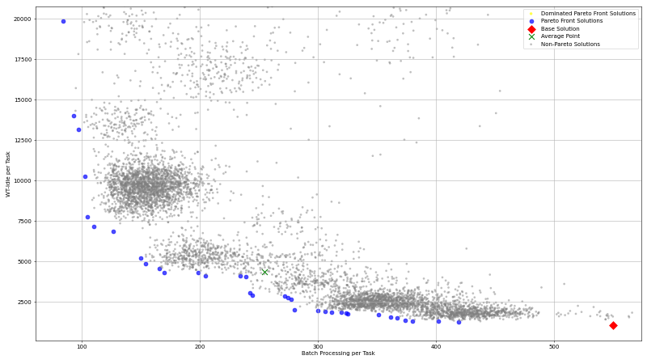</td>
<td>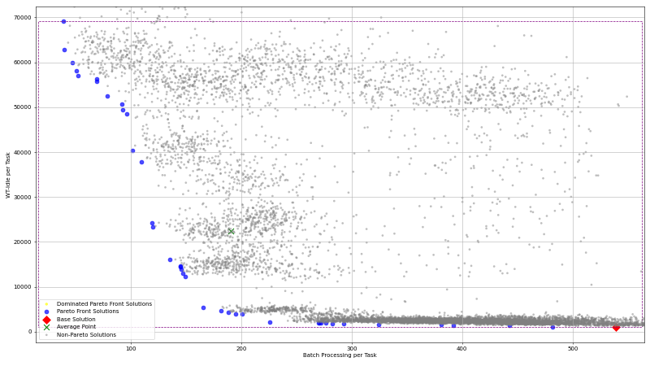</td>
<td>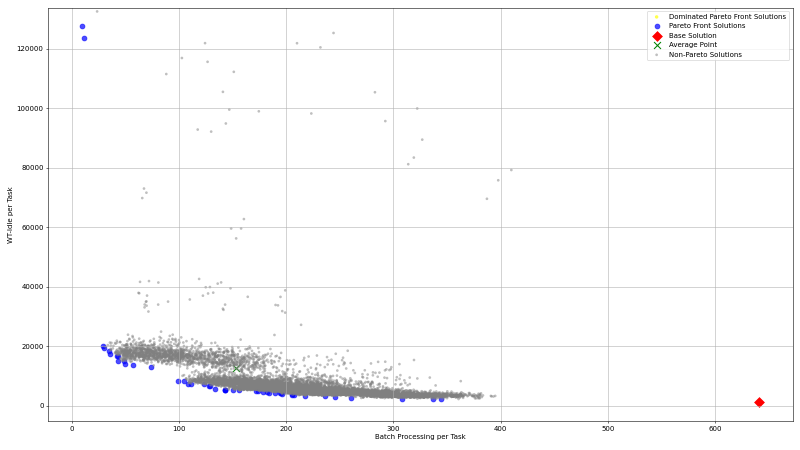</td>
<td>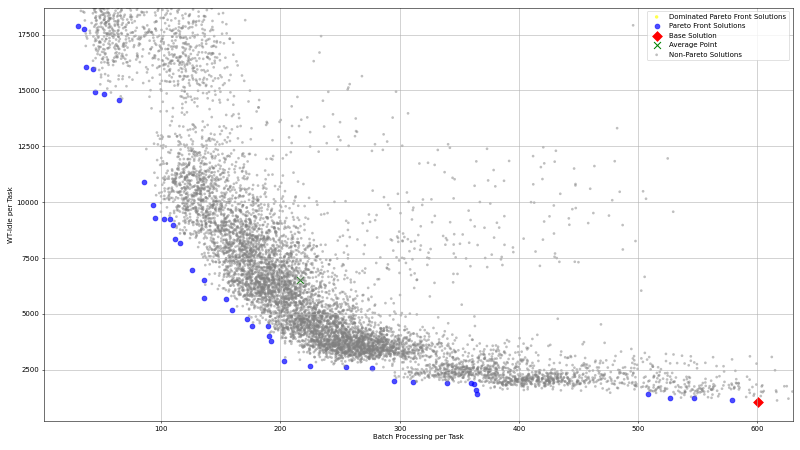</td>
<td>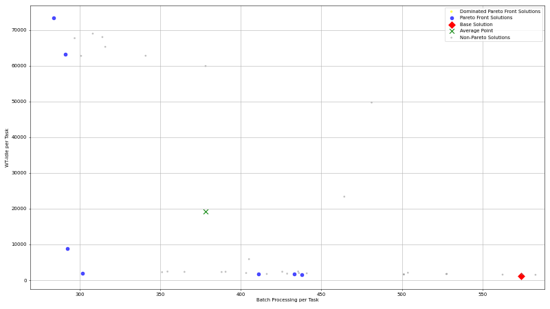</td>
<td>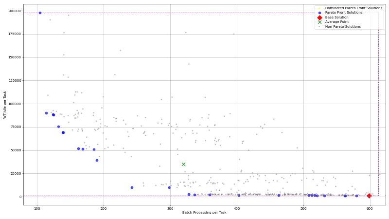</td>
</tr></table>

---

#### Hard

##### Metric Plots

<table>
<tr><td><strong>Pareto Front Size</strong> 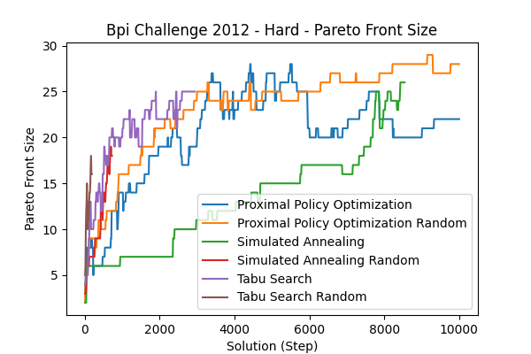 <em>Solution = Step</em></td><td><strong>Explored Solutions</strong> 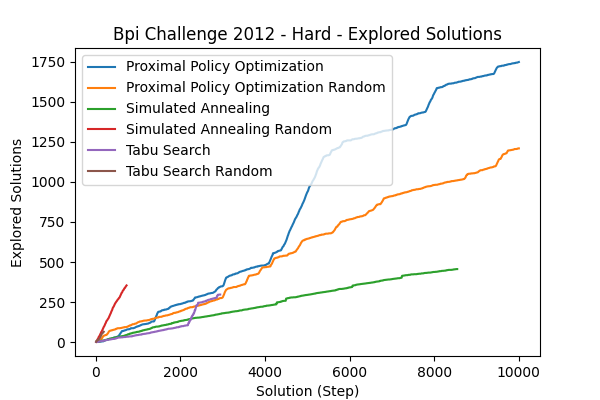 <em>Solution = Step</em></td><td><strong>New Base Solutions (Radius)</strong> 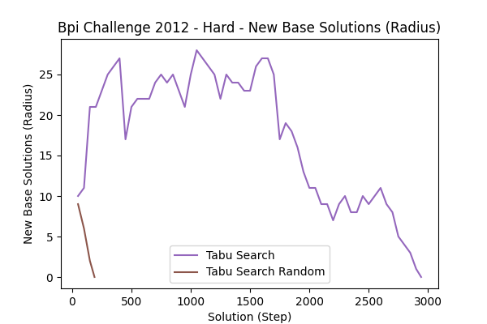 <em>Solution = Step</em></td></tr>
<tr><td><strong>New Base Solutions (Temperature)</strong> 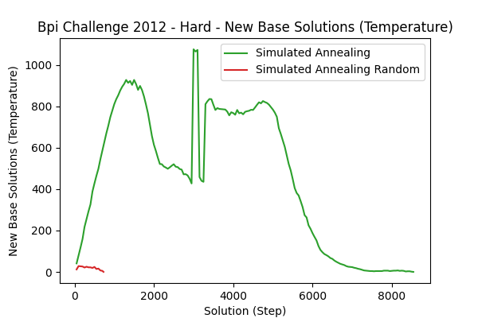 <em>Solution = Step</em></td><td><strong>Median Batch Processing Time</strong> 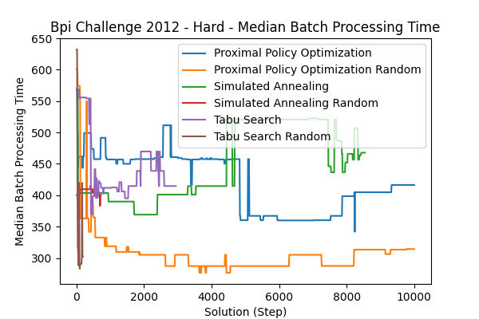 <em>Solution = Step</em></td><td><strong>Median Wait+Idle Time</strong> 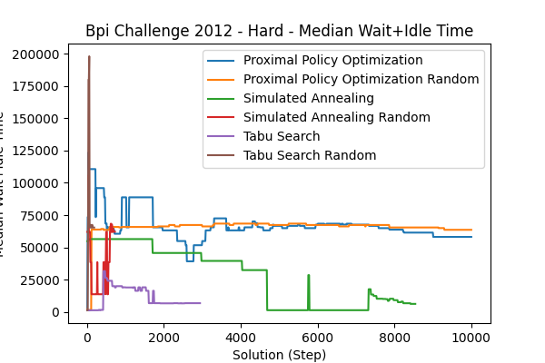 <em>Solution = Step</em></td></tr>
<tr><td><strong>Min Wait+Idle Time</strong> 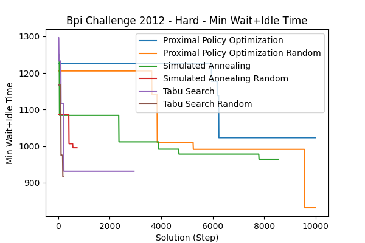 <em>Solution = Step</em></td><td><strong>Min Batch Processing Time</strong> 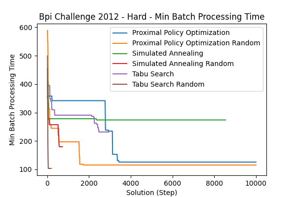 <em>Solution = Step</em></td><td><strong>Average Cycle Time</strong> 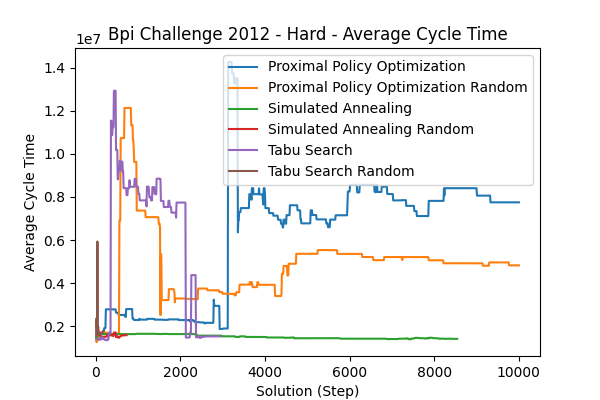 <em>Solution = Step</em></td></tr>
<tr><td><strong>Min Cycle Time</strong> 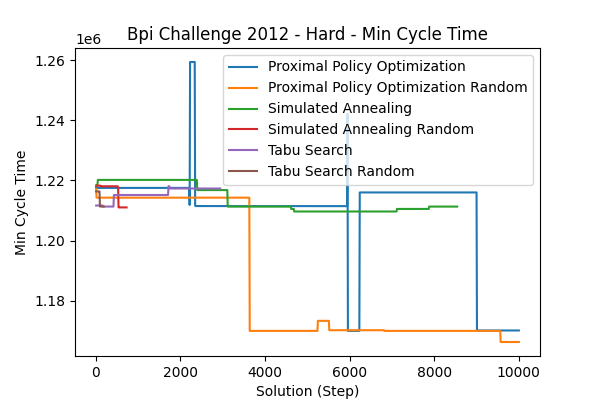 <em>Solution = Step</em></td><td><strong>Iteration Number</strong> 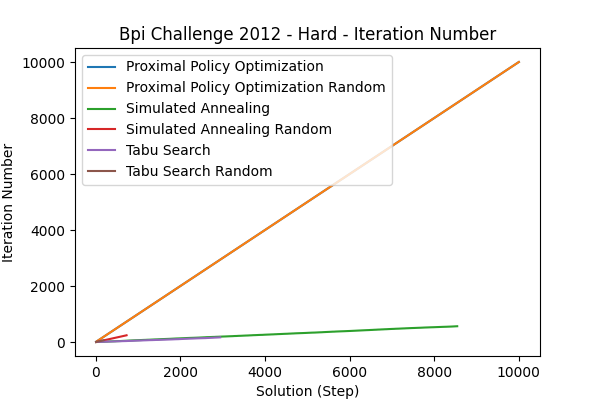 <em>Solution = Step</em></td><td></td></tr>
</table>

##### Summary Table (Final Values)

| Agent                               | Explored Solutions | New Base Solutions (Radius) | New Base Solutions (Temperature) | Median Batch Processing Time | Median Wait+Idle Time | Min Wait+Idle Time | Min Batch Processing Time | Average Cycle Time | Min Cycle Time | Iteration Number |
| :---------------------------------- | -----------------: | --------------------------: | -------------------------------: | ---------------------------: | --------------------: | -----------------: | ------------------------: | -----------------: | -------------: | ---------------: |
| Simulated Annealing Random          |                354 |                             |                                0 |                      400.248 |               62184.1 |             995.72 |                   179.726 |        1.58524e+06 |    1.21104e+06 |              242 |
| Simulated Annealing                 |                456 |                             |                                0 |                      467.688 |               6320.09 |            964.332 |                   273.924 |        1.41545e+06 |    1.21131e+06 |              565 |
| Tabu Search                         |                297 |                           0 |                                  |                       414.72 |               6866.26 |            931.426 |                   231.571 |        1.52894e+06 |    1.21731e+06 |              168 |
| Tabu Search Random                  |                 65 |                           0 |                                  |                      302.327 |               65421.7 |             916.78 |                   103.398 |         1.7864e+06 |    1.21133e+06 |               62 |
| Proximal Policy Optimization        |               1748 |                             |                                  |                      416.373 |               58168.2 |            1023.32 |                   125.748 |        7.74888e+06 |    1.17014e+06 |            10000 |
| Proximal Policy Optimization Random |               1209 |                             |                                  |                      314.348 |               63653.1 |            831.471 |                   115.456 |        4.82441e+06 |     1.1663e+06 |            10000 |

##### Pareto Front Images

<table><tr>
<th>Simulated Annealing Random</th>
<th>Simulated Annealing</th>
<th>Tabu Search</th>
<th>Tabu Search Random</th>
<th>Proximal Policy Optimization</th>
<th>Proximal Policy Optimization Random</th>
</tr><tr>
<td>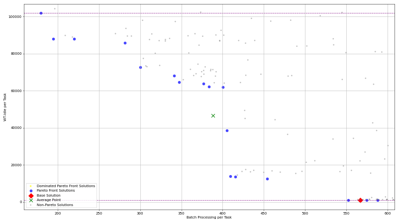</td>
<td>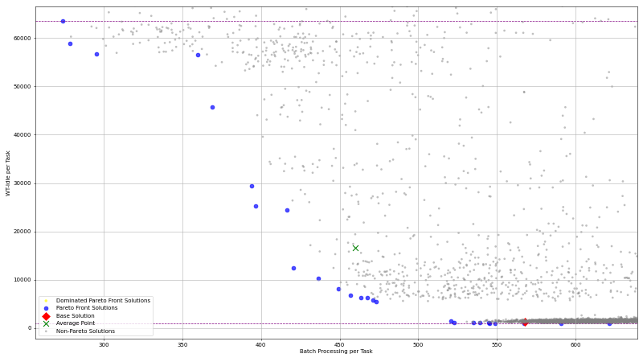</td>
<td>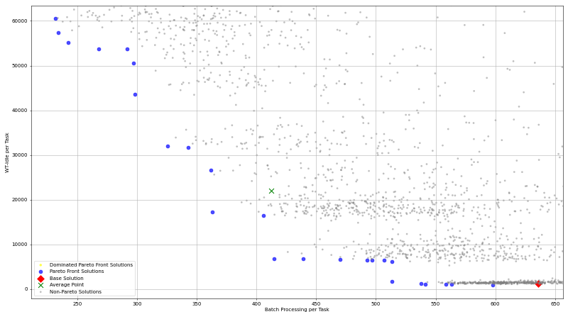</td>
<td>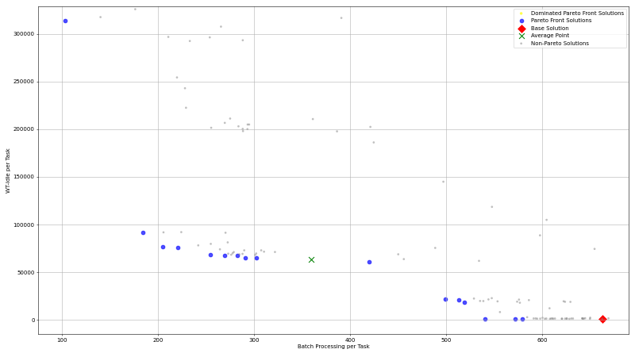</td>
<td>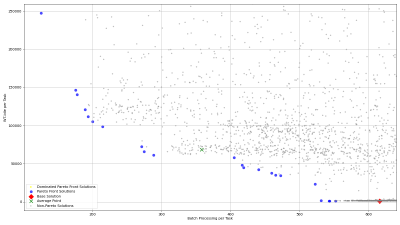</td>
<td>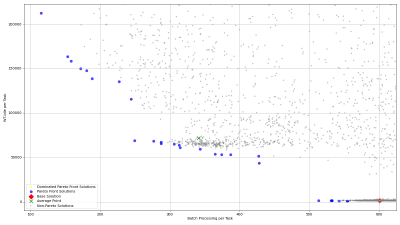</td>
</tr></table>

---

#### Mid

##### Metric Plots

<table>
<tr><td><strong>Pareto Front Size</strong> 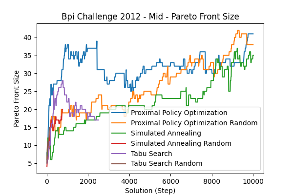 <em>Solution = Step</em></td><td><strong>Explored Solutions</strong> 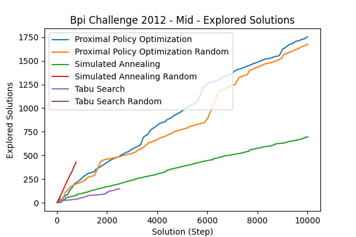 <em>Solution = Step</em></td><td><strong>New Base Solutions (Radius)</strong> 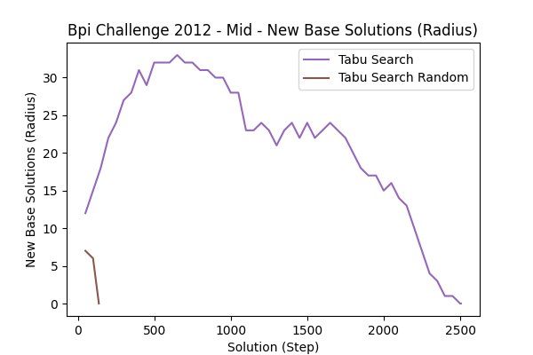 <em>Solution = Step</em></td></tr>
<tr><td><strong>New Base Solutions (Temperature)</strong>  <em>Solution = Step</em></td><td><strong>Median Batch Processing Time</strong> 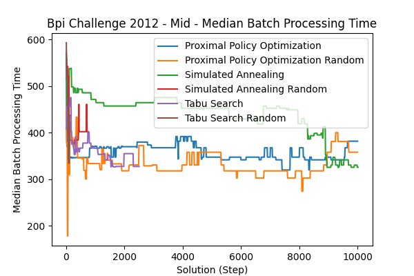 <em>Solution = Step</em></td><td><strong>Median Wait+Idle Time</strong> 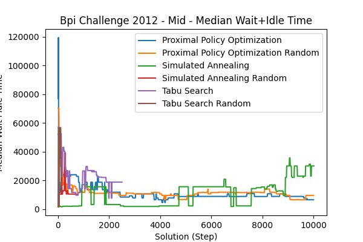 <em>Solution = Step</em></td></tr>
<tr><td><strong>Min Wait+Idle Time</strong>  <em>Solution = Step</em></td><td><strong>Min Batch Processing Time</strong> 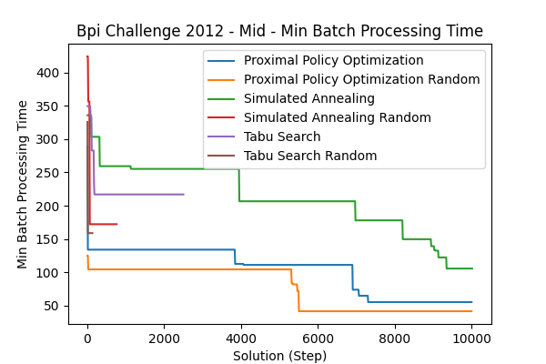 <em>Solution = Step</em></td><td><strong>Average Cycle Time</strong> 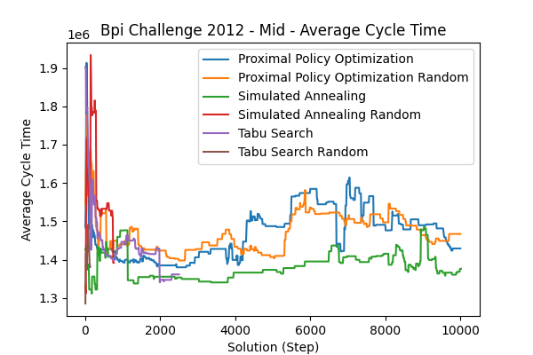 <em>Solution = Step</em></td></tr>
<tr><td><strong>Min Cycle Time</strong> 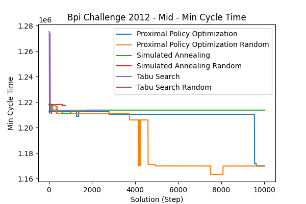 <em>Solution = Step</em></td><td><strong>Iteration Number</strong> 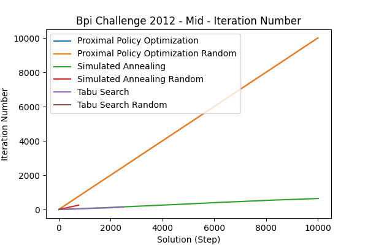 <em>Solution = Step</em></td><td></td></tr>
</table>

##### Summary Table (Final Values)

| Agent                               | Explored Solutions | New Base Solutions (Radius) | New Base Solutions (Temperature) | Median Batch Processing Time | Median Wait+Idle Time | Min Wait+Idle Time | Min Batch Processing Time | Average Cycle Time | Min Cycle Time | Iteration Number |
| :---------------------------------- | -----------------: | --------------------------: | -------------------------------: | ---------------------------: | --------------------: | -----------------: | ------------------------: | -----------------: | -------------: | ---------------: |
| Proximal Policy Optimization        |               1754 |                             |                                  |                      381.689 |               6475.52 |            1309.49 |                   55.4108 |        1.42909e+06 |       1.17e+06 |            10000 |
| Simulated Annealing                 |                696 |                             |                                9 |                      325.567 |               29975.7 |             1019.1 |                   105.748 |        1.37587e+06 |    1.21377e+06 |              642 |
| Tabu Search Random                  |                 50 |                           0 |                                  |                      436.944 |               15197.9 |            1274.86 |                   158.886 |        1.38085e+06 |    1.21129e+06 |               45 |
| Tabu Search                         |                146 |                           0 |                                  |                      327.359 |               18741.5 |            1241.84 |                    216.94 |        1.36132e+06 |    1.21358e+06 |              133 |
| Simulated Annealing Random          |                429 |                             |                                0 |                      402.162 |               10419.2 |            1074.47 |                   172.256 |        1.39163e+06 |    1.21732e+06 |              255 |
| Proximal Policy Optimization Random |               1677 |                             |                                  |                      358.013 |               9448.71 |            1054.15 |                   41.6873 |        1.46688e+06 |       1.17e+06 |            10000 |

##### Pareto Front Images

<table><tr>
<th>Proximal Policy Optimization</th>
<th>Simulated Annealing</th>
<th>Tabu Search Random</th>
<th>Tabu Search</th>
<th>Simulated Annealing Random</th>
<th>Proximal Policy Optimization Random</th>
</tr><tr>
<td>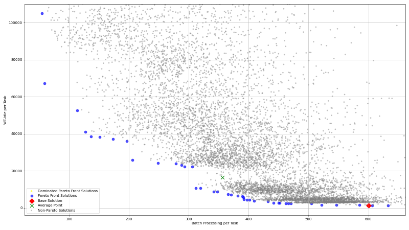</td>
<td>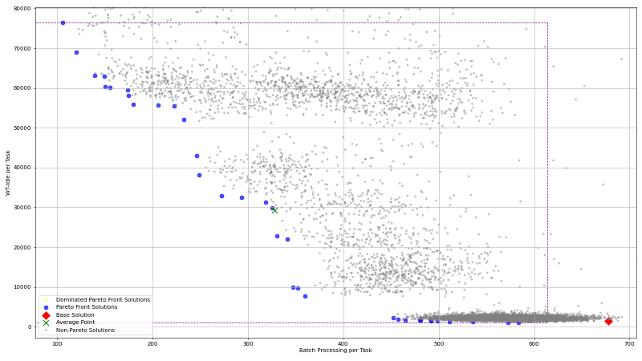</td>
<td>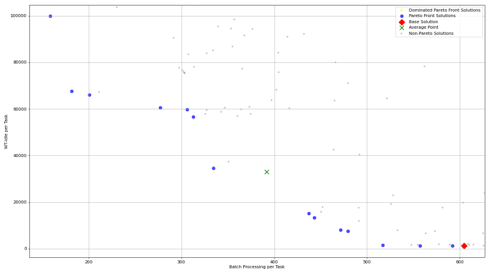</td>
<td>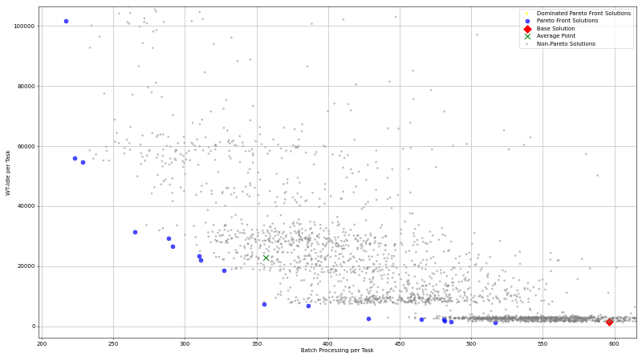</td>
<td>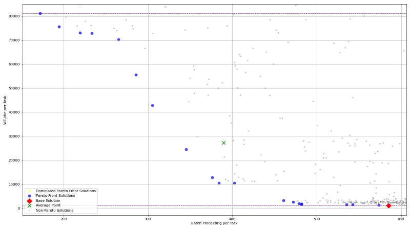</td>
<td>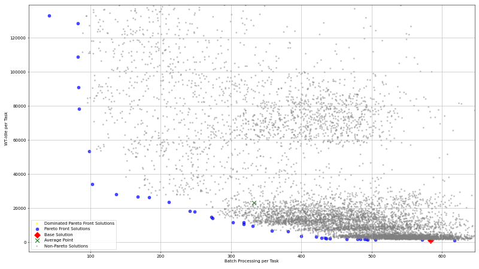</td>
</tr></table>

---

---

### Bpi Challenge 2017

#### Analyzer Overview

##### Pareto Size

| Agent / Reference | Easy  | Mid   | Hard  |
| ----------------- | ----- | ----- | ----- |
| Reference         | 68,00 | 34,00 | 22,00 |
| Reference Random  | 46,00 | 31,00 | 9,00  |
| Reference Optimos | 59,00 | 35,00 | 21,00 |
| SA                | 34,00 | 26,00 | 25,00 |
| Tabu Search       | 39,00 | 36,00 | 2,00  |
| PPO               | 40,00 | 32,00 | 16,00 |
| Tabu Random       | 19,00 | 11,00 | 4,00  |
| SA Random         | 19,00 | 21,00 | 7,00  |
| PPO Random        | 33,00 | 32,00 | 12,00 |

 

##### Hyperarea Ratio

| Agent / Reference | Easy | Mid  | Hard |
| ----------------- | ---- | ---- | ---- |
| Reference Random  | 1,00 | 0,96 | 1,00 |
| Reference Optimos | 1,00 | 1,00 | 1,00 |
| SA                | 0,81 | 0,93 | 1,00 |
| Tabu Search       | 0,95 | 0,98 | 1,00 |
| PPO               | 1,00 | 0,99 | 1,00 |
| Tabu Random       | 0,85 | 0,86 | 1,00 |
| SA Random         | 0,86 | 0,91 | 1,00 |
| PPO Random        | 1,00 | 0,95 | 1,00 |

 

##### Hausdorff

| Agent / Reference | Easy      | Mid       | Hard       |
| ----------------- | --------- | --------- | ---------- |
| Reference Random  | 79,08     | 21.159,01 | 7.660,72   |
| Reference Optimos | 4.916,98  | 442,87    | 1.114,51   |
| SA                | 13.998,34 | 3.563,03  | 764,08     |
| Tabu Search       | 959,61    | 7.012,05  | 21.714,03  |
| PPO               | 5.836,54  | 2.629,91  | 118.980,27 |
| Tabu Random       | 10.561,28 | 4.241,19  | 14.593,91  |
| SA Random         | 2.472,96  | 20.629,72 | 7.716,23   |
| PPO Random        | 152,81    | 8.273,79  | 24.916,06  |

 

##### Delta

| Agent / Reference | Easy | Mid  | Hard |
| ----------------- | ---- | ---- | ---- |
| Reference Random  | 1,07 | 1,33 | 1,43 |
| Reference Optimos | 1,36 | 1,27 | 0,95 |
| SA                | 1,30 | 1,03 | 1,06 |
| Tabu Search       | 0,89 | 1,12 | 1,00 |
| PPO               | 1,34 | 1,29 | 0,96 |
| Tabu Random       | 1,16 | 1,22 | 0,80 |
| SA Random         | 1,38 | 1,09 | 1,36 |
| PPO Random        | 1,03 | 1,07 | 1,01 |

 

##### Purity

| Agent / Reference | Easy | Mid  | Hard |
| ----------------- | ---- | ---- | ---- |
| Reference Random  | 0,31 | 0,26 | 0,18 |
| Reference Optimos | 0,69 | 0,74 | 0,82 |
| SA                | 0,29 | 0,21 | 0,68 |
| Tabu Search       | 0,34 | 0,26 | 0,00 |
| PPO               | 0,10 | 0,26 | 0,14 |
| Tabu Random       | 0,01 | 0,00 | 0,00 |
| SA Random         | 0,06 | 0,00 | 0,14 |
| PPO Random        | 0,26 | 0,26 | 0,05 |

 

##### Avg Cycle Time

| Agent / Reference | Easy       | Mid          | Hard          |
| ----------------- | ---------- | ------------ | ------------- |
| Base              | 852.467,43 | 852.710,18   | 852.702,68    |
| Reference         | 839.940,98 | 990.747,76   | 991.046,77    |
| Reference Random  | 846.410,93 | 966.070,75   | 996.937,34    |
| Reference Optimos | 842.130,74 | 988.114,18   | 985.012,14    |
| SA                | 941.847,55 | 951.636,32   | 964.062,54    |
| Tabu Search       | 861.506,82 | 920.061,23   | 4.712.685,16  |
| PPO               | 852.272,83 | 1.060.722,98 | 17.301.316,04 |
| Tabu Random       | 894.732,99 | 1.100.928,34 | 914.196,55    |
| SA Random         | 868.914,85 | 1.143.350,67 | 1.044.067,34  |
| PPO Random        | 844.653,56 | 926.197,95   | 15.219.855,60 |

 

##### Best Cycle Time

| Agent / Reference | Easy       | Mid        | Hard       |
| ----------------- | ---------- | ---------- | ---------- |
| Base              | 852.467,43 | 852.710,18 | 852.702,68 |
| Reference         | 696.456,31 | 840.352,05 | 837.243,10 |
| Reference Random  | 773.072,94 | 838.151,30 | 837.243,10 |
| Reference Optimos | 622.341,70 | 840.352,05 | 838.174,03 |
| SA                | 847.721,61 | 846.218,83 | 845.162,58 |
| Tabu Search       | 696.456,31 | 846.408,80 | 852.516,38 |
| PPO               | 622.341,70 | 825.269,43 | 838.174,03 |
| Tabu Random       | 851.317,68 | 852.455,13 | 849.882,17 |
| SA Random         | 850.046,38 | 848.571,22 | 851.497,36 |
| PPO Random        | 773.072,94 | 833.972,70 | 837.243,10 |

 

#### Easy

##### Metric Plots

<table>
<tr><td><strong>Pareto Front Size</strong> 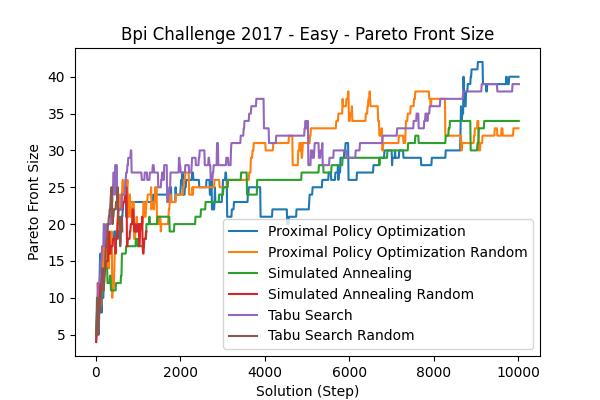 <em>Solution = Step</em></td><td><strong>Explored Solutions</strong> 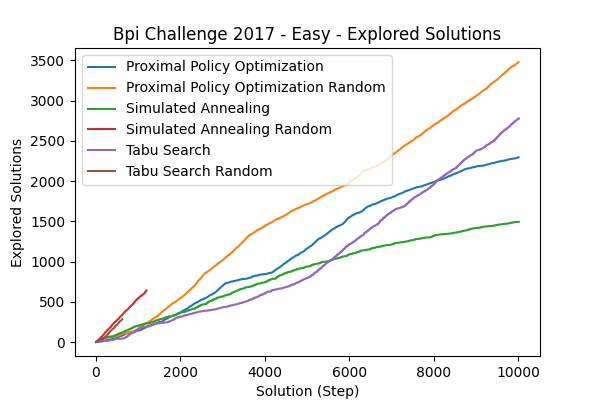 <em>Solution = Step</em></td><td><strong>New Base Solutions (Radius)</strong> 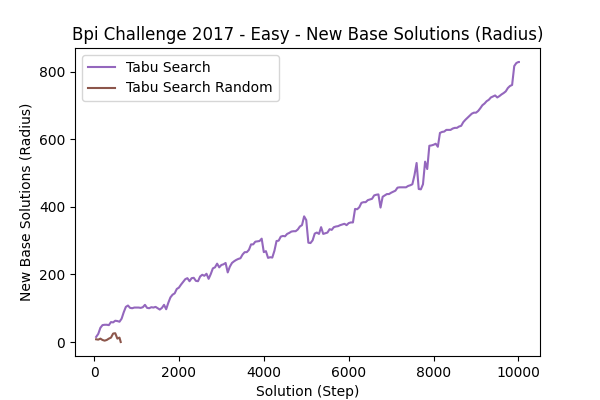 <em>Solution = Step</em></td></tr>
<tr><td><strong>New Base Solutions (Temperature)</strong> 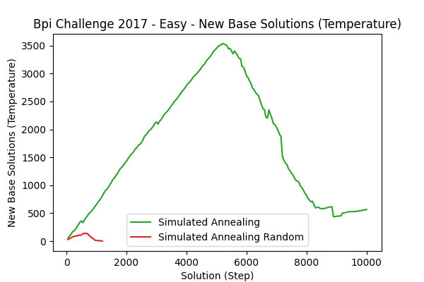 <em>Solution = Step</em></td><td><strong>Median Batch Processing Time</strong> 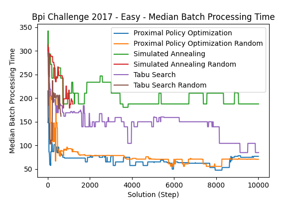 <em>Solution = Step</em></td><td><strong>Median Wait+Idle Time</strong> 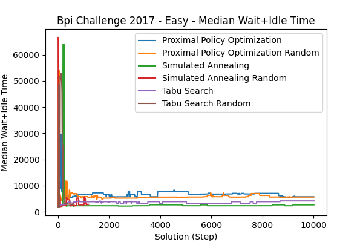 <em>Solution = Step</em></td></tr>
<tr><td><strong>Min Wait+Idle Time</strong> 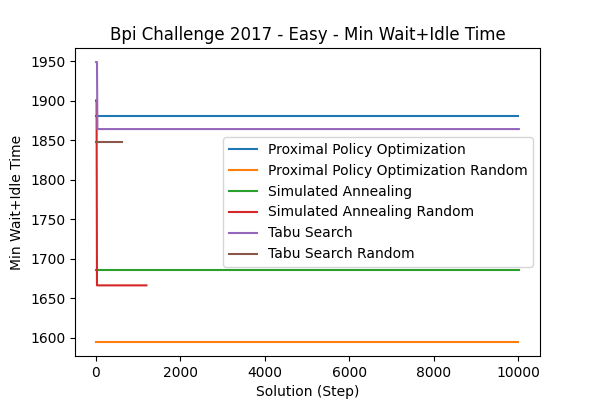 <em>Solution = Step</em></td><td><strong>Min Batch Processing Time</strong> 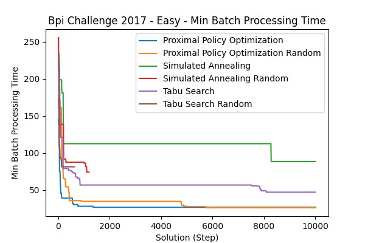 <em>Solution = Step</em></td><td><strong>Average Cycle Time</strong>  <em>Solution = Step</em></td></tr>
<tr><td><strong>Min Cycle Time</strong> 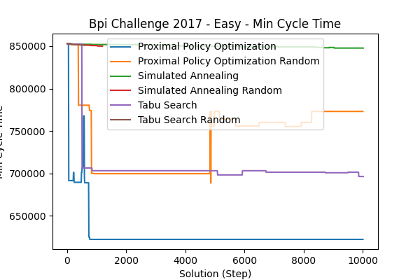 <em>Solution = Step</em></td><td><strong>Iteration Number</strong> 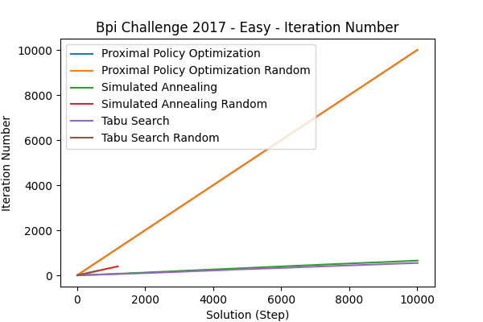 <em>Solution = Step</em></td><td></td></tr>
</table>

##### Summary Table (Final Values)

| Agent                               | Explored Solutions | New Base Solutions (Radius) | New Base Solutions (Temperature) | Median Batch Processing Time | Median Wait+Idle Time | Min Wait+Idle Time | Min Batch Processing Time | Average Cycle Time | Min Cycle Time | Iteration Number |
| :---------------------------------- | -----------------: | --------------------------: | -------------------------------: | ---------------------------: | --------------------: | -----------------: | ------------------------: | -----------------: | -------------: | ---------------: |
| Simulated Annealing                 |               1495 |                             |                              564 |                      187.678 |                2671.3 |            1685.37 |                   88.4875 |             941853 |         847722 |              655 |
| Proximal Policy Optimization        |               2296 |                             |                                  |                      76.9091 |               5744.85 |             1880.5 |                   26.7912 |             851855 |         622342 |            10000 |
| Tabu Search Random                  |                285 |                           0 |                                  |                      161.651 |               2953.78 |            1847.12 |                   81.3977 |             899299 |         851318 |              208 |
| Tabu Search                         |               2778 |                         829 |                                  |                       84.846 |               4172.09 |            1863.92 |                   47.1866 |             878877 |         696456 |              548 |
| Simulated Annealing Random          |                641 |                             |                                0 |                      187.088 |               2868.49 |            1666.28 |                   74.1311 |             869780 |         850046 |              398 |
| Proximal Policy Optimization Random |               3480 |                             |                                  |                       70.704 |                5654.5 |            1594.65 |                   26.1549 |             846913 |         773073 |            10000 |

##### Pareto Front Images

<table><tr>
<th>Simulated Annealing</th>
<th>Proximal Policy Optimization</th>
<th>Tabu Search Random</th>
<th>Tabu Search</th>
<th>Simulated Annealing Random</th>
<th>Proximal Policy Optimization Random</th>
</tr><tr>
<td>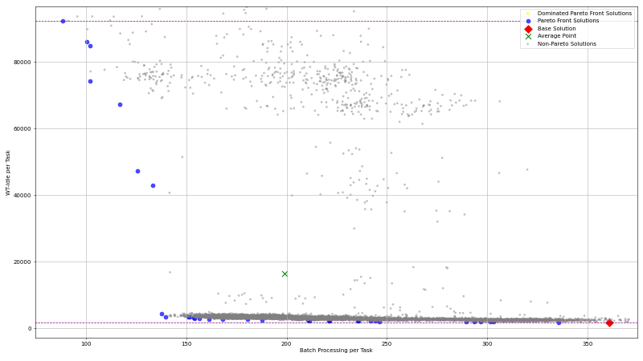</td>
<td></td>
<td>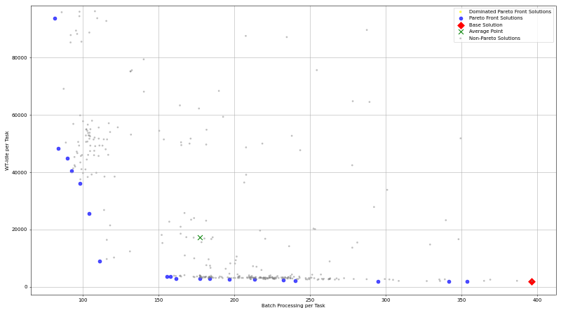</td>
<td>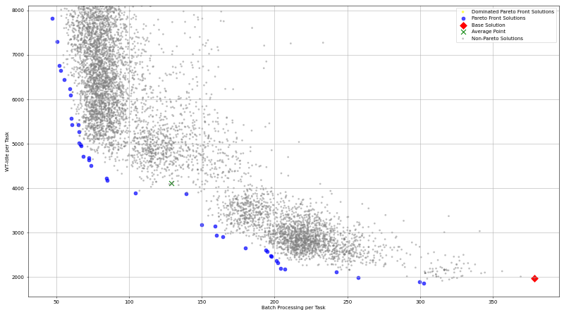</td>
<td>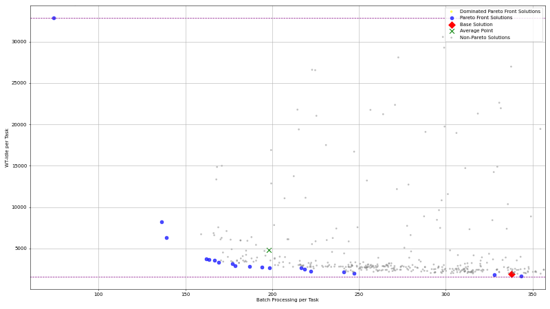</td>
<td>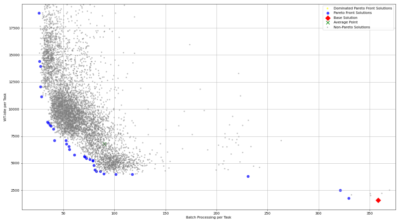</td>
</tr></table>

---

#### Hard

##### Metric Plots

<table>
<tr><td><strong>Pareto Front Size</strong> 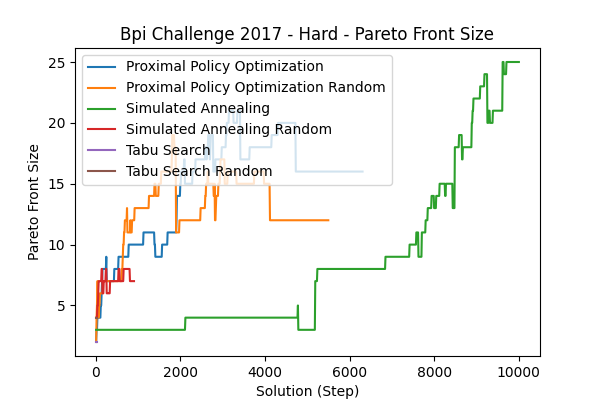 <em>Solution = Step</em></td><td><strong>Explored Solutions</strong> 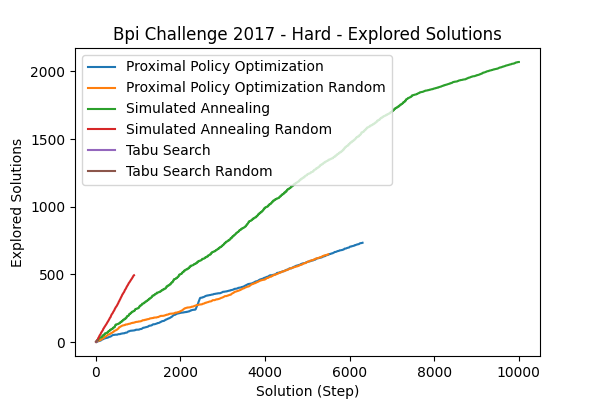 <em>Solution = Step</em></td><td><strong>New Base Solutions (Radius)</strong> 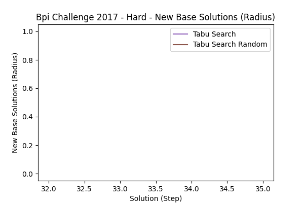 <em>Solution = Step</em></td></tr>
<tr><td><strong>New Base Solutions (Temperature)</strong> 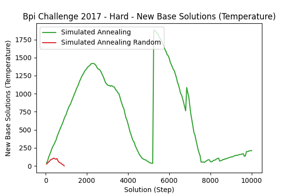 <em>Solution = Step</em></td><td><strong>Median Batch Processing Time</strong> 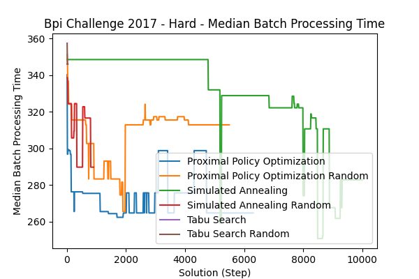 <em>Solution = Step</em></td><td><strong>Median Wait+Idle Time</strong> 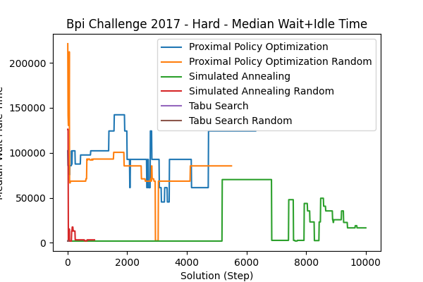 <em>Solution = Step</em></td></tr>
<tr><td><strong>Min Wait+Idle Time</strong> 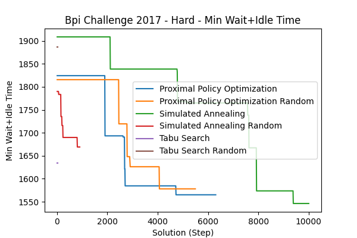 <em>Solution = Step</em></td><td><strong>Min Batch Processing Time</strong> 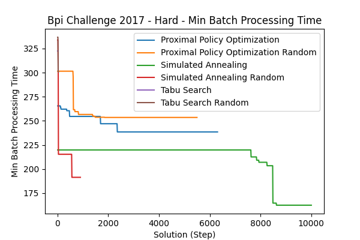 <em>Solution = Step</em></td><td><strong>Average Cycle Time</strong> 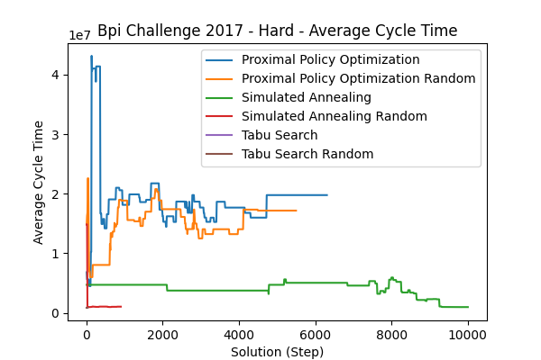 <em>Solution = Step</em></td></tr>
<tr><td><strong>Min Cycle Time</strong> 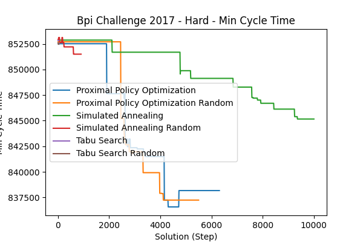 <em>Solution = Step</em></td><td><strong>Iteration Number</strong> 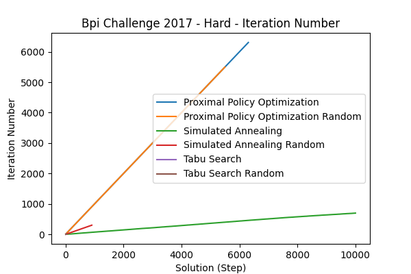 <em>Solution = Step</em></td><td></td></tr>
</table>

##### Summary Table (Final Values)

| Agent                               | Explored Solutions | New Base Solutions (Radius) | New Base Solutions (Temperature) | Median Batch Processing Time | Median Wait+Idle Time | Min Wait+Idle Time | Min Batch Processing Time | Average Cycle Time | Min Cycle Time | Iteration Number |
| :---------------------------------- | -----------------: | --------------------------: | -------------------------------: | ---------------------------: | --------------------: | -----------------: | ------------------------: | -----------------: | -------------: | ---------------: |
| Proximal Policy Optimization        |                734 |                             |                                  |                      264.749 |                124297 |            1565.19 |                    238.49 |         1.9778e+07 |         838174 |             6309 |
| Proximal Policy Optimization Random |                649 |                             |                                  |                      312.849 |               85486.2 |            1578.08 |                   253.508 |        1.71763e+07 |         837243 |             5499 |
| Tabu Search                         |                  5 |                           1 |                                  |                      345.837 |               1913.78 |            1633.79 |                    322.47 |             853221 |         852804 |                4 |
| Simulated Annealing Random          |                494 |                             |                                0 |                      289.753 |               3270.74 |             1669.1 |                   191.397 |        1.04407e+06 |         851497 |              300 |
| Tabu Search Random                  |                 13 |                           0 |                                  |                      346.008 |               1940.38 |            1886.98 |                   300.681 |             884157 |         852467 |               10 |
| Simulated Annealing                 |               2069 |                             |                              211 |                      282.783 |               16583.8 |             1546.3 |                    162.47 |             974249 |         845163 |              698 |

##### Pareto Front Images

<table><tr>
<th>Proximal Policy Optimization</th>
<th>Proximal Policy Optimization Random</th>
<th>Tabu Search</th>
<th>Simulated Annealing Random</th>
<th>Tabu Search Random</th>
<th>Simulated Annealing</th>
</tr><tr>
<td>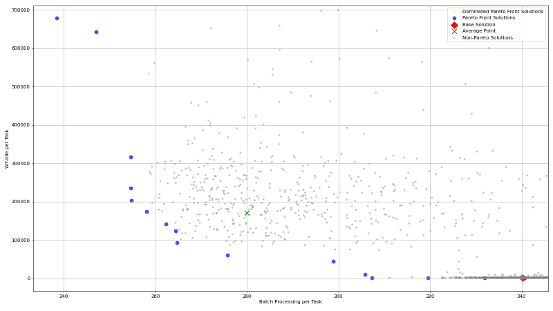</td>
<td>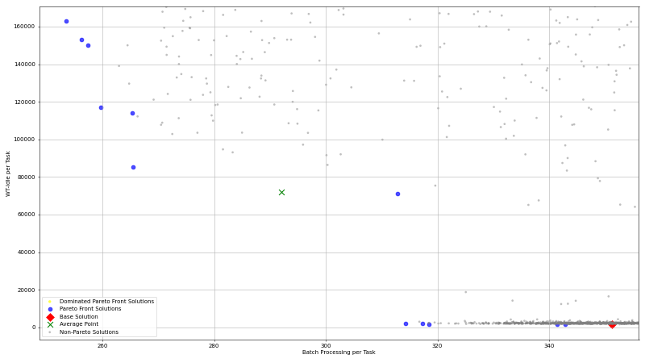</td>
<td>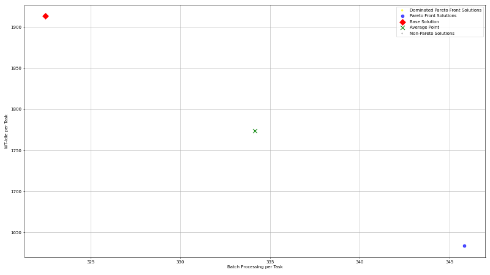</td>
<td>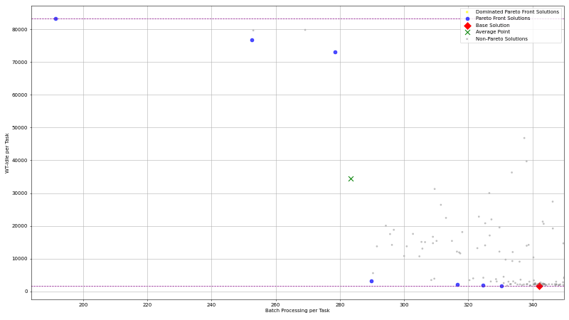</td>
<td>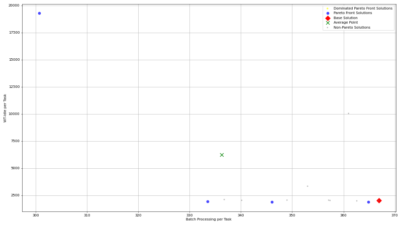</td>
<td>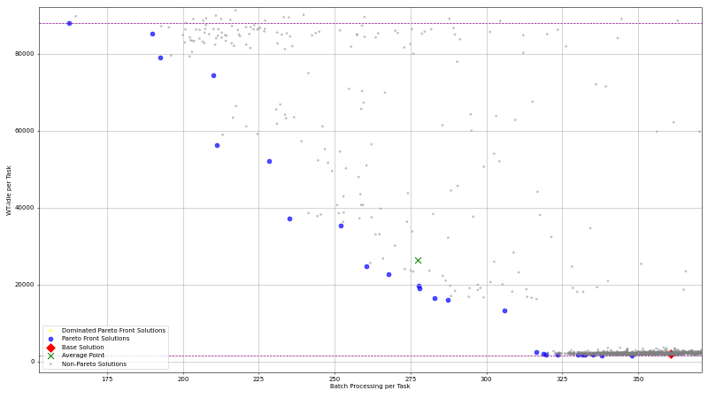</td>
</tr></table>

---

#### Mid

##### Metric Plots

<table>
<tr><td><strong>Pareto Front Size</strong> 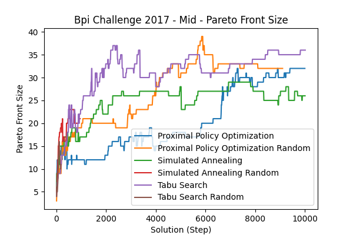 <em>Solution = Step</em></td><td><strong>Explored Solutions</strong> 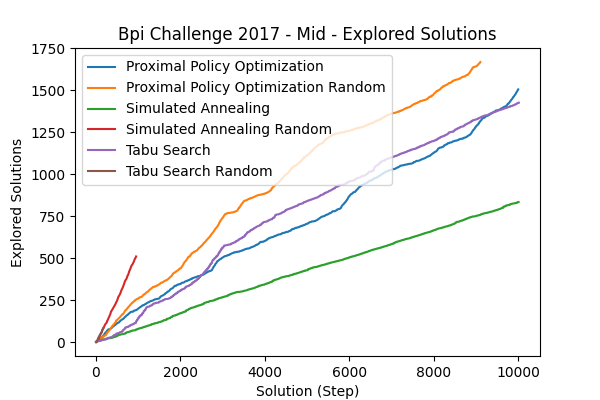 <em>Solution = Step</em></td><td><strong>New Base Solutions (Radius)</strong> 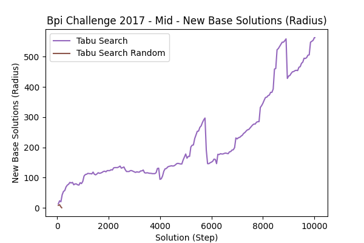 <em>Solution = Step</em></td></tr>
<tr><td><strong>New Base Solutions (Temperature)</strong> 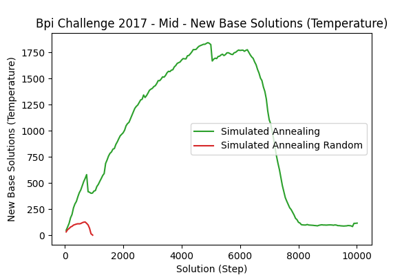 <em>Solution = Step</em></td><td><strong>Median Batch Processing Time</strong> 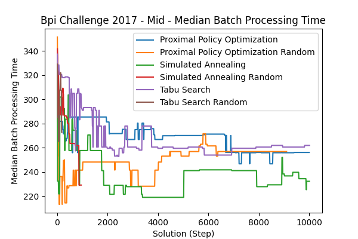 <em>Solution = Step</em></td><td><strong>Median Wait+Idle Time</strong> 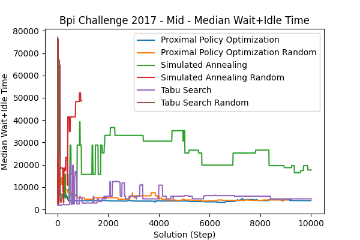 <em>Solution = Step</em></td></tr>
<tr><td><strong>Min Wait+Idle Time</strong> 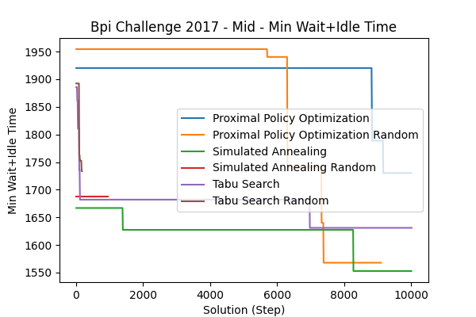 <em>Solution = Step</em></td><td><strong>Min Batch Processing Time</strong> 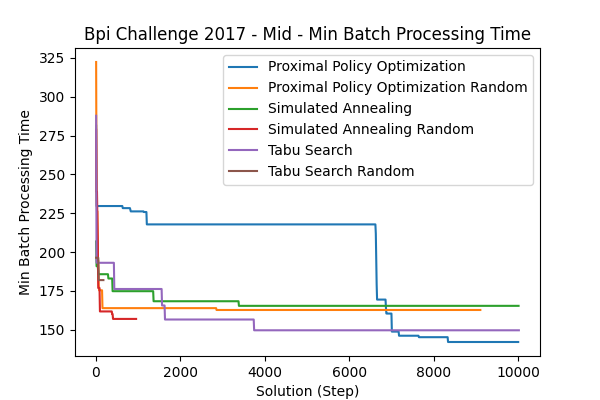 <em>Solution = Step</em></td><td><strong>Average Cycle Time</strong>  <em>Solution = Step</em></td></tr>
<tr><td><strong>Min Cycle Time</strong> 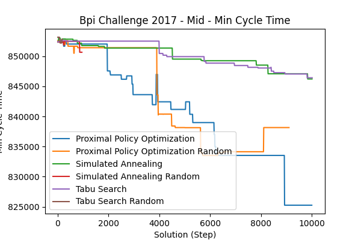 <em>Solution = Step</em></td><td><strong>Iteration Number</strong> 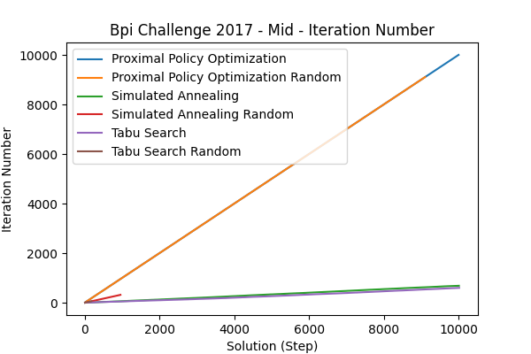 <em>Solution = Step</em></td><td></td></tr>
</table>

##### Summary Table (Final Values)

| Agent                               | Explored Solutions | New Base Solutions (Radius) | New Base Solutions (Temperature) | Median Batch Processing Time | Median Wait+Idle Time | Min Wait+Idle Time | Min Batch Processing Time | Average Cycle Time | Min Cycle Time | Iteration Number |
| :---------------------------------- | -----------------: | --------------------------: | -------------------------------: | ---------------------------: | --------------------: | -----------------: | ------------------------: | -----------------: | -------------: | ---------------: |
| Simulated Annealing Random          |                511 |                             |                                0 |                      229.168 |                 48541 |            1687.05 |                   157.022 |        1.11572e+06 |         850648 |              317 |
| Tabu Search Random                  |                 85 |                           0 |                                  |                      272.658 |               5366.21 |            1733.68 |                   182.011 |        1.12352e+06 |         852813 |               59 |
| Simulated Annealing                 |                835 |                             |                              115 |                      232.291 |               17700.8 |            1552.83 |                    165.44 |             955819 |         846219 |              684 |
| Tabu Search                         |               1426 |                         563 |                                  |                      261.936 |               4764.39 |               1631 |                   149.707 |             924136 |         846409 |              599 |
| Proximal Policy Optimization Random |               1668 |                             |                                  |                      256.863 |               4246.43 |             1567.9 |                   162.776 |             933243 |         838151 |             9105 |
| Proximal Policy Optimization        |               1505 |                             |                                  |                      256.137 |               3996.74 |            1730.14 |                   142.168 |        1.02846e+06 |         825269 |            10000 |

##### Pareto Front Images

<table><tr>
<th>Simulated Annealing Random</th>
<th>Tabu Search Random</th>
<th>Simulated Annealing</th>
<th>Tabu Search</th>
<th>Proximal Policy Optimization Random</th>
<th>Proximal Policy Optimization</th>
</tr><tr>
<td>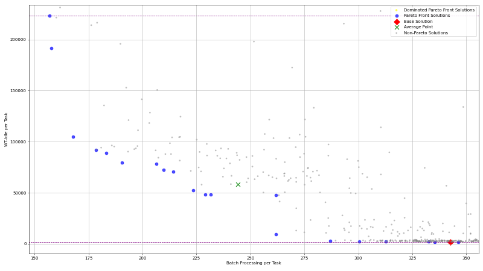</td>
<td>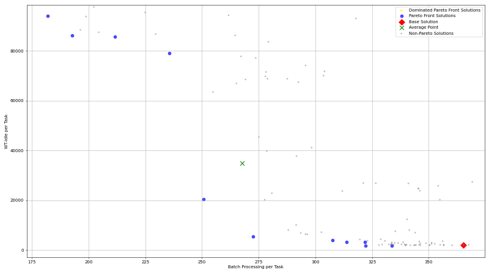</td>
<td>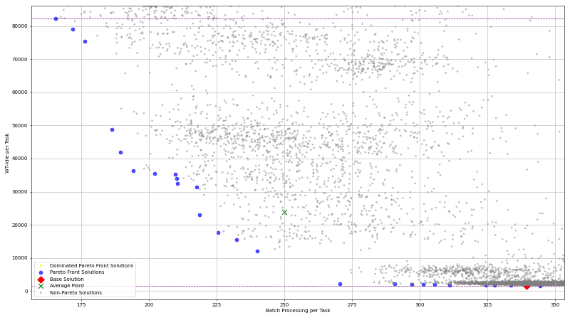</td>
<td></td>
<td>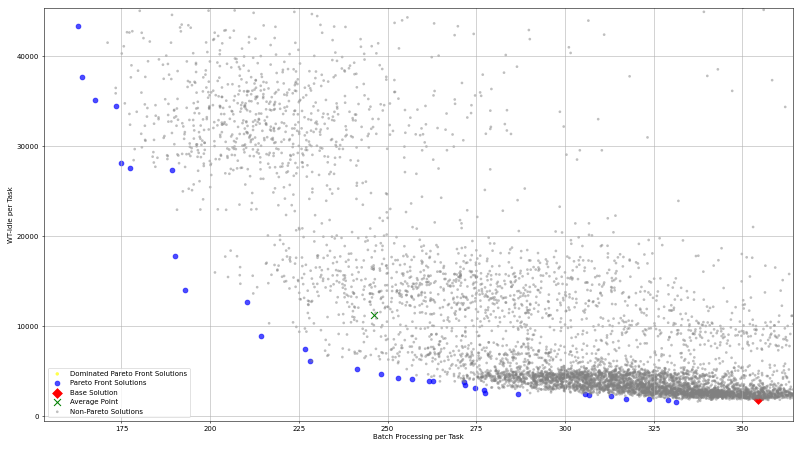</td>
<td>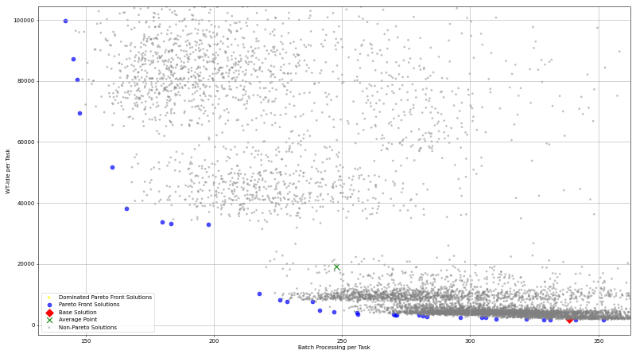</td>
</tr></table>

---

---

### Bpic2019 Das

#### Analyzer Overview

##### Pareto Size

| Agent / Reference | Easy  | Mid   | Hard  |
| ----------------- | ----- | ----- | ----- |
| Reference         | 22,00 | 20,00 | 21,00 |
| Reference Random  | 19,00 | 16,00 | 6,00  |
| Reference Optimos | 15,00 | 12,00 | 21,00 |
| SA                | 6,00  | 7,00  | 12,00 |
| Tabu Search       | 2,00  | 8,00  | 20,00 |
| PPO               | 19,00 | 1,00  | 3,00  |
| Tabu Random       | 1,00  | 1,00  | 5,00  |
| SA Random         | 8,00  | 9,00  | 2,00  |
| PPO Random        | 21,00 | 19,00 | 1,00  |

 

##### Hyperarea Ratio

| Agent / Reference | Easy | Mid  | Hard |
| ----------------- | ---- | ---- | ---- |
| Reference Random  | 1,00 | 1,00 | 1,00 |
| Reference Optimos | 1,00 | 0,97 | 1,00 |
| SA                | 0,98 | 0,96 | 1,00 |
| Tabu Search       | 0,99 | 0,97 | 1,00 |
| PPO               | 1,00 | 0,95 | 1,00 |
| Tabu Random       | 0,99 | 0,96 | 1,00 |
| SA Random         | 0,99 | 0,99 | 1,00 |
| PPO Random        | 1,00 | 1,00 | 1,00 |

 

##### Hausdorff

| Agent / Reference | Easy      | Mid        | Hard      |
| ----------------- | --------- | ---------- | --------- |
| Reference Random  | 436,47    | 14.889,61  | 12.286,71 |
| Reference Optimos | 6.464,99  | 407.081,79 | 1.066,54  |
| SA                | 30.437,76 | 406.714,23 | 2.827,93  |
| Tabu Search       | 36.522,19 | 407.081,79 | 4.007,42  |
| PPO               | 7.252,59  | 411.160,14 | 10.129,56 |
| Tabu Random       | 36.850,45 | 409.332,38 | 3.515,98  |
| SA Random         | 20.186,07 | 432.142,03 | 24.029,74 |
| PPO Random        | 7.483,51  | 20.502,26  | 25.058,47 |

 

##### Delta

| Agent / Reference | Easy | Mid  | Hard |
| ----------------- | ---- | ---- | ---- |
| Reference Random  | 0,78 | 1,26 | 1,07 |
| Reference Optimos | 1,18 | 1,00 | 0,86 |
| SA                | 0,96 | 1,00 | 0,87 |
| Tabu Search       | 0,96 | 1,00 | 0,73 |
| PPO               | 1,07 | 0,00 | 0,95 |
| Tabu Random       | 0,00 | 0,00 | 0,76 |
| SA Random         | 1,08 | 1,49 | 0,53 |
| PPO Random        | 0,90 | 1,31 | 0,00 |

 

##### Purity

| Agent / Reference | Easy | Mid  | Hard |
| ----------------- | ---- | ---- | ---- |
| Reference Random  | 0,86 | 0,40 | 0,05 |
| Reference Optimos | 0,14 | 0,60 | 0,95 |
| SA                | 0,00 | 0,00 | 0,38 |
| Tabu Search       | 0,05 | 0,60 | 0,43 |
| PPO               | 0,09 | 0,00 | 0,14 |
| Tabu Random       | 0,05 | 0,00 | 0,00 |
| SA Random         | 0,14 | 0,00 | 0,05 |
| PPO Random        | 0,68 | 0,40 | 0,00 |

 

##### Avg Cycle Time

| Agent / Reference | Easy          | Mid            | Hard          |
| ----------------- | ------------- | -------------- | ------------- |
| Base              | 1.043.060,17  | 1.000.680,00   | 991.869,54    |
| Reference         | 13.254.654,93 | 155.539.098,79 | 5.729.997,50  |
| Reference Random  | 13.562.132,10 | 197.451.477,36 | 4.099.719,95  |
| Reference Optimos | 14.429.898,92 | 4.418.830,87   | 5.670.829,81  |
| SA                | 1.507.097,88  | 1.956.373,35   | 2.093.072,03  |
| Tabu Search       | 1.589.905,74  | 4.418.830,87   | 3.806.304,86  |
| PPO               | 11.638.988,73 | 956.771,68     | 20.860.614,86 |
| Tabu Random       | 1.746.895,25  | 2.076.818,41   | 2.480.043,52  |
| SA Random         | 2.499.499,15  | 199.021.926,37 | 6.599.391,04  |
| PPO Random        | 12.219.507,07 | 179.002.555,71 | 991.869,54    |

 

##### Best Cycle Time

| Agent / Reference | Easy         | Mid          | Hard         |
| ----------------- | ------------ | ------------ | ------------ |
| Base              | 1.043.060,17 | 1.000.680,00 | 991.869,54   |
| Reference         | 1.067.163,66 | 3.042.646,84 | 1.000.620,00 |
| Reference Random  | 1.067.163,66 | 2.048.507,77 | 2.229.581,59 |
| Reference Optimos | 1.371.193,29 | 3.042.646,84 | 1.000.620,00 |
| SA                | 1.063.109,41 | 1.544.374,98 | 1.000.620,00 |
| Tabu Search       | 1.371.193,29 | 3.042.646,84 | 1.406.989,11 |
| PPO               | 1.082.014,13 | 956.771,68   | 5.143.888,24 |
| Tabu Random       | 1.746.895,25 | 2.076.818,41 | 1.000.680,00 |
| SA Random         | 1.067.163,66 | 2.048.507,77 | 3.358.982,00 |
| PPO Random        | 1.690.399,18 | 2.151.928,20 | 991.869,54   |

 

#### Easy

##### Metric Plots

<table>
<tr><td><strong>Pareto Front Size</strong> 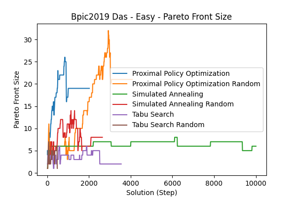 <em>Solution = Step</em></td><td><strong>Explored Solutions</strong> 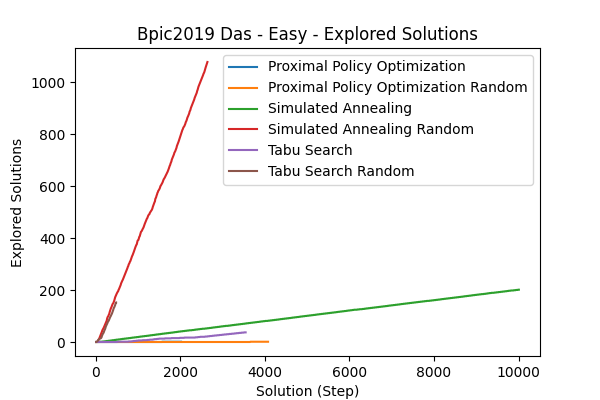 <em>Solution = Step</em></td><td><strong>New Base Solutions (Radius)</strong> 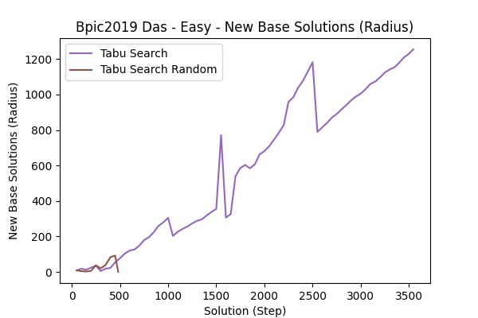 <em>Solution = Step</em></td></tr>
<tr><td><strong>New Base Solutions (Temperature)</strong> 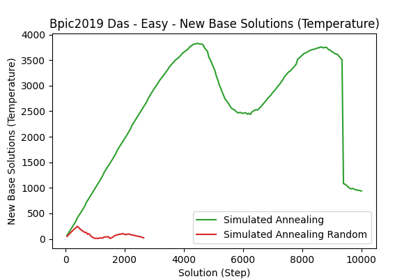 <em>Solution = Step</em></td><td><strong>Median Batch Processing Time</strong>  <em>Solution = Step</em></td><td><strong>Median Wait+Idle Time</strong> 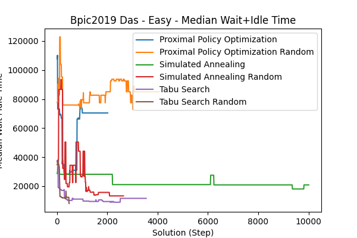 <em>Solution = Step</em></td></tr>
<tr><td><strong>Min Wait+Idle Time</strong> 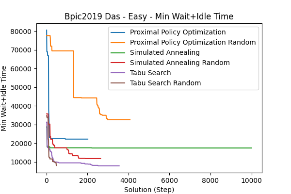 <em>Solution = Step</em></td><td><strong>Min Batch Processing Time</strong> 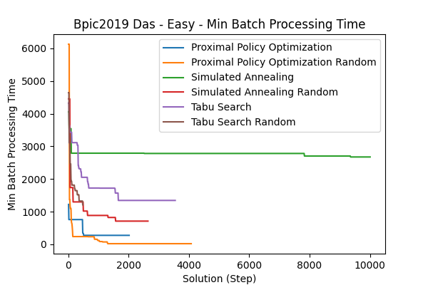 <em>Solution = Step</em></td><td><strong>Average Cycle Time</strong> 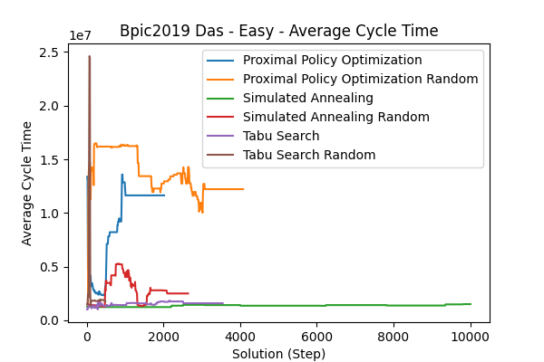 <em>Solution = Step</em></td></tr>
<tr><td><strong>Min Cycle Time</strong> 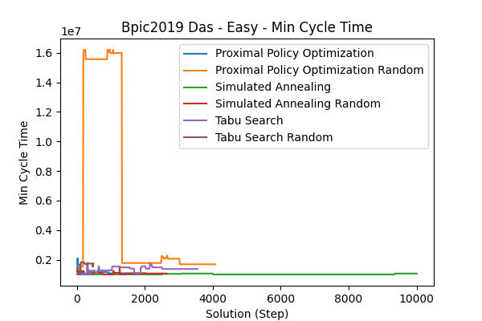 <em>Solution = Step</em></td><td><strong>Iteration Number</strong> 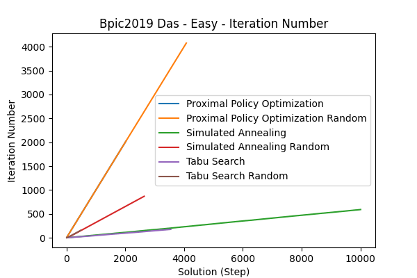 <em>Solution = Step</em></td><td></td></tr>
</table>

##### Summary Table (Final Values)

| Agent                               | Explored Solutions | New Base Solutions (Radius) | New Base Solutions (Temperature) | Median Batch Processing Time | Median Wait+Idle Time | Min Wait+Idle Time | Min Batch Processing Time | Average Cycle Time | Min Cycle Time | Iteration Number |
| :---------------------------------- | -----------------: | --------------------------: | -------------------------------: | ---------------------------: | --------------------: | -----------------: | ------------------------: | -----------------: | -------------: | ---------------: |
| Proximal Policy Optimization        |                  2 |                             |                                  |                      497.189 |               70454.2 |            22196.1 |                   274.656 |         1.1639e+07 |    1.08201e+06 |             2019 |
| Simulated Annealing                 |                202 |                             |                              938 |                       3349.8 |               20885.9 |            17427.8 |                   2674.79 |         1.5071e+06 |    1.06311e+06 |              591 |
| Simulated Annealing Random          |               1077 |                             |                               20 |                       1470.7 |                 13291 |            11772.4 |                   710.565 |         2.4995e+06 |    1.06716e+06 |              868 |
| Tabu Search                         |                 38 |                        1255 |                                  |                      1345.84 |               11600.6 |            7859.27 |                   1344.12 |        1.58991e+06 |    1.37119e+06 |              176 |
| Tabu Search Random                  |                153 |                           0 |                                  |                      1205.18 |               8067.77 |            8067.77 |                   1205.18 |         1.7469e+06 |     1.7469e+06 |              155 |
| Proximal Policy Optimization Random |                  2 |                             |                                  |                      72.7355 |               85031.5 |            32568.2 |                   19.6215 |        1.22195e+07 |     1.6904e+06 |             4077 |

##### Pareto Front Images

<table><tr>
<th>Proximal Policy Optimization</th>
<th>Simulated Annealing</th>
<th>Simulated Annealing Random</th>
<th>Tabu Search</th>
<th>Tabu Search Random</th>
<th>Proximal Policy Optimization Random</th>
</tr><tr>
<td>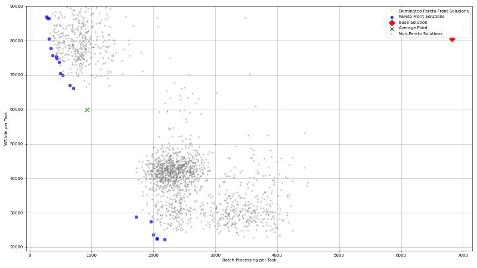</td>
<td>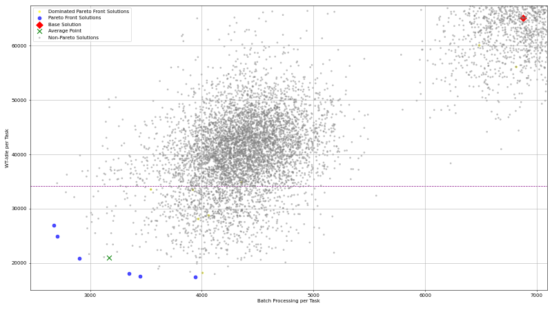</td>
<td>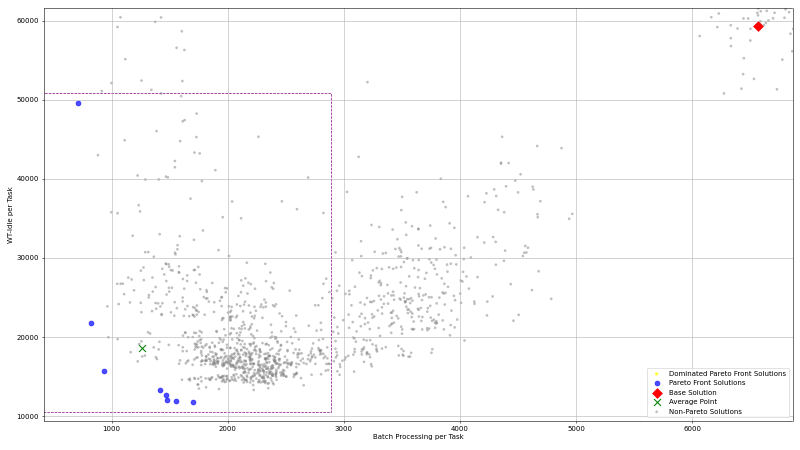</td>
<td>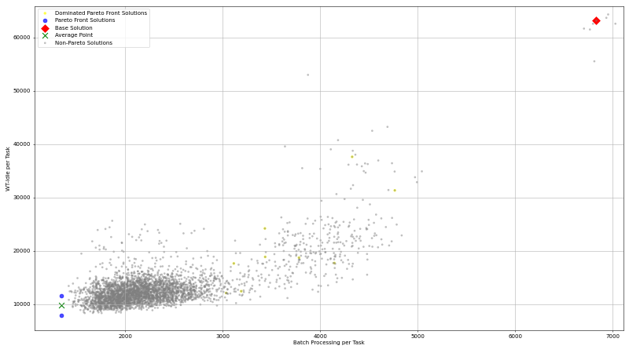</td>
<td>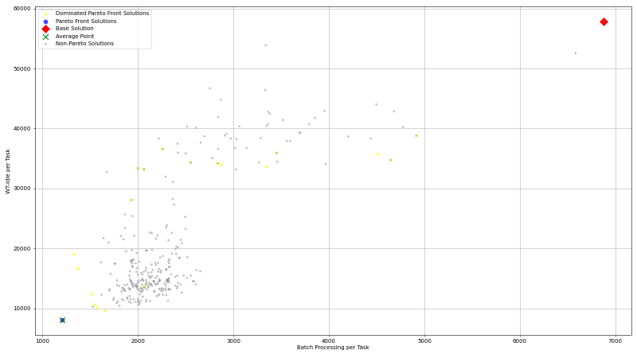</td>
<td>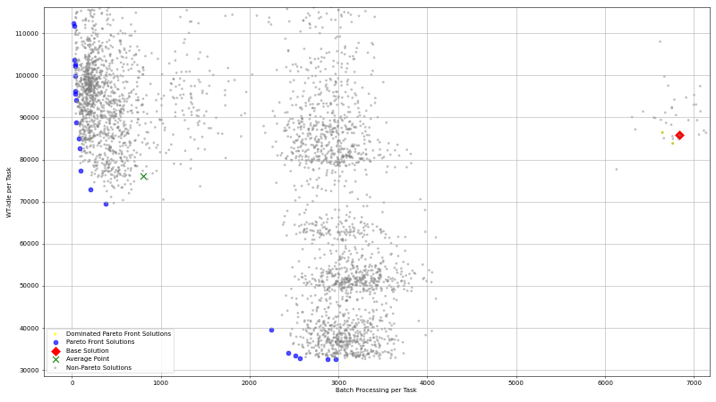</td>
</tr></table>

---

#### Hard

##### Metric Plots

<table>
<tr><td><strong>Pareto Front Size</strong> 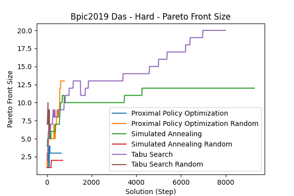 <em>Solution = Step</em></td><td><strong>Explored Solutions</strong> 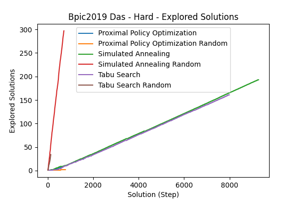 <em>Solution = Step</em></td><td><strong>New Base Solutions (Radius)</strong> 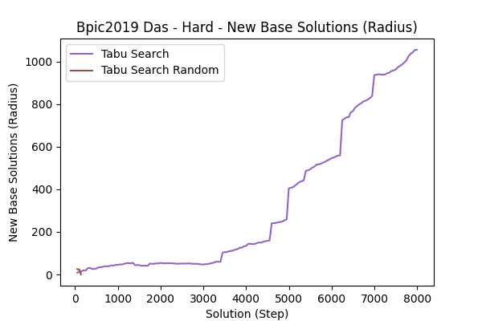 <em>Solution = Step</em></td></tr>
<tr><td><strong>New Base Solutions (Temperature)</strong> 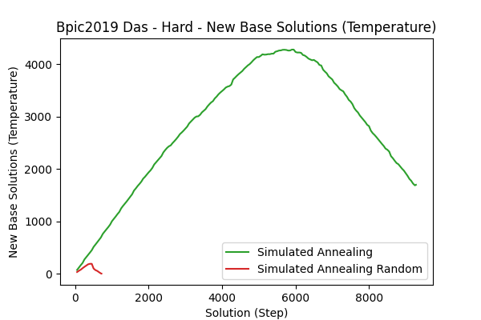 <em>Solution = Step</em></td><td><strong>Median Batch Processing Time</strong> 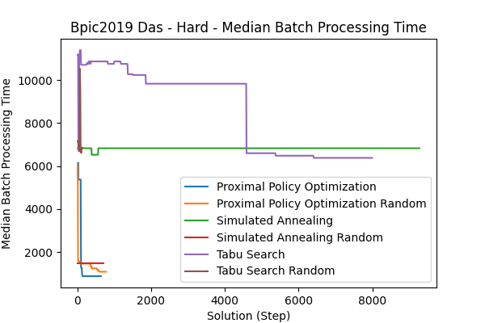 <em>Solution = Step</em></td><td><strong>Median Wait+Idle Time</strong> 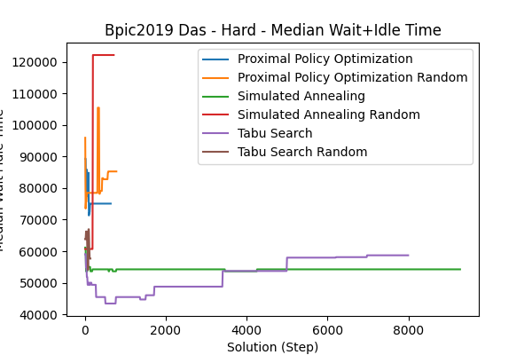 <em>Solution = Step</em></td></tr>
<tr><td><strong>Min Wait+Idle Time</strong> 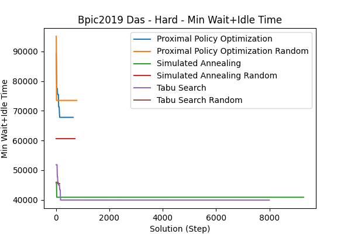 <em>Solution = Step</em></td><td><strong>Min Batch Processing Time</strong>  <em>Solution = Step</em></td><td><strong>Average Cycle Time</strong>  <em>Solution = Step</em></td></tr>
<tr><td><strong>Min Cycle Time</strong> 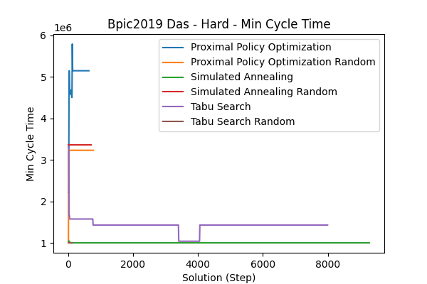 <em>Solution = Step</em></td><td><strong>Iteration Number</strong> 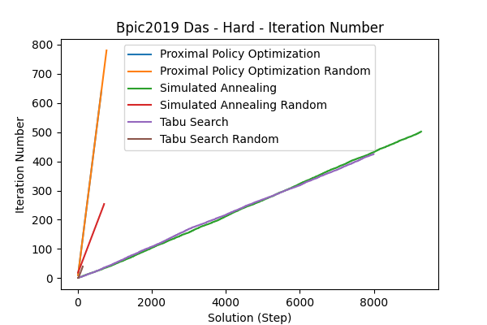 <em>Solution = Step</em></td><td></td></tr>
</table>

##### Summary Table (Final Values)

| Agent                               | Explored Solutions | New Base Solutions (Radius) | New Base Solutions (Temperature) | Median Batch Processing Time | Median Wait+Idle Time | Min Wait+Idle Time | Min Batch Processing Time | Average Cycle Time | Min Cycle Time | Iteration Number |
| :---------------------------------- | -----------------: | --------------------------: | -------------------------------: | ---------------------------: | --------------------: | -----------------: | ------------------------: | -----------------: | -------------: | ---------------: |
| Simulated Annealing                 |                193 |                             |                             1695 |                      6826.63 |               54250.2 |            40890.1 |                   5813.41 |        2.19567e+06 |    1.00062e+06 |              502 |
| Proximal Policy Optimization        |                  8 |                             |                                  |                      880.522 |               75071.4 |            67806.2 |                   622.467 |        2.08606e+07 |    5.14389e+06 |              640 |
| Tabu Search                         |                161 |                        1055 |                                  |                      6379.16 |               58697.1 |              39942 |                   5753.88 |        3.98648e+06 |    1.42871e+06 |              425 |
| Proximal Policy Optimization Random |                  2 |                             |                                  |                      1087.13 |               85264.4 |            73515.1 |                   74.9752 |        1.97393e+09 |    3.22863e+06 |              780 |
| Simulated Annealing Random          |                297 |                             |                                0 |                       1478.5 |                122153 |            60686.6 |                   1289.17 |        6.59939e+06 |    3.35898e+06 |              254 |
| Tabu Search Random                  |                 34 |                           0 |                                  |                       6848.5 |               57649.6 |            45475.6 |                   5950.38 |        2.48004e+06 |    1.00068e+06 |               40 |

##### Pareto Front Images

<table><tr>
<th>Simulated Annealing</th>
<th>Proximal Policy Optimization</th>
<th>Tabu Search</th>
<th>Simulated Annealing Random</th>
<th>Tabu Search Random</th>
</tr><tr>
<td>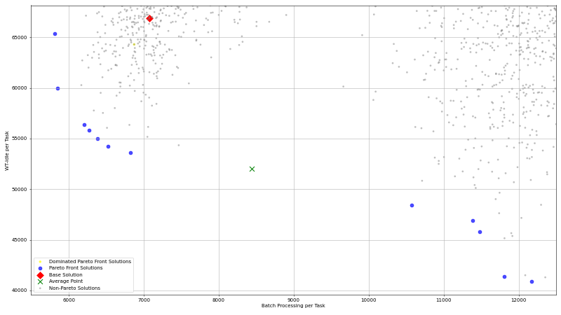</td>
<td>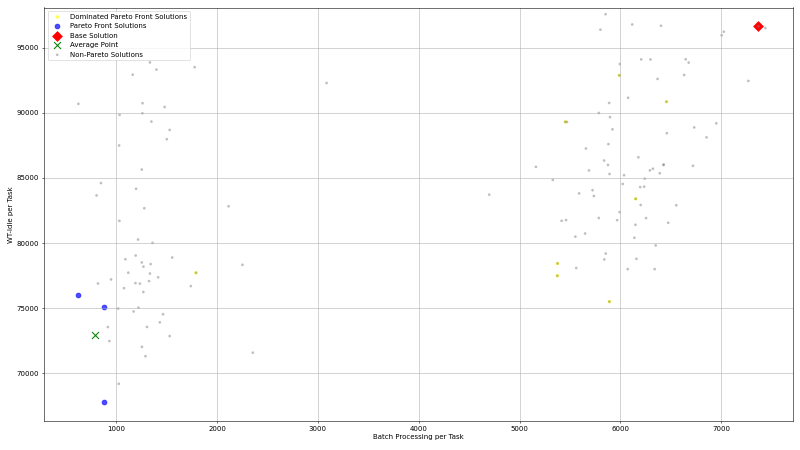</td>
<td>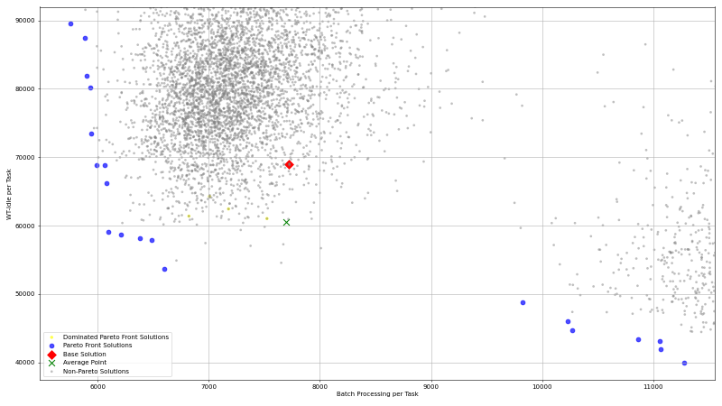</td>
<td></td>
<td>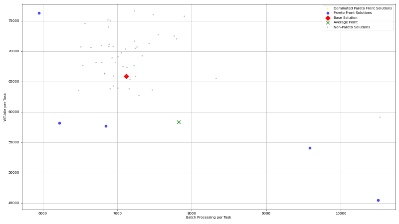</td>
</tr></table>

---

#### Mid

##### Metric Plots

<table>
<tr><td><strong>Pareto Front Size</strong> 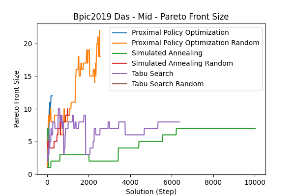 <em>Solution = Step</em></td><td><strong>Explored Solutions</strong> 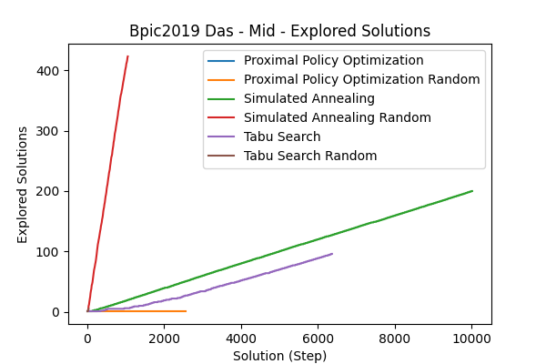 <em>Solution = Step</em></td><td><strong>New Base Solutions (Radius)</strong> 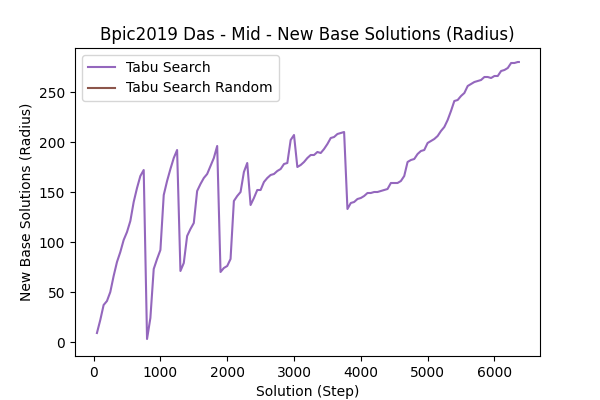 <em>Solution = Step</em></td></tr>
<tr><td><strong>New Base Solutions (Temperature)</strong> 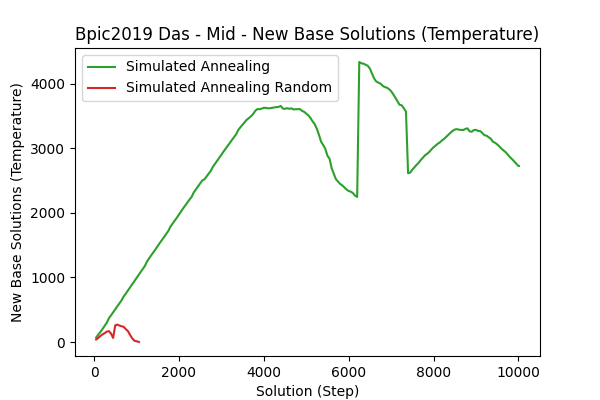 <em>Solution = Step</em></td><td><strong>Median Batch Processing Time</strong>  <em>Solution = Step</em></td><td><strong>Median Wait+Idle Time</strong> 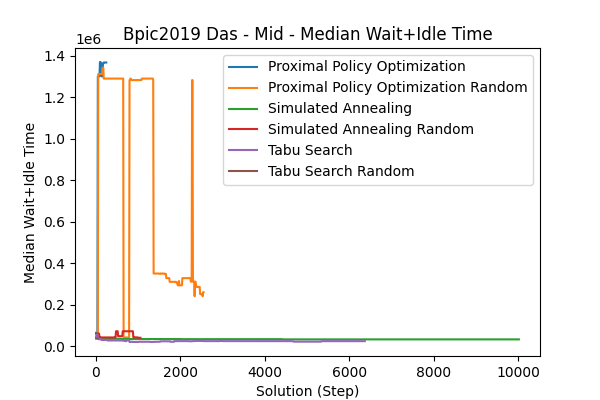 <em>Solution = Step</em></td></tr>
<tr><td><strong>Min Wait+Idle Time</strong>  <em>Solution = Step</em></td><td><strong>Min Batch Processing Time</strong> 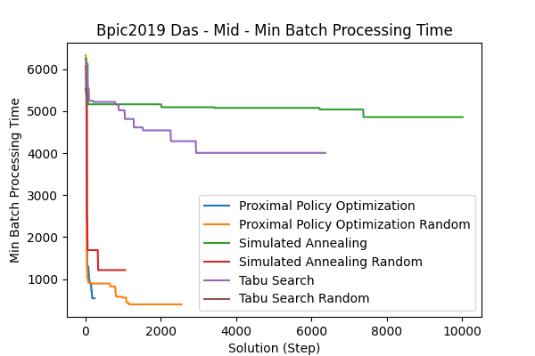 <em>Solution = Step</em></td><td><strong>Average Cycle Time</strong> 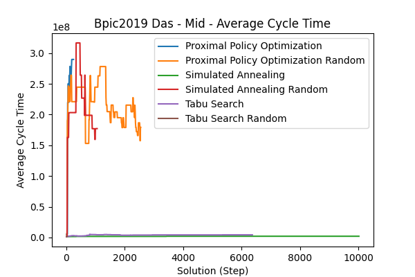 <em>Solution = Step</em></td></tr>
<tr><td><strong>Min Cycle Time</strong> 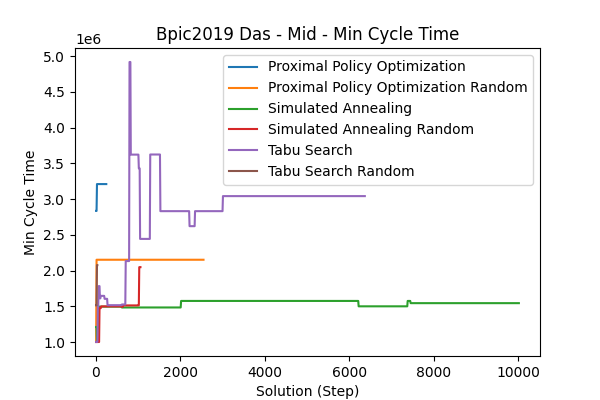 <em>Solution = Step</em></td><td><strong>Iteration Number</strong> 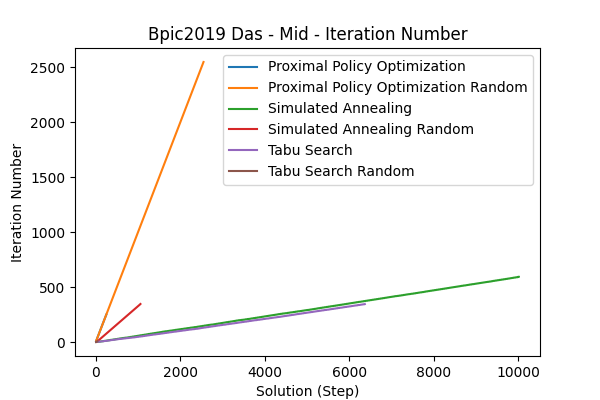 <em>Solution = Step</em></td><td></td></tr>
</table>

##### Summary Table (Final Values)

| Agent                               | Explored Solutions | New Base Solutions (Radius) | New Base Solutions (Temperature) | Median Batch Processing Time | Median Wait+Idle Time | Min Wait+Idle Time | Min Batch Processing Time | Average Cycle Time | Min Cycle Time | Iteration Number |
| :---------------------------------- | -----------------: | --------------------------: | -------------------------------: | ---------------------------: | --------------------: | -----------------: | ------------------------: | -----------------: | -------------: | ---------------: |
| Proximal Policy Optimization Random |                  1 |                             |                                  |                      3966.08 |                260646 |            38356.2 |                   397.863 |        1.79178e+08 |    2.15193e+06 |             2550 |
| Simulated Annealing Random          |                423 |                             |                                0 |                       4911.1 |               41088.3 |            34011.4 |                   1215.16 |        1.77198e+08 |    2.04851e+06 |              347 |
| Proximal Policy Optimization        |                  1 |                             |                                  |                      1302.29 |           1.36772e+06 |            41748.2 |                   543.183 |        2.89777e+08 |    3.21102e+06 |              250 |
| Tabu Search                         |                 96 |                         280 |                                  |                       4414.2 |               24713.4 |            19788.5 |                   4007.29 |        4.26219e+06 |    3.04265e+06 |              346 |
| Simulated Annealing                 |                200 |                             |                             2726 |                      5448.91 |               33277.7 |            29834.5 |                   4860.56 |        1.95637e+06 |    1.54438e+06 |              593 |
| Tabu Search Random                  |                  5 |                           0 |                                  |                      5195.05 |               37198.8 |            37198.8 |                   5195.05 |        2.07682e+06 |    2.07682e+06 |                7 |

##### Pareto Front Images

<table><tr>
<th>Proximal Policy Optimization Random</th>
<th>Simulated Annealing Random</th>
<th>Tabu Search</th>
<th>Simulated Annealing</th>
<th>Tabu Search Random</th>
</tr><tr>
<td>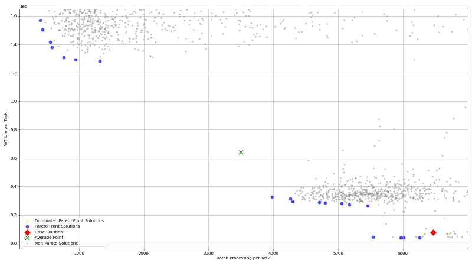</td>
<td>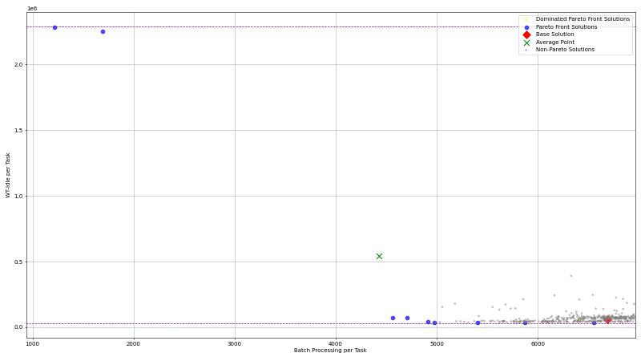</td>
<td>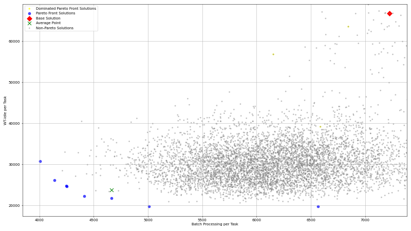</td>
<td>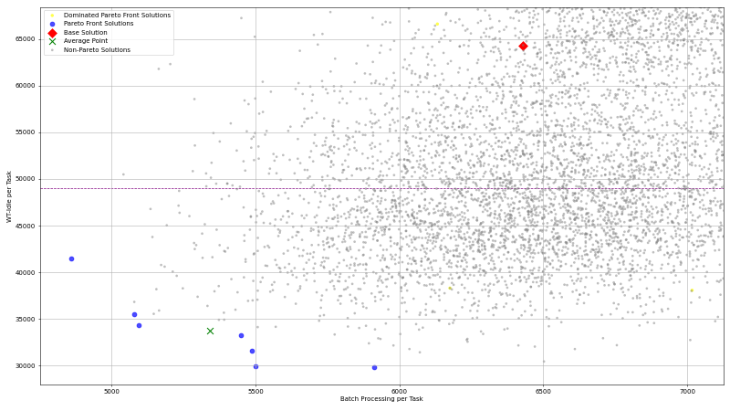</td>
<td>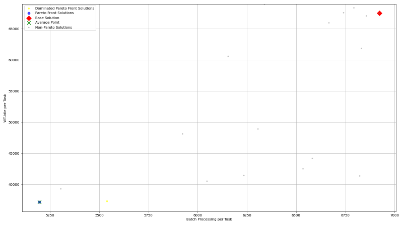</td>
</tr></table>

---

---

### Callcentre

#### Analyzer Overview

##### Pareto Size

| Agent / Reference | Easy  | Mid   | Hard  |
| ----------------- | ----- | ----- | ----- |
| Reference         | 15,00 | 14,00 | 13,00 |
| Reference Random  | 9,00  | 17,00 | 17,00 |
| Reference Optimos | 15,00 | 5,00  | 9,00  |
| SA                | 7,00  | 4,00  | 5,00  |
| Tabu Search       | 1,00  | 4,00  | 1,00  |
| PPO               | 17,00 | 5,00  | 9,00  |
| Tabu Random       | 9,00  | 2,00  | 3,00  |
| SA Random         | 11,00 | 9,00  | 15,00 |
| PPO Random        | 9,00  | 12,00 | 8,00  |

 

##### Hyperarea Ratio

| Agent / Reference | Easy | Mid  | Hard |
| ----------------- | ---- | ---- | ---- |
| Reference Random  | 1,00 | 1,00 | 1,00 |
| Reference Optimos | 1,00 | 1,00 | 1,00 |
| SA                | 0,98 | 0,91 | 1,00 |
| Tabu Search       | 0,98 | 0,91 | 1,00 |
| PPO               | 1,00 | 1,00 | 1,00 |
| Tabu Random       | 0,99 | 0,84 | 1,00 |
| SA Random         | 1,00 | 1,00 | 1,00 |
| PPO Random        | 1,00 | 1,00 | 1,00 |

 

##### Hausdorff

| Agent / Reference | Easy      | Mid        | Hard       |
| ----------------- | --------- | ---------- | ---------- |
| Reference Random  | 20.522,85 | 1.199,31   | 17.646,90  |
| Reference Optimos | 0,00      | 26.800,08  | 3.270,60   |
| SA                | 33.019,80 | 271.567,49 | 517.182,71 |
| Tabu Search       | 29.609,43 | 216.393,82 | 581.762,66 |
| PPO               | 0,00      | 26.800,08  | 3.270,60   |
| Tabu Random       | 24.933,62 | 409.015,90 | 891.974,32 |
| SA Random         | 54.507,65 | 2.173,16   | 18.693,25  |
| PPO Random        | 20.522,85 | 17.516,95  | 13.509,85  |

 

##### Delta

| Agent / Reference | Easy | Mid  | Hard |
| ----------------- | ---- | ---- | ---- |
| Reference Random  | 0,99 | 1,21 | 1,23 |
| Reference Optimos | 1,74 | 1,00 | 1,60 |
| SA                | 0,93 | 0,95 | 0,00 |
| Tabu Search       | 0,00 | 0,94 | 0,00 |
| PPO               | 1,74 | 1,00 | 1,60 |
| Tabu Random       | 1,02 | 0,97 | 0,92 |
| SA Random         | 1,29 | 1,01 | 1,19 |
| PPO Random        | 0,99 | 0,97 | 1,01 |

 

##### Purity

| Agent / Reference | Easy | Mid  | Hard |
| ----------------- | ---- | ---- | ---- |
| Reference Random  | 0,00 | 0,64 | 0,62 |
| Reference Optimos | 1,00 | 0,36 | 0,38 |
| SA                | 0,00 | 0,00 | 0,00 |
| Tabu Search       | 0,00 | 0,00 | 0,00 |
| PPO               | 1,00 | 0,36 | 0,38 |
| Tabu Random       | 0,00 | 0,00 | 0,00 |
| SA Random         | 0,00 | 0,21 | 0,62 |
| PPO Random        | 0,00 | 0,43 | 0,00 |

 

##### Avg Cycle Time

| Agent / Reference | Easy          | Mid           | Hard          |
| ----------------- | ------------- | ------------- | ------------- |
| Base              | 11.106.584,79 | 10.889.027,63 | 11.738.570,26 |
| Reference         | 71.718,79     | 114.388,32    | 83.654,70     |
| Reference Random  | 14.570,07     | 108.691,65    | 143.569,65    |
| Reference Optimos | 71.718,79     | 6.096,85      | 49.050,92     |
| SA                | 1.738.604,64  | 7.956.488,84  | 9.698.842,92  |
| Tabu Search       | 1.527.949,36  | 9.167.885,21  | 10.225.921,16 |
| PPO               | 71.718,79     | 6.096,85      | 49.050,92     |
| Tabu Random       | 1.146.321,93  | 9.011.205,66  | 19.606.665,88 |
| SA Random         | 15.340.975,24 | 191.474,45    | 172.392,03    |
| PPO Random        | 14.570,07     | 79.599,66     | 15.676,56     |

 

##### Best Cycle Time

| Agent / Reference | Easy          | Mid           | Hard          |
| ----------------- | ------------- | ------------- | ------------- |
| Base              | 11.106.584,79 | 10.889.027,63 | 11.738.570,26 |
| Reference         | 1.881,05      | 5.758,89      | 4.876,96      |
| Reference Random  | 1.902,42      | 4.281,56      | 4.876,96      |
| Reference Optimos | 1.881,05      | 5.758,89      | 4.417,33      |
| SA                | 1.387.596,57  | 7.093.163,15  | 9.698.842,92  |
| Tabu Search       | 1.527.949,36  | 8.719.642,93  | 10.225.921,16 |
| PPO               | 1.881,05      | 5.758,89      | 4.417,33      |
| Tabu Random       | 1.066.232,87  | 8.773.247,05  | 10.438.156,55 |
| SA Random         | 191.679,36    | 4.281,56      | 4.876,96      |
| PPO Random        | 1.902,42      | 34.311,62     | 4.562,45      |

 

#### Easy

##### Metric Plots

<table>
<tr><td><strong>Pareto Front Size</strong> 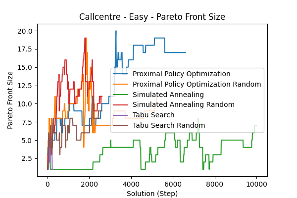 <em>Solution = Step</em></td><td><strong>Explored Solutions</strong> 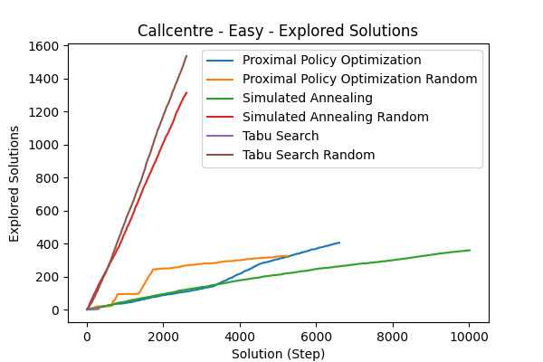 <em>Solution = Step</em></td><td><strong>New Base Solutions (Radius)</strong> 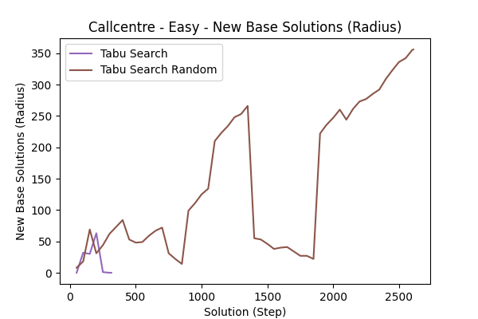 <em>Solution = Step</em></td></tr>
<tr><td><strong>New Base Solutions (Temperature)</strong> 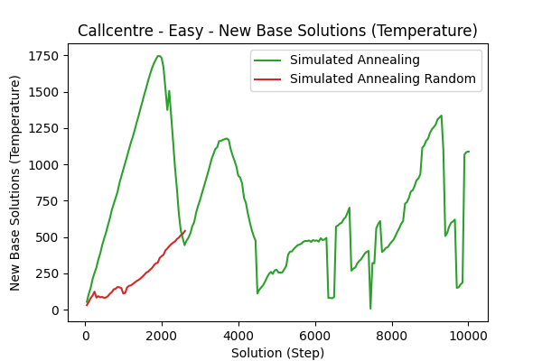 <em>Solution = Step</em></td><td><strong>Median Batch Processing Time</strong> 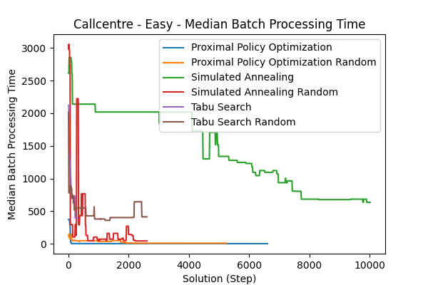 <em>Solution = Step</em></td><td><strong>Median Wait+Idle Time</strong> 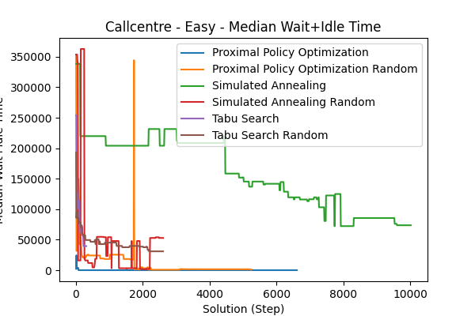 <em>Solution = Step</em></td></tr>
<tr><td><strong>Min Wait+Idle Time</strong> 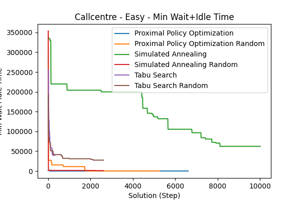 <em>Solution = Step</em></td><td><strong>Min Batch Processing Time</strong> 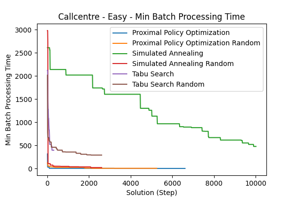 <em>Solution = Step</em></td><td><strong>Average Cycle Time</strong> 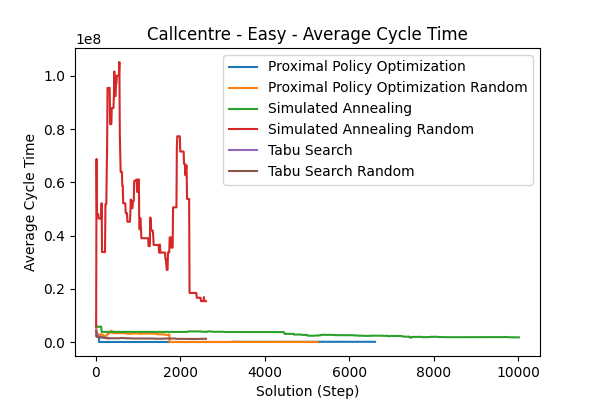 <em>Solution = Step</em></td></tr>
<tr><td><strong>Min Cycle Time</strong> 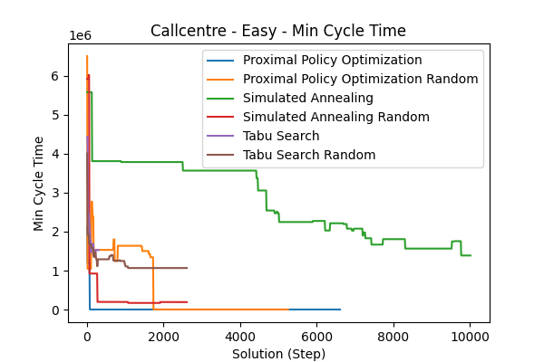 <em>Solution = Step</em></td><td><strong>Iteration Number</strong> 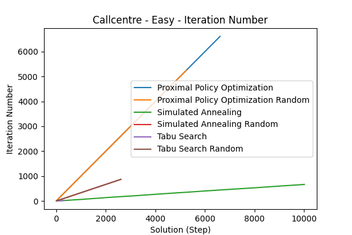 <em>Solution = Step</em></td><td></td></tr>
</table>

##### Summary Table (Final Values)

| Agent                               | Explored Solutions | New Base Solutions (Radius) | New Base Solutions (Temperature) | Median Batch Processing Time | Median Wait+Idle Time | Min Wait+Idle Time | Min Batch Processing Time | Average Cycle Time | Min Cycle Time | Iteration Number |
| :---------------------------------- | -----------------: | --------------------------: | -------------------------------: | ---------------------------: | --------------------: | -----------------: | ------------------------: | -----------------: | -------------: | ---------------: |
| Proximal Policy Optimization Random |                326 |                             |                                  |                      8.50276 |               1002.91 |            52.8721 |                   2.71642 |            12413.4 |        1951.83 |             5250 |
| Simulated Annealing                 |                360 |                             |                             1088 |                      635.292 |               73685.2 |            62330.9 |                   475.886 |         1.7386e+06 |     1.3876e+06 |              664 |
| Proximal Policy Optimization        |                405 |                             |                                  |                       2.0621 |                9.2528 |            4.74002 |               0.000273994 |            73793.5 |        1881.05 |             6610 |
| Simulated Annealing Random          |               1314 |                             |                              542 |                      44.0033 |               52849.9 |            949.004 |                    18.734 |         1.5341e+07 |         191679 |              868 |
| Tabu Search                         |                  4 |                           0 |                                  |                      394.564 |               39471.6 |            39471.6 |                   394.564 |        1.52795e+06 |    1.52795e+06 |               21 |
| Tabu Search Random                  |               1536 |                         356 |                                  |                      412.834 |               30917.8 |            27420.2 |                   289.078 |        1.19836e+06 |    1.06623e+06 |              868 |

##### Pareto Front Images

<table><tr>
<th>Proximal Policy Optimization Random</th>
<th>Simulated Annealing</th>
<th>Proximal Policy Optimization</th>
<th>Simulated Annealing Random</th>
<th>Tabu Search</th>
<th>Tabu Search Random</th>
</tr><tr>
<td>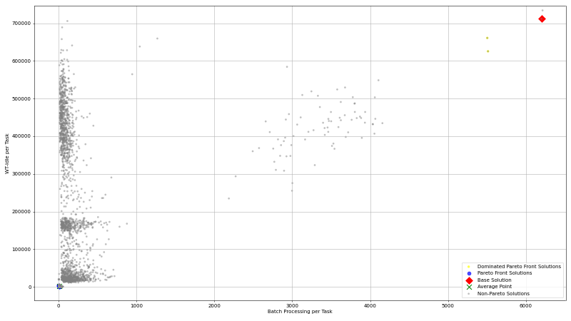</td>
<td>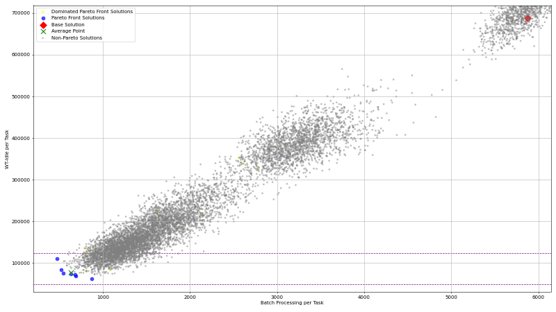</td>
<td>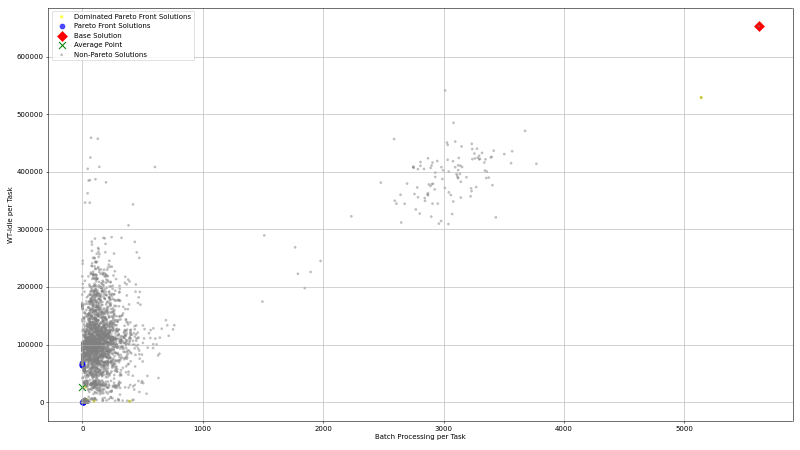</td>
<td>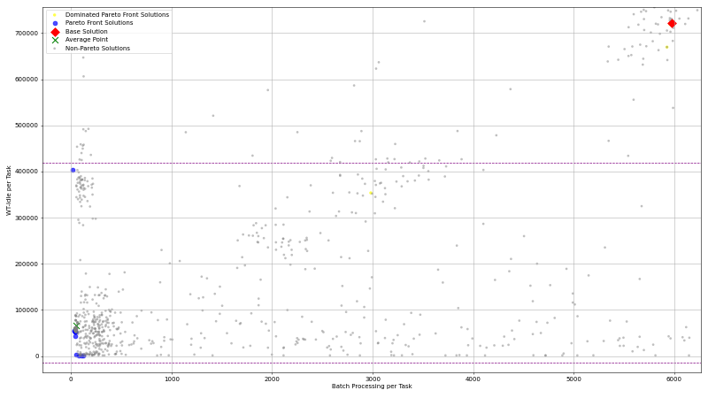</td>
<td>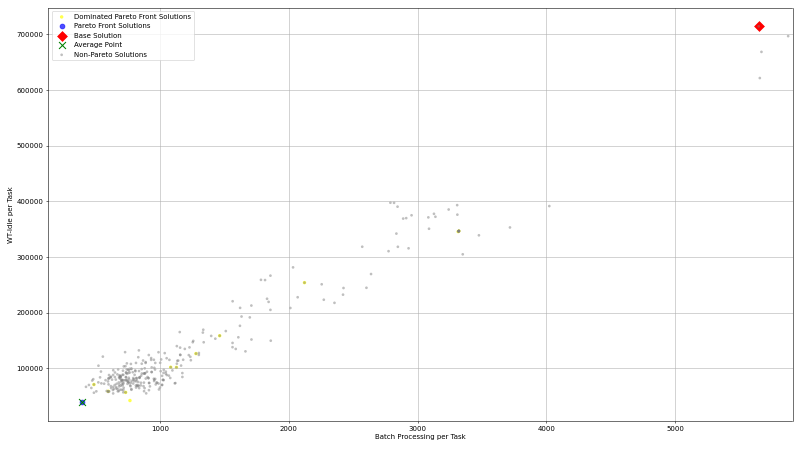</td>
<td>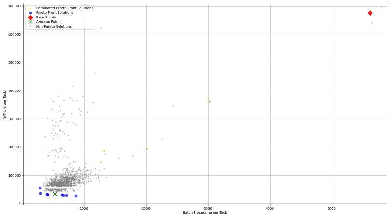</td>
</tr></table>

---

#### Hard

##### Metric Plots

<table>
<tr><td><strong>Pareto Front Size</strong> 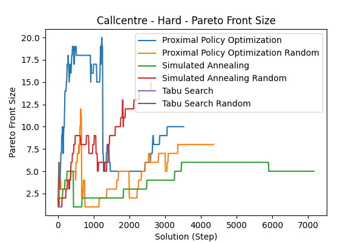 <em>Solution = Step</em></td><td><strong>Explored Solutions</strong> 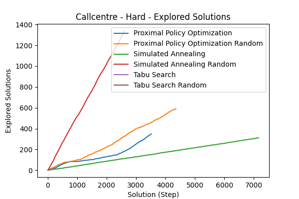 <em>Solution = Step</em></td><td><strong>New Base Solutions (Radius)</strong> 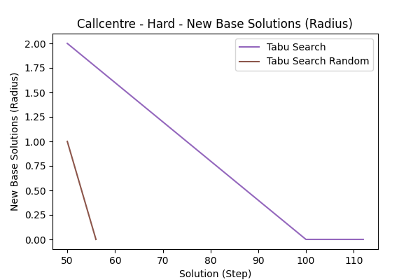 <em>Solution = Step</em></td></tr>
<tr><td><strong>New Base Solutions (Temperature)</strong> 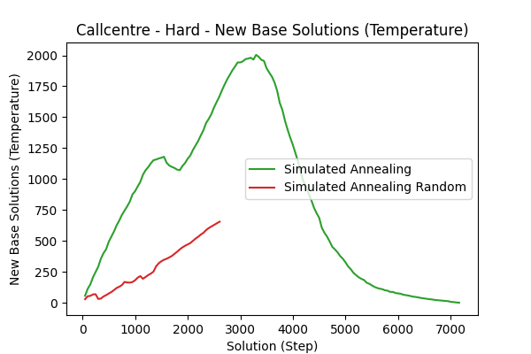 <em>Solution = Step</em></td><td><strong>Median Batch Processing Time</strong> 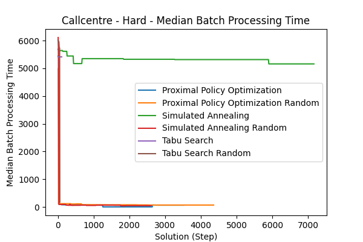 <em>Solution = Step</em></td><td><strong>Median Wait+Idle Time</strong> 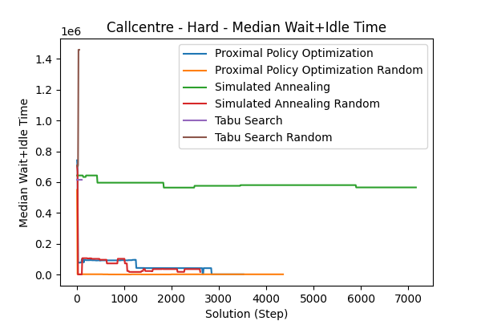 <em>Solution = Step</em></td></tr>
<tr><td><strong>Min Wait+Idle Time</strong> 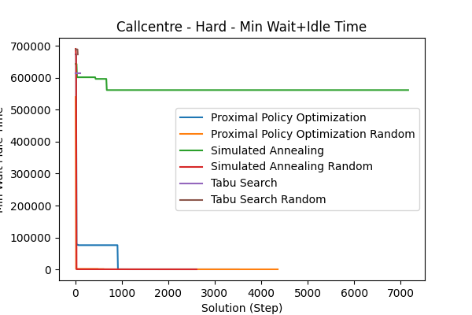 <em>Solution = Step</em></td><td><strong>Min Batch Processing Time</strong> 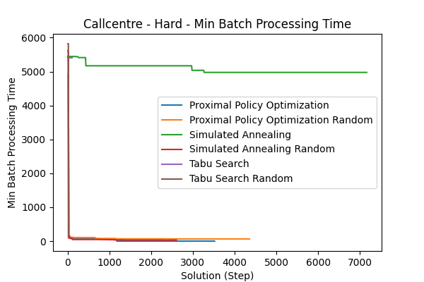 <em>Solution = Step</em></td><td><strong>Average Cycle Time</strong> 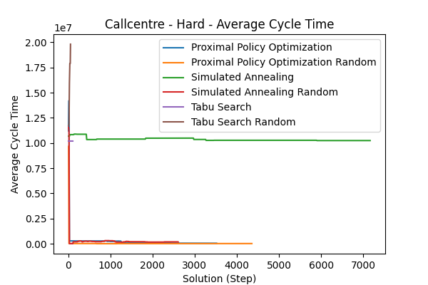 <em>Solution = Step</em></td></tr>
<tr><td><strong>Min Cycle Time</strong> 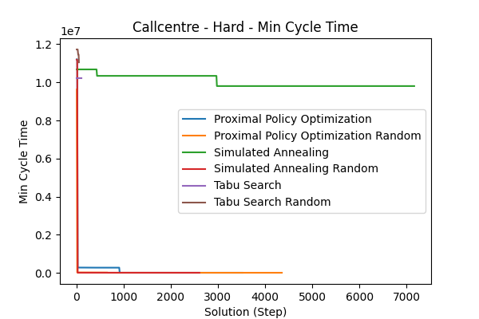 <em>Solution = Step</em></td><td><strong>Iteration Number</strong> 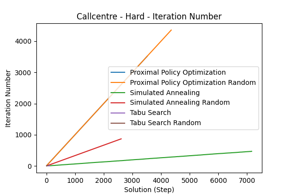 <em>Solution = Step</em></td><td></td></tr>
</table>

##### Summary Table (Final Values)

| Agent                               | Explored Solutions | New Base Solutions (Radius) | New Base Solutions (Temperature) | Median Batch Processing Time | Median Wait+Idle Time | Min Wait+Idle Time | Min Batch Processing Time | Average Cycle Time | Min Cycle Time | Iteration Number |
| :---------------------------------- | -----------------: | --------------------------: | -------------------------------: | ---------------------------: | --------------------: | -----------------: | ------------------------: | -----------------: | -------------: | ---------------: |
| Simulated Annealing                 |                311 |                             |                                0 |                      5159.47 |                565748 |             561513 |                   4975.99 |        1.02421e+07 |    9.80554e+06 |              468 |
| Simulated Annealing Random          |               1339 |                             |                              655 |                      46.2151 |               17433.5 |            481.313 |                    28.908 |             172392 |        4876.96 |              868 |
| Tabu Search Random                  |                 16 |                           0 |                                  |                      167.355 |           1.45963e+06 |             672983 |                   142.055 |        1.98113e+07 |    1.10522e+07 |               18 |
| Proximal Policy Optimization Random |                590 |                             |                                  |                      66.8742 |               1518.69 |            545.972 |                   64.4603 |            15676.6 |        4562.45 |             4357 |
| Tabu Search                         |                  4 |                           0 |                                  |                      5408.31 |                614176 |             614176 |                   5408.31 |        1.02259e+07 |    1.02259e+07 |                9 |
| Proximal Policy Optimization        |                349 |                             |                                  |                      63.5844 |               1546.46 |            553.247 |                 0.0032952 |            45649.9 |        4417.33 |             3520 |

##### Pareto Front Images

<table><tr>
<th>Simulated Annealing</th>
<th>Simulated Annealing Random</th>
<th>Tabu Search Random</th>
<th>Proximal Policy Optimization Random</th>
<th>Tabu Search</th>
<th>Proximal Policy Optimization</th>
</tr><tr>
<td>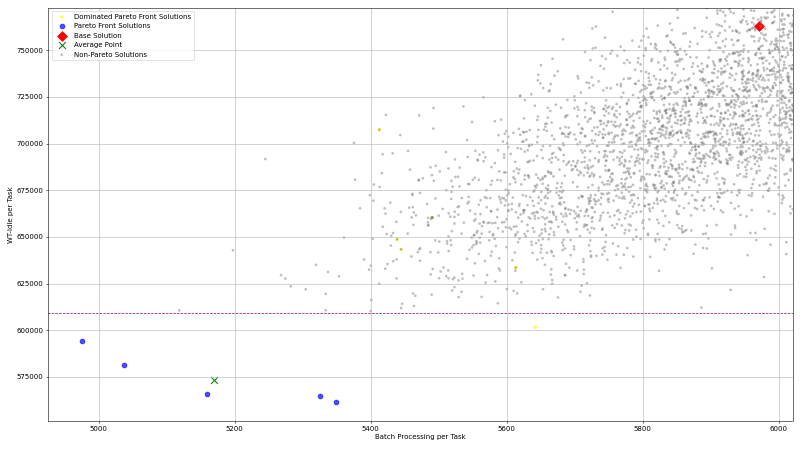</td>
<td></td>
<td>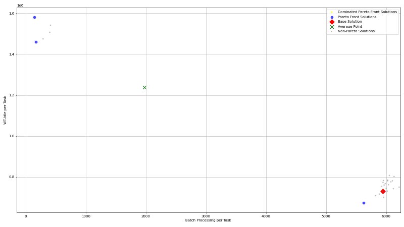</td>
<td>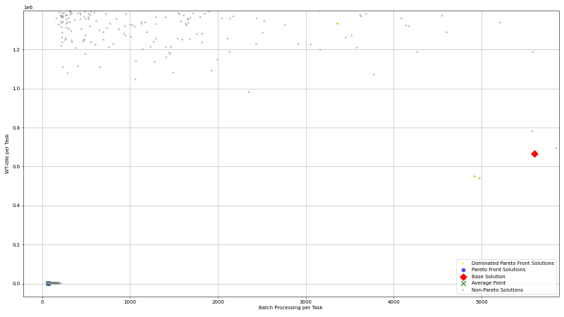</td>
<td>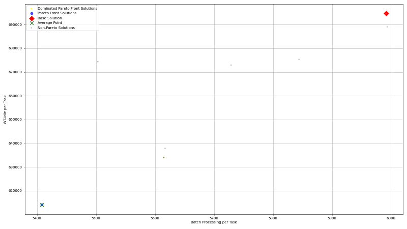</td>
<td>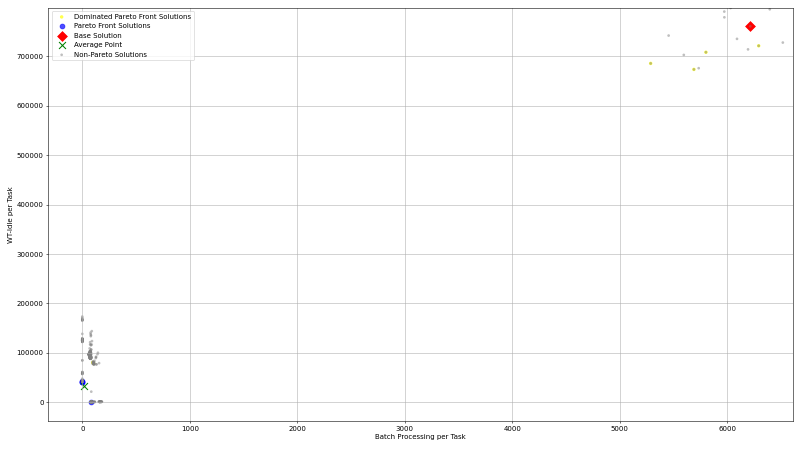</td>
</tr></table>

---

#### Mid

##### Metric Plots

<table>
<tr><td><strong>Pareto Front Size</strong> 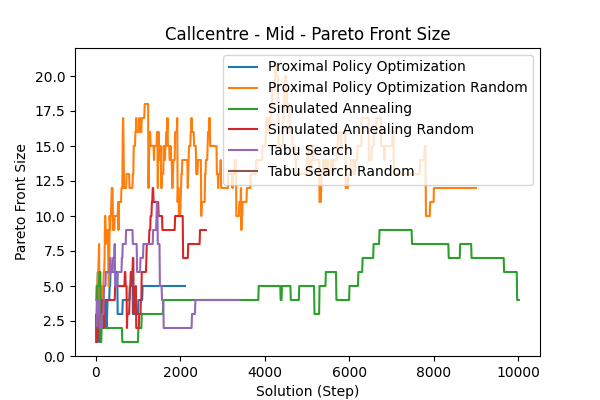 <em>Solution = Step</em></td><td><strong>Explored Solutions</strong> 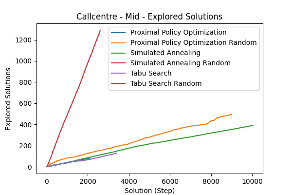 <em>Solution = Step</em></td><td><strong>New Base Solutions (Radius)</strong> 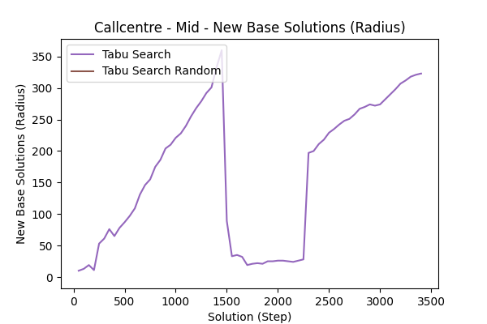 <em>Solution = Step</em></td></tr>
<tr><td><strong>New Base Solutions (Temperature)</strong> 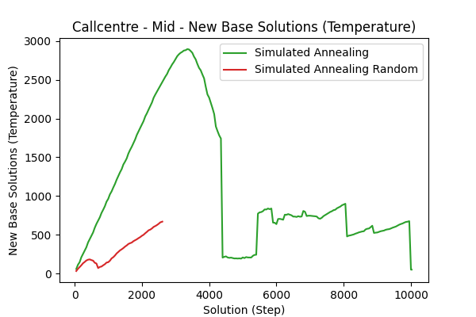 <em>Solution = Step</em></td><td><strong>Median Batch Processing Time</strong> 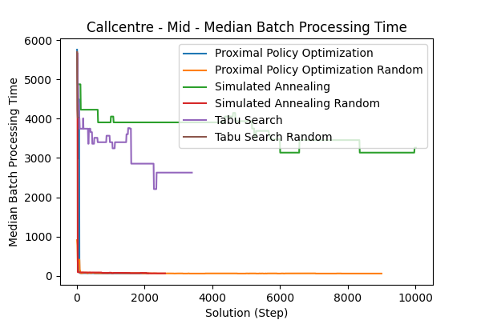 <em>Solution = Step</em></td><td><strong>Median Wait+Idle Time</strong> 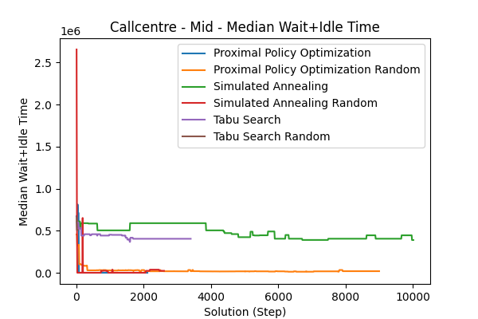 <em>Solution = Step</em></td></tr>
<tr><td><strong>Min Wait+Idle Time</strong> 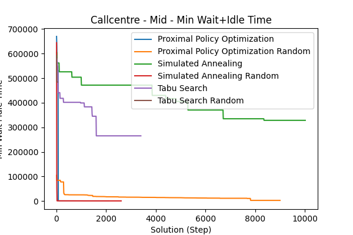 <em>Solution = Step</em></td><td><strong>Min Batch Processing Time</strong> 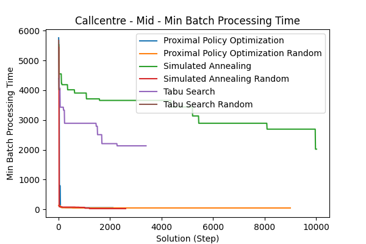 <em>Solution = Step</em></td><td><strong>Average Cycle Time</strong> 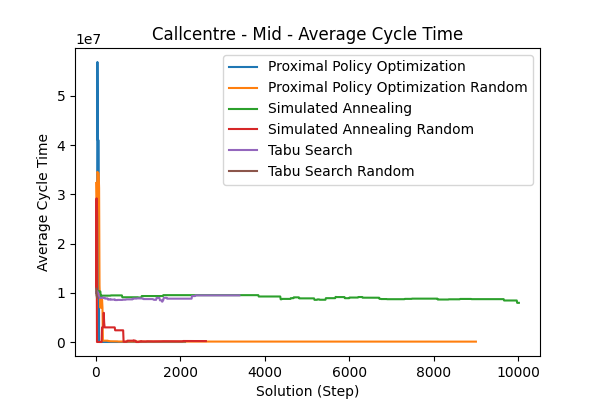 <em>Solution = Step</em></td></tr>
<tr><td><strong>Min Cycle Time</strong> 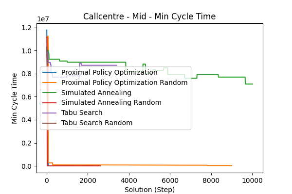 <em>Solution = Step</em></td><td><strong>Iteration Number</strong> 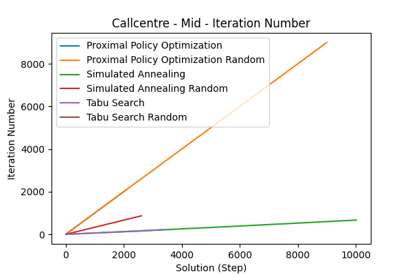 <em>Solution = Step</em></td><td></td></tr>
</table>

##### Summary Table (Final Values)

| Agent                               | Explored Solutions | New Base Solutions (Radius) | New Base Solutions (Temperature) | Median Batch Processing Time | Median Wait+Idle Time | Min Wait+Idle Time | Min Batch Processing Time | Average Cycle Time | Min Cycle Time | Iteration Number |
| :---------------------------------- | -----------------: | --------------------------: | -------------------------------: | ---------------------------: | --------------------: | -----------------: | ------------------------: | -----------------: | -------------: | ---------------: |
| Tabu Search                         |                129 |                         323 |                                  |                      2627.52 |                404183 |             265318 |                   2134.67 |         9.4731e+06 |    8.71964e+06 |              221 |
| Tabu Search Random                  |                 11 |                           0 |                                  |                      4027.36 |                508363 |             484184 |                    4020.2 |        9.01121e+06 |    8.77325e+06 |               14 |
| Proximal Policy Optimization Random |                494 |                             |                                  |                      56.7506 |               18992.3 |             2501.6 |                   48.9149 |            80850.5 |        34311.6 |             9004 |
| Simulated Annealing Random          |               1290 |                             |                              671 |                      62.0692 |               23664.1 |            387.522 |                    27.257 |             191474 |        4281.56 |              868 |
| Simulated Annealing                 |                389 |                             |                               52 |                      3260.93 |                389294 |             328432 |                   2023.79 |        7.95649e+06 |    7.09316e+06 |              668 |
| Proximal Policy Optimization        |                 84 |                             |                                  |                        59.71 |               382.555 |            336.071 |                   56.9189 |            6096.85 |        5758.89 |             2116 |

##### Pareto Front Images

<table><tr>
<th>Tabu Search</th>
<th>Tabu Search Random</th>
<th>Proximal Policy Optimization Random</th>
<th>Simulated Annealing Random</th>
<th>Simulated Annealing</th>
<th>Proximal Policy Optimization</th>
</tr><tr>
<td>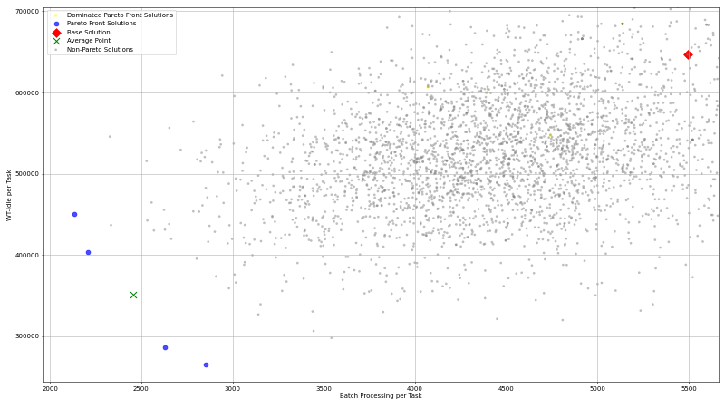</td>
<td></td>
<td>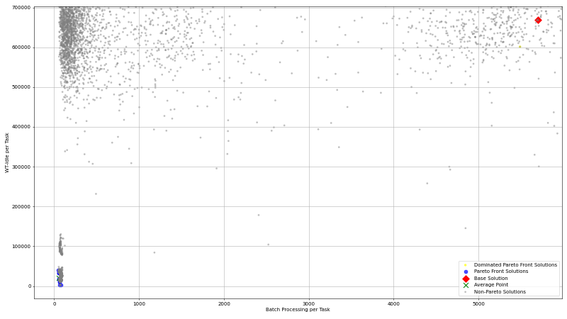</td>
<td>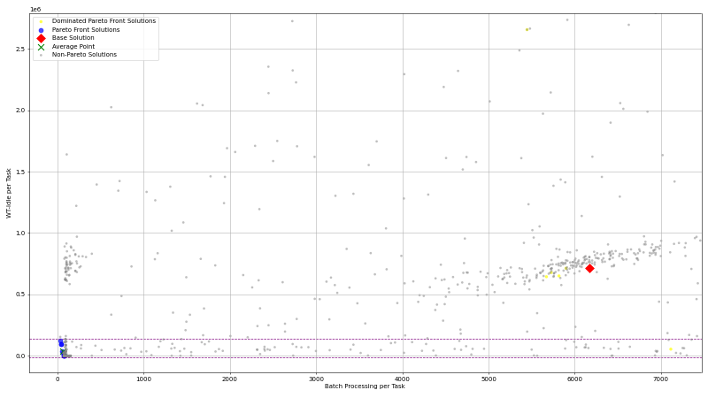</td>
<td>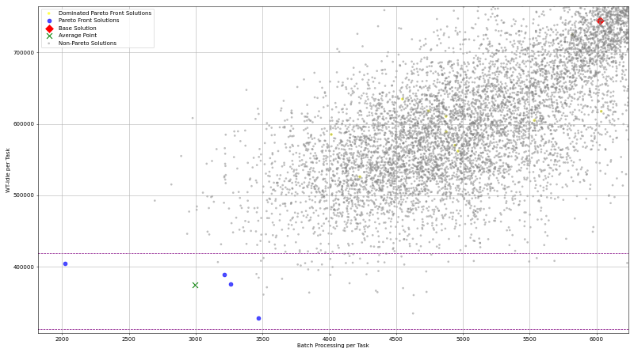</td>
<td>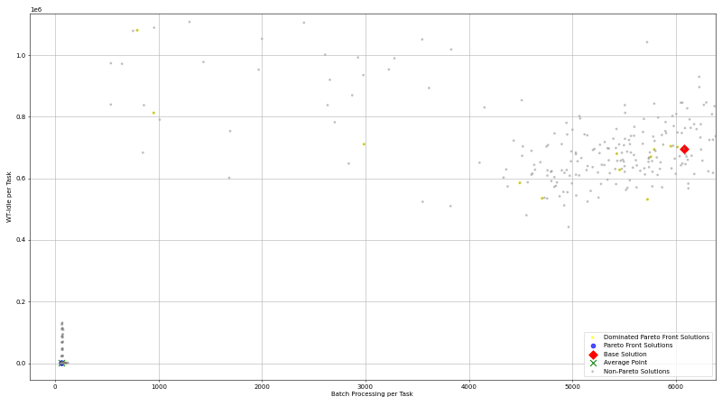</td>
</tr></table>

---

---

### Consulta Data Mining

#### Analyzer Overview

##### Pareto Size

| Agent / Reference | Easy  | Mid   | Hard  |
| ----------------- | ----- | ----- | ----- |
| Reference         | 77,00 | 32,00 | 24,00 |
| Reference Random  | 50,00 | 25,00 | 21,00 |
| Reference Optimos | 77,00 | 30,00 | 28,00 |
| SA                | 26,00 | 19,00 | 6,00  |
| Tabu Search       | 42,00 | 21,00 | 13,00 |
| PPO               | 50,00 | 28,00 | 30,00 |
| Tabu Random       | 29,00 | 10,00 | 9,00  |
| SA Random         | 34,00 | 21,00 | 10,00 |
| PPO Random        | 34,00 | 15,00 | 16,00 |

 

##### Hyperarea Ratio

| Agent / Reference | Easy | Mid  | Hard |
| ----------------- | ---- | ---- | ---- |
| Reference Random  | 0,98 | 0,99 | 1,00 |
| Reference Optimos | 1,00 | 0,96 | 0,99 |
| SA                | 0,73 | 0,70 | 0,97 |
| Tabu Search       | 0,87 | 0,96 | 0,98 |
| PPO               | 0,99 | 0,82 | 0,99 |
| Tabu Random       | 0,88 | 0,63 | 0,97 |
| SA Random         | 0,81 | 0,98 | 1,00 |
| PPO Random        | 0,97 | 0,61 | 0,98 |

 

##### Hausdorff

| Agent / Reference | Easy      | Mid       | Hard      |
| ----------------- | --------- | --------- | --------- |
| Reference Random  | 2.833,58  | 1.319,03  | 18.702,87 |
| Reference Optimos | 3,08      | 90.263,12 | 35.620,70 |
| SA                | 7.078,89  | 90.612,63 | 78.466,39 |
| Tabu Search       | 11.310,39 | 90.300,65 | 62.127,93 |
| PPO               | 981,75    | 92.517,95 | 36.111,28 |
| Tabu Random       | 4.486,89  | 91.019,64 | 56.746,92 |
| SA Random         | 38.498,23 | 1.372,92  | 19.515,43 |
| PPO Random        | 3.219,77  | 93.659,12 | 69.173,02 |

 

##### Delta

| Agent / Reference | Easy | Mid  | Hard |
| ----------------- | ---- | ---- | ---- |
| Reference Random  | 1,12 | 1,72 | 1,60 |
| Reference Optimos | 1,20 | 1,01 | 1,09 |
| SA                | 1,05 | 1,02 | 1,01 |
| Tabu Search       | 0,95 | 1,01 | 1,03 |
| PPO               | 1,11 | 1,01 | 1,06 |
| Tabu Random       | 0,98 | 1,02 | 1,00 |
| SA Random         | 1,38 | 1,63 | 1,49 |
| PPO Random        | 1,01 | 1,00 | 0,99 |

 

##### Purity

| Agent / Reference | Easy | Mid  | Hard |
| ----------------- | ---- | ---- | ---- |
| Reference Random  | 0,01 | 0,16 | 0,25 |
| Reference Optimos | 0,99 | 0,84 | 0,75 |
| SA                | 0,06 | 0,19 | 0,00 |
| Tabu Search       | 0,58 | 0,66 | 0,42 |
| PPO               | 0,36 | 0,00 | 0,33 |
| Tabu Random       | 0,01 | 0,03 | 0,00 |
| SA Random         | 0,01 | 0,12 | 0,21 |
| PPO Random        | 0,00 | 0,00 | 0,04 |

 

##### Avg Cycle Time

| Agent / Reference | Easy          | Mid           | Hard          |
| ----------------- | ------------- | ------------- | ------------- |
| Base              | 10.924.190,73 | 11.498.316,15 | 11.845.078,32 |
| Reference         | 11.505.477,29 | 11.360.135,58 | 12.438.262,75 |
| Reference Random  | 11.595.106,20 | 11.443.018,69 | 11.625.892,84 |
| Reference Optimos | 11.510.016,25 | 11.401.558,01 | 12.432.425,07 |
| SA                | 11.523.864,35 | 11.760.911,87 | 11.371.253,37 |
| Tabu Search       | 11.397.259,22 | 11.343.615,08 | 14.404.102,38 |
| PPO               | 11.573.728,00 | 11.892.906,21 | 12.519.200,95 |
| Tabu Random       | 11.899.980,67 | 11.533.807,71 | 11.899.414,42 |
| SA Random         | 11.487.427,01 | 11.406.146,05 | 11.686.354,37 |
| PPO Random        | 11.582.461,74 | 11.581.298,14 | 11.884.449,70 |

 

##### Best Cycle Time

| Agent / Reference | Easy          | Mid           | Hard          |
| ----------------- | ------------- | ------------- | ------------- |
| Base              | 10.924.190,73 | 11.498.316,15 | 11.845.078,32 |
| Reference         | 10.653.552,98 | 10.906.582,86 | 10.908.571,55 |
| Reference Random  | 10.908.046,39 | 10.867.316,03 | 10.912.591,09 |
| Reference Optimos | 10.653.552,98 | 10.906.582,86 | 10.908.571,55 |
| SA                | 10.899.817,14 | 11.162.809,30 | 11.150.692,54 |
| Tabu Search       | 10.653.552,98 | 10.906.582,86 | 10.908.571,55 |
| PPO               | 10.559.397,46 | 11.248.319,30 | 11.182.600,34 |
| Tabu Random       | 10.924.190,73 | 10.917.768,17 | 11.250.920,54 |
| SA Random         | 10.908.046,39 | 10.917.768,17 | 11.246.504,00 |
| PPO Random        | 10.729.651,35 | 10.867.316,03 | 11.250.920,54 |

 

#### Easy

##### Metric Plots

<table>
<tr><td><strong>Pareto Front Size</strong> 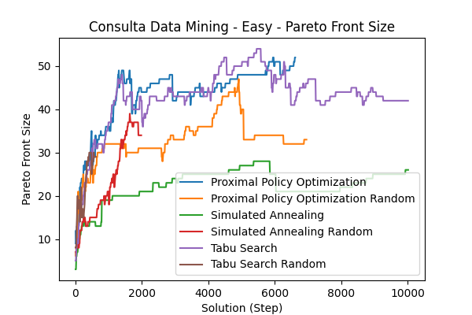 <em>Solution = Step</em></td><td><strong>Explored Solutions</strong> 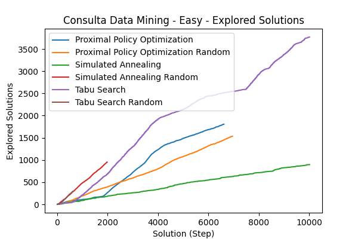 <em>Solution = Step</em></td><td><strong>New Base Solutions (Radius)</strong> 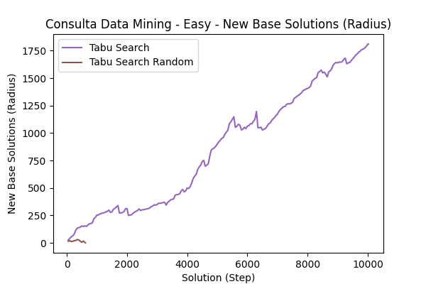 <em>Solution = Step</em></td></tr>
<tr><td><strong>New Base Solutions (Temperature)</strong> 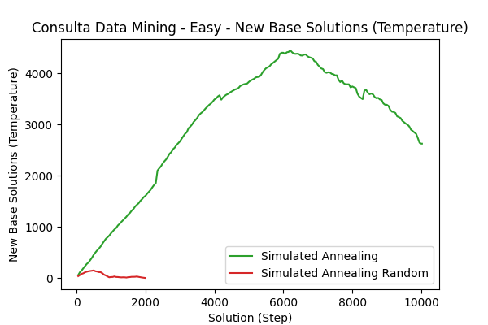 <em>Solution = Step</em></td><td><strong>Median Batch Processing Time</strong> 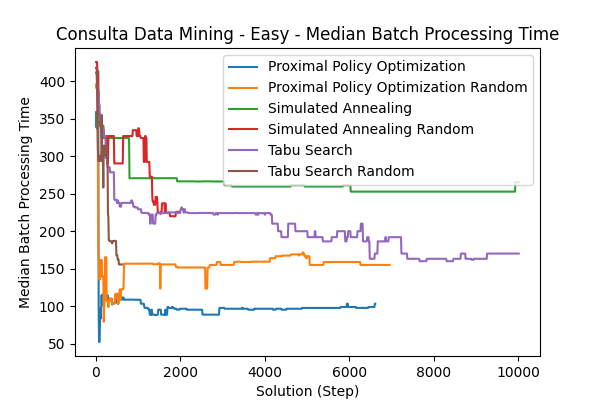 <em>Solution = Step</em></td><td><strong>Median Wait+Idle Time</strong> 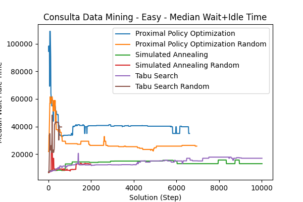 <em>Solution = Step</em></td></tr>
<tr><td><strong>Min Wait+Idle Time</strong>  <em>Solution = Step</em></td><td><strong>Min Batch Processing Time</strong> 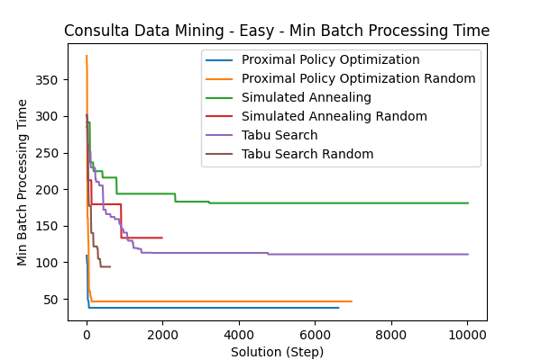 <em>Solution = Step</em></td><td><strong>Average Cycle Time</strong> 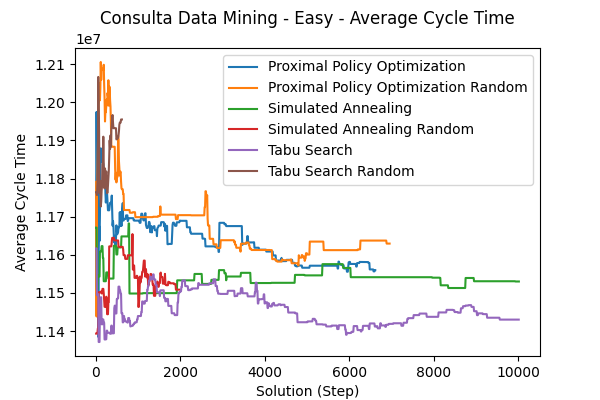 <em>Solution = Step</em></td></tr>
<tr><td><strong>Min Cycle Time</strong> 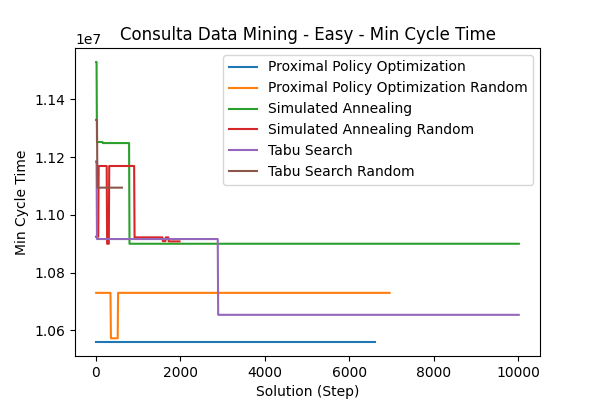 <em>Solution = Step</em></td><td><strong>Iteration Number</strong> 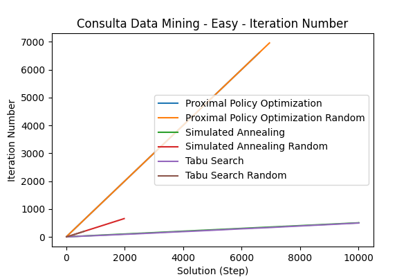 <em>Solution = Step</em></td><td></td></tr>
</table>

##### Summary Table (Final Values)

| Agent                               | Explored Solutions | New Base Solutions (Radius) | New Base Solutions (Temperature) | Median Batch Processing Time | Median Wait+Idle Time | Min Wait+Idle Time | Min Batch Processing Time | Average Cycle Time | Min Cycle Time | Iteration Number |
| :---------------------------------- | -----------------: | --------------------------: | -------------------------------: | ---------------------------: | --------------------: | -----------------: | ------------------------: | -----------------: | -------------: | ---------------: |
| Tabu Search                         |               3770 |                        1811 |                                  |                      170.106 |               17030.1 |            6137.59 |                   110.896 |        1.14301e+07 |    1.06536e+07 |              497 |
| Simulated Annealing                 |                897 |                             |                             2623 |                      265.373 |               13104.2 |            5840.44 |                   180.957 |        1.15301e+07 |    1.08998e+07 |              505 |
| Simulated Annealing Random          |                953 |                             |                                0 |                      225.732 |               12859.9 |            6329.29 |                   133.415 |        1.15087e+07 |     1.0908e+07 |              656 |
| Tabu Search Random                  |                292 |                           0 |                                  |                      155.542 |               39696.6 |            6169.77 |                   93.8181 |        1.19551e+07 |    1.10942e+07 |              200 |
| Proximal Policy Optimization        |               1806 |                             |                                  |                      103.127 |               34976.8 |            6015.03 |                   37.7386 |        1.15599e+07 |    1.05594e+07 |             6620 |
| Proximal Policy Optimization Random |               1536 |                             |                                  |                      154.911 |               25812.6 |            6631.31 |                    46.425 |        1.16295e+07 |    1.07297e+07 |             6960 |

##### Pareto Front Images

<table><tr>
<th>Tabu Search</th>
<th>Simulated Annealing</th>
<th>Simulated Annealing Random</th>
<th>Tabu Search Random</th>
<th>Proximal Policy Optimization</th>
<th>Proximal Policy Optimization Random</th>
</tr><tr>
<td>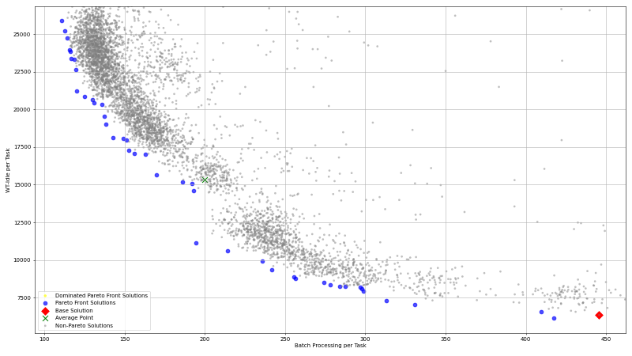</td>
<td>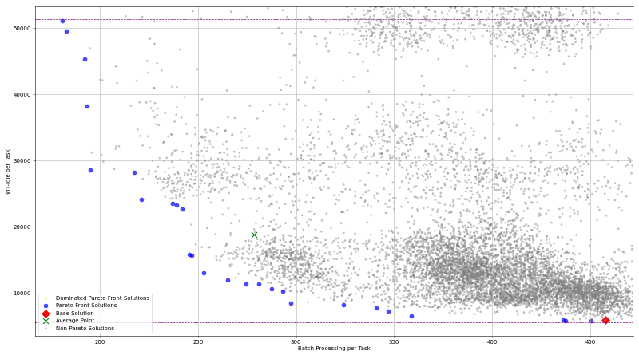</td>
<td>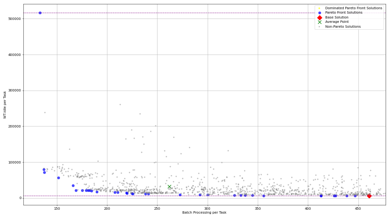</td>
<td>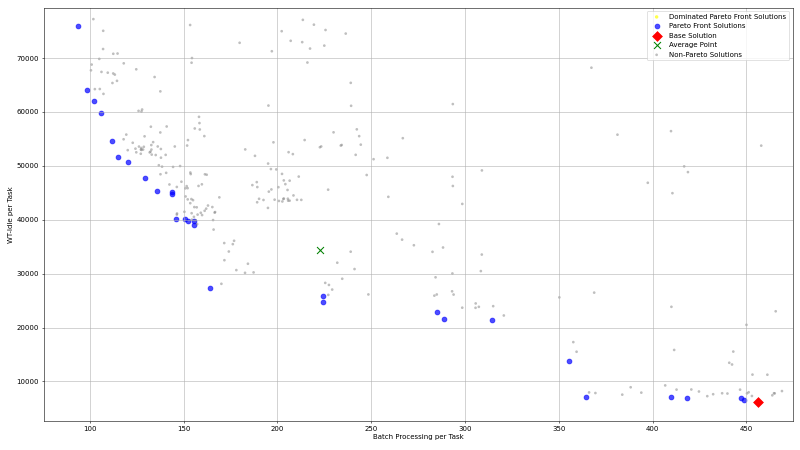</td>
<td>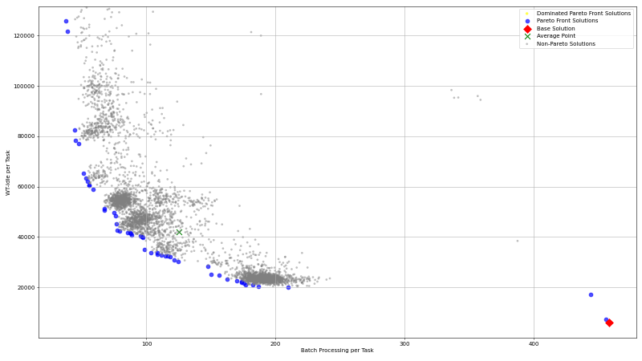</td>
<td>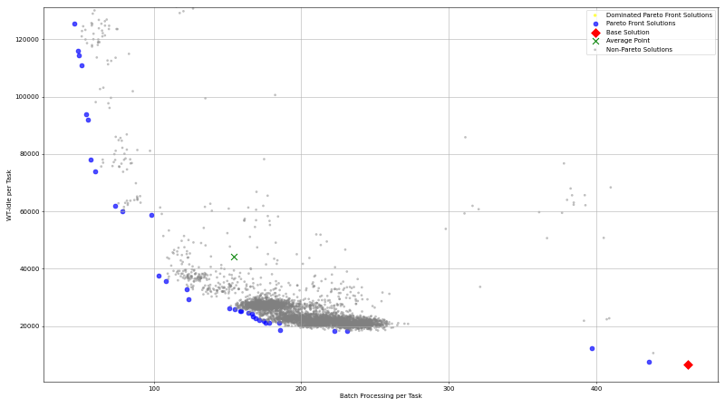</td>
</tr></table>

---

#### Hard

##### Metric Plots

<table>
<tr><td><strong>Pareto Front Size</strong>  <em>Solution = Step</em></td><td><strong>Explored Solutions</strong> 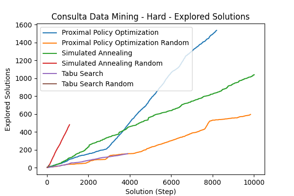 <em>Solution = Step</em></td><td><strong>New Base Solutions (Radius)</strong> 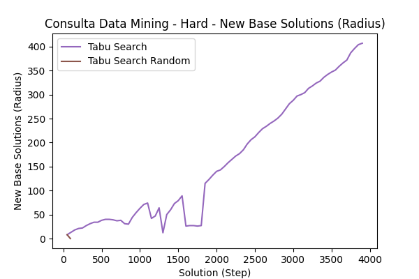 <em>Solution = Step</em></td></tr>
<tr><td><strong>New Base Solutions (Temperature)</strong> 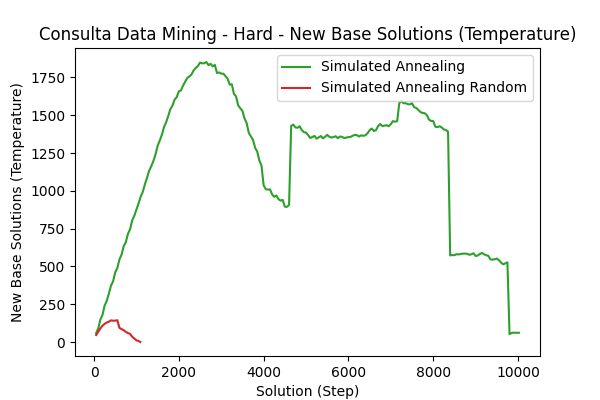 <em>Solution = Step</em></td><td><strong>Median Batch Processing Time</strong>  <em>Solution = Step</em></td><td><strong>Median Wait+Idle Time</strong> 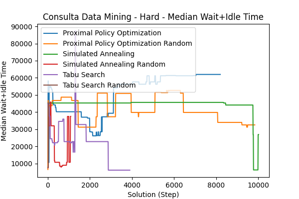 <em>Solution = Step</em></td></tr>
<tr><td><strong>Min Wait+Idle Time</strong> 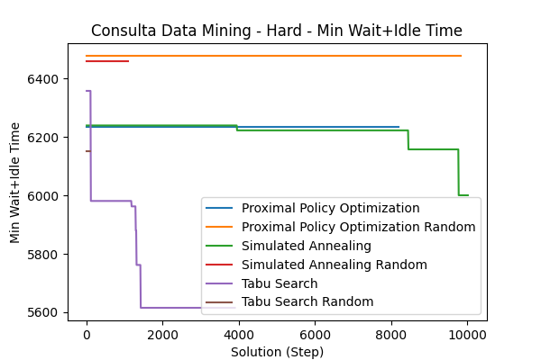 <em>Solution = Step</em></td><td><strong>Min Batch Processing Time</strong> 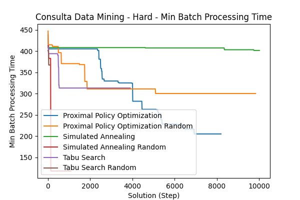 <em>Solution = Step</em></td><td><strong>Average Cycle Time</strong> 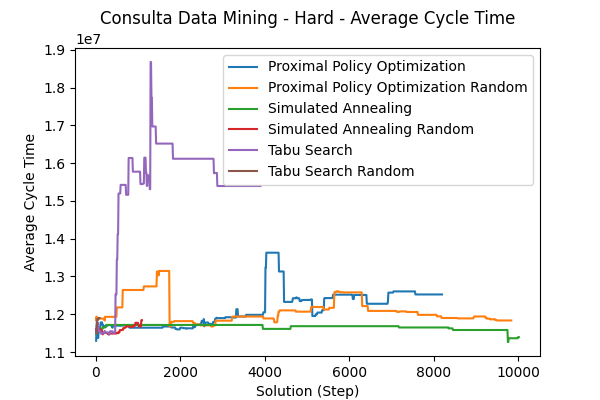 <em>Solution = Step</em></td></tr>
<tr><td><strong>Min Cycle Time</strong> 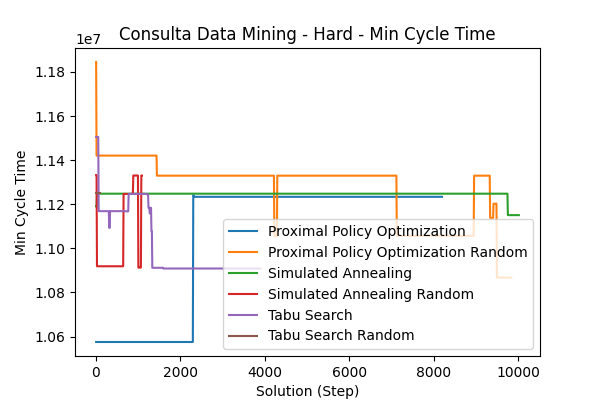 <em>Solution = Step</em></td><td><strong>Iteration Number</strong> 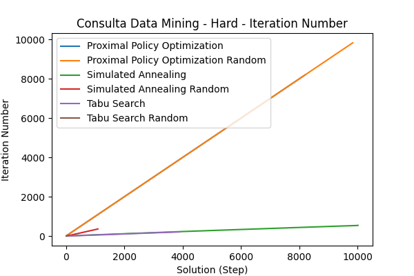 <em>Solution = Step</em></td><td></td></tr>
</table>

##### Summary Table (Final Values)

| Agent                               | Explored Solutions | New Base Solutions (Radius) | New Base Solutions (Temperature) | Median Batch Processing Time | Median Wait+Idle Time | Min Wait+Idle Time | Min Batch Processing Time | Average Cycle Time | Min Cycle Time | Iteration Number |
| :---------------------------------- | -----------------: | --------------------------: | -------------------------------: | ---------------------------: | --------------------: | -----------------: | ------------------------: | -----------------: | -------------: | ---------------: |
| Simulated Annealing Random          |                480 |                             |                                0 |                      362.548 |               37494.4 |            6460.22 |                   117.932 |        1.18439e+07 |    1.13304e+07 |              357 |
| Proximal Policy Optimization        |               1536 |                             |                                  |                      366.917 |               61966.4 |             6235.2 |                   205.196 |        1.25242e+07 |    1.12337e+07 |             8200 |
| Tabu Search                         |                156 |                         407 |                                  |                      415.201 |               6099.14 |            5615.28 |                   313.212 |        1.53945e+07 |    1.09086e+07 |              210 |
| Proximal Policy Optimization Random |                595 |                             |                                  |                      407.522 |               32505.5 |            6478.39 |                   300.311 |        1.18351e+07 |    1.08675e+07 |             9840 |
| Simulated Annealing                 |               1039 |                             |                               61 |                      431.474 |               26892.3 |            6000.73 |                   401.691 |        1.13937e+07 |    1.11507e+07 |              536 |
| Tabu Search Random                  |                 26 |                           0 |                                  |                      405.941 |               45240.1 |            6152.13 |                   367.441 |        1.19013e+07 |    1.12509e+07 |               25 |

##### Pareto Front Images

<table><tr>
<th>Simulated Annealing Random</th>
<th>Proximal Policy Optimization</th>
<th>Tabu Search</th>
<th>Proximal Policy Optimization Random</th>
<th>Simulated Annealing</th>
<th>Tabu Search Random</th>
</tr><tr>
<td>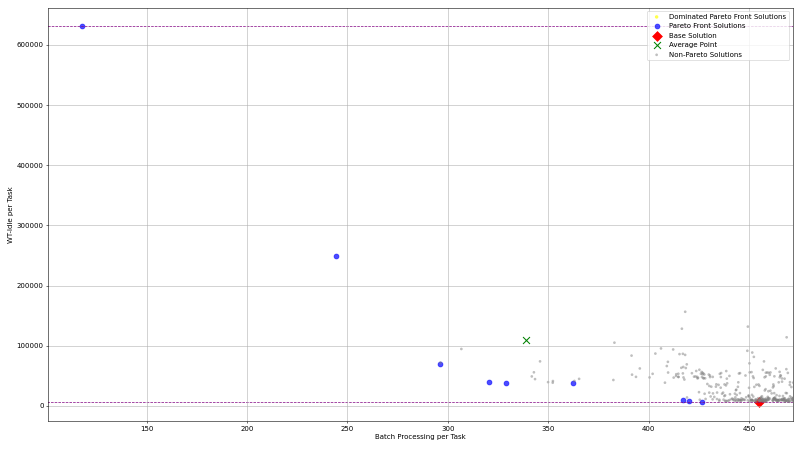</td>
<td></td>
<td>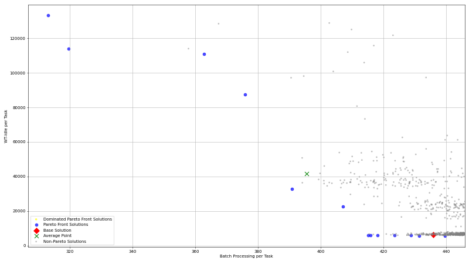</td>
<td>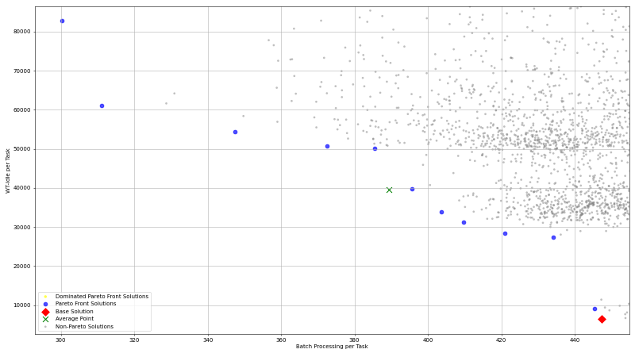</td>
<td>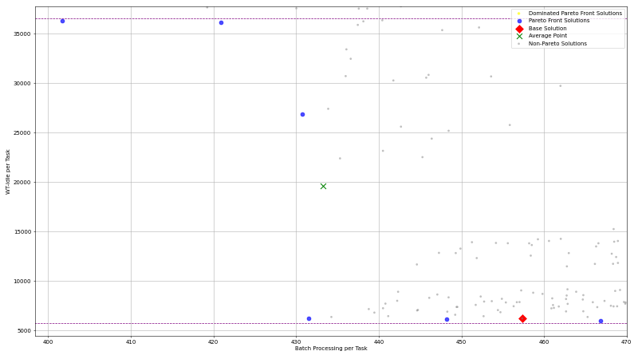</td>
<td>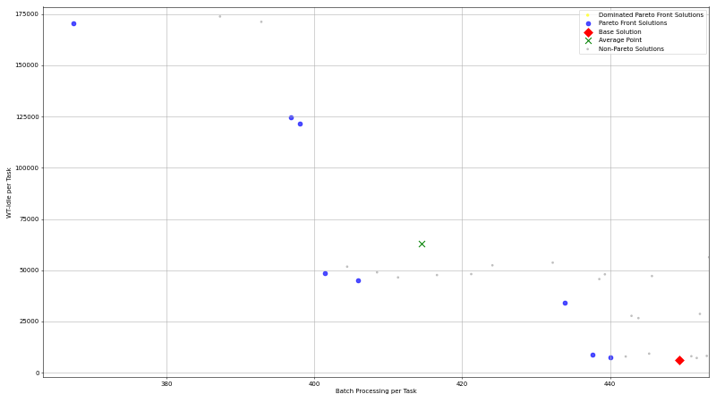</td>
</tr></table>

---

#### Mid

##### Metric Plots

<table>
<tr><td><strong>Pareto Front Size</strong> 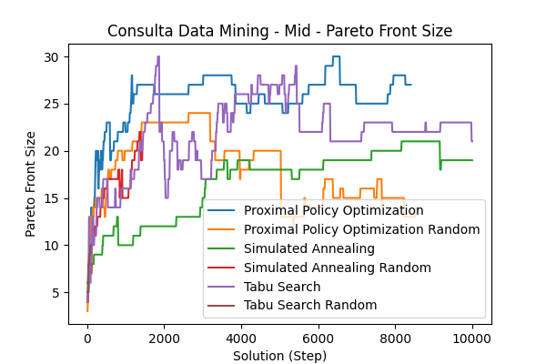 <em>Solution = Step</em></td><td><strong>Explored Solutions</strong> 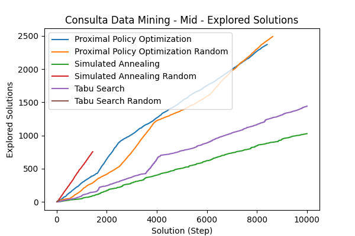 <em>Solution = Step</em></td><td><strong>New Base Solutions (Radius)</strong> 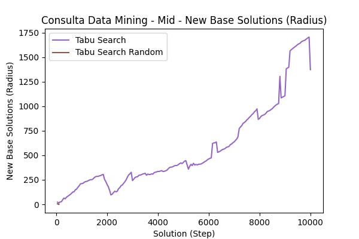 <em>Solution = Step</em></td></tr>
<tr><td><strong>New Base Solutions (Temperature)</strong> 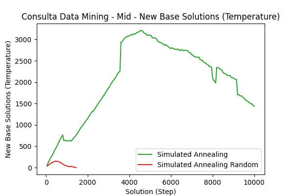 <em>Solution = Step</em></td><td><strong>Median Batch Processing Time</strong> 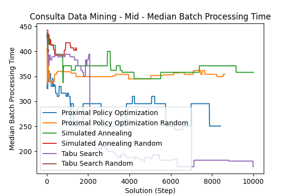 <em>Solution = Step</em></td><td><strong>Median Wait+Idle Time</strong> 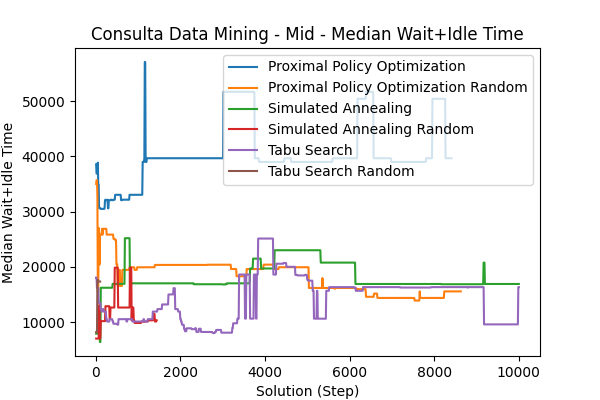 <em>Solution = Step</em></td></tr>
<tr><td><strong>Min Wait+Idle Time</strong> 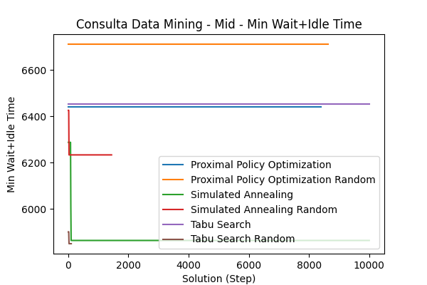 <em>Solution = Step</em></td><td><strong>Min Batch Processing Time</strong> 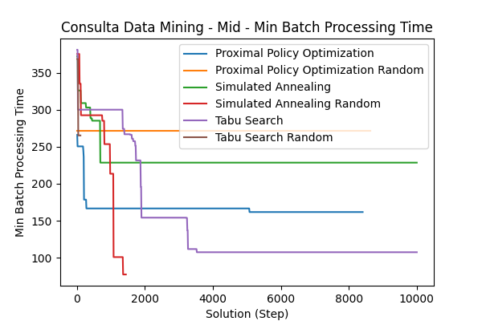 <em>Solution = Step</em></td><td><strong>Average Cycle Time</strong> 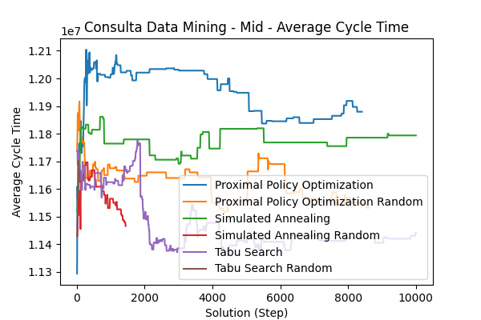 <em>Solution = Step</em></td></tr>
<tr><td><strong>Min Cycle Time</strong> 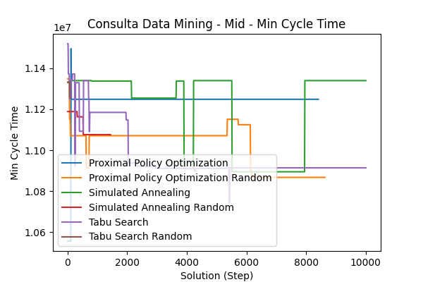 <em>Solution = Step</em></td><td><strong>Iteration Number</strong> 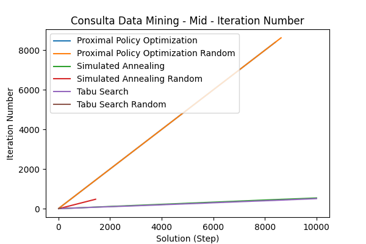 <em>Solution = Step</em></td><td></td></tr>
</table>

##### Summary Table (Final Values)

| Agent                               | Explored Solutions | New Base Solutions (Radius) | New Base Solutions (Temperature) | Median Batch Processing Time | Median Wait+Idle Time | Min Wait+Idle Time | Min Batch Processing Time | Average Cycle Time | Min Cycle Time | Iteration Number |
| :---------------------------------- | -----------------: | --------------------------: | -------------------------------: | ---------------------------: | --------------------: | -----------------: | ------------------------: | -----------------: | -------------: | ---------------: |
| Proximal Policy Optimization Random |               2491 |                             |                                  |                      354.015 |               15552.3 |            6711.04 |                   271.133 |        1.15323e+07 |    1.08673e+07 |             8630 |
| Tabu Search                         |               1443 |                        1374 |                                  |                      169.183 |               16326.9 |            6453.47 |                   107.354 |        1.14417e+07 |    1.09137e+07 |              508 |
| Tabu Search Random                  |                 29 |                           0 |                                  |                      402.302 |               17340.7 |            5849.89 |                   265.309 |        1.16251e+07 |    1.12549e+07 |               29 |
| Simulated Annealing                 |               1028 |                             |                             1435 |                      357.962 |               16897.4 |            5863.78 |                    228.51 |        1.17937e+07 |    1.13394e+07 |              538 |
| Simulated Annealing Random          |                755 |                             |                                0 |                      402.086 |               10307.5 |            6233.14 |                   77.2871 |        1.14658e+07 |    1.10758e+07 |              475 |
| Proximal Policy Optimization        |               2371 |                             |                                  |                      250.507 |               39678.4 |            6441.33 |                    161.69 |        1.18794e+07 |    1.12483e+07 |             8410 |

##### Pareto Front Images

<table><tr>
<th>Proximal Policy Optimization Random</th>
<th>Tabu Search</th>
<th>Tabu Search Random</th>
<th>Simulated Annealing</th>
<th>Simulated Annealing Random</th>
<th>Proximal Policy Optimization</th>
</tr><tr>
<td>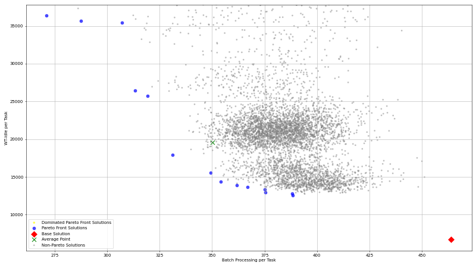</td>
<td>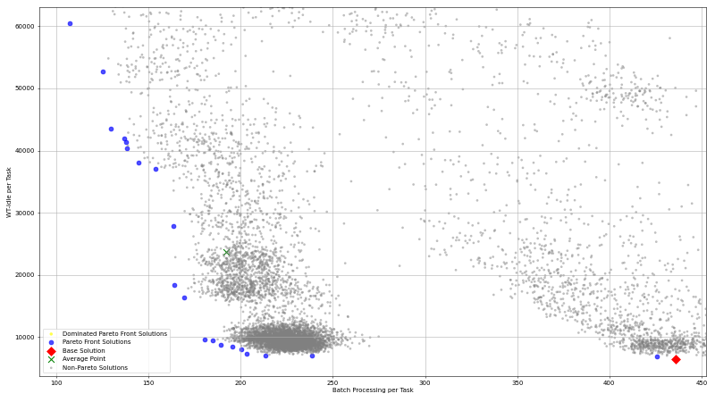</td>
<td>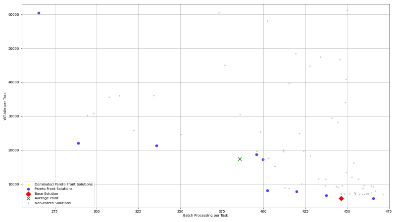</td>
<td>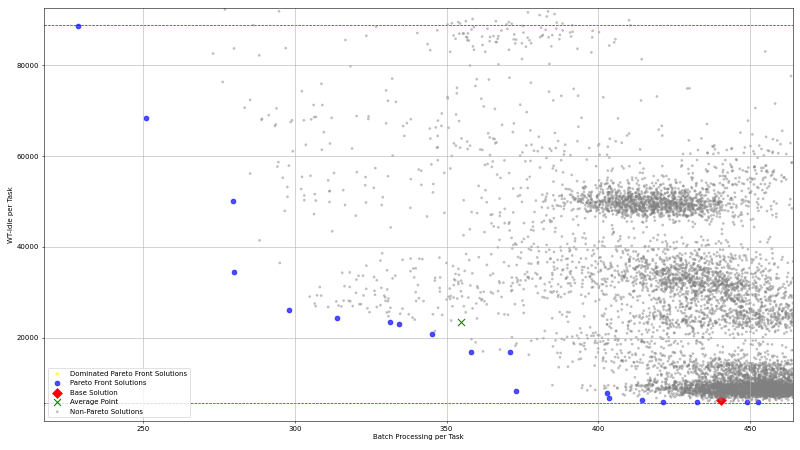</td>
<td>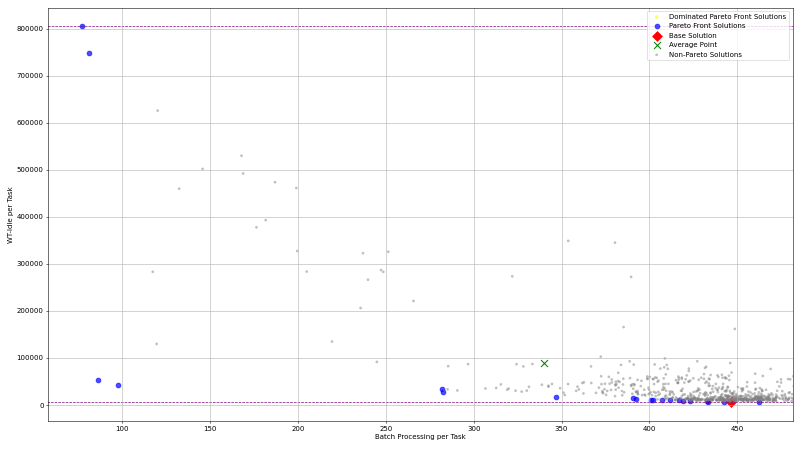</td>
<td>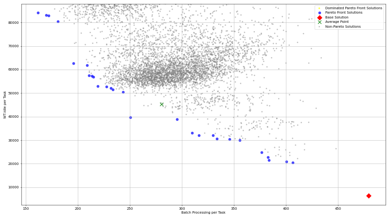</td>
</tr></table>

---

---

### Gov

#### Analyzer Overview

##### Pareto Size

| Agent / Reference | Easy  | Mid   | Hard |
| ----------------- | ----- | ----- | ---- |
| Reference         | 16,00 | 27,00 | 7,00 |
| Reference Random  | 9,00  | 13,00 | 5,00 |
| Reference Optimos | 25,00 | 24,00 | 8,00 |
| SA                | 13,00 | 14,00 | 1,00 |
| Tabu Search       | 16,00 | 23,00 | 9,00 |
| PPO               | 18,00 | 9,00  | 3,00 |
| Tabu Random       | 4,00  | 9,00  | 6,00 |
| SA Random         | 6,00  | 13,00 | 5,00 |
| PPO Random        | 8,00  | 1,00  | 3,00 |

 

##### Hyperarea Ratio

| Agent / Reference | Easy | Mid  | Hard |
| ----------------- | ---- | ---- | ---- |
| Reference Random  | 0,96 | 0,95 | 0,95 |
| Reference Optimos | 1,00 | 1,00 | 1,00 |
| SA                | 0,94 | 0,98 | 0,75 |
| Tabu Search       | 0,95 | 1,00 | 1,00 |
| PPO               | 1,00 | 0,98 | 0,80 |
| Tabu Random       | 0,83 | 0,95 | 0,87 |
| SA Random         | 0,83 | 0,93 | 0,95 |
| PPO Random        | 0,96 | 0,70 | 0,86 |

 

##### Hausdorff

| Agent / Reference | Easy       | Mid        | Hard      |
| ----------------- | ---------- | ---------- | --------- |
| Reference Random  | 39.667,12  | 352.431,65 | 5.806,21  |
| Reference Optimos | 10.576,03  | 352,96     | 3.998,92  |
| SA                | 152.385,25 | 399.357,74 | 20.475,90 |
| Tabu Search       | 32.656,23  | 1.302,60   | 3.868,06  |
| PPO               | 23.490,96  | 135.108,38 | 19.548,23 |
| Tabu Random       | 206.593,44 | 455.474,06 | 8.808,25  |
| SA Random         | 189.753,58 | 477.693,56 | 5.806,21  |
| PPO Random        | 40.487,77  | 50.237,47  | 17.401,13 |

 

##### Delta

| Agent / Reference | Easy | Mid  | Hard |
| ----------------- | ---- | ---- | ---- |
| Reference Random  | 0,97 | 1,34 | 1,11 |
| Reference Optimos | 0,89 | 1,03 | 0,85 |
| SA                | 1,26 | 1,17 | 0,00 |
| Tabu Search       | 0,91 | 1,02 | 0,91 |
| PPO               | 0,65 | 1,01 | 0,93 |
| Tabu Random       | 1,22 | 1,11 | 0,59 |
| SA Random         | 1,27 | 1,27 | 1,11 |
| PPO Random        | 0,92 | 0,00 | 0,88 |

 

##### Purity

| Agent / Reference | Easy | Mid  | Hard |
| ----------------- | ---- | ---- | ---- |
| Reference Random  | 0,38 | 0,15 | 0,71 |
| Reference Optimos | 0,62 | 0,85 | 0,29 |
| SA                | 0,38 | 0,04 | 0,00 |
| Tabu Search       | 0,00 | 0,81 | 0,29 |
| PPO               | 0,25 | 0,00 | 0,00 |
| Tabu Random       | 0,00 | 0,00 | 0,00 |
| SA Random         | 0,06 | 0,15 | 0,71 |
| PPO Random        | 0,31 | 0,00 | 0,00 |

 

##### Avg Cycle Time

| Agent / Reference | Easy          | Mid           | Hard          |
| ----------------- | ------------- | ------------- | ------------- |
| Base              | 13.369.643,07 | 16.047.474,92 | 15.756.570,78 |
| Reference         | 20.436.272,38 | 14.173.733,86 | 17.593.722,11 |
| Reference Random  | 18.702.461,88 | 22.575.756,16 | 16.897.205,28 |
| Reference Optimos | 20.952.414,82 | 13.521.404,64 | 18.387.074,73 |
| SA                | 19.893.274,06 | 28.990.146,10 | 15.180.790,23 |
| Tabu Search       | 20.151.717,82 | 13.179.858,35 | 18.507.970,25 |
| PPO               | 22.998.007,74 | 46.578.544,00 | 16.484.211,55 |
| Tabu Random       | 16.411.001,37 | 29.225.441,19 | 18.492.864,11 |
| SA Random         | 17.674.868,00 | 22.470.807,00 | 16.897.205,28 |
| PPO Random        | 19.708.624,27 | 16.047.474,92 | 19.719.892,00 |

 

##### Best Cycle Time

| Agent / Reference | Easy          | Mid           | Hard          |
| ----------------- | ------------- | ------------- | ------------- |
| Base              | 13.369.643,07 | 16.047.474,92 | 15.756.570,78 |
| Reference         | 15.788.366,74 | 10.521.791,54 | 14.582.036,26 |
| Reference Random  | 14.811.805,42 | 15.523.152,37 | 14.582.036,26 |
| Reference Optimos | 15.788.366,74 | 10.521.791,54 | 14.914.682,03 |
| SA                | 15.788.366,74 | 13.734.908,48 | 15.180.790,23 |
| Tabu Search       | 16.655.749,35 | 10.521.791,54 | 14.914.682,03 |
| PPO               | 13.369.643,07 | 16.357.230,91 | 15.887.150,00 |
| Tabu Random       | 13.369.643,07 | 16.723.485,01 | 17.763.490,08 |
| SA Random         | 14.811.805,42 | 15.523.152,37 | 14.582.036,26 |
| PPO Random        | 16.639.415,98 | 16.047.474,92 | 15.756.570,78 |

 

#### Easy

##### Metric Plots

<table>
<tr><td><strong>Pareto Front Size</strong> 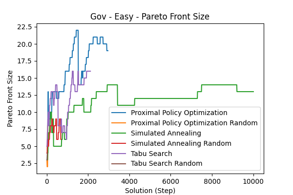 <em>Solution = Step</em></td><td><strong>Explored Solutions</strong> 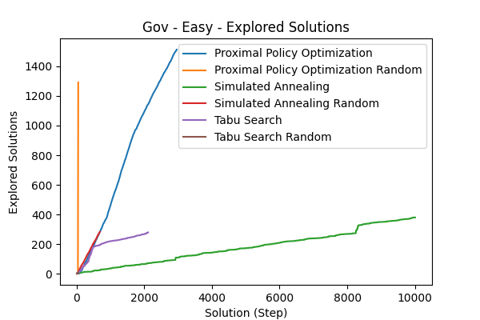 <em>Solution = Step</em></td><td><strong>New Base Solutions (Radius)</strong> 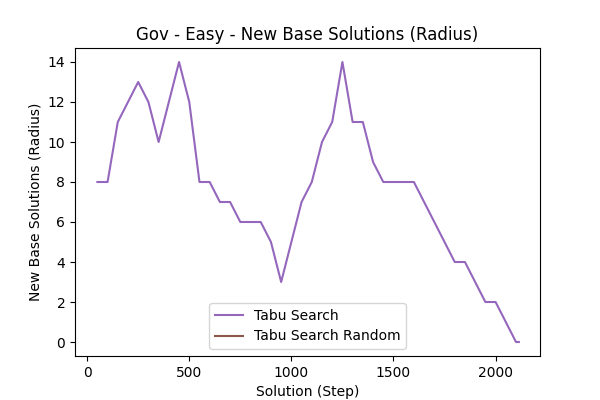 <em>Solution = Step</em></td></tr>
<tr><td><strong>New Base Solutions (Temperature)</strong> 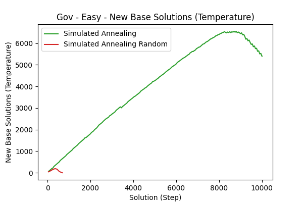 <em>Solution = Step</em></td><td><strong>Median Batch Processing Time</strong> 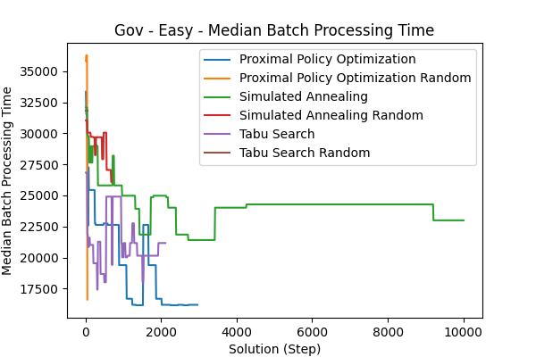 <em>Solution = Step</em></td><td><strong>Median Wait+Idle Time</strong> 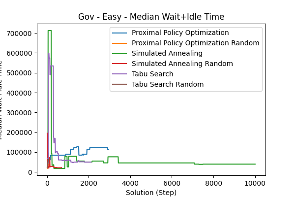 <em>Solution = Step</em></td></tr>
<tr><td><strong>Min Wait+Idle Time</strong> 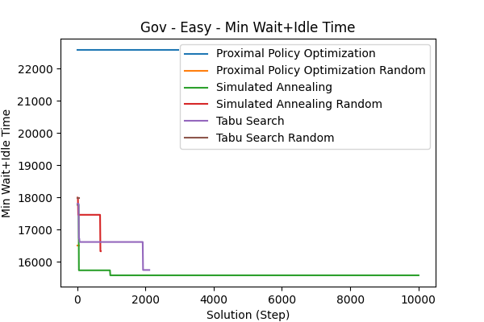 <em>Solution = Step</em></td><td><strong>Min Batch Processing Time</strong> 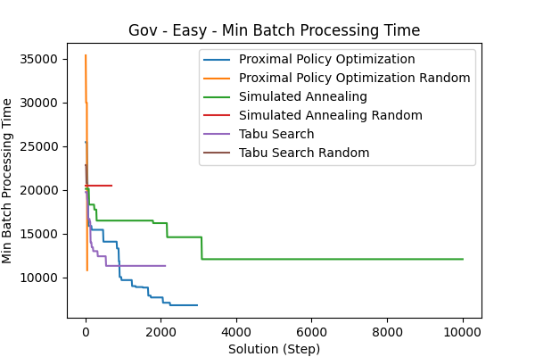 <em>Solution = Step</em></td><td><strong>Average Cycle Time</strong> 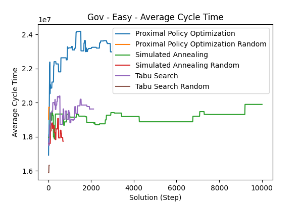 <em>Solution = Step</em></td></tr>
<tr><td><strong>Min Cycle Time</strong> 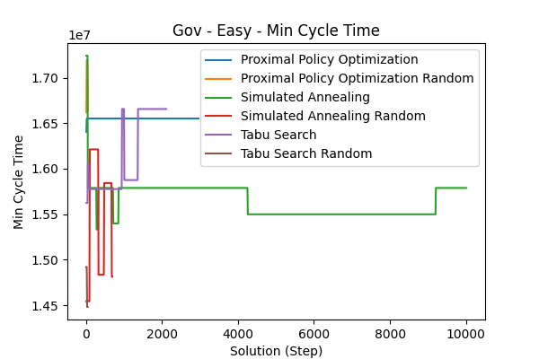 <em>Solution = Step</em></td><td><strong>Iteration Number</strong> 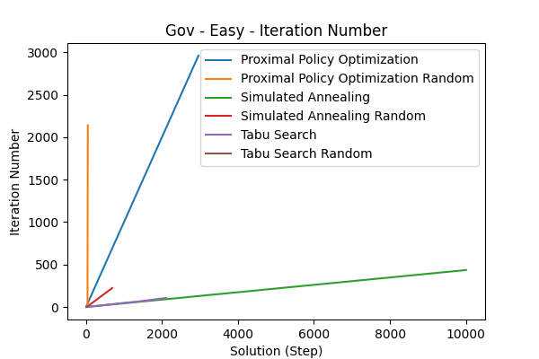 <em>Solution = Step</em></td><td></td></tr>
</table>

##### Summary Table (Final Values)

| Agent                               | Explored Solutions | New Base Solutions (Radius) | New Base Solutions (Temperature) | Median Batch Processing Time | Median Wait+Idle Time | Min Wait+Idle Time | Min Batch Processing Time | Average Cycle Time | Min Cycle Time | Iteration Number |
| :---------------------------------- | -----------------: | --------------------------: | -------------------------------: | ---------------------------: | --------------------: | -----------------: | ------------------------: | -----------------: | -------------: | ---------------: |
| Simulated Annealing Random          |                283 |                             |                                0 |                      26094.2 |               21950.9 |            16326.9 |                   20502.1 |        1.77299e+07 |    1.48118e+07 |              224 |
| Proximal Policy Optimization        |               1513 |                             |                                  |                      16202.4 |                114188 |            22581.1 |                   6818.76 |        2.29747e+07 |    1.65511e+07 |             2960 |
| Proximal Policy Optimization Random |               1292 |                             |                                  |                      16627.8 |               38220.7 |              16503 |                   10819.3 |        1.97086e+07 |    1.66394e+07 |             2141 |
| Simulated Annealing                 |                380 |                             |                             5397 |                      22997.7 |               39174.3 |            15579.2 |                     12078 |        1.98933e+07 |    1.57884e+07 |              436 |
| Tabu Search                         |                279 |                           0 |                                  |                      21172.7 |               49389.3 |            15744.2 |                   11317.7 |        1.96246e+07 |    1.66557e+07 |              107 |
| Tabu Search Random                  |                  9 |                           0 |                                  |                      31842.3 |                 50827 |            17978.8 |                   20743.8 |        1.63184e+07 |    1.44806e+07 |                9 |

##### Pareto Front Images

<table><tr>
<th>Simulated Annealing Random</th>
<th>Proximal Policy Optimization</th>
<th>Proximal Policy Optimization Random</th>
<th>Simulated Annealing</th>
<th>Tabu Search</th>
<th>Tabu Search Random</th>
</tr><tr>
<td>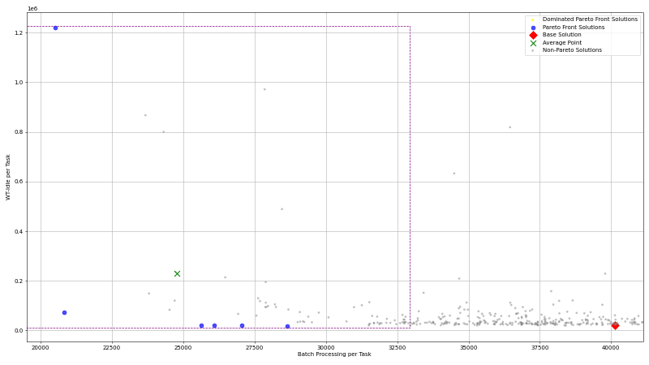</td>
<td>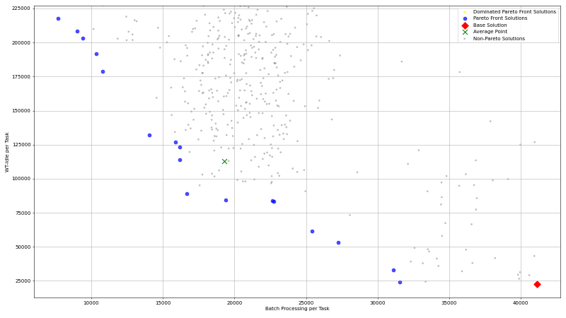</td>
<td>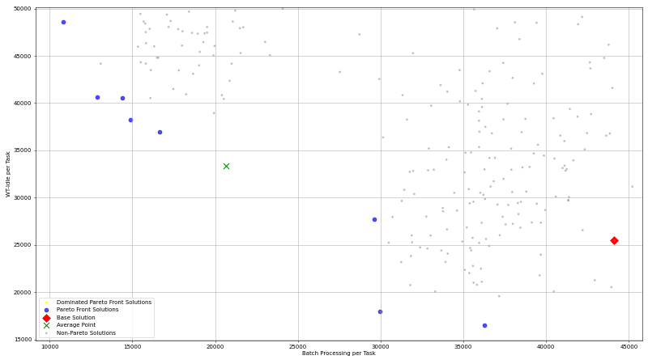</td>
<td>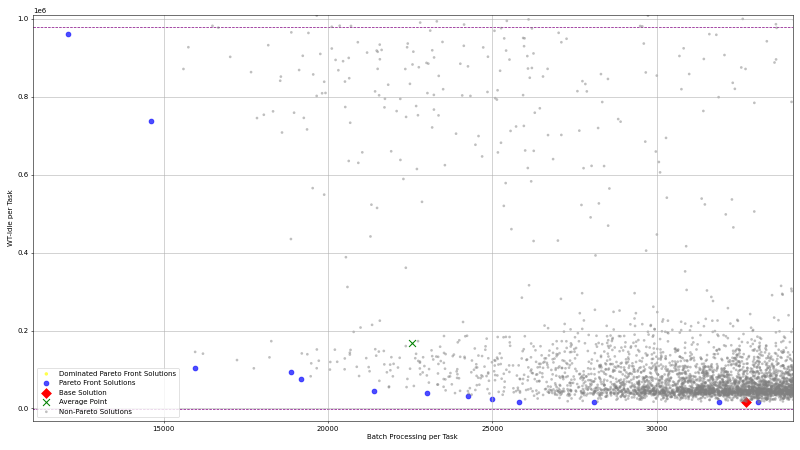</td>
<td>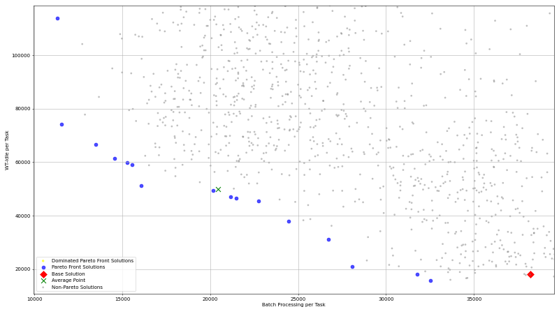</td>
<td>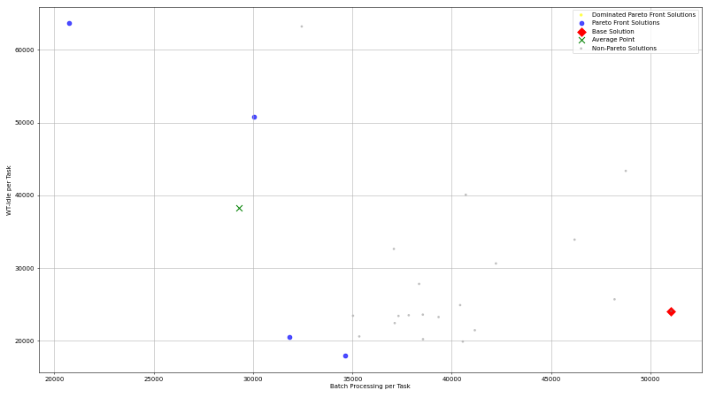</td>
</tr></table>

---

#### Hard

##### Metric Plots

<table>
<tr><td><strong>Pareto Front Size</strong>  <em>Solution = Step</em></td><td><strong>Explored Solutions</strong> 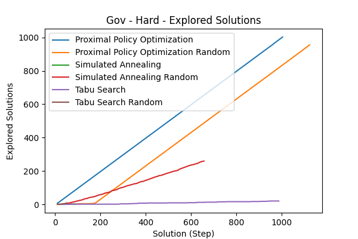 <em>Solution = Step</em></td><td><strong>New Base Solutions (Radius)</strong> 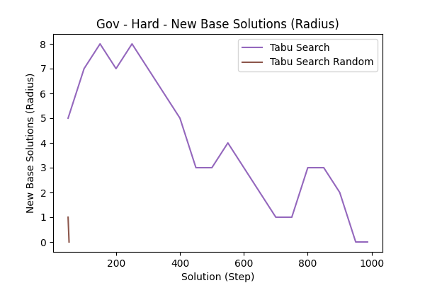 <em>Solution = Step</em></td></tr>
<tr><td><strong>New Base Solutions (Temperature)</strong> 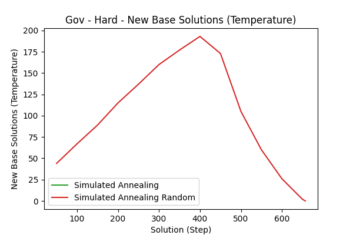 <em>Solution = Step</em></td><td><strong>Median Batch Processing Time</strong> 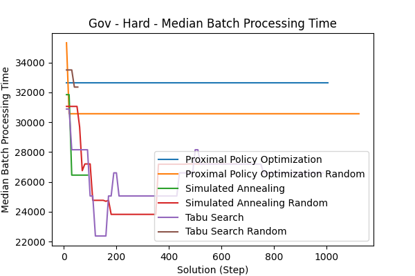 <em>Solution = Step</em></td><td><strong>Median Wait+Idle Time</strong> 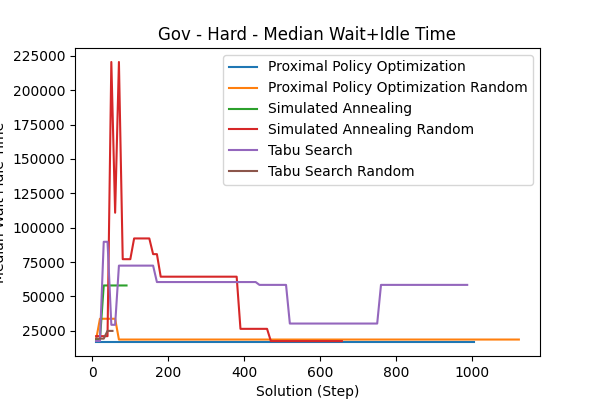 <em>Solution = Step</em></td></tr>
<tr><td><strong>Min Wait+Idle Time</strong> 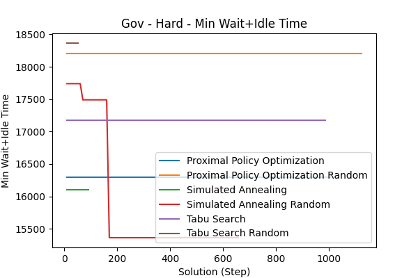 <em>Solution = Step</em></td><td><strong>Min Batch Processing Time</strong> 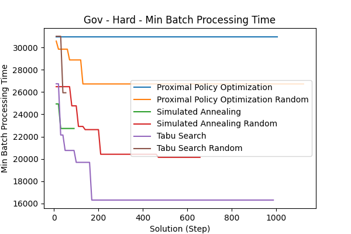 <em>Solution = Step</em></td><td><strong>Average Cycle Time</strong> 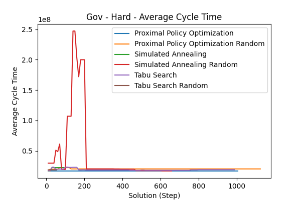 <em>Solution = Step</em></td></tr>
<tr><td><strong>Min Cycle Time</strong> 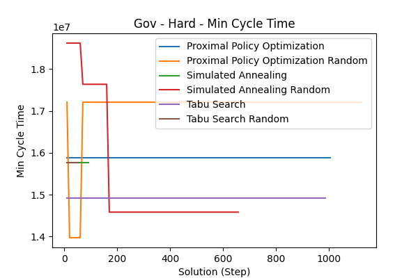 <em>Solution = Step</em></td><td><strong>Iteration Number</strong> 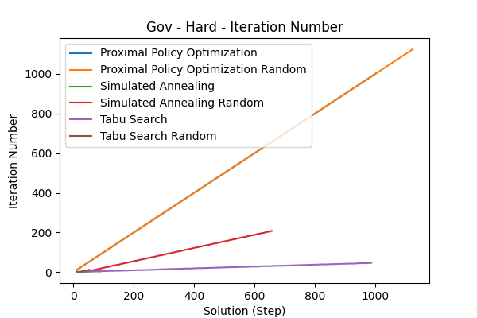 <em>Solution = Step</em></td><td></td></tr>
</table>

##### Summary Table (Final Values)

| Agent                               | Explored Solutions | New Base Solutions (Radius) | New Base Solutions (Temperature) | Median Batch Processing Time | Median Wait+Idle Time | Min Wait+Idle Time | Min Batch Processing Time | Average Cycle Time | Min Cycle Time | Iteration Number |
| :---------------------------------- | -----------------: | --------------------------: | -------------------------------: | ---------------------------: | --------------------: | -----------------: | ------------------------: | -----------------: | -------------: | ---------------: |
| Simulated Annealing Random          |                260 |                             |                                0 |                      27205.9 |               17489.5 |            15362.9 |                   20141.6 |        1.68972e+07 |     1.4582e+07 |              208 |
| Simulated Annealing                 |                  2 |                             |                               57 |                      26455.9 |               57958.7 |            16098.6 |                   22732.4 |         2.2491e+07 |    1.57653e+07 |                4 |
| Tabu Search                         |                 21 |                           0 |                                  |                      26606.1 |               58379.5 |            17174.7 |                     16308 |         1.8935e+07 |    1.49147e+07 |               47 |
| Proximal Policy Optimization        |               1002 |                             |                                  |                      32647.9 |               16824.2 |            16297.8 |                   30929.9 |        1.70208e+07 |    1.58872e+07 |             1005 |
| Tabu Search Random                  |                 10 |                           0 |                                  |                      32359.8 |               24904.8 |            18364.8 |                     25940 |        1.86589e+07 |    1.57566e+07 |               12 |
| Proximal Policy Optimization Random |                955 |                             |                                  |                      30572.2 |               18615.2 |            18202.9 |                   26730.4 |        2.02035e+07 |    1.72073e+07 |             1124 |

##### Pareto Front Images

<table><tr>
<th>Simulated Annealing Random</th>
<th>Tabu Search</th>
<th>Proximal Policy Optimization</th>
<th>Tabu Search Random</th>
<th>Proximal Policy Optimization Random</th>
</tr><tr>
<td>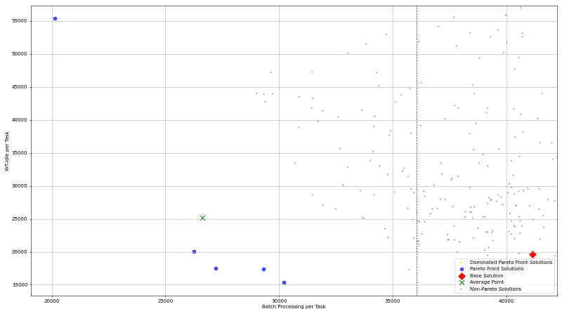</td>
<td>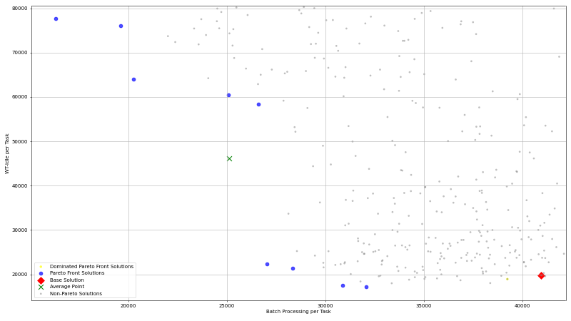</td>
<td>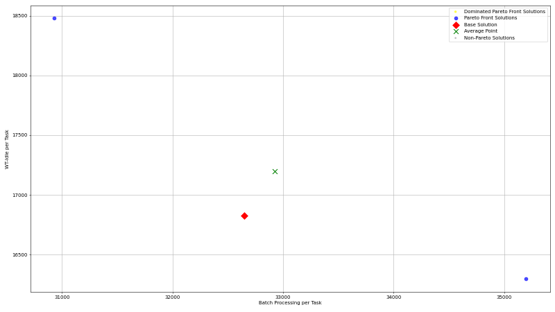</td>
<td>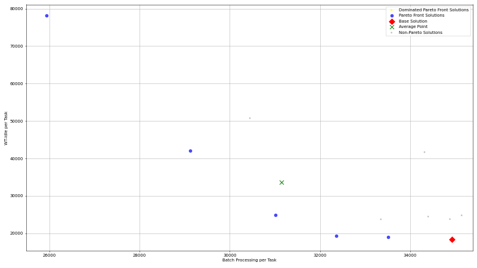</td>
<td>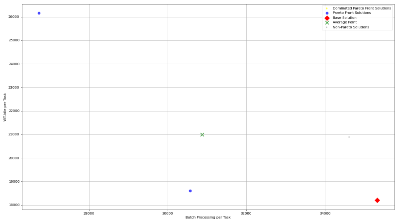</td>
</tr></table>

---

#### Mid

##### Metric Plots

<table>
<tr><td><strong>Pareto Front Size</strong> 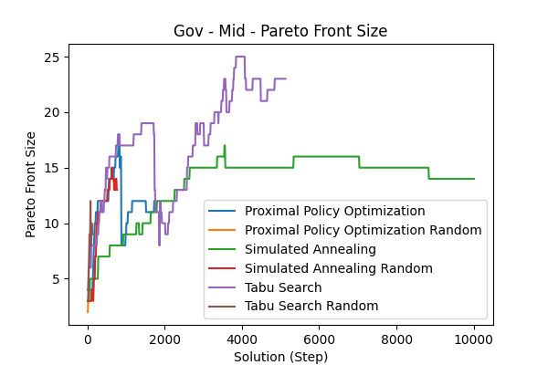 <em>Solution = Step</em></td><td><strong>Explored Solutions</strong> 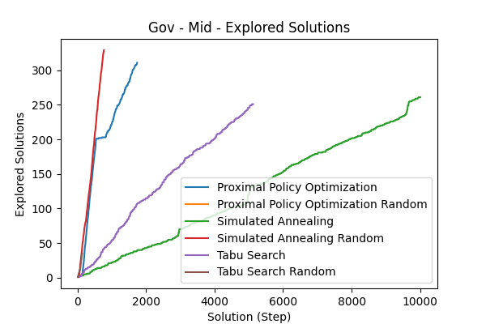 <em>Solution = Step</em></td><td><strong>New Base Solutions (Radius)</strong> 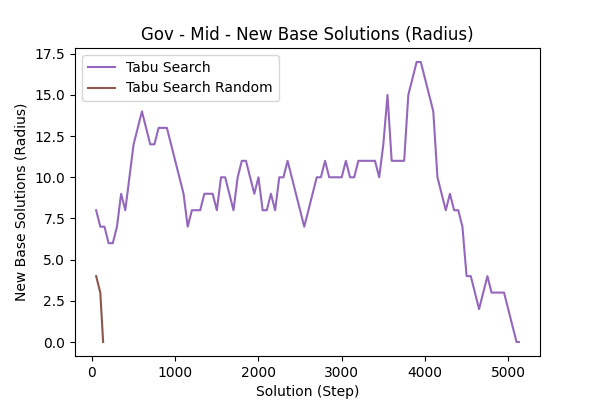 <em>Solution = Step</em></td></tr>
<tr><td><strong>New Base Solutions (Temperature)</strong>  <em>Solution = Step</em></td><td><strong>Median Batch Processing Time</strong> 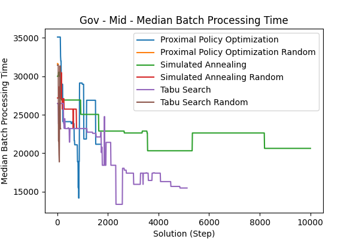 <em>Solution = Step</em></td><td><strong>Median Wait+Idle Time</strong> 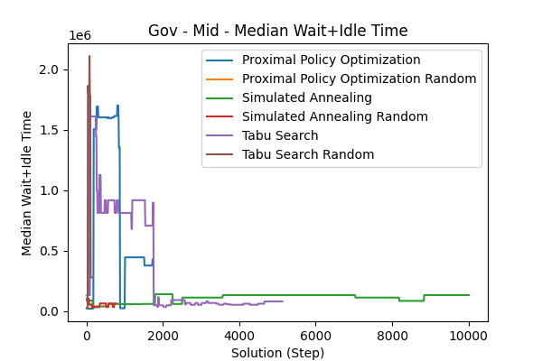 <em>Solution = Step</em></td></tr>
<tr><td><strong>Min Wait+Idle Time</strong> 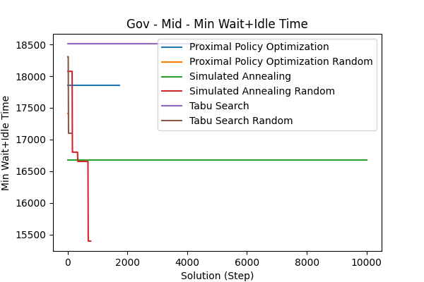 <em>Solution = Step</em></td><td><strong>Min Batch Processing Time</strong> 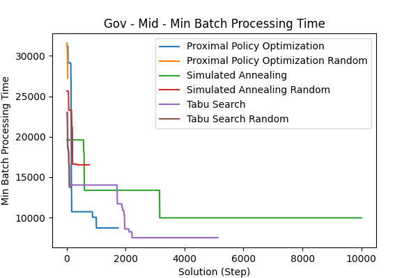 <em>Solution = Step</em></td><td><strong>Average Cycle Time</strong> 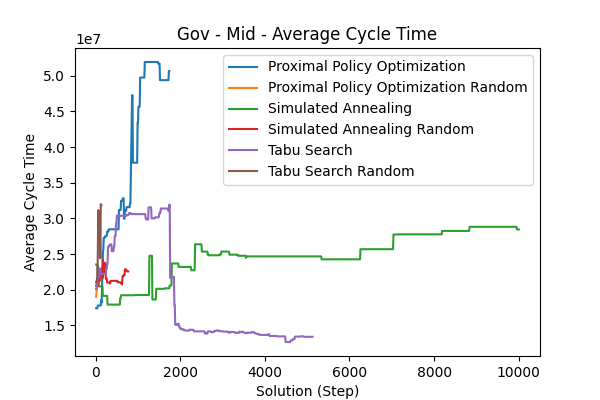 <em>Solution = Step</em></td></tr>
<tr><td><strong>Min Cycle Time</strong> 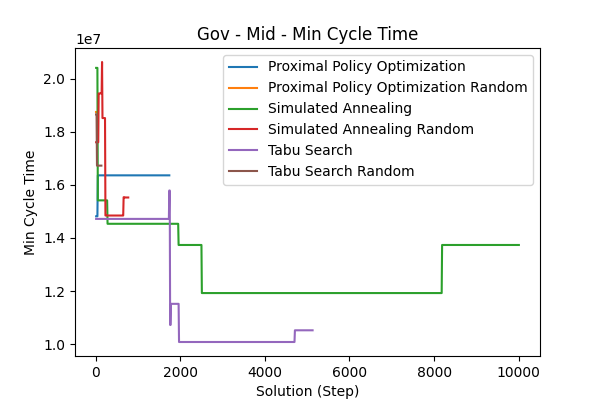 <em>Solution = Step</em></td><td><strong>Iteration Number</strong> 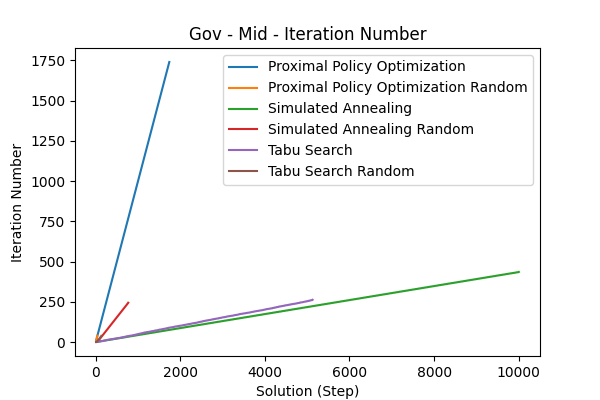 <em>Solution = Step</em></td><td></td></tr>
</table>

##### Summary Table (Final Values)

| Agent                               | Explored Solutions | New Base Solutions (Radius) | New Base Solutions (Temperature) | Median Batch Processing Time | Median Wait+Idle Time | Min Wait+Idle Time | Min Batch Processing Time | Average Cycle Time | Min Cycle Time | Iteration Number |
| :---------------------------------- | -----------------: | --------------------------: | -------------------------------: | ---------------------------: | --------------------: | -----------------: | ------------------------: | -----------------: | -------------: | ---------------: |
| Simulated Annealing                 |                261 |                             |                             5965 |                      20624.5 |                131950 |            16679.8 |                   9974.93 |        2.84575e+07 |    1.37349e+07 |              436 |
| Proximal Policy Optimization Random |                  2 |                             |                                  |                      31570.7 |               29507.8 |              17416 |                   27229.8 |        2.06983e+07 |    1.87449e+07 |               40 |
| Tabu Search                         |                251 |                           0 |                                  |                      15466.1 |               79917.1 |            18424.2 |                   7523.86 |        1.33973e+07 |    1.05218e+07 |              263 |
| Tabu Search Random                  |                 35 |                           0 |                                  |                      23175.2 |                277960 |            17099.1 |                   13762.5 |        3.18784e+07 |    1.67235e+07 |               39 |
| Simulated Annealing Random          |                329 |                             |                                0 |                      23271.2 |               63004.7 |            15398.1 |                   16524.7 |        2.25602e+07 |    1.55232e+07 |              245 |
| Proximal Policy Optimization        |                311 |                             |                                  |                      21161.4 |                427582 |            17853.6 |                   8724.54 |        5.06741e+07 |    1.63572e+07 |             1740 |

##### Pareto Front Images

<table><tr>
<th>Simulated Annealing</th>
<th>Tabu Search</th>
<th>Tabu Search Random</th>
<th>Simulated Annealing Random</th>
</tr><tr>
<td>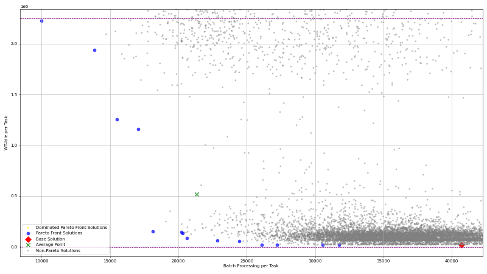</td>
<td>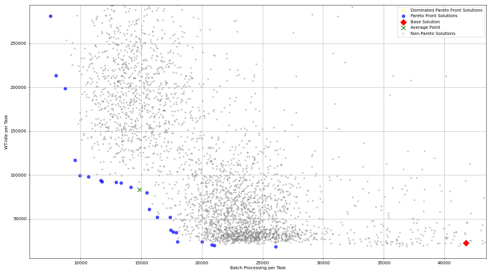</td>
<td>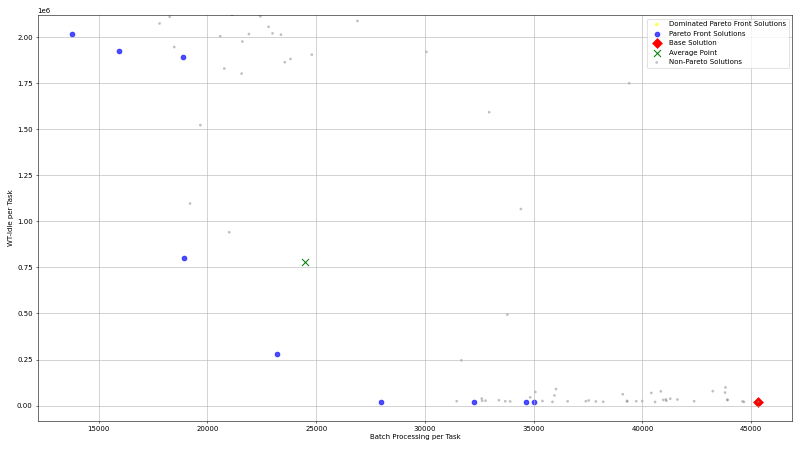</td>
<td>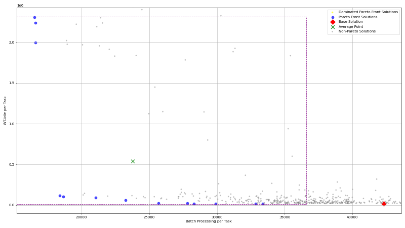</td>
</tr></table>

---

---

### Insurance

#### Analyzer Overview

##### Pareto Size

| Agent / Reference | Easy   | Mid   | Hard  |
| ----------------- | ------ | ----- | ----- |
| Reference         | 102,00 | 35,00 | 9,00  |
| Reference Random  | 49,00  | 18,00 | 11,00 |
| Reference Optimos | 83,00  | 35,00 | 9,00  |
| SA                | 35,00  | 15,00 | 9,00  |
| Tabu Search       | 66,00  | 24,00 | 9,00  |
| PPO               | 34,00  | 19,00 | 6,00  |
| Tabu Random       | 20,00  | 10,00 | 2,00  |
| SA Random         | 42,00  | 15,00 | 4,00  |
| PPO Random        | 23,00  | 15,00 | 13,00 |

 

##### Hyperarea Ratio

| Agent / Reference | Easy | Mid  | Hard |
| ----------------- | ---- | ---- | ---- |
| Reference Random  | 1,00 | 0,96 | 1,00 |
| Reference Optimos | 0,86 | 1,00 | 1,00 |
| SA                | 0,63 | 0,67 | 1,00 |
| Tabu Search       | 0,86 | 0,65 | 1,00 |
| PPO               | 0,84 | 0,99 | 1,00 |
| Tabu Random       | 0,76 | 0,72 | 1,00 |
| SA Random         | 1,00 | 0,96 | 1,00 |
| PPO Random        | 0,73 | 0,83 | 1,00 |

 

##### Hausdorff

| Agent / Reference | Easy      | Mid      | Hard     |
| ----------------- | --------- | -------- | -------- |
| Reference Random  | 820,72    | 2.021,48 | 405,81   |
| Reference Optimos | 20.828,96 | 300,91   | 0,00     |
| SA                | 25.189,49 | 8.911,26 | 239,13   |
| Tabu Search       | 20.873,41 | 9.904,22 | 514,92   |
| PPO               | 22.266,42 | 1.265,45 | 6.938,30 |
| Tabu Random       | 23.137,72 | 5.116,44 | 694,27   |
| SA Random         | 1.089,10  | 2.175,18 | 731,99   |
| PPO Random        | 22.317,59 | 2.574,28 | 360,41   |

 

##### Delta

| Agent / Reference | Easy | Mid  | Hard |
| ----------------- | ---- | ---- | ---- |
| Reference Random  | 1,20 | 1,12 | 0,90 |
| Reference Optimos | 0,97 | 0,97 | 1,08 |
| SA                | 0,98 | 1,00 | 1,21 |
| Tabu Search       | 0,97 | 1,01 | 0,86 |
| PPO               | 0,99 | 0,79 | 1,24 |
| Tabu Random       | 0,96 | 0,96 | 0,69 |
| SA Random         | 1,13 | 1,23 | 0,73 |
| PPO Random        | 0,98 | 0,71 | 0,81 |

 

##### Purity

| Agent / Reference | Easy | Mid  | Hard |
| ----------------- | ---- | ---- | ---- |
| Reference Random  | 0,19 | 0,11 | 0,00 |
| Reference Optimos | 0,81 | 0,89 | 1,00 |
| SA                | 0,17 | 0,26 | 0,22 |
| Tabu Search       | 0,64 | 0,34 | 0,67 |
| PPO               | 0,01 | 0,34 | 0,22 |
| Tabu Random       | 0,01 | 0,03 | 0,11 |
| SA Random         | 0,17 | 0,11 | 0,11 |
| PPO Random        | 0,01 | 0,03 | 0,11 |

 

##### Avg Cycle Time

| Agent / Reference | Easy          | Mid           | Hard          |
| ----------------- | ------------- | ------------- | ------------- |
| Base              | 21.523.074,51 | 21.367.016,55 | 21.992.001,65 |
| Reference         | 22.163.701,21 | 22.480.273,77 | 21.980.061,32 |
| Reference Random  | 22.520.861,70 | 22.715.030,13 | 22.230.347,40 |
| Reference Optimos | 21.940.447,08 | 22.319.156,40 | 21.980.061,32 |
| SA                | 21.997.410,60 | 21.882.992,74 | 21.868.122,18 |
| Tabu Search       | 21.931.262,97 | 22.084.117,64 | 22.034.900,76 |
| PPO               | 21.866.011,73 | 22.512.018,90 | 22.017.415,53 |
| Tabu Random       | 21.910.472,47 | 22.448.677,25 | 21.575.390,94 |
| SA Random         | 22.575.855,21 | 22.727.193,86 | 21.591.259,18 |
| PPO Random        | 21.976.390,66 | 22.504.743,76 | 22.192.879,69 |

 

##### Best Cycle Time

| Agent / Reference | Easy          | Mid           | Hard          |
| ----------------- | ------------- | ------------- | ------------- |
| Base              | 21.523.074,51 | 21.367.016,55 | 21.992.001,65 |
| Reference         | 21.072.069,32 | 21.367.016,55 | 21.506.333,06 |
| Reference Random  | 21.265.421,23 | 21.209.398,29 | 21.840.288,41 |
| Reference Optimos | 21.072.069,32 | 21.449.581,76 | 21.506.333,06 |
| SA                | 20.944.858,00 | 21.367.016,55 | 21.221.099,75 |
| Tabu Search       | 21.072.069,32 | 21.288.200,25 | 21.776.404,35 |
| PPO               | 20.709.108,80 | 21.250.656,59 | 21.517.242,02 |
| Tabu Random       | 21.285.666,80 | 21.367.016,55 | 21.370.047,01 |
| SA Random         | 21.265.421,23 | 21.282.481,73 | 21.370.047,01 |
| PPO Random        | 21.114.791,87 | 21.209.398,29 | 21.780.734,88 |

 

#### Easy

##### Metric Plots

<table>
<tr><td><strong>Pareto Front Size</strong> 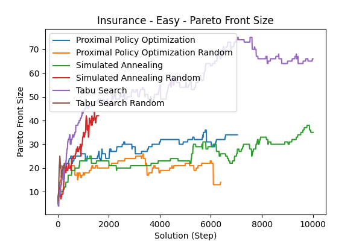 <em>Solution = Step</em></td><td><strong>Explored Solutions</strong> 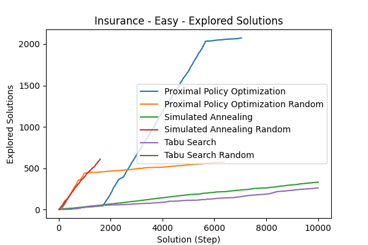 <em>Solution = Step</em></td><td><strong>New Base Solutions (Radius)</strong> 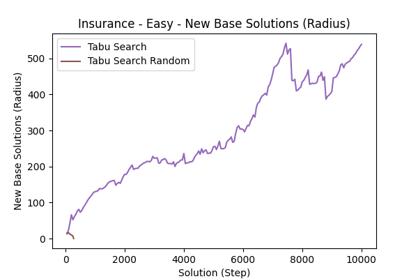 <em>Solution = Step</em></td></tr>
<tr><td><strong>New Base Solutions (Temperature)</strong> 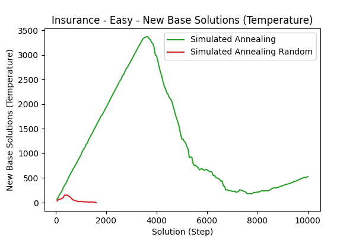 <em>Solution = Step</em></td><td><strong>Median Batch Processing Time</strong> 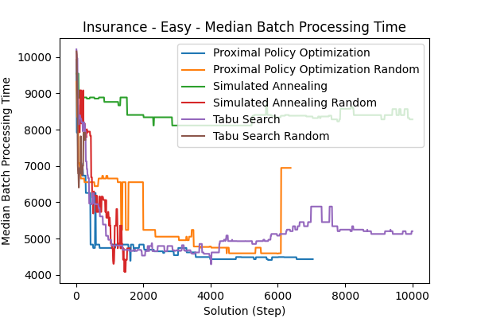 <em>Solution = Step</em></td><td><strong>Median Wait+Idle Time</strong> 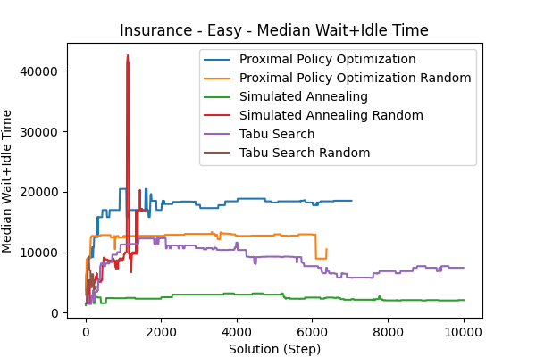 <em>Solution = Step</em></td></tr>
<tr><td><strong>Min Wait+Idle Time</strong> 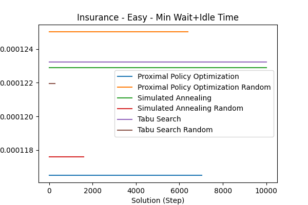 <em>Solution = Step</em></td><td><strong>Min Batch Processing Time</strong> 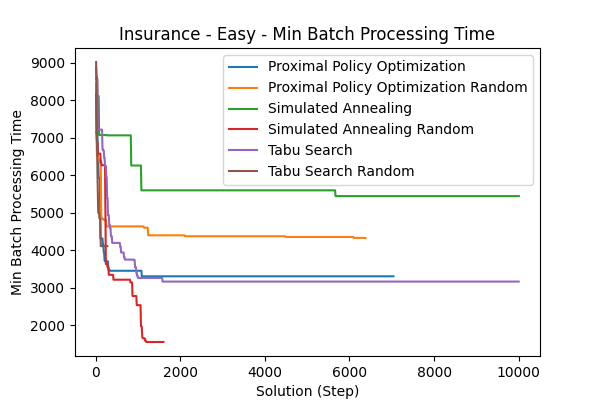 <em>Solution = Step</em></td><td><strong>Average Cycle Time</strong> 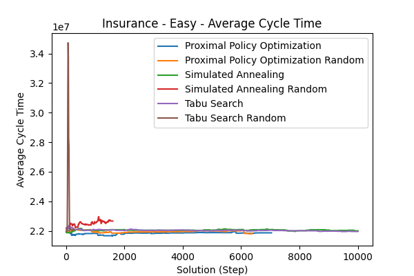 <em>Solution = Step</em></td></tr>
<tr><td><strong>Min Cycle Time</strong> 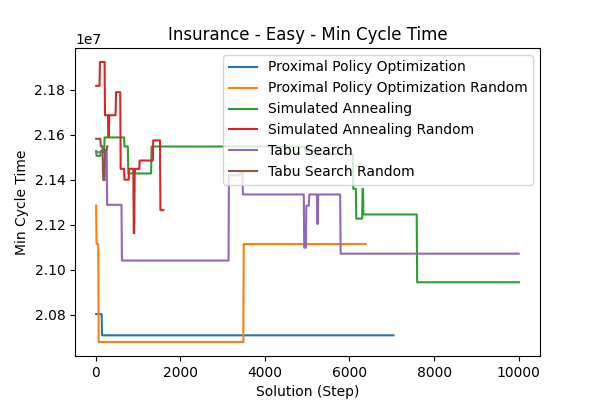 <em>Solution = Step</em></td><td><strong>Iteration Number</strong> 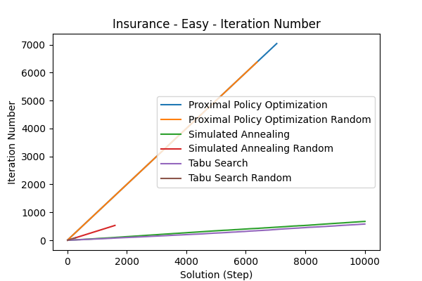 <em>Solution = Step</em></td><td></td></tr>
</table>

##### Summary Table (Final Values)

| Agent                               | Explored Solutions | New Base Solutions (Radius) | New Base Solutions (Temperature) | Median Batch Processing Time | Median Wait+Idle Time | Min Wait+Idle Time | Min Batch Processing Time | Average Cycle Time | Min Cycle Time | Iteration Number |
| :---------------------------------- | -----------------: | --------------------------: | -------------------------------: | ---------------------------: | --------------------: | -----------------: | ------------------------: | -----------------: | -------------: | ---------------: |
| Proximal Policy Optimization Random |                576 |                             |                                  |                      6945.97 |               10507.8 |        0.000125033 |                    4322.7 |        2.18484e+07 |    2.11148e+07 |             6380 |
| Simulated Annealing Random          |                609 |                             |                                0 |                      4733.08 |               16923.2 |        0.000117582 |                   1552.04 |        2.26663e+07 |    2.12654e+07 |              532 |
| Proximal Policy Optimization        |               2074 |                             |                                  |                      4433.41 |               18527.3 |        0.000116494 |                   3304.72 |        2.18687e+07 |    2.07091e+07 |             7040 |
| Simulated Annealing                 |                331 |                             |                              531 |                      8281.91 |               2091.42 |        0.000122913 |                   5444.12 |        2.20013e+07 |    2.09449e+07 |              675 |
| Tabu Search Random                  |                 96 |                           0 |                                  |                      7720.85 |               4222.09 |        0.000121963 |                   4110.18 |        2.20979e+07 |    2.15495e+07 |               90 |
| Tabu Search                         |                261 |                         539 |                                  |                      5203.88 |               7433.62 |        0.000123237 |                   3163.88 |        2.19604e+07 |    2.10721e+07 |              582 |

##### Pareto Front Images

<table><tr>
<th>Proximal Policy Optimization Random</th>
<th>Simulated Annealing Random</th>
<th>Proximal Policy Optimization</th>
<th>Simulated Annealing</th>
<th>Tabu Search Random</th>
<th>Tabu Search</th>
</tr><tr>
<td>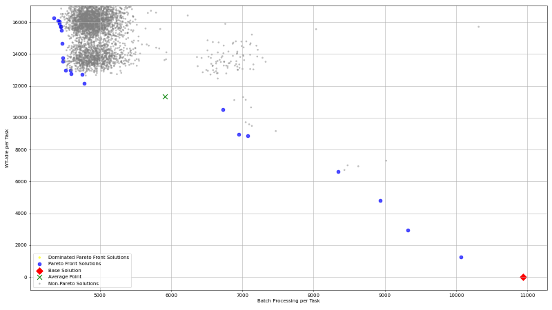</td>
<td></td>
<td>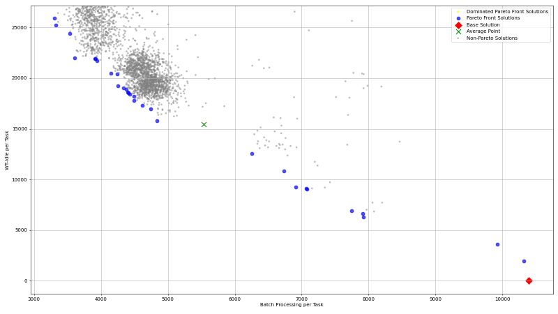</td>
<td>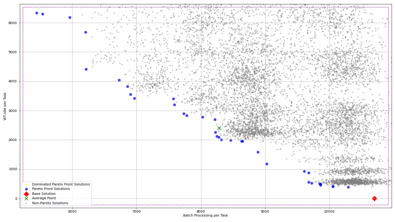</td>
<td>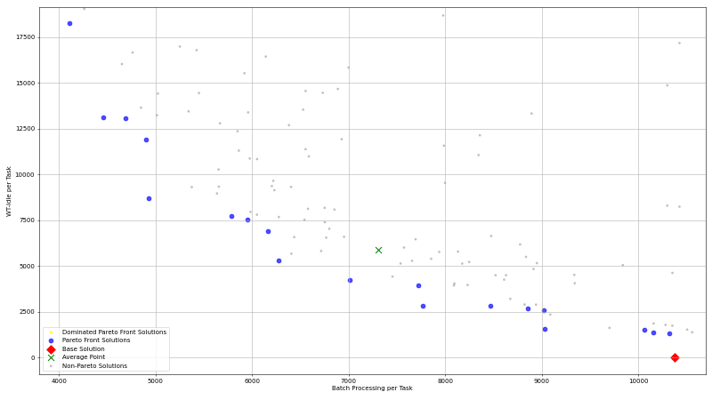</td>
<td>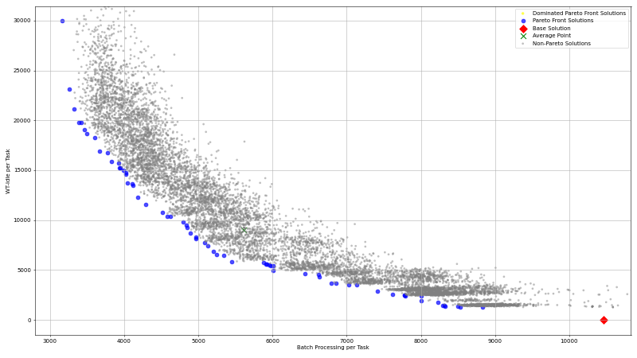</td>
</tr></table>

---

#### Hard

##### Metric Plots

<table>
<tr><td><strong>Pareto Front Size</strong> 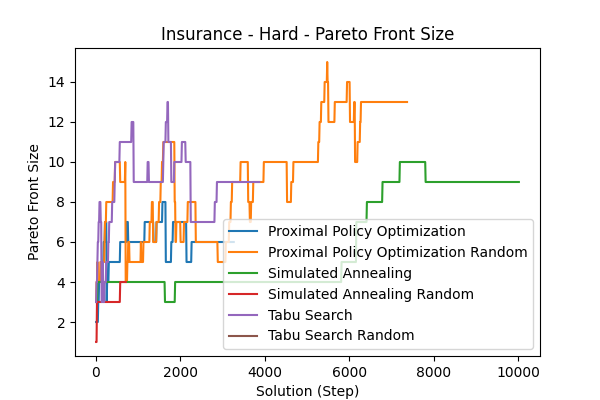 <em>Solution = Step</em></td><td><strong>Explored Solutions</strong> 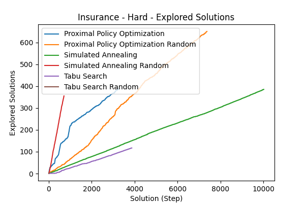 <em>Solution = Step</em></td><td><strong>New Base Solutions (Radius)</strong> 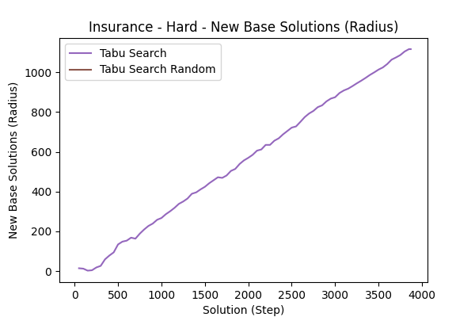 <em>Solution = Step</em></td></tr>
<tr><td><strong>New Base Solutions (Temperature)</strong> 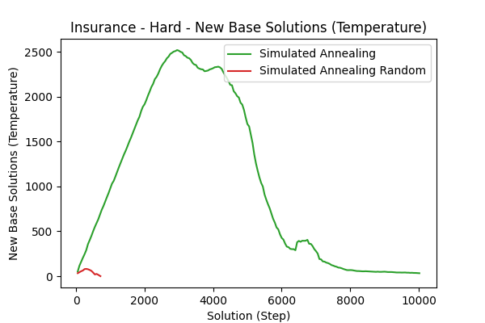 <em>Solution = Step</em></td><td><strong>Median Batch Processing Time</strong> 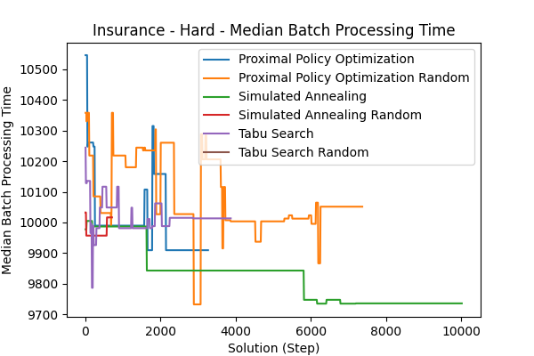 <em>Solution = Step</em></td><td><strong>Median Wait+Idle Time</strong> 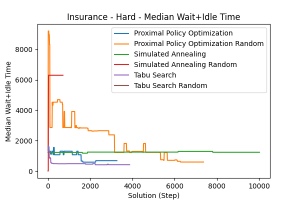 <em>Solution = Step</em></td></tr>
<tr><td><strong>Min Wait+Idle Time</strong> 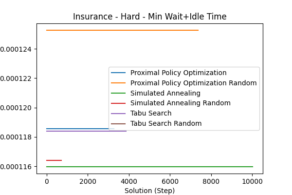 <em>Solution = Step</em></td><td><strong>Min Batch Processing Time</strong> 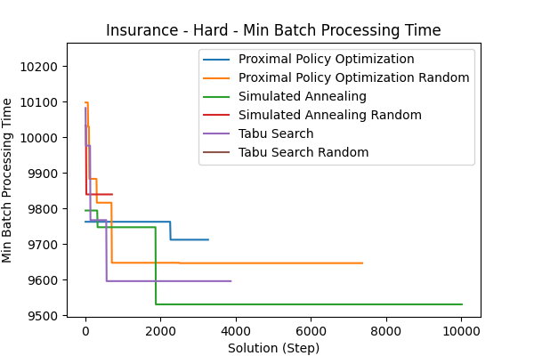 <em>Solution = Step</em></td><td><strong>Average Cycle Time</strong> 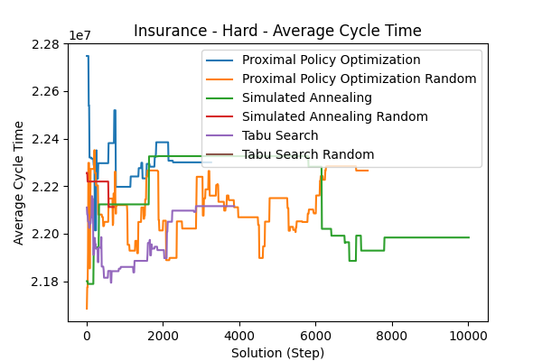 <em>Solution = Step</em></td></tr>
<tr><td><strong>Min Cycle Time</strong> 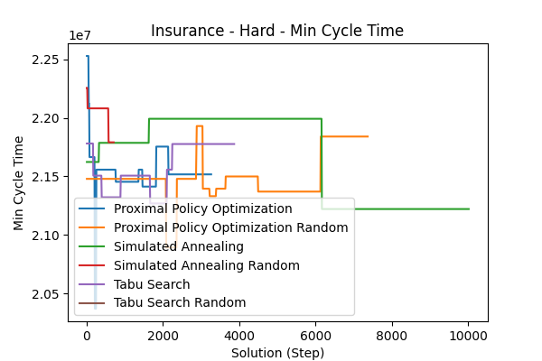 <em>Solution = Step</em></td><td><strong>Iteration Number</strong> 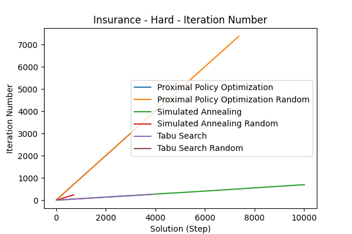 <em>Solution = Step</em></td><td></td></tr>
</table>

##### Summary Table (Final Values)

| Agent                               | Explored Solutions | New Base Solutions (Radius) | New Base Solutions (Temperature) | Median Batch Processing Time | Median Wait+Idle Time | Min Wait+Idle Time | Min Batch Processing Time | Average Cycle Time | Min Cycle Time | Iteration Number |
| :---------------------------------- | -----------------: | --------------------------: | -------------------------------: | ---------------------------: | --------------------: | -----------------: | ------------------------: | -----------------: | -------------: | ---------------: |
| Proximal Policy Optimization        |                388 |                             |                                  |                      9909.22 |               680.976 |         0.00011856 |                   9711.92 |        2.23003e+07 |    2.15172e+07 |             3269 |
| Tabu Search Random                  |                  2 |                           0 |                                  |                      10545.1 |                1186.9 |        0.000121782 |                   10230.4 |         2.2355e+07 |    2.20561e+07 |                4 |
| Proximal Policy Optimization Random |                650 |                             |                                  |                      10051.4 |               589.183 |        0.000125266 |                   9646.19 |        2.22657e+07 |    2.18403e+07 |             7370 |
| Simulated Annealing                 |                385 |                             |                               33 |                      9735.43 |               1230.37 |        0.000115974 |                   9530.31 |         2.1984e+07 |    2.12211e+07 |              693 |
| Simulated Annealing Random          |                355 |                             |                                0 |                      10016.3 |                6295.8 |        0.000116415 |                   9839.26 |        2.21125e+07 |     2.1791e+07 |              236 |
| Tabu Search                         |                117 |                        1117 |                                  |                      10013.2 |               416.181 |          0.0001184 |                   9595.67 |        2.21161e+07 |    2.17764e+07 |              257 |

##### Pareto Front Images

<table><tr>
<th>Proximal Policy Optimization</th>
<th>Tabu Search Random</th>
<th>Proximal Policy Optimization Random</th>
<th>Simulated Annealing</th>
<th>Simulated Annealing Random</th>
<th>Tabu Search</th>
</tr><tr>
<td>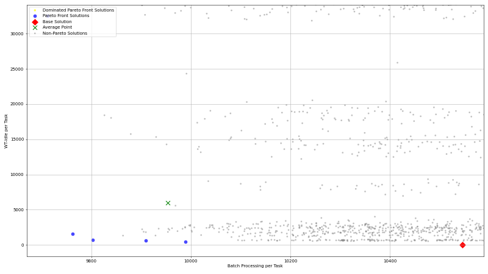</td>
<td>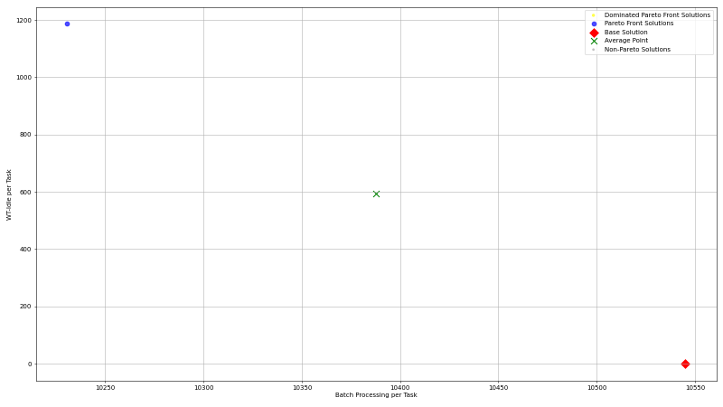</td>
<td>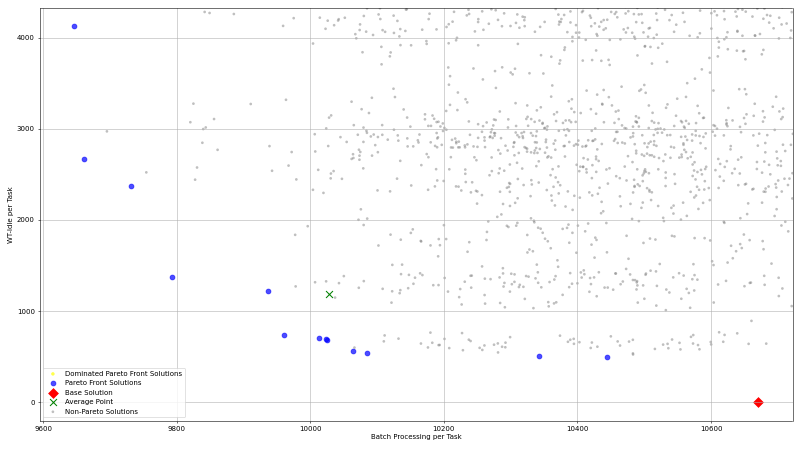</td>
<td>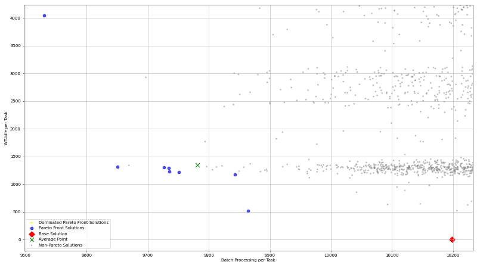</td>
<td>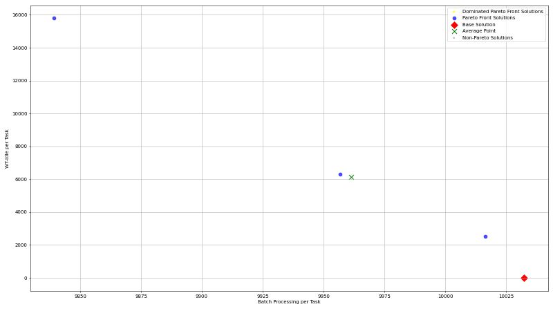</td>
<td>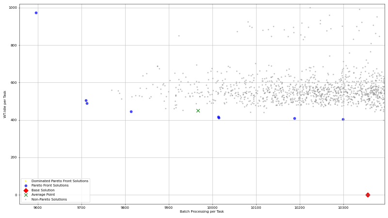</td>
</tr></table>

---

#### Mid

##### Metric Plots

<table>
<tr><td><strong>Pareto Front Size</strong> 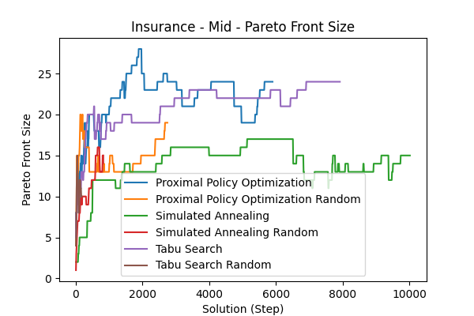 <em>Solution = Step</em></td><td><strong>Explored Solutions</strong> 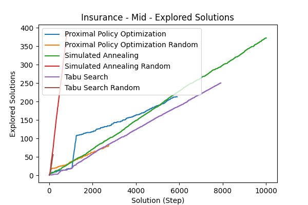 <em>Solution = Step</em></td><td><strong>New Base Solutions (Radius)</strong> 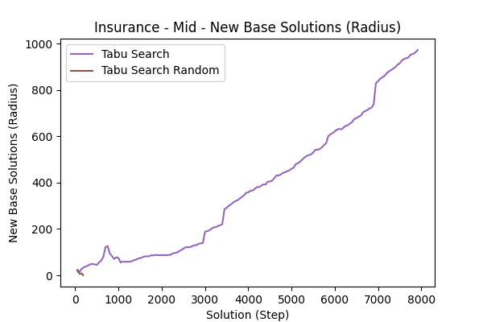 <em>Solution = Step</em></td></tr>
<tr><td><strong>New Base Solutions (Temperature)</strong> 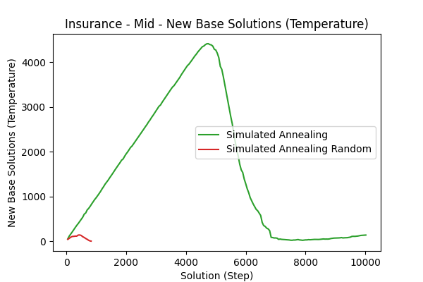 <em>Solution = Step</em></td><td><strong>Median Batch Processing Time</strong> 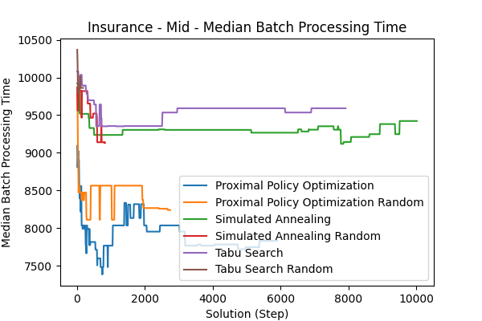 <em>Solution = Step</em></td><td><strong>Median Wait+Idle Time</strong> 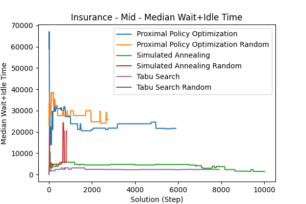 <em>Solution = Step</em></td></tr>
<tr><td><strong>Min Wait+Idle Time</strong> 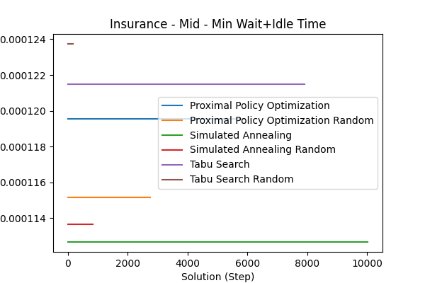 <em>Solution = Step</em></td><td><strong>Min Batch Processing Time</strong> 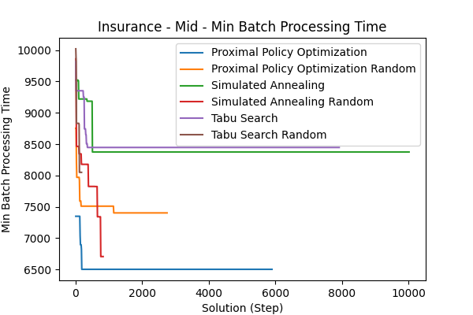 <em>Solution = Step</em></td><td><strong>Average Cycle Time</strong> 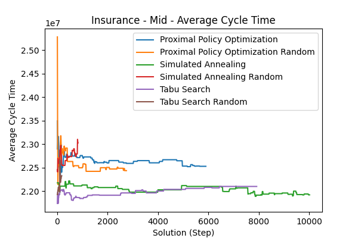 <em>Solution = Step</em></td></tr>
<tr><td><strong>Min Cycle Time</strong> 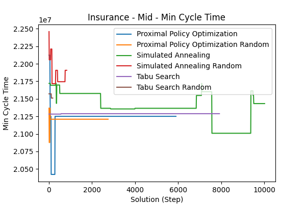 <em>Solution = Step</em></td><td><strong>Iteration Number</strong> 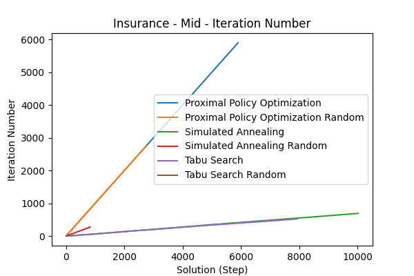 <em>Solution = Step</em></td><td></td></tr>
</table>

##### Summary Table (Final Values)

| Agent                               | Explored Solutions | New Base Solutions (Radius) | New Base Solutions (Temperature) | Median Batch Processing Time | Median Wait+Idle Time | Min Wait+Idle Time | Min Batch Processing Time | Average Cycle Time | Min Cycle Time | Iteration Number |
| :---------------------------------- | -----------------: | --------------------------: | -------------------------------: | ---------------------------: | --------------------: | -----------------: | ------------------------: | -----------------: | -------------: | ---------------: |
| Proximal Policy Optimization        |                213 |                             |                                  |                       7829.7 |                 21629 |        0.000119552 |                   6503.66 |        2.25286e+07 |    2.12507e+07 |             5900 |
| Proximal Policy Optimization Random |                 81 |                             |                                  |                      8239.04 |               25732.6 |        0.000115148 |                   7403.33 |        2.24371e+07 |    2.12094e+07 |             2750 |
| Tabu Search                         |                250 |                         973 |                                  |                      9590.87 |               2333.37 |        0.000121475 |                   8446.93 |        2.21005e+07 |    2.12882e+07 |              521 |
| Tabu Search Random                  |                 56 |                           0 |                                  |                      9861.28 |               3118.35 |        0.000123739 |                   8049.84 |         2.2328e+07 |    2.15111e+07 |               59 |
| Simulated Annealing                 |                372 |                             |                              135 |                      9421.57 |               1397.23 |        0.000112675 |                   8374.64 |        2.19224e+07 |    2.14326e+07 |              691 |
| Simulated Annealing Random          |                389 |                             |                                0 |                      9130.72 |               20397.5 |        0.000113679 |                   6707.26 |        2.30258e+07 |    2.19076e+07 |              274 |

##### Pareto Front Images

<table><tr>
<th>Proximal Policy Optimization</th>
<th>Proximal Policy Optimization Random</th>
<th>Tabu Search</th>
<th>Tabu Search Random</th>
<th>Simulated Annealing</th>
<th>Simulated Annealing Random</th>
</tr><tr>
<td>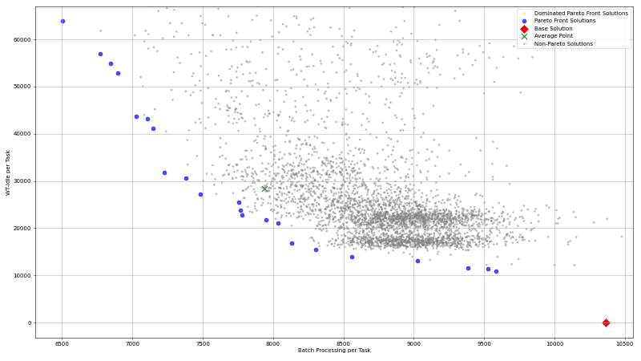</td>
<td></td>
<td></td>
<td>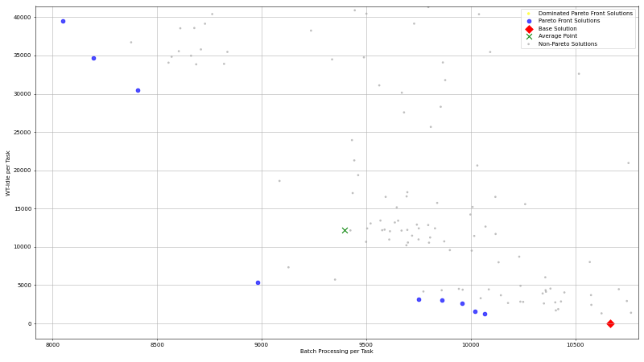</td>
<td>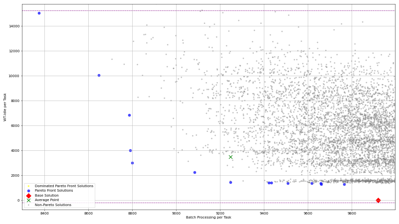</td>
<td>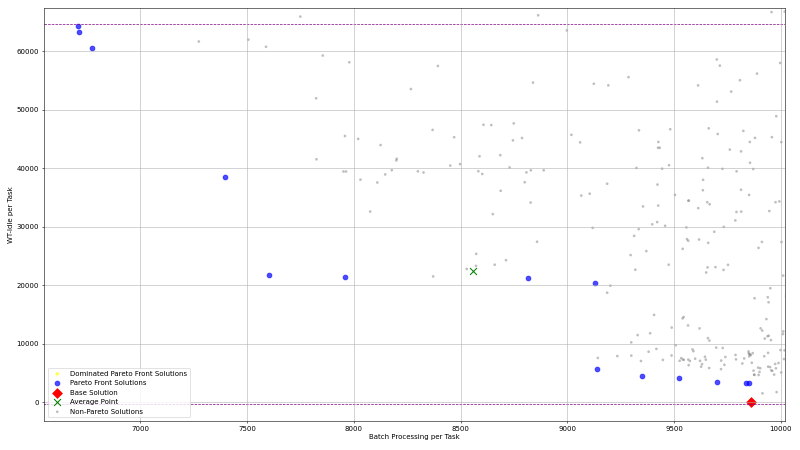</td>
</tr></table>

---

---

### Production

#### Analyzer Overview

##### Pareto Size

| Agent / Reference | Easy  | Mid   | Hard  |
| ----------------- | ----- | ----- | ----- |
| Reference         | 80,00 | 44,00 | 13,00 |
| Reference Random  | 76,00 | 41,00 | 12,00 |
| Reference Optimos | 69,00 | 44,00 | 16,00 |
| SA                | 37,00 | 30,00 | 12,00 |
| Tabu Search       | 47,00 | 44,00 | 18,00 |
| PPO               | 50,00 | 41,00 | 8,00  |
| Tabu Random       | 41,00 | 15,00 | 8,00  |
| SA Random         | 35,00 | 17,00 | 8,00  |
| PPO Random        | 45,00 | 39,00 | 13,00 |

 

##### Hyperarea Ratio

| Agent / Reference | Easy | Mid  | Hard |
| ----------------- | ---- | ---- | ---- |
| Reference Random  | 0,96 | 0,86 | 1,00 |
| Reference Optimos | 0,99 | 1,00 | 1,00 |
| SA                | 0,68 | 0,80 | 0,98 |
| Tabu Search       | 0,94 | 0,88 | 1,00 |
| PPO               | 0,94 | 0,94 | 0,98 |
| Tabu Random       | 0,78 | 0,60 | 0,98 |
| SA Random         | 0,73 | 0,68 | 1,00 |
| PPO Random        | 0,90 | 0,84 | 0,98 |

 

##### Hausdorff

| Agent / Reference | Easy      | Mid        | Hard      |
| ----------------- | --------- | ---------- | --------- |
| Reference Random  | 11.943,84 | 57.288,56  | 13.093,12 |
| Reference Optimos | 1.231,15  | 0,00       | 16.105,32 |
| SA                | 44.380,42 | 145.330,56 | 32.912,96 |
| Tabu Search       | 32.572,43 | 96.853,24  | 16.542,56 |
| PPO               | 3.905,48  | 11.508,62  | 54.021,29 |
| Tabu Random       | 44.322,42 | 140.492,35 | 35.702,53 |
| SA Random         | 9.194,47  | 141.978,28 | 13.963,67 |
| PPO Random        | 19.913,55 | 58.921,94  | 25.432,49 |

 

##### Delta

| Agent / Reference | Easy | Mid  | Hard |
| ----------------- | ---- | ---- | ---- |
| Reference Random  | 0,97 | 0,96 | 1,33 |
| Reference Optimos | 0,95 | 1,09 | 0,99 |
| SA                | 0,97 | 0,97 | 1,17 |
| Tabu Search       | 0,88 | 1,00 | 1,06 |
| PPO               | 0,97 | 0,98 | 0,99 |
| Tabu Random       | 0,97 | 1,00 | 1,01 |
| SA Random         | 1,25 | 0,97 | 1,15 |
| PPO Random        | 0,83 | 0,97 | 1,37 |

 

##### Purity

| Agent / Reference | Easy | Mid  | Hard |
| ----------------- | ---- | ---- | ---- |
| Reference Random  | 0,53 | 0,00 | 0,31 |
| Reference Optimos | 0,47 | 1,00 | 0,69 |
| SA                | 0,04 | 0,09 | 0,00 |
| Tabu Search       | 0,26 | 0,61 | 0,54 |
| PPO               | 0,17 | 0,30 | 0,15 |
| Tabu Random       | 0,45 | 0,00 | 0,00 |
| SA Random         | 0,07 | 0,00 | 0,23 |
| PPO Random        | 0,00 | 0,00 | 0,08 |

 

##### Avg Cycle Time

| Agent / Reference | Easy          | Mid           | Hard          |
| ----------------- | ------------- | ------------- | ------------- |
| Base              | 42.044.521,00 | 41.035.979,10 | 41.461.760,95 |
| Reference         | 42.190.396,40 | 42.625.614,35 | 42.689.935,34 |
| Reference Random  | 42.366.701,18 | 42.561.152,22 | 42.480.832,52 |
| Reference Optimos | 42.179.962,73 | 42.625.614,35 | 42.651.001,36 |
| SA                | 42.295.871,86 | 42.079.724,37 | 42.323.845,15 |
| Tabu Search       | 42.150.131,94 | 42.650.766,40 | 42.692.566,31 |
| PPO               | 42.229.110,27 | 42.672.010,76 | 42.214.365,71 |
| Tabu Random       | 42.198.516,53 | 41.983.662,10 | 41.447.310,40 |
| SA Random         | 42.334.991,62 | 42.370.681,44 | 42.297.213,99 |
| PPO Random        | 42.507.066,35 | 42.483.845,26 | 42.512.857,09 |

 

##### Best Cycle Time

| Agent / Reference | Easy          | Mid           | Hard          |
| ----------------- | ------------- | ------------- | ------------- |
| Base              | 42.044.521,00 | 41.035.979,10 | 41.461.760,95 |
| Reference         | 40.511.363,26 | 40.891.617,05 | 41.496.367,12 |
| Reference Random  | 40.511.363,26 | 40.924.274,21 | 41.510.903,62 |
| Reference Optimos | 40.615.200,00 | 40.891.617,05 | 41.496.367,12 |
| SA                | 41.215.377,05 | 40.649.684,84 | 40.341.465,75 |
| Tabu Search       | 40.889.476,81 | 40.891.617,05 | 41.222.681,50 |
| PPO               | 40.297.020,43 | 40.937.649,95 | 41.448.152,63 |
| Tabu Random       | 40.511.363,26 | 40.649.684,84 | 40.341.465,75 |
| SA Random         | 41.149.958,32 | 40.957.056,09 | 40.341.465,75 |
| PPO Random        | 41.098.342,91 | 40.403.956,28 | 41.510.903,62 |

 

#### Easy

##### Metric Plots

<table>
<tr><td><strong>Pareto Front Size</strong>  <em>Solution = Step</em></td><td><strong>Explored Solutions</strong> 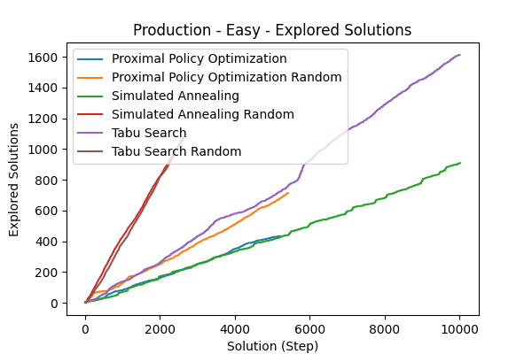 <em>Solution = Step</em></td><td><strong>New Base Solutions (Radius)</strong> 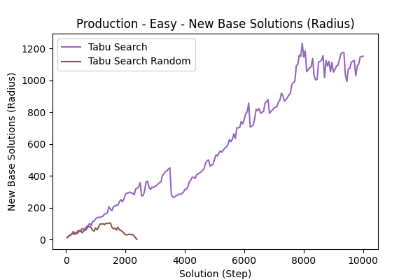 <em>Solution = Step</em></td></tr>
<tr><td><strong>New Base Solutions (Temperature)</strong>  <em>Solution = Step</em></td><td><strong>Median Batch Processing Time</strong> 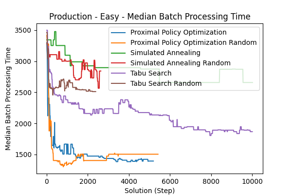 <em>Solution = Step</em></td><td><strong>Median Wait+Idle Time</strong> 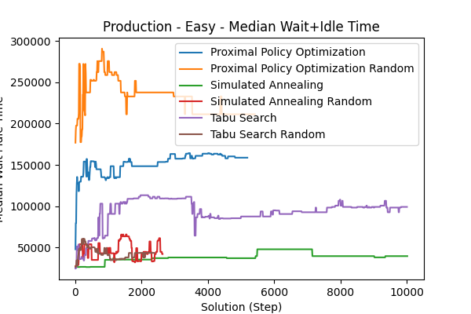 <em>Solution = Step</em></td></tr>
<tr><td><strong>Min Wait+Idle Time</strong>  <em>Solution = Step</em></td><td><strong>Min Batch Processing Time</strong> 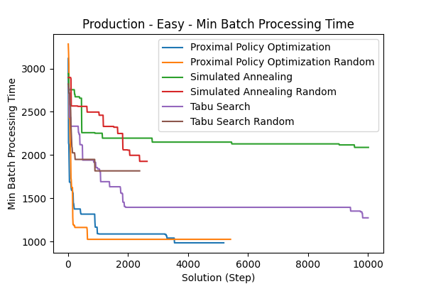 <em>Solution = Step</em></td><td><strong>Average Cycle Time</strong> 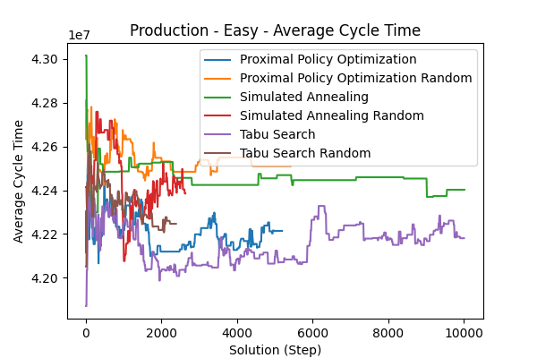 <em>Solution = Step</em></td></tr>
<tr><td><strong>Min Cycle Time</strong> 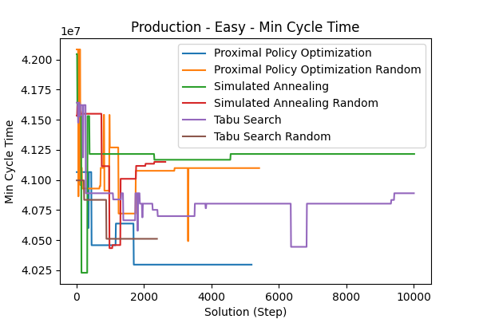 <em>Solution = Step</em></td><td><strong>Iteration Number</strong> 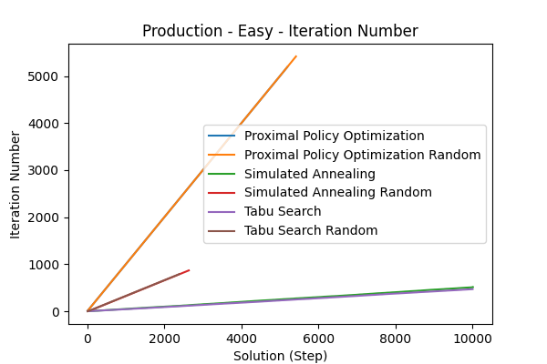 <em>Solution = Step</em></td><td></td></tr>
</table>

##### Summary Table (Final Values)

| Agent                               | Explored Solutions | New Base Solutions (Radius) | New Base Solutions (Temperature) | Median Batch Processing Time | Median Wait+Idle Time | Min Wait+Idle Time | Min Batch Processing Time | Average Cycle Time | Min Cycle Time | Iteration Number |
| :---------------------------------- | -----------------: | --------------------------: | -------------------------------: | ---------------------------: | --------------------: | -----------------: | ------------------------: | -----------------: | -------------: | ---------------: |
| Tabu Search                         |               1613 |                        1150 |                                  |                      1866.25 |               99144.4 |            20775.8 |                      1275 |        4.21807e+07 |    4.08895e+07 |              470 |
| Tabu Search Random                  |                967 |                           0 |                                  |                      2511.28 |               43486.5 |            18300.3 |                   1817.65 |        4.22467e+07 |    4.05114e+07 |              790 |
| Proximal Policy Optimization Random |                715 |                             |                                  |                      1503.18 |                211330 |            19394.6 |                   1026.66 |        4.25095e+07 |    4.10983e+07 |             5417 |
| Proximal Policy Optimization        |                433 |                             |                                  |                      1393.31 |                158756 |            18884.9 |                   986.332 |        4.22143e+07 |     4.0297e+07 |             5190 |
| Simulated Annealing                 |                909 |                             |                             4850 |                      2657.53 |               39568.9 |            19465.7 |                   2089.03 |        4.24021e+07 |    4.12154e+07 |              510 |
| Simulated Annealing Random          |               1076 |                             |                               22 |                      2842.55 |               42094.1 |            17468.6 |                   1927.91 |        4.23852e+07 |      4.115e+07 |              868 |

##### Pareto Front Images

<table><tr>
<th>Tabu Search</th>
<th>Tabu Search Random</th>
<th>Proximal Policy Optimization Random</th>
<th>Proximal Policy Optimization</th>
<th>Simulated Annealing</th>
<th>Simulated Annealing Random</th>
</tr><tr>
<td>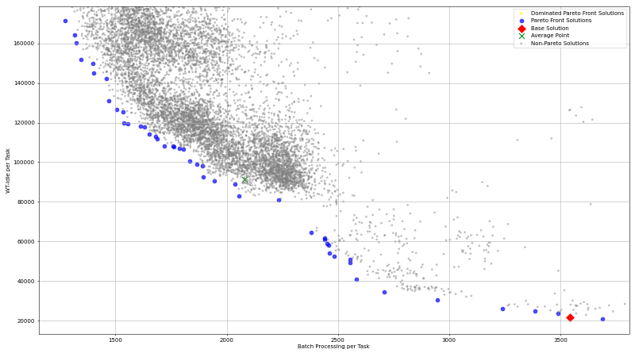</td>
<td>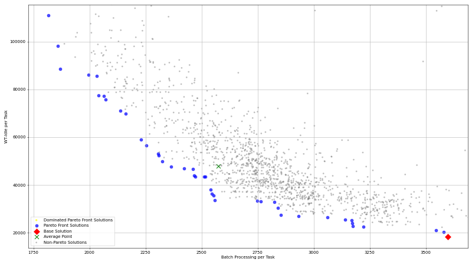</td>
<td>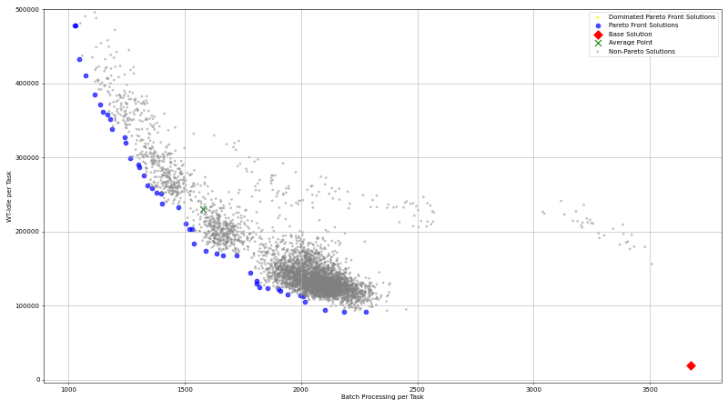</td>
<td>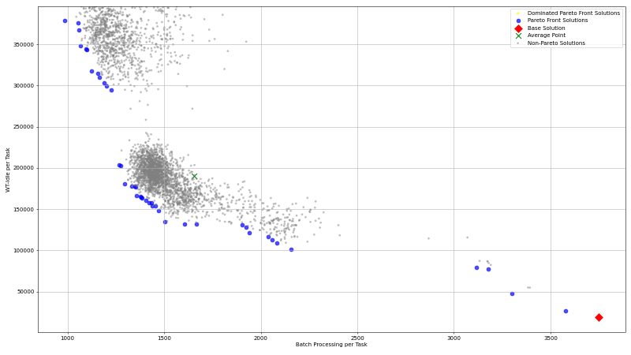</td>
<td>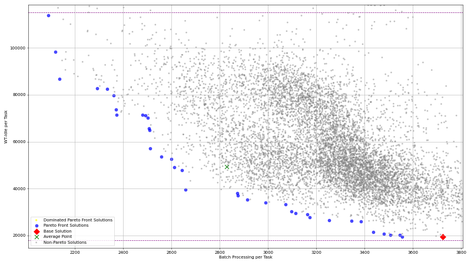</td>
<td>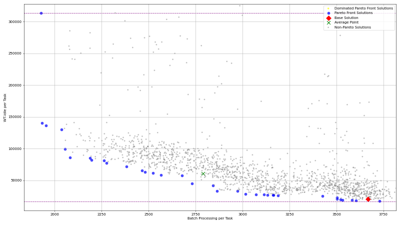</td>
</tr></table>

---

#### Hard

##### Metric Plots

<table>
<tr><td><strong>Pareto Front Size</strong> 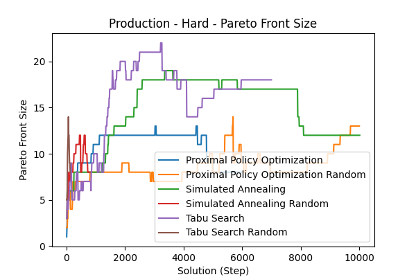 <em>Solution = Step</em></td><td><strong>Explored Solutions</strong> 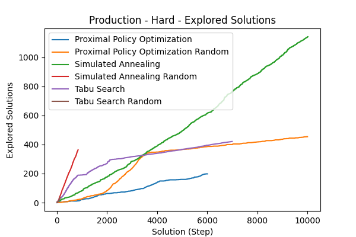 <em>Solution = Step</em></td><td><strong>New Base Solutions (Radius)</strong> 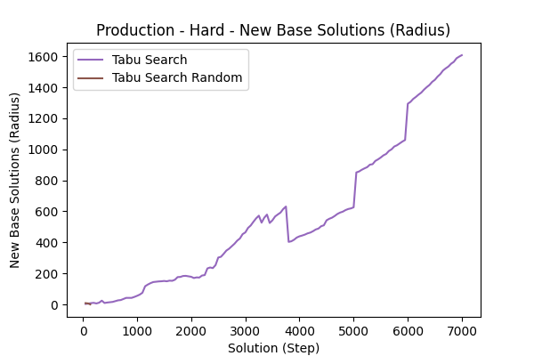 <em>Solution = Step</em></td></tr>
<tr><td><strong>New Base Solutions (Temperature)</strong> 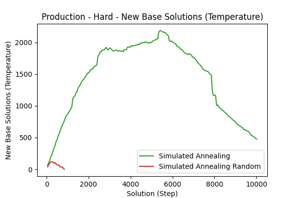 <em>Solution = Step</em></td><td><strong>Median Batch Processing Time</strong>  <em>Solution = Step</em></td><td><strong>Median Wait+Idle Time</strong>  <em>Solution = Step</em></td></tr>
<tr><td><strong>Min Wait+Idle Time</strong> 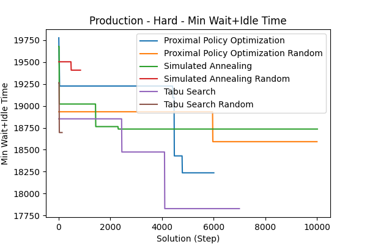 <em>Solution = Step</em></td><td><strong>Min Batch Processing Time</strong> 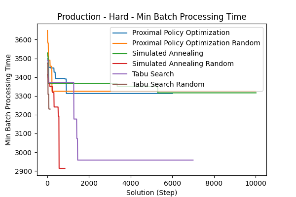 <em>Solution = Step</em></td><td><strong>Average Cycle Time</strong> 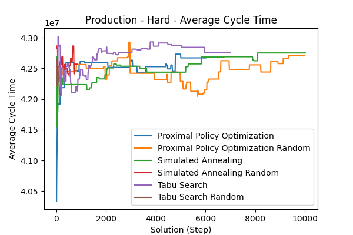 <em>Solution = Step</em></td></tr>
<tr><td><strong>Min Cycle Time</strong> 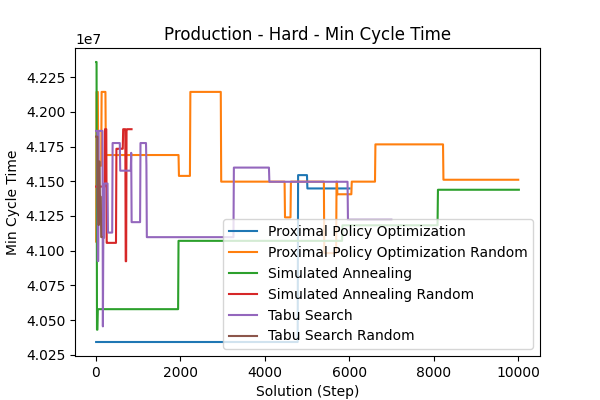 <em>Solution = Step</em></td><td><strong>Iteration Number</strong> 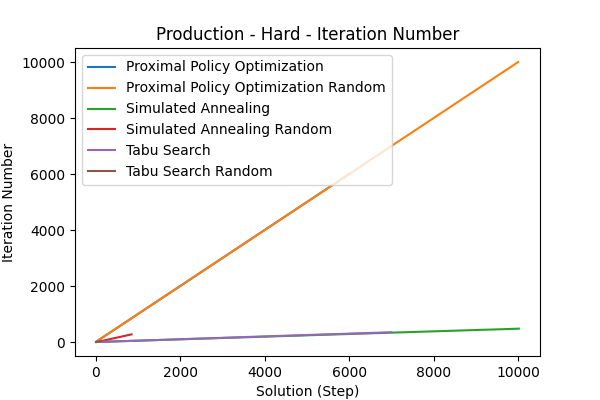 <em>Solution = Step</em></td><td></td></tr>
</table>

##### Summary Table (Final Values)

| Agent                               | Explored Solutions | New Base Solutions (Radius) | New Base Solutions (Temperature) | Median Batch Processing Time | Median Wait+Idle Time | Min Wait+Idle Time | Min Batch Processing Time | Average Cycle Time | Min Cycle Time | Iteration Number |
| :---------------------------------- | -----------------: | --------------------------: | -------------------------------: | ---------------------------: | --------------------: | -----------------: | ------------------------: | -----------------: | -------------: | ---------------: |
| Tabu Search                         |                421 |                        1607 |                                  |                         3357 |                222307 |            17827.8 |                   2958.22 |        4.27518e+07 |    4.12227e+07 |              349 |
| Simulated Annealing Random          |                363 |                             |                                0 |                      3386.54 |                131318 |            19407.7 |                   2913.66 |        4.25681e+07 |    4.18752e+07 |              274 |
| Proximal Policy Optimization        |                198 |                             |                                  |                      3395.28 |               57158.1 |            18236.2 |                   3312.91 |        4.26699e+07 |    4.14482e+07 |             6009 |
| Proximal Policy Optimization Random |                454 |                             |                                  |                      3488.99 |               20836.2 |            18591.7 |                   3324.69 |        4.27135e+07 |    4.15109e+07 |            10000 |
| Tabu Search Random                  |                 38 |                           0 |                                  |                      3495.72 |                122346 |              18696 |                   3229.58 |        4.20802e+07 |    4.10975e+07 |               40 |
| Simulated Annealing                 |               1142 |                             |                              478 |                      3465.95 |                120724 |            18735.7 |                    3316.3 |          4.275e+07 |    4.14388e+07 |              478 |

##### Pareto Front Images

<table><tr>
<th>Tabu Search</th>
<th>Simulated Annealing Random</th>
<th>Proximal Policy Optimization</th>
<th>Proximal Policy Optimization Random</th>
<th>Tabu Search Random</th>
<th>Simulated Annealing</th>
</tr><tr>
<td>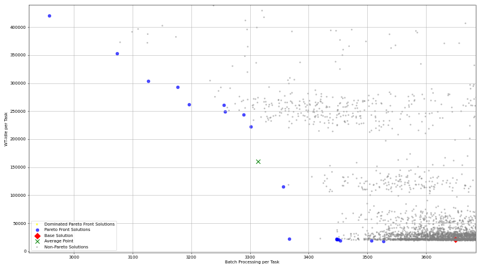</td>
<td>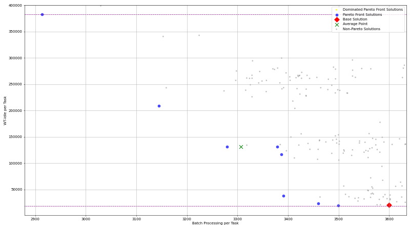</td>
<td>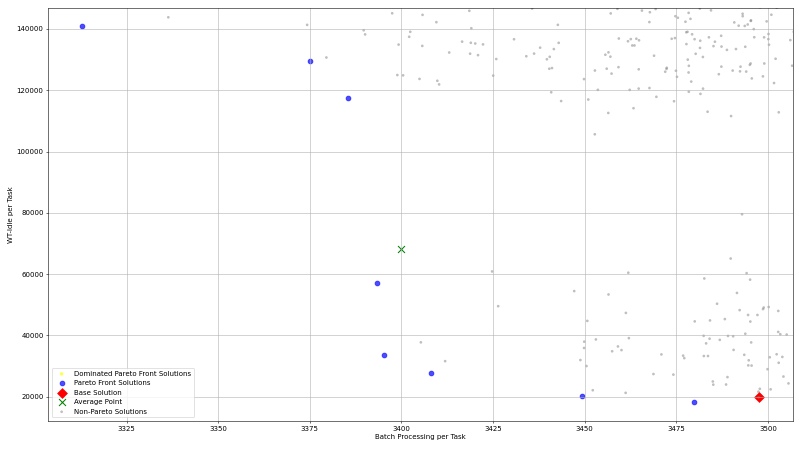</td>
<td>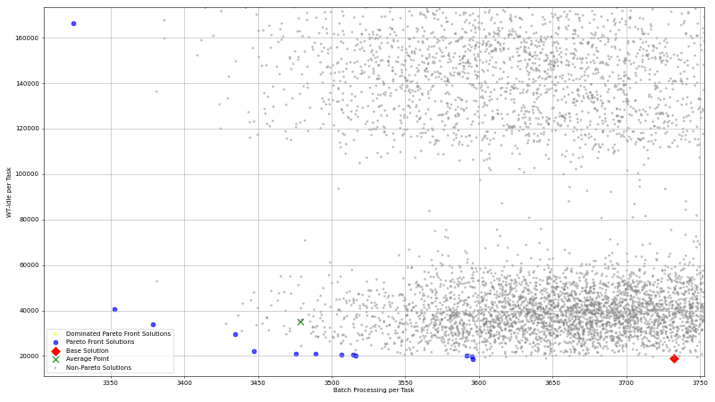</td>
<td>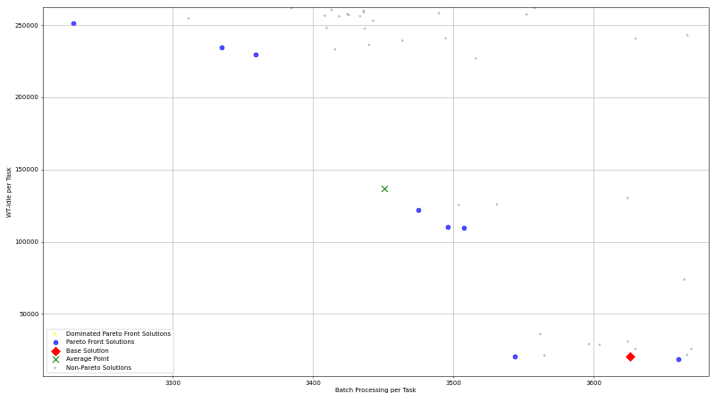</td>
<td>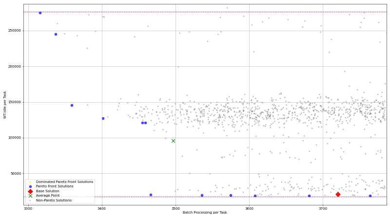</td>
</tr></table>

---

#### Mid

##### Metric Plots

<table>
<tr><td><strong>Pareto Front Size</strong> 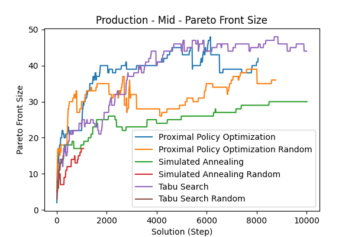 <em>Solution = Step</em></td><td><strong>Explored Solutions</strong> 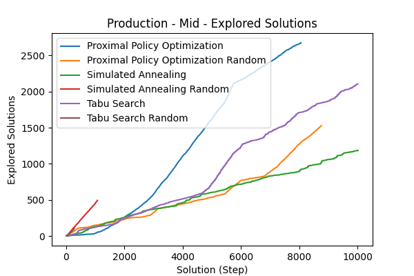 <em>Solution = Step</em></td><td><strong>New Base Solutions (Radius)</strong>  <em>Solution = Step</em></td></tr>
<tr><td><strong>New Base Solutions (Temperature)</strong> 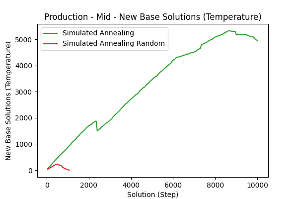 <em>Solution = Step</em></td><td><strong>Median Batch Processing Time</strong> 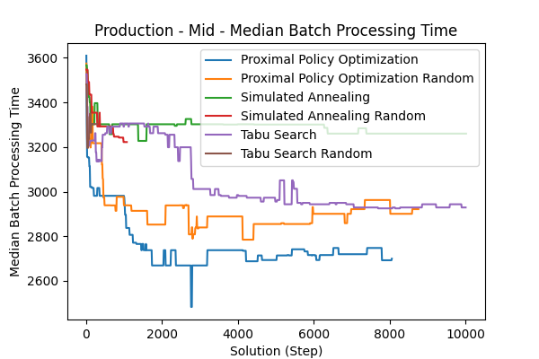 <em>Solution = Step</em></td><td><strong>Median Wait+Idle Time</strong> 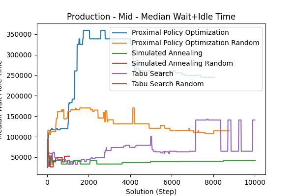 <em>Solution = Step</em></td></tr>
<tr><td><strong>Min Wait+Idle Time</strong> 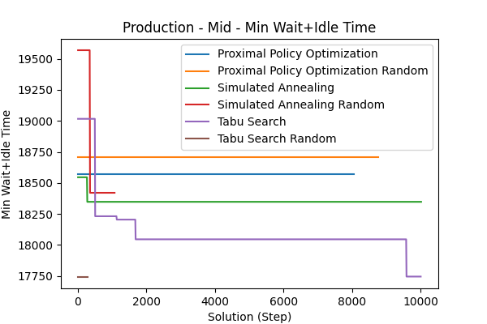 <em>Solution = Step</em></td><td><strong>Min Batch Processing Time</strong> 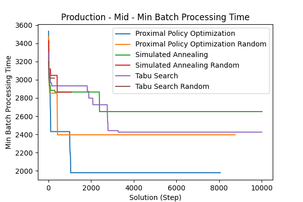 <em>Solution = Step</em></td><td><strong>Average Cycle Time</strong>  <em>Solution = Step</em></td></tr>
<tr><td><strong>Min Cycle Time</strong> 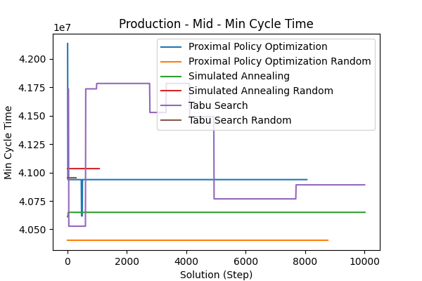 <em>Solution = Step</em></td><td><strong>Iteration Number</strong> 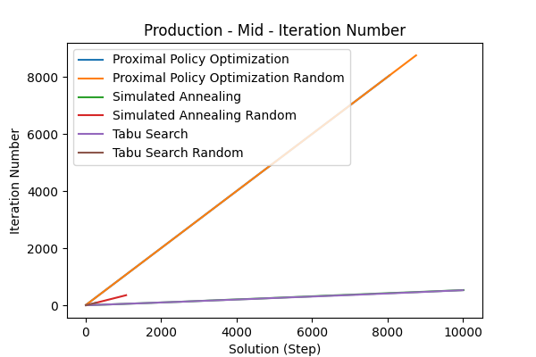 <em>Solution = Step</em></td><td></td></tr>
</table>

##### Summary Table (Final Values)

| Agent                               | Explored Solutions | New Base Solutions (Radius) | New Base Solutions (Temperature) | Median Batch Processing Time | Median Wait+Idle Time | Min Wait+Idle Time | Min Batch Processing Time | Average Cycle Time | Min Cycle Time | Iteration Number |
| :---------------------------------- | -----------------: | --------------------------: | -------------------------------: | ---------------------------: | --------------------: | -----------------: | ------------------------: | -----------------: | -------------: | ---------------: |
| Proximal Policy Optimization        |               2676 |                             |                                  |                      2699.64 |                244719 |            18567.7 |                   1979.87 |        4.27068e+07 |    4.09376e+07 |             8060 |
| Tabu Search Random                  |                107 |                           0 |                                  |                      3302.76 |               37616.6 |            17742.1 |                   3017.75 |        4.21376e+07 |    4.09571e+07 |               88 |
| Proximal Policy Optimization Random |               1528 |                             |                                  |                      2921.49 |                114675 |            18708.5 |                   2395.72 |        4.25273e+07 |     4.0404e+07 |             8760 |
| Simulated Annealing                 |               1185 |                             |                             4965 |                      3259.96 |                 42165 |            18347.8 |                   2650.36 |        4.21387e+07 |    4.06497e+07 |              533 |
| Simulated Annealing Random          |                494 |                             |                                0 |                      3222.15 |               52595.6 |            18420.6 |                   2864.07 |        4.25709e+07 |     4.1036e+07 |              353 |
| Tabu Search                         |               2104 |                        1121 |                                  |                       2929.1 |                140953 |            17745.8 |                    2425.2 |        4.27049e+07 |    4.08916e+07 |              528 |

##### Pareto Front Images

<table><tr>
<th>Proximal Policy Optimization</th>
<th>Tabu Search Random</th>
<th>Proximal Policy Optimization Random</th>
<th>Simulated Annealing</th>
<th>Simulated Annealing Random</th>
<th>Tabu Search</th>
</tr><tr>
<td>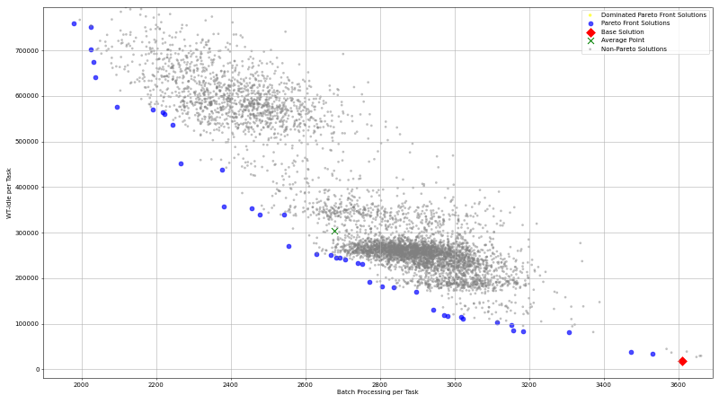</td>
<td>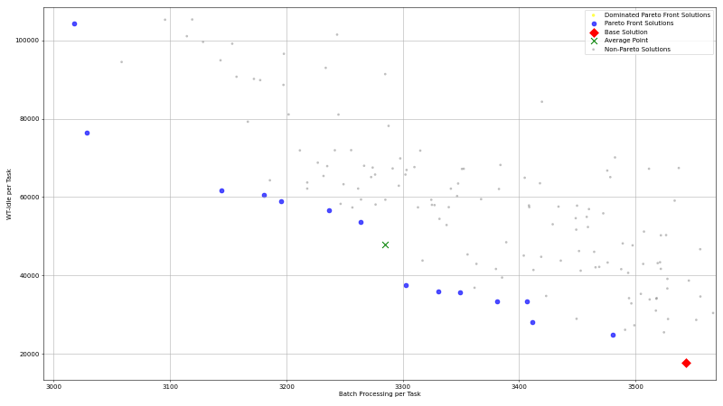</td>
<td>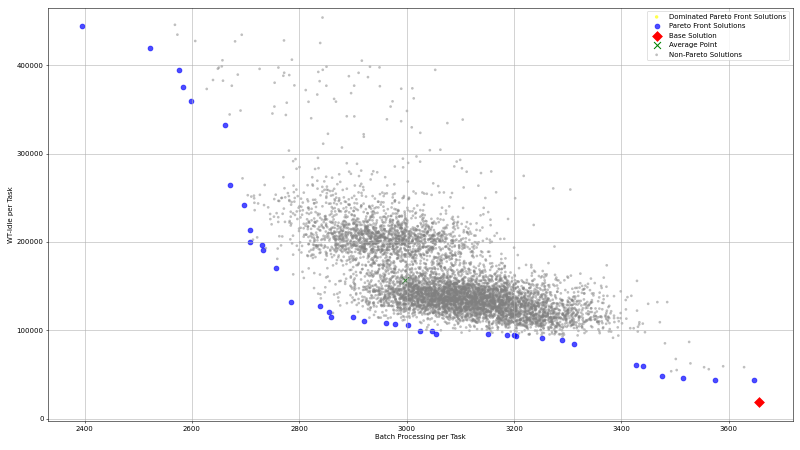</td>
<td>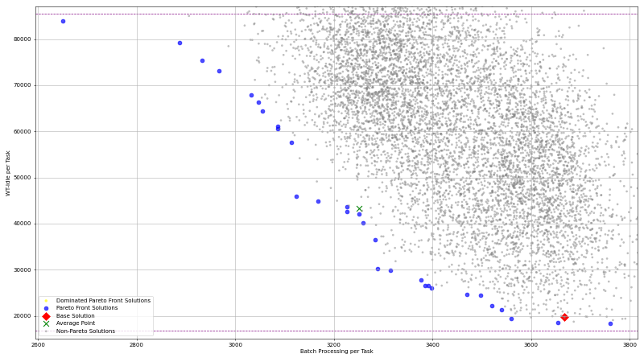</td>
<td>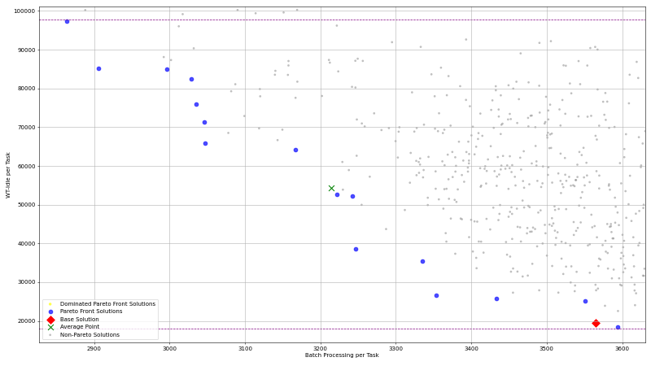</td>
<td>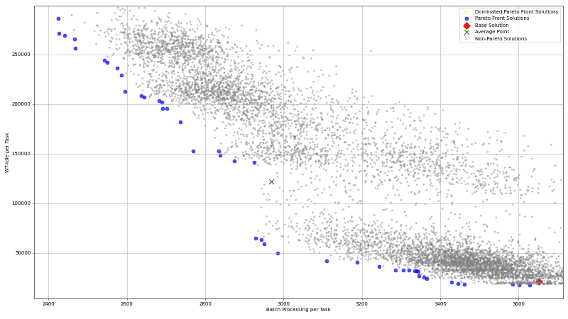</td>
</tr></table>

---

---

### Purchasing Example

#### Analyzer Overview

##### Pareto Size

| Agent / Reference | Easy  | Mid   | Hard  |
| ----------------- | ----- | ----- | ----- |
| Reference         | 84,00 | 67,00 | 21,00 |
| Reference Random  | 63,00 | 36,00 | 11,00 |
| Reference Optimos | 84,00 | 61,00 | 30,00 |
| SA                | 21,00 | 34,00 | 17,00 |
| Tabu Search       | 62,00 | 60,00 | 23,00 |
| PPO               | 41,00 | 31,00 | 9,00  |
| Tabu Random       | 21,00 | 15,00 | 7,00  |
| SA Random         | 19,00 | 21,00 | 5,00  |
| PPO Random        | 55,00 | 33,00 | 11,00 |

 

##### Hyperarea Ratio

| Agent / Reference | Easy | Mid  | Hard |
| ----------------- | ---- | ---- | ---- |
| Reference Random  | 0,95 | 0,98 | 1,00 |
| Reference Optimos | 1,00 | 0,98 | 1,00 |
| SA                | 0,82 | 0,98 | 1,00 |
| Tabu Search       | 0,88 | 0,94 | 1,00 |
| PPO               | 0,97 | 0,80 | 0,99 |
| Tabu Random       | 0,81 | 0,80 | 1,00 |
| SA Random         | 0,85 | 0,91 | 1,00 |
| PPO Random        | 0,93 | 0,97 | 0,99 |

 

##### Hausdorff

| Agent / Reference | Easy      | Mid       | Hard      |
| ----------------- | --------- | --------- | --------- |
| Reference Random  | 8.623,00  | 8.140,31  | 38.482,71 |
| Reference Optimos | 1.182,97  | 8.972,15  | 1.701,43  |
| SA                | 11.506,75 | 9.414,85  | 5.687,71  |
| Tabu Search       | 16.494,34 | 10.951,91 | 2.928,72  |
| PPO               | 3.640,81  | 9.523,58  | 32.184,80 |
| Tabu Random       | 7.035,61  | 9.284,33  | 5.852,66  |
| SA Random         | 6.729,42  | 10.447,49 | 70.349,14 |
| PPO Random        | 8.762,85  | 9.982,97  | 22.409,18 |

 

##### Delta

| Agent / Reference | Easy | Mid  | Hard |
| ----------------- | ---- | ---- | ---- |
| Reference Random  | 0,93 | 1,18 | 1,14 |
| Reference Optimos | 1,40 | 1,00 | 0,82 |
| SA                | 1,07 | 1,00 | 1,29 |
| Tabu Search       | 0,99 | 0,97 | 0,85 |
| PPO               | 1,06 | 0,97 | 0,98 |
| Tabu Random       | 1,16 | 1,05 | 0,73 |
| SA Random         | 1,08 | 1,11 | 0,98 |
| PPO Random        | 0,94 | 1,05 | 1,06 |

 

##### Purity

| Agent / Reference | Easy | Mid  | Hard |
| ----------------- | ---- | ---- | ---- |
| Reference Random  | 0,32 | 0,12 | 0,38 |
| Reference Optimos | 0,68 | 0,88 | 0,62 |
| SA                | 0,08 | 0,09 | 0,14 |
| Tabu Search       | 0,42 | 0,81 | 0,48 |
| PPO               | 0,19 | 0,01 | 0,00 |
| Tabu Random       | 0,05 | 0,01 | 0,24 |
| SA Random         | 0,04 | 0,10 | 0,10 |
| PPO Random        | 0,26 | 0,04 | 0,05 |

 

##### Avg Cycle Time

| Agent / Reference | Easy          | Mid           | Hard          |
| ----------------- | ------------- | ------------- | ------------- |
| Base              | 34.307.437,68 | 34.273.851,12 | 33.988.137,01 |
| Reference         | 35.625.578,32 | 35.418.563,14 | 36.667.798,11 |
| Reference Random  | 35.365.017,14 | 35.964.278,76 | 36.736.667,40 |
| Reference Optimos | 35.408.186,90 | 35.325.624,35 | 36.352.271,30 |
| SA                | 35.380.553,77 | 35.672.985,33 | 35.860.683,28 |
| Tabu Search       | 34.868.499,42 | 35.263.349,91 | 36.583.744,60 |
| PPO               | 36.007.578,64 | 35.828.438,13 | 35.644.030,25 |
| Tabu Random       | 35.209.070,54 | 35.211.262,66 | 36.323.646,62 |
| SA Random         | 35.666.977,63 | 35.342.877,92 | 37.434.647,90 |
| PPO Random        | 35.369.977,71 | 36.650.868,87 | 35.462.892,97 |

 

##### Best Cycle Time

| Agent / Reference | Easy          | Mid           | Hard          |
| ----------------- | ------------- | ------------- | ------------- |
| Base              | 34.307.437,68 | 34.273.851,12 | 33.988.137,01 |
| Reference         | 33.668.470,79 | 33.819.249,21 | 34.723.728,97 |
| Reference Random  | 34.226.981,05 | 34.291.066,42 | 34.723.728,97 |
| Reference Optimos | 33.242.624,60 | 33.819.249,21 | 34.261.631,04 |
| SA                | 33.668.470,79 | 33.791.557,40 | 33.988.137,01 |
| Tabu Search       | 33.242.624,60 | 33.819.249,21 | 35.142.270,91 |
| PPO               | 34.288.824,13 | 34.273.851,12 | 34.887.923,36 |
| Tabu Random       | 33.668.470,79 | 34.076.614,29 | 33.988.137,01 |
| SA Random         | 33.668.470,79 | 34.273.851,12 | 34.872.935,94 |
| PPO Random        | 33.760.787,04 | 34.273.851,12 | 33.988.137,01 |

 

#### Easy

##### Metric Plots

<table>
<tr><td><strong>Pareto Front Size</strong>  <em>Solution = Step</em></td><td><strong>Explored Solutions</strong> 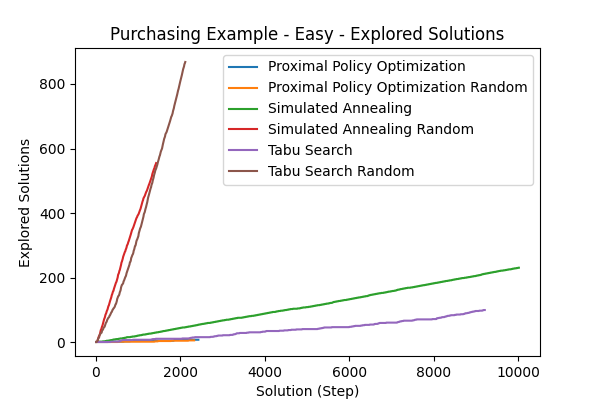 <em>Solution = Step</em></td><td><strong>New Base Solutions (Radius)</strong> 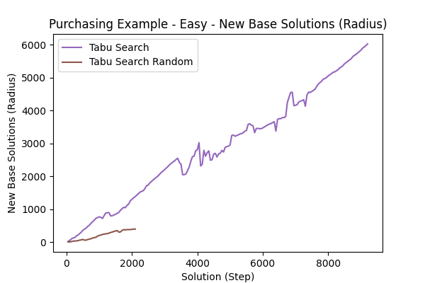 <em>Solution = Step</em></td></tr>
<tr><td><strong>New Base Solutions (Temperature)</strong> 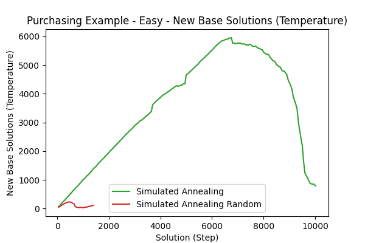 <em>Solution = Step</em></td><td><strong>Median Batch Processing Time</strong> 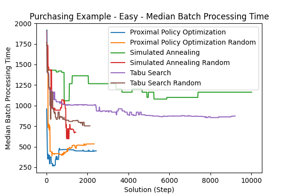 <em>Solution = Step</em></td><td><strong>Median Wait+Idle Time</strong> 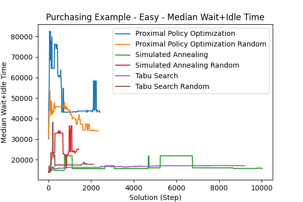 <em>Solution = Step</em></td></tr>
<tr><td><strong>Min Wait+Idle Time</strong> 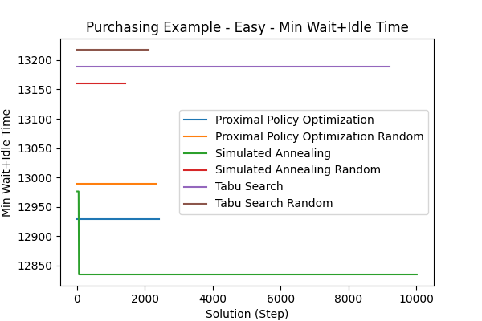 <em>Solution = Step</em></td><td><strong>Min Batch Processing Time</strong> 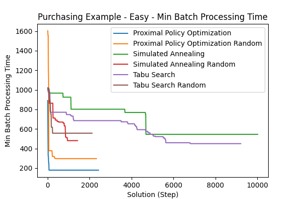 <em>Solution = Step</em></td><td><strong>Average Cycle Time</strong> 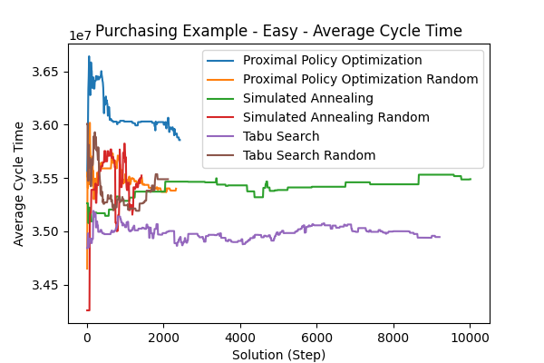 <em>Solution = Step</em></td></tr>
<tr><td><strong>Min Cycle Time</strong> 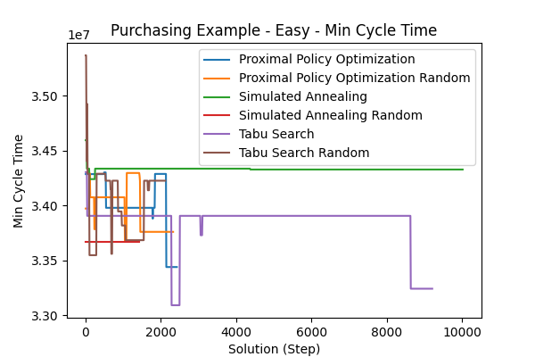 <em>Solution = Step</em></td><td><strong>Iteration Number</strong> 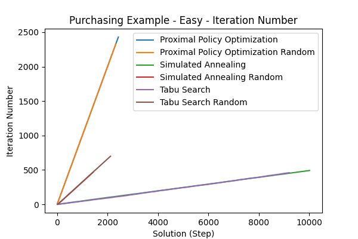 <em>Solution = Step</em></td><td></td></tr>
</table>

##### Summary Table (Final Values)

| Agent                               | Explored Solutions | New Base Solutions (Radius) | New Base Solutions (Temperature) | Median Batch Processing Time | Median Wait+Idle Time | Min Wait+Idle Time | Min Batch Processing Time | Average Cycle Time | Min Cycle Time | Iteration Number |
| :---------------------------------- | -----------------: | --------------------------: | -------------------------------: | ---------------------------: | --------------------: | -----------------: | ------------------------: | -----------------: | -------------: | ---------------: |
| Tabu Search                         |                100 |                        6024 |                                  |                       872.82 |               17087.1 |            13188.9 |                   449.941 |        3.49465e+07 |    3.32426e+07 |              460 |
| Simulated Annealing Random          |                555 |                             |                              106 |                       676.57 |               25119.4 |            13159.7 |                   480.777 |        3.55237e+07 |    3.36685e+07 |              468 |
| Simulated Annealing                 |                231 |                             |                              791 |                       1163.3 |               15749.5 |            12834.4 |                    545.17 |        3.54894e+07 |     3.4329e+07 |              493 |
| Tabu Search Random                  |                868 |                         395 |                                  |                       753.18 |               17761.9 |            13217.8 |                   556.669 |        3.54891e+07 |     3.4227e+07 |              700 |
| Proximal Policy Optimization Random |                  6 |                             |                                  |                      534.415 |                 34313 |            12989.7 |                   296.582 |        3.54005e+07 |    3.37608e+07 |             2330 |
| Proximal Policy Optimization        |                  8 |                             |                                  |                      449.076 |               43184.7 |            12928.8 |                    178.91 |        3.58564e+07 |    3.34401e+07 |             2430 |

##### Pareto Front Images

<table><tr>
<th>Tabu Search</th>
<th>Simulated Annealing</th>
<th>Tabu Search Random</th>
<th>Proximal Policy Optimization Random</th>
<th>Proximal Policy Optimization</th>
</tr><tr>
<td>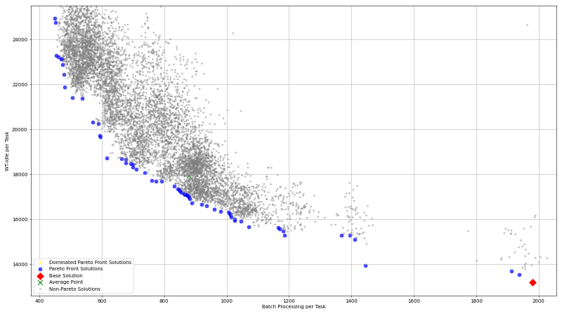</td>
<td>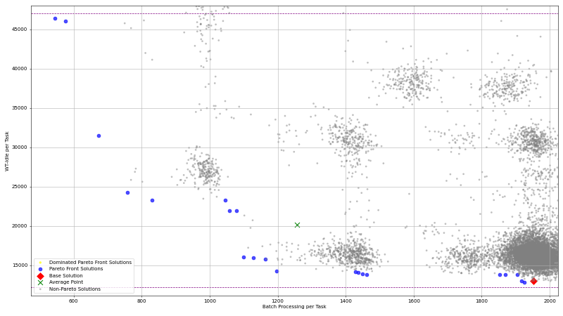</td>
<td>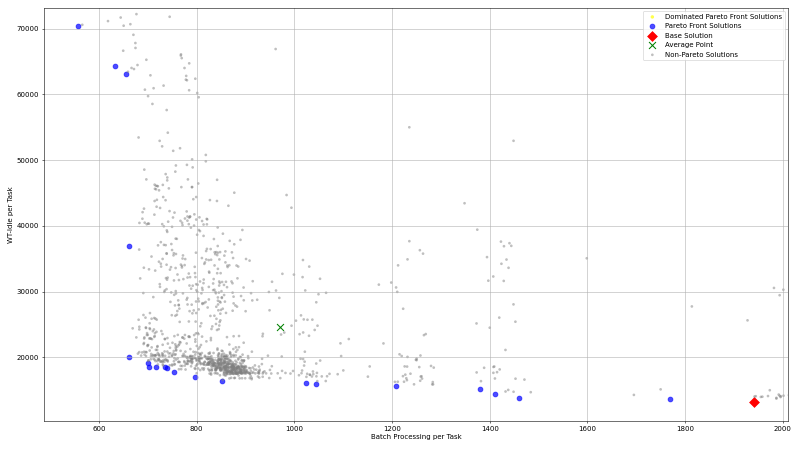</td>
<td></td>
<td>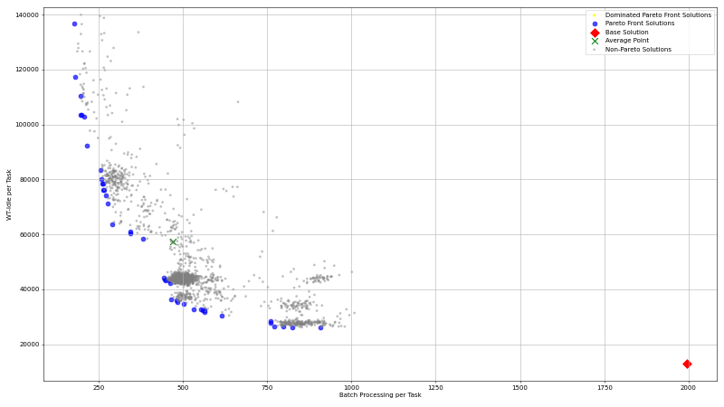</td>
</tr></table>

---

#### Hard

##### Metric Plots

<table>
<tr><td><strong>Pareto Front Size</strong> 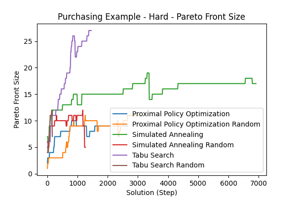 <em>Solution = Step</em></td><td><strong>Explored Solutions</strong> 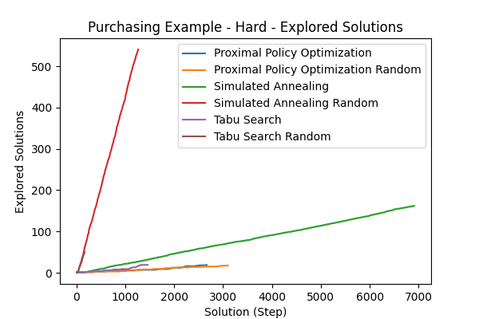 <em>Solution = Step</em></td><td><strong>New Base Solutions (Radius)</strong> 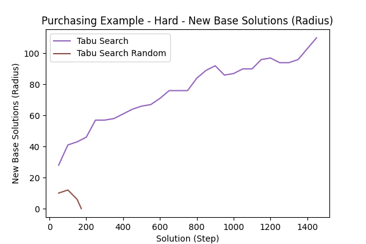 <em>Solution = Step</em></td></tr>
<tr><td><strong>New Base Solutions (Temperature)</strong> 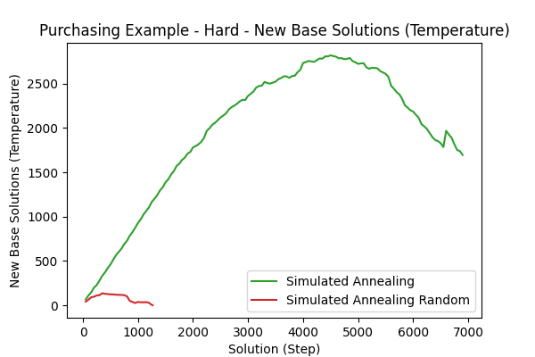 <em>Solution = Step</em></td><td><strong>Median Batch Processing Time</strong>  <em>Solution = Step</em></td><td><strong>Median Wait+Idle Time</strong> 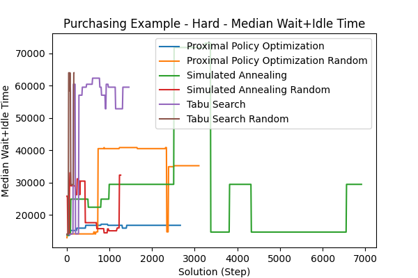 <em>Solution = Step</em></td></tr>
<tr><td><strong>Min Wait+Idle Time</strong> 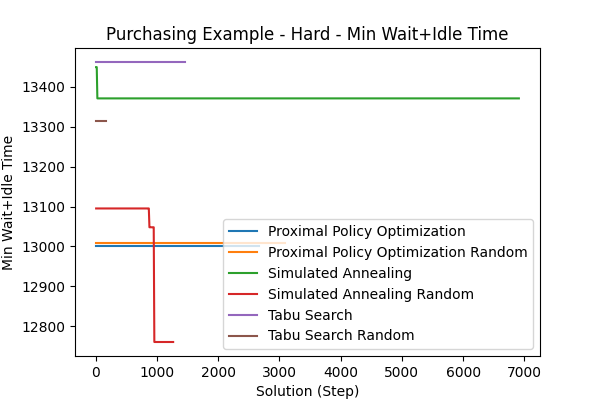 <em>Solution = Step</em></td><td><strong>Min Batch Processing Time</strong> 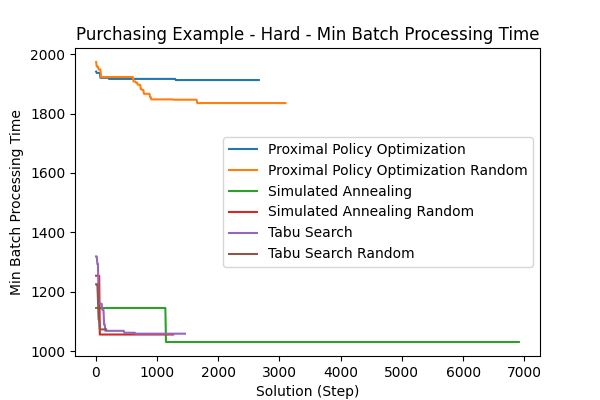 <em>Solution = Step</em></td><td><strong>Average Cycle Time</strong> 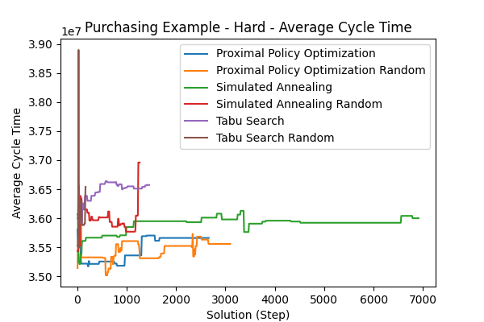 <em>Solution = Step</em></td></tr>
<tr><td><strong>Min Cycle Time</strong> 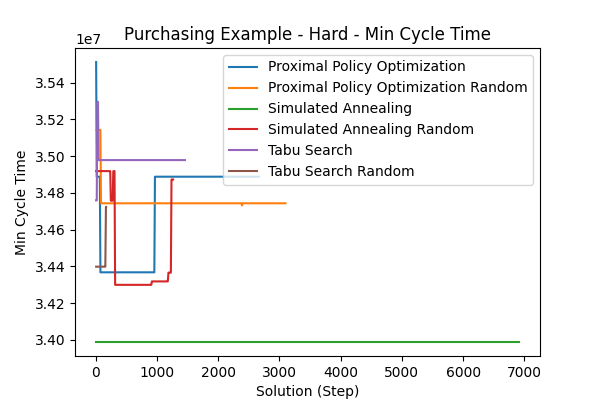 <em>Solution = Step</em></td><td><strong>Iteration Number</strong>  <em>Solution = Step</em></td><td></td></tr>
</table>

##### Summary Table (Final Values)

| Agent                               | Explored Solutions | New Base Solutions (Radius) | New Base Solutions (Temperature) | Median Batch Processing Time | Median Wait+Idle Time | Min Wait+Idle Time | Min Batch Processing Time | Average Cycle Time | Min Cycle Time | Iteration Number |
| :---------------------------------- | -----------------: | --------------------------: | -------------------------------: | ---------------------------: | --------------------: | -----------------: | ------------------------: | -----------------: | -------------: | ---------------: |
| Tabu Search                         |                 19 |                         110 |                                  |                      1353.08 |               59550.4 |            13462.1 |                   1059.06 |         3.6573e+07 |    3.49784e+07 |               73 |
| Proximal Policy Optimization Random |                 18 |                             |                                  |                      1897.74 |               35265.2 |            13009.4 |                   1835.32 |        3.55581e+07 |    3.47432e+07 |             3100 |
| Tabu Search Random                  |                 50 |                           0 |                                  |                      1173.42 |               64006.2 |            13314.2 |                   1073.52 |        3.65412e+07 |    3.47237e+07 |               52 |
| Simulated Annealing                 |                162 |                             |                             1696 |                      1912.72 |               29503.3 |            13370.9 |                   1031.09 |        3.60005e+07 |    3.39881e+07 |              338 |
| Proximal Policy Optimization        |                 19 |                             |                                  |                      1928.49 |               16835.9 |            13001.1 |                   1912.79 |         3.5661e+07 |    3.48879e+07 |             2667 |
| Simulated Annealing Random          |                541 |                             |                                0 |                       1883.9 |                 32361 |            12760.7 |                   1056.26 |        3.69597e+07 |    3.48729e+07 |              414 |

##### Pareto Front Images

<table><tr>
<th>Proximal Policy Optimization Random</th>
<th>Tabu Search Random</th>
<th>Simulated Annealing</th>
<th>Proximal Policy Optimization</th>
<th>Simulated Annealing Random</th>
</tr><tr>
<td>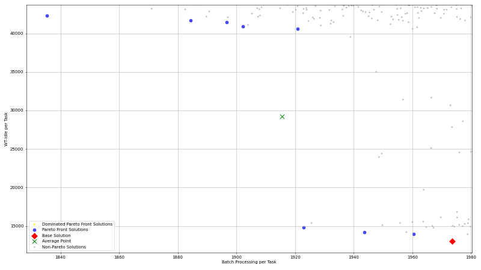</td>
<td>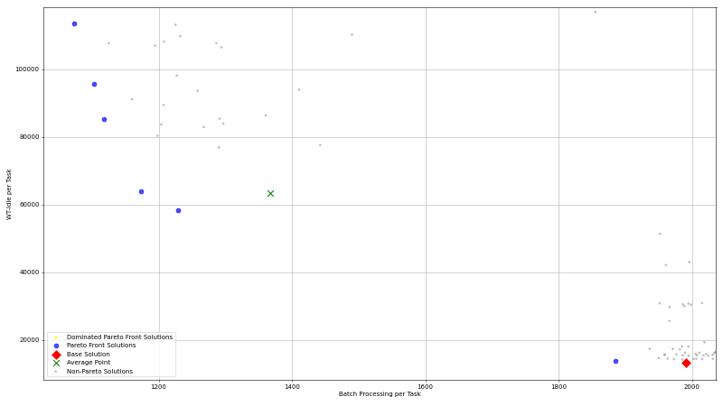</td>
<td>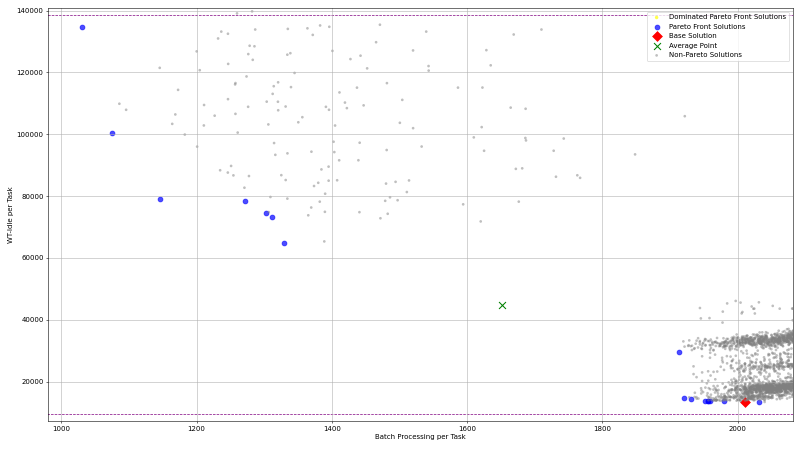</td>
<td>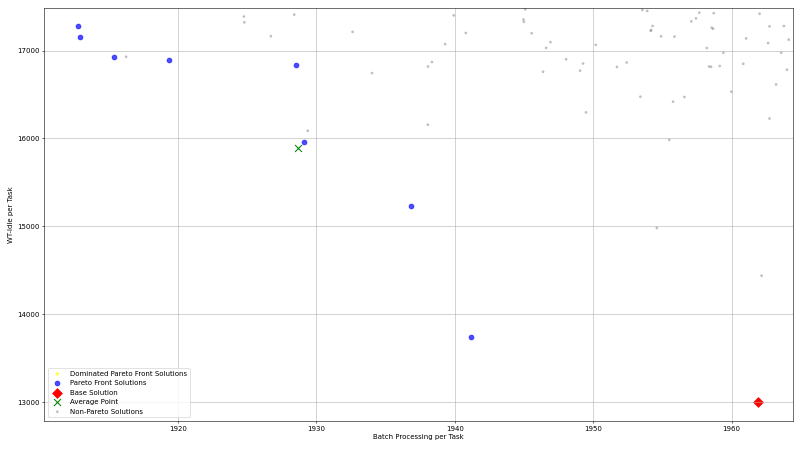</td>
<td>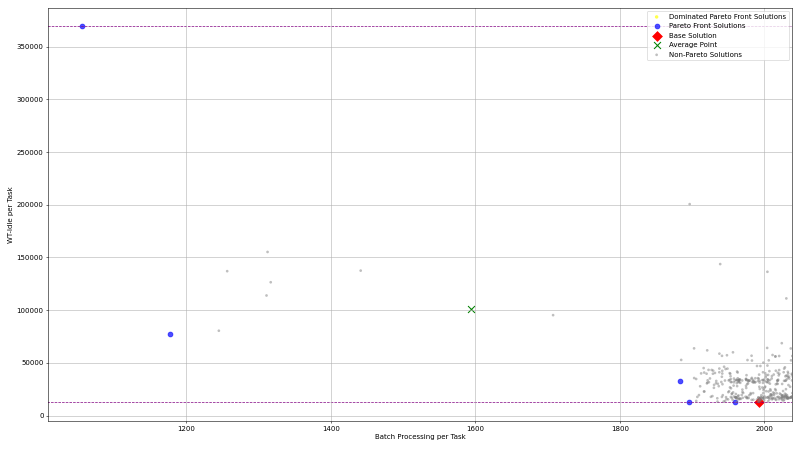</td>
</tr></table>

---

#### Mid

##### Metric Plots

<table>
<tr><td><strong>Pareto Front Size</strong> 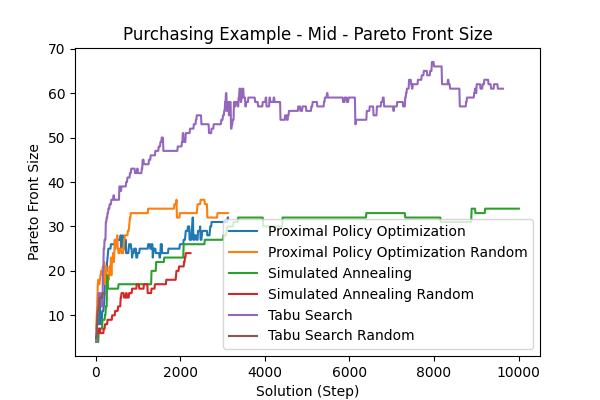 <em>Solution = Step</em></td><td><strong>Explored Solutions</strong> 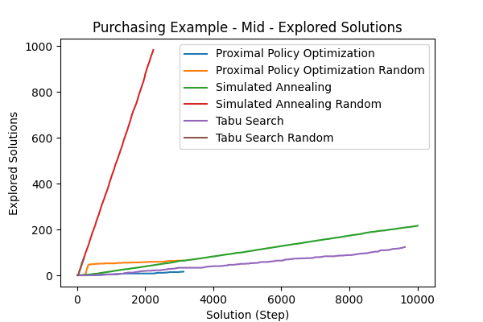 <em>Solution = Step</em></td><td><strong>New Base Solutions (Radius)</strong> 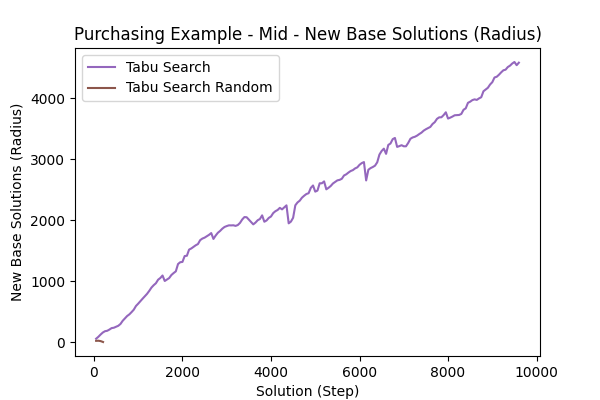 <em>Solution = Step</em></td></tr>
<tr><td><strong>New Base Solutions (Temperature)</strong> 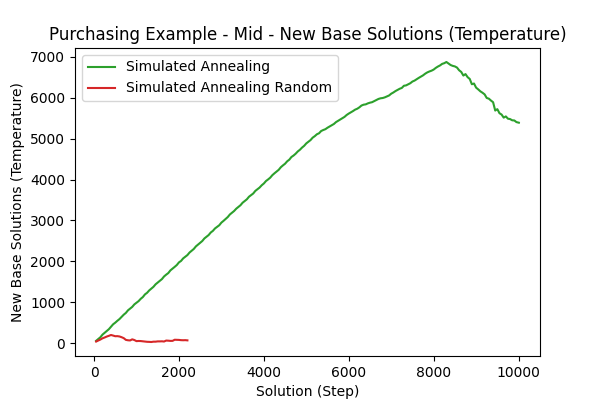 <em>Solution = Step</em></td><td><strong>Median Batch Processing Time</strong> 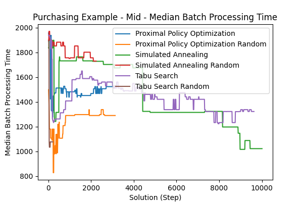 <em>Solution = Step</em></td><td><strong>Median Wait+Idle Time</strong> 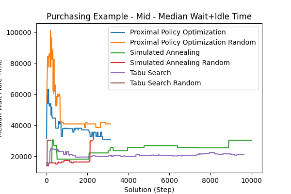 <em>Solution = Step</em></td></tr>
<tr><td><strong>Min Wait+Idle Time</strong> 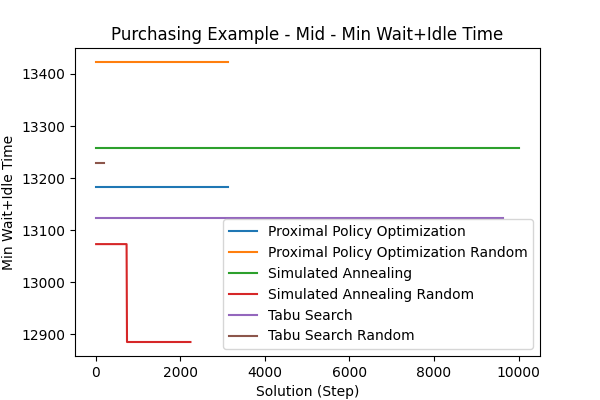 <em>Solution = Step</em></td><td><strong>Min Batch Processing Time</strong> 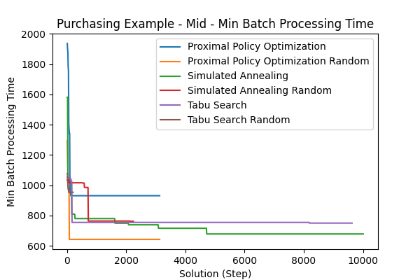 <em>Solution = Step</em></td><td><strong>Average Cycle Time</strong>  <em>Solution = Step</em></td></tr>
<tr><td><strong>Min Cycle Time</strong> 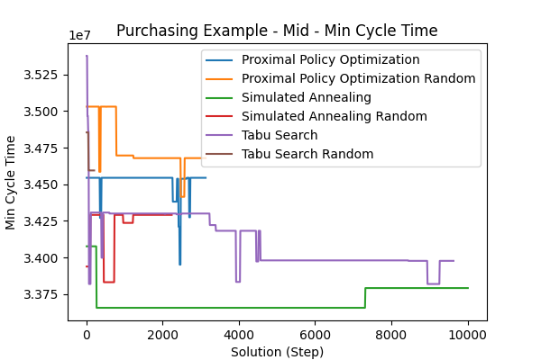 <em>Solution = Step</em></td><td><strong>Iteration Number</strong> 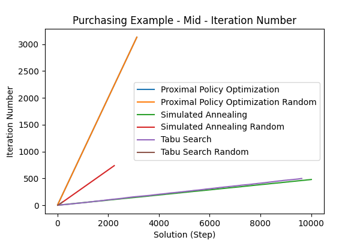 <em>Solution = Step</em></td><td></td></tr>
</table>

##### Summary Table (Final Values)

| Agent                               | Explored Solutions | New Base Solutions (Radius) | New Base Solutions (Temperature) | Median Batch Processing Time | Median Wait+Idle Time | Min Wait+Idle Time | Min Batch Processing Time | Average Cycle Time | Min Cycle Time | Iteration Number |
| :---------------------------------- | -----------------: | --------------------------: | -------------------------------: | ---------------------------: | --------------------: | -----------------: | ------------------------: | -----------------: | -------------: | ---------------: |
| Proximal Policy Optimization Random |                 65 |                             |                                  |                       1290.2 |                 40902 |              13423 |                   642.461 |        3.66452e+07 |    3.46787e+07 |             3130 |
| Simulated Annealing Random          |                983 |                             |                               74 |                      1729.68 |               29967.1 |            12885.4 |                   762.261 |        3.55964e+07 |    3.42911e+07 |              738 |
| Proximal Policy Optimization        |                 17 |                             |                                  |                      1524.35 |                 30951 |            13183.3 |                   931.013 |        3.57782e+07 |    3.45443e+07 |             3130 |
| Simulated Annealing                 |                217 |                             |                             5387 |                      1022.85 |               30291.8 |            13257.9 |                   678.387 |         3.5673e+07 |    3.37916e+07 |              480 |
| Tabu Search Random                  |                 75 |                           0 |                                  |                      1077.34 |               30100.8 |            13229.1 |                   953.633 |        3.54491e+07 |    3.45946e+07 |               63 |
| Tabu Search                         |                124 |                        4583 |                                  |                      1322.55 |               21115.1 |            13124.3 |                   750.199 |        3.52817e+07 |    3.39773e+07 |              498 |

##### Pareto Front Images

<table><tr>
<th>Proximal Policy Optimization Random</th>
<th>Simulated Annealing Random</th>
<th>Proximal Policy Optimization</th>
<th>Simulated Annealing</th>
<th>Tabu Search Random</th>
<th>Tabu Search</th>
</tr><tr>
<td>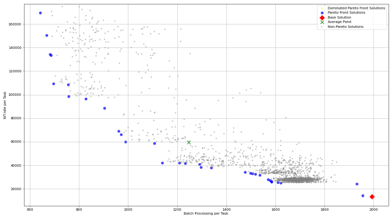</td>
<td></td>
<td>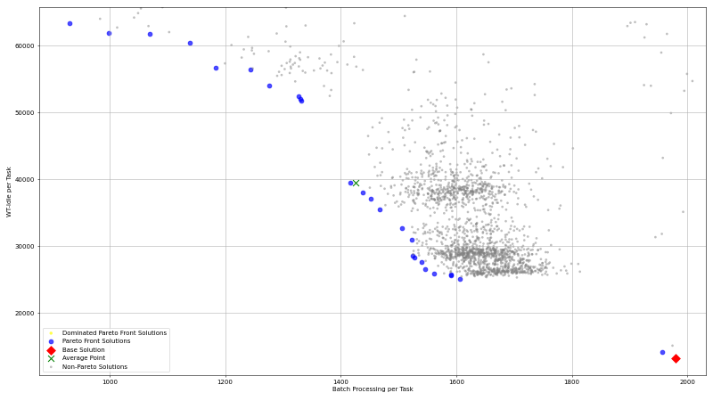</td>
<td>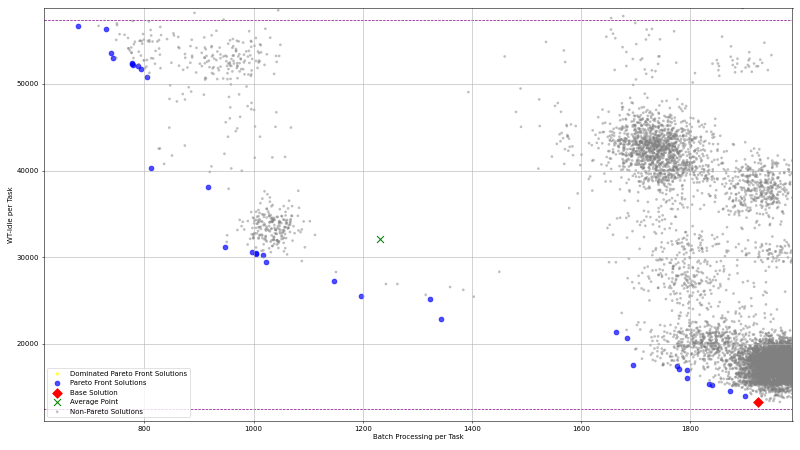</td>
<td>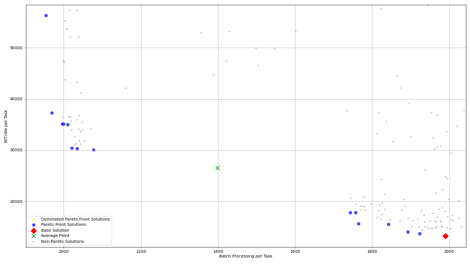</td>
<td>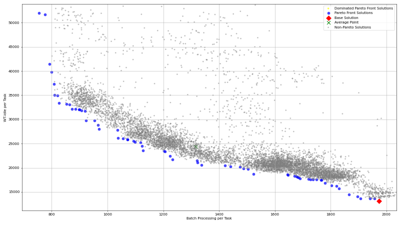</td>
</tr></table>

---

---

### Sepsis Das

#### Analyzer Overview

##### Pareto Size

| Agent / Reference | Easy  | Mid   | Hard  |
| ----------------- | ----- | ----- | ----- |
| Reference         | 23,00 | 8,00  | 12,00 |
| Reference Random  | 19,00 | 5,00  | 12,00 |
| Reference Optimos | 22,00 | 12,00 | 5,00  |
| SA                | 2,00  | 8,00  | 8,00  |
| Tabu Search       | 11,00 | 14,00 | 2,00  |
| PPO               | 25,00 | 10,00 | 3,00  |
| Tabu Random       | 9,00  | 1,00  | 1,00  |
| SA Random         | 15,00 | 5,00  | 12,00 |
| PPO Random        | 7,00  | 10,00 | 5,00  |

 

##### Hyperarea Ratio

| Agent / Reference | Easy | Mid  | Hard |
| ----------------- | ---- | ---- | ---- |
| Reference Random  | 1,00 | 1,00 | 1,00 |
| Reference Optimos | 1,00 | 0,94 | 0,95 |
| SA                | 0,64 | 0,56 | 0,95 |
| Tabu Search       | 1,00 | 0,85 | 0,95 |
| PPO               | 1,00 | 0,93 | 0,95 |
| Tabu Random       | 0,91 | 0,51 | 0,95 |
| SA Random         | 1,00 | 1,00 | 1,00 |
| PPO Random        | 0,75 | 0,59 | 0,95 |

 

##### Hausdorff

| Agent / Reference | Easy      | Mid          | Hard       |
| ----------------- | --------- | ------------ | ---------- |
| Reference Random  | 19.067,89 | 11.197,12    | 0,00       |
| Reference Optimos | 14.272,81 | 342.611,80   | 596.711,72 |
| SA                | 49.441,71 | 559.260,76   | 530.011,87 |
| Tabu Search       | 46.633,58 | 206.833,75   | 236.365,07 |
| PPO               | 19.872,42 | 369.574,35   | 145.835,87 |
| Tabu Random       | 62.815,90 | 640.252,01   | 270.431,98 |
| SA Random         | 18.882,65 | 11.197,12    | 0,00       |
| PPO Random        | 61.185,80 | 1.385.123,39 | 146.622,71 |

 

##### Delta

| Agent / Reference | Easy | Mid  | Hard |
| ----------------- | ---- | ---- | ---- |
| Reference Random  | 1,04 | 1,18 | 0,57 |
| Reference Optimos | 0,90 | 0,88 | 0,67 |
| SA                | 0,88 | 0,91 | 0,82 |
| Tabu Search       | 1,39 | 0,71 | 0,92 |
| PPO               | 0,88 | 0,95 | 0,76 |
| Tabu Random       | 1,00 | 0,00 | 0,00 |
| SA Random         | 0,84 | 1,18 | 0,57 |
| PPO Random        | 0,95 | 1,11 | 0,79 |

 

##### Purity

| Agent / Reference | Easy | Mid  | Hard |
| ----------------- | ---- | ---- | ---- |
| Reference Random  | 0,04 | 0,62 | 1,00 |
| Reference Optimos | 0,96 | 0,38 | 0,00 |
| SA                | 0,00 | 0,00 | 0,00 |
| Tabu Search       | 0,39 | 0,38 | 0,00 |
| PPO               | 0,57 | 0,00 | 0,00 |
| Tabu Random       | 0,00 | 0,00 | 0,00 |
| SA Random         | 0,04 | 0,62 | 1,00 |
| PPO Random        | 0,00 | 0,00 | 0,00 |

 

##### Avg Cycle Time

| Agent / Reference | Easy          | Mid            | Hard           |
| ----------------- | ------------- | -------------- | -------------- |
| Base              | 81.884.663,83 | 78.354.184,84  | 77.382.542,97  |
| Reference         | 49.160.507,13 | 90.904.175,17  | 113.991.676,16 |
| Reference Random  | 49.643.547,41 | 100.127.438,39 | 113.991.676,16 |
| Reference Optimos | 49.009.105,75 | 86.763.900,52  | 79.868.329,19  |
| SA                | 48.981.957,29 | 75.362.790,22  | 79.854.360,14  |
| Tabu Search       | 49.340.890,25 | 78.094.062,27  | 77.669.925,99  |
| PPO               | 48.954.593,42 | 92.318.161,88  | 80.056.716,20  |
| Tabu Random       | 49.210.432,29 | 75.073.704,05  | 77.983.503,98  |
| SA Random         | 49.981.451,71 | 100.127.438,39 | 113.991.676,16 |
| PPO Random        | 48.593.383,09 | 74.766.027,53  | 79.378.748,37  |

 

##### Best Cycle Time

| Agent / Reference | Easy          | Mid           | Hard          |
| ----------------- | ------------- | ------------- | ------------- |
| Base              | 81.884.663,83 | 78.354.184,84 | 77.382.542,97 |
| Reference         | 47.409.540,37 | 71.528.257,84 | 95.169.098,95 |
| Reference Random  | 47.241.669,76 | 93.615.262,32 | 95.169.098,95 |
| Reference Optimos | 47.409.540,37 | 71.528.257,84 | 77.504.818,50 |
| SA                | 47.433.718,09 | 73.779.573,57 | 78.350.481,99 |
| Tabu Search       | 47.409.540,37 | 71.528.257,84 | 77.504.818,50 |
| PPO               | 45.437.286,89 | 85.317.002,71 | 79.791.185,01 |
| Tabu Random       | 48.275.138,18 | 75.073.704,05 | 77.983.503,98 |
| SA Random         | 47.241.669,76 | 93.615.262,32 | 95.169.098,95 |
| PPO Random        | 46.879.543,35 | 71.455.570,34 | 77.905.095,08 |

 

#### Easy

##### Metric Plots

<table>
<tr><td><strong>Pareto Front Size</strong> 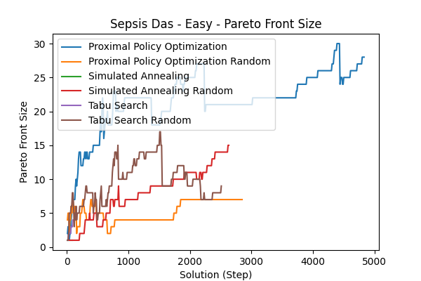 <em>Solution = Step</em></td><td><strong>Explored Solutions</strong> 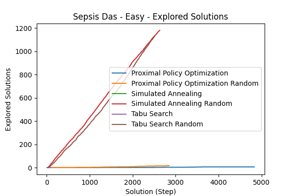 <em>Solution = Step</em></td><td><strong>New Base Solutions (Radius)</strong> 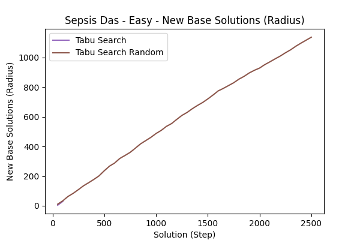 <em>Solution = Step</em></td></tr>
<tr><td><strong>New Base Solutions (Temperature)</strong> 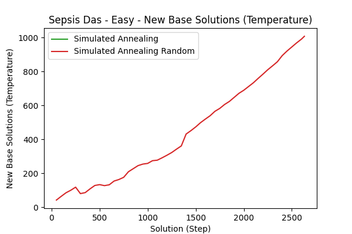 <em>Solution = Step</em></td><td><strong>Median Batch Processing Time</strong> 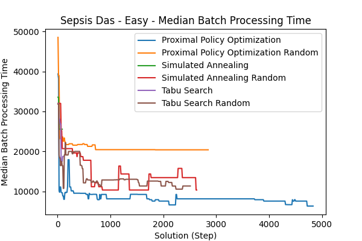 <em>Solution = Step</em></td><td><strong>Median Wait+Idle Time</strong> 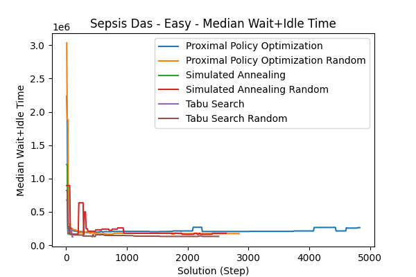 <em>Solution = Step</em></td></tr>
<tr><td><strong>Min Wait+Idle Time</strong> 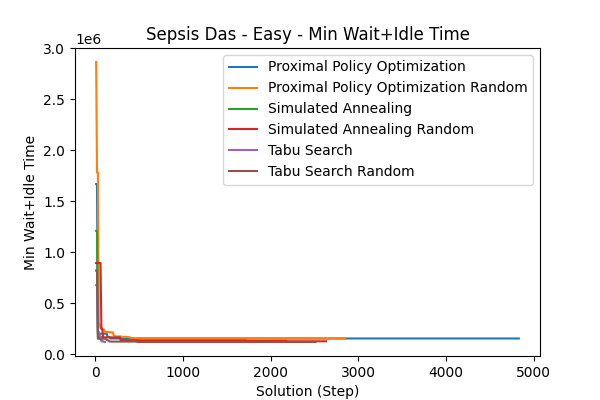 <em>Solution = Step</em></td><td><strong>Min Batch Processing Time</strong> 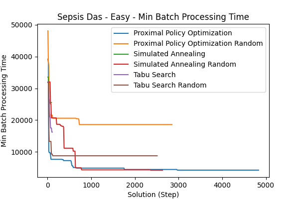 <em>Solution = Step</em></td><td><strong>Average Cycle Time</strong> 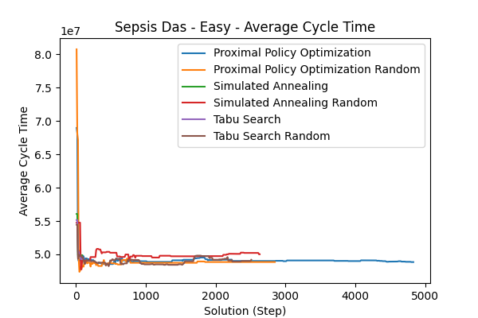 <em>Solution = Step</em></td></tr>
<tr><td><strong>Min Cycle Time</strong> 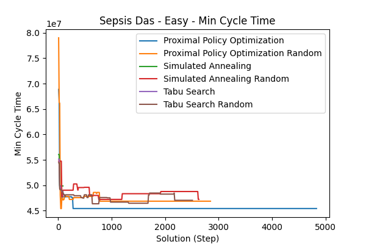 <em>Solution = Step</em></td><td><strong>Iteration Number</strong> 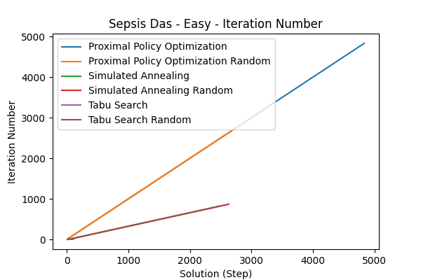 <em>Solution = Step</em></td><td></td></tr>
</table>

##### Summary Table (Final Values)

| Agent                               | Explored Solutions | New Base Solutions (Radius) | New Base Solutions (Temperature) | Median Batch Processing Time | Median Wait+Idle Time | Min Wait+Idle Time | Min Batch Processing Time | Average Cycle Time | Min Cycle Time | Iteration Number |
| :---------------------------------- | -----------------: | --------------------------: | -------------------------------: | ---------------------------: | --------------------: | -----------------: | ------------------------: | -----------------: | -------------: | ---------------: |
| Proximal Policy Optimization Random |                 18 |                             |                                  |                      20385.5 |                174318 |             156983 |                   18592.3 |        4.88577e+07 |    4.68795e+07 |             2849 |
| Proximal Policy Optimization        |                  7 |                             |                                  |                      6305.35 |                264172 |             155985 |                   4243.08 |        4.88522e+07 |    4.54373e+07 |             4830 |
| Tabu Search                         |                  1 |                          30 |                                  |                      18726.6 |                125919 |             121739 |                     16216 |        4.93868e+07 |    4.81111e+07 |                5 |
| Tabu Search Random                  |               1126 |                        1136 |                                  |                      11330.3 |                132134 |             121390 |                   8755.65 |        4.91912e+07 |    4.70545e+07 |              830 |
| Simulated Annealing Random          |               1180 |                             |                             1008 |                      10316.2 |                179386 |             128493 |                   4233.59 |         5.0022e+07 |    4.72417e+07 |              868 |
| Simulated Annealing                 |                  1 |                             |                               69 |                      25537.3 |                169598 |             169598 |                   25537.3 |        4.98798e+07 |    4.98798e+07 |                4 |

##### Pareto Front Images

<table><tr>
<th>Proximal Policy Optimization Random</th>
<th>Proximal Policy Optimization</th>
<th>Tabu Search Random</th>
<th>Simulated Annealing Random</th>
</tr><tr>
<td>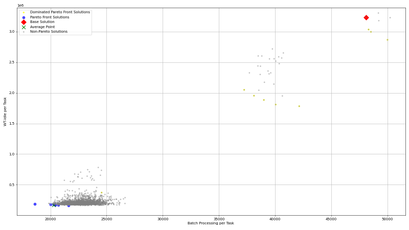</td>
<td>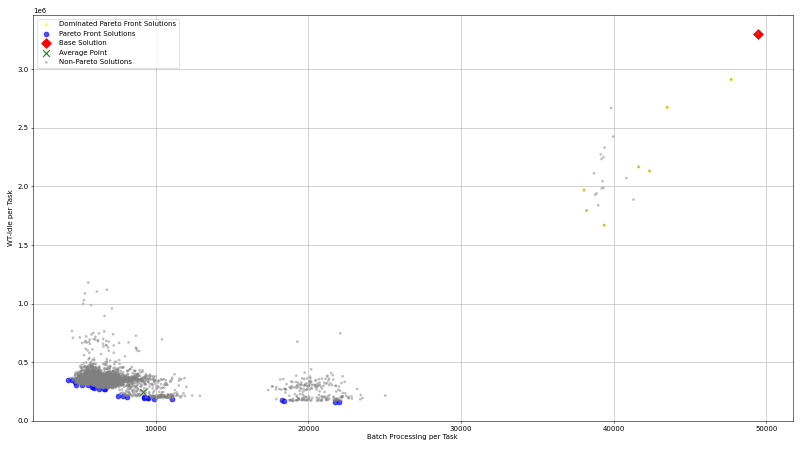</td>
<td>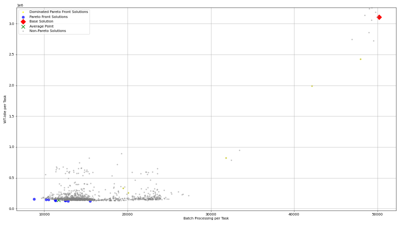</td>
<td>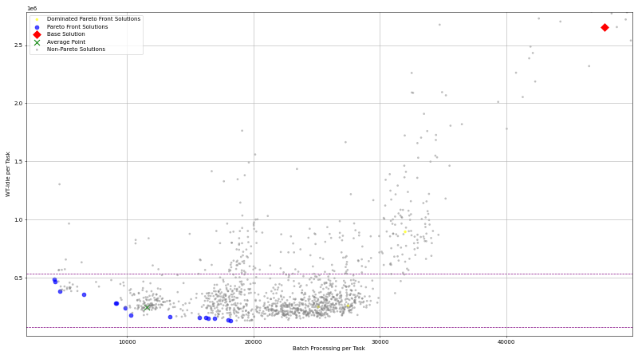</td>
</tr></table>

---

#### Hard

##### Metric Plots

<table>
<tr><td><strong>Pareto Front Size</strong> 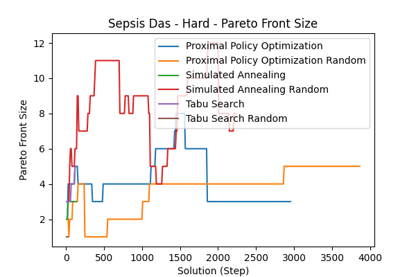 <em>Solution = Step</em></td><td><strong>Explored Solutions</strong> 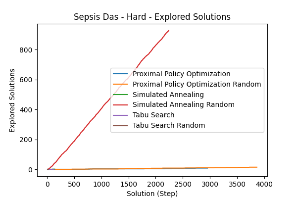 <em>Solution = Step</em></td><td><strong>New Base Solutions (Radius)</strong> 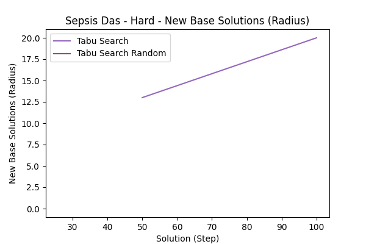 <em>Solution = Step</em></td></tr>
<tr><td><strong>New Base Solutions (Temperature)</strong> 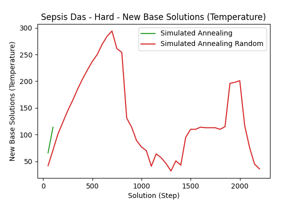 <em>Solution = Step</em></td><td><strong>Median Batch Processing Time</strong> 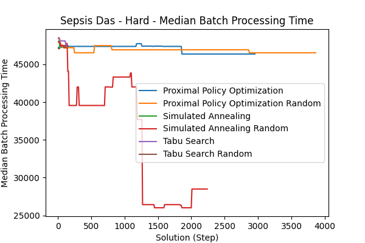 <em>Solution = Step</em></td><td><strong>Median Wait+Idle Time</strong> 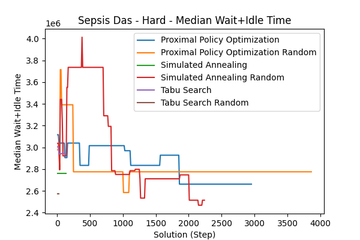 <em>Solution = Step</em></td></tr>
<tr><td><strong>Min Wait+Idle Time</strong> 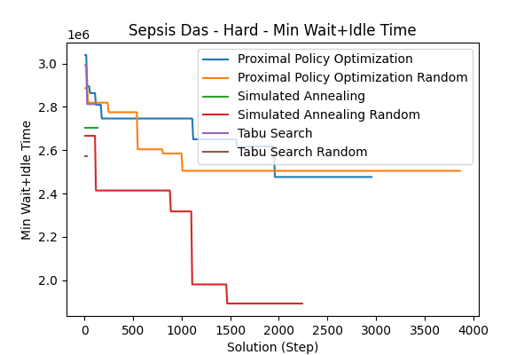 <em>Solution = Step</em></td><td><strong>Min Batch Processing Time</strong> 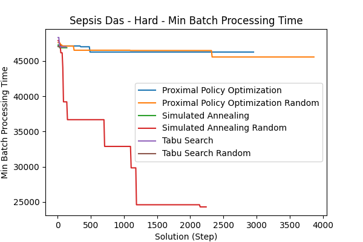 <em>Solution = Step</em></td><td><strong>Average Cycle Time</strong>  <em>Solution = Step</em></td></tr>
<tr><td><strong>Min Cycle Time</strong> 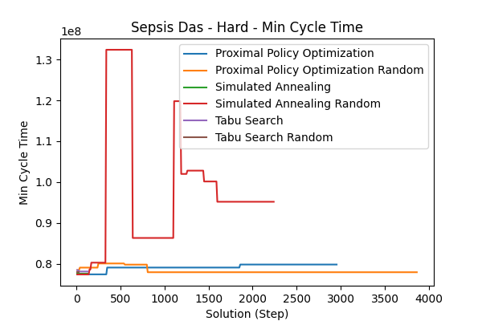 <em>Solution = Step</em></td><td><strong>Iteration Number</strong> 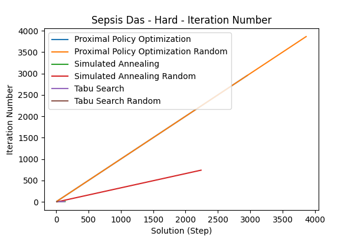 <em>Solution = Step</em></td><td></td></tr>
</table>

##### Summary Table (Final Values)

| Agent                               | Explored Solutions | New Base Solutions (Radius) | New Base Solutions (Temperature) | Median Batch Processing Time | Median Wait+Idle Time | Min Wait+Idle Time | Min Batch Processing Time | Average Cycle Time | Min Cycle Time | Iteration Number |
| :---------------------------------- | -----------------: | --------------------------: | -------------------------------: | ---------------------------: | --------------------: | -----------------: | ------------------------: | -----------------: | -------------: | ---------------: |
| Simulated Annealing                 |                  2 |                             |                              114 |                      47280.1 |           2.76164e+06 |        2.70343e+06 |                   46888.4 |        7.80104e+07 |    7.74798e+07 |                7 |
| Tabu Search Random                  |                  1 |                           0 |                                  |                      47088.4 |           2.57387e+06 |        2.57387e+06 |                   47088.4 |        7.79835e+07 |    7.79835e+07 |                3 |
| Simulated Annealing Random          |                926 |                             |                               36 |                      28487.4 |           2.51413e+06 |        1.89205e+06 |                   24292.6 |        1.16187e+08 |    9.51691e+07 |              740 |
| Proximal Policy Optimization Random |                 15 |                             |                                  |                      46534.7 |           2.77533e+06 |        2.50461e+06 |                   45574.2 |        7.93788e+07 |    7.79051e+07 |             3865 |
| Tabu Search                         |                  1 |                          20 |                                  |                      47587.6 |           2.93964e+06 |        2.81282e+06 |                   47010.3 |        8.00764e+07 |    7.80771e+07 |                6 |
| Proximal Policy Optimization        |                  9 |                             |                                  |                      46371.6 |           2.66203e+06 |        2.47632e+06 |                   46275.4 |        8.00567e+07 |    7.97912e+07 |             2955 |

##### Pareto Front Images

<table><tr>
<th>Tabu Search Random</th>
<th>Simulated Annealing Random</th>
<th>Proximal Policy Optimization Random</th>
<th>Proximal Policy Optimization</th>
</tr><tr>
<td>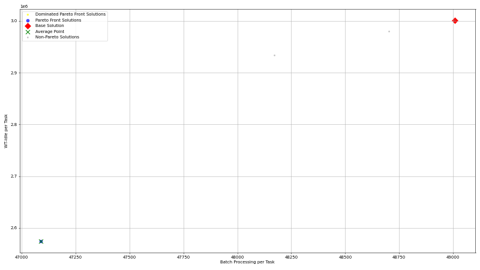</td>
<td>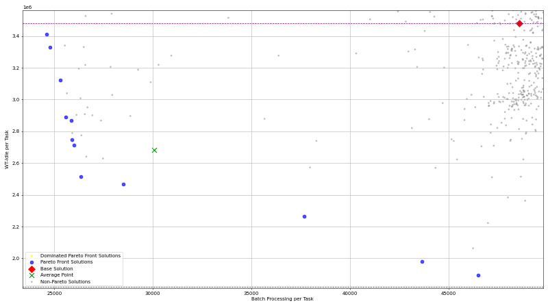</td>
<td>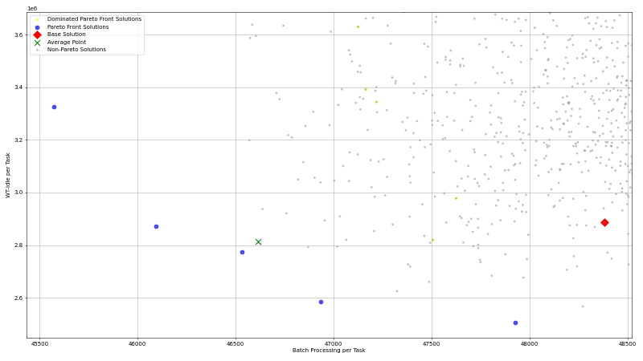</td>
<td>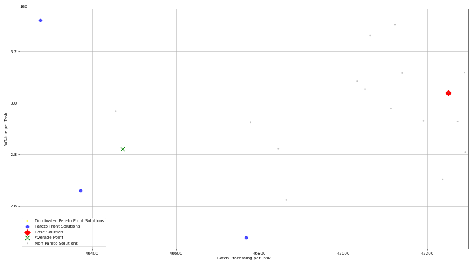</td>
</tr></table>

---

#### Mid

##### Metric Plots

<table>
<tr><td><strong>Pareto Front Size</strong> 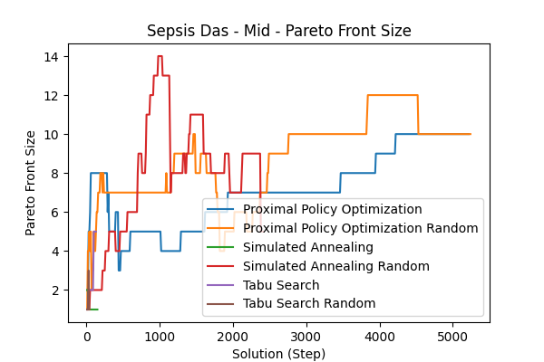 <em>Solution = Step</em></td><td><strong>Explored Solutions</strong> 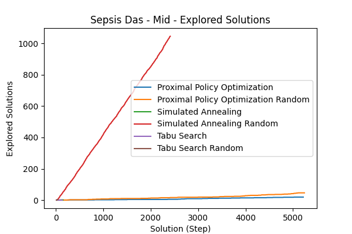 <em>Solution = Step</em></td><td><strong>New Base Solutions (Radius)</strong> 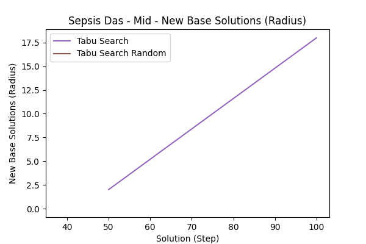 <em>Solution = Step</em></td></tr>
<tr><td><strong>New Base Solutions (Temperature)</strong> 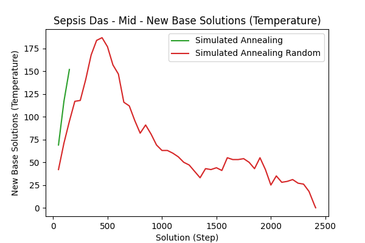 <em>Solution = Step</em></td><td><strong>Median Batch Processing Time</strong> 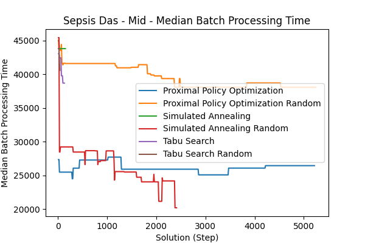 <em>Solution = Step</em></td><td><strong>Median Wait+Idle Time</strong> 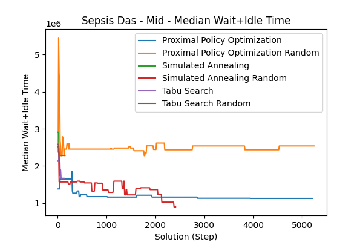 <em>Solution = Step</em></td></tr>
<tr><td><strong>Min Wait+Idle Time</strong> 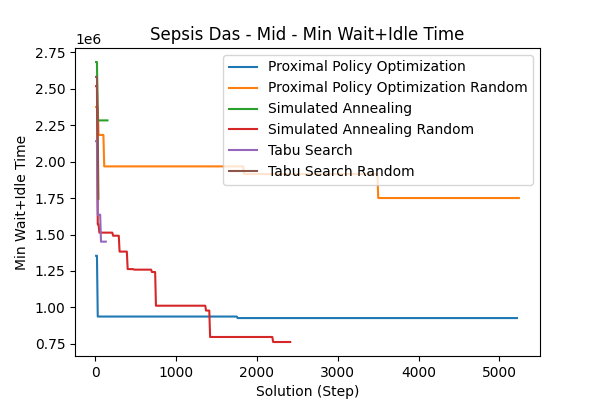 <em>Solution = Step</em></td><td><strong>Min Batch Processing Time</strong> 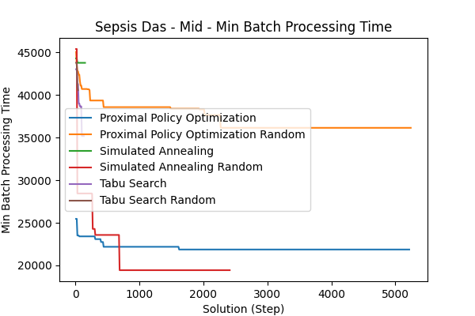 <em>Solution = Step</em></td><td><strong>Average Cycle Time</strong> 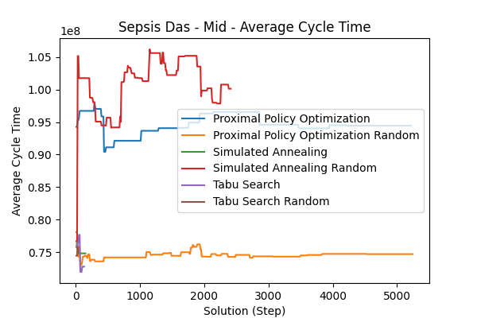 <em>Solution = Step</em></td></tr>
<tr><td><strong>Min Cycle Time</strong> 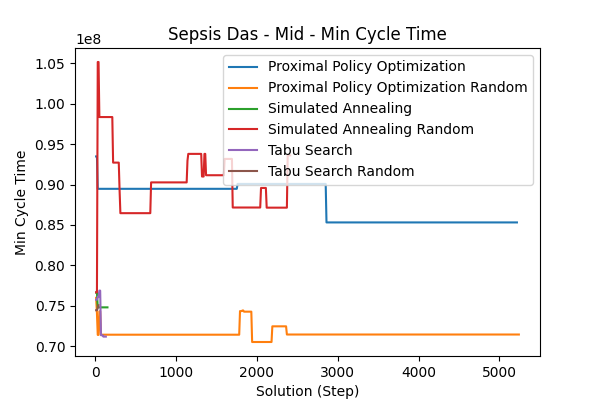 <em>Solution = Step</em></td><td><strong>Iteration Number</strong> 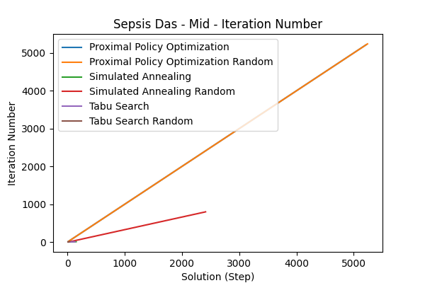 <em>Solution = Step</em></td><td></td></tr>
</table>

##### Summary Table (Final Values)

| Agent                               | Explored Solutions | New Base Solutions (Radius) | New Base Solutions (Temperature) | Median Batch Processing Time | Median Wait+Idle Time | Min Wait+Idle Time | Min Batch Processing Time | Average Cycle Time | Min Cycle Time | Iteration Number |
| :---------------------------------- | -----------------: | --------------------------: | -------------------------------: | ---------------------------: | --------------------: | -----------------: | ------------------------: | -----------------: | -------------: | ---------------: |
| Simulated Annealing Random          |               1045 |                             |                                0 |                      20186.4 |                899261 |             762744 |                   19442.4 |        1.00127e+08 |    9.36153e+07 |              798 |
| Simulated Annealing                 |                  2 |                             |                              152 |                      43785.9 |           2.28339e+06 |        2.28339e+06 |                   43785.9 |         7.4814e+07 |     7.4814e+07 |                8 |
| Tabu Search                         |                  1 |                          18 |                                  |                      38674.8 |           1.66835e+06 |        1.45137e+06 |                   35191.7 |        7.27851e+07 |    7.11963e+07 |                6 |
| Tabu Search Random                  |                  4 |                           0 |                                  |                        40570 |            1.7456e+06 |         1.7456e+06 |                     40570 |        7.50737e+07 |    7.50737e+07 |                7 |
| Proximal Policy Optimization        |                 20 |                             |                                  |                      26432.2 |           1.12776e+06 |             926937 |                   21868.5 |        9.44429e+07 |     8.5317e+07 |             5217 |
| Proximal Policy Optimization Random |                 47 |                             |                                  |                      38062.6 |           2.53954e+06 |        1.75074e+06 |                   36154.1 |        7.47033e+07 |    7.14556e+07 |             5240 |

##### Pareto Front Images

<table><tr>
<th>Simulated Annealing Random</th>
<th>Tabu Search Random</th>
<th>Proximal Policy Optimization</th>
<th>Proximal Policy Optimization Random</th>
</tr><tr>
<td>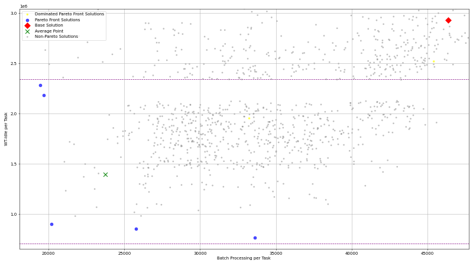</td>
<td>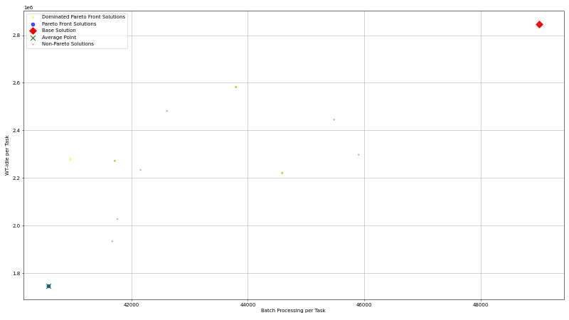</td>
<td></td>
<td>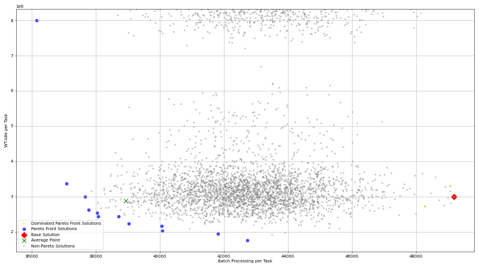</td>
</tr></table>

---

---

### Trafic Das

#### Analyzer Overview

##### Pareto Size

| Agent / Reference | Easy  | Mid   | Hard  |
| ----------------- | ----- | ----- | ----- |
| Reference         | 10,00 | 16,00 | 22,00 |
| Reference Random  | 8,00  | 15,00 | 22,00 |
| Reference Optimos | 5,00  | 15,00 | 32,00 |
| SA                | 7,00  | 3,00  | 9,00  |
| Tabu Search       | 4,00  | 6,00  | 5,00  |
| PPO               | 5,00  | 17,00 | 29,00 |
| Tabu Random       | 5,00  | 15,00 | 6,00  |
| SA Random         | 4,00  | 3,00  | 6,00  |
| PPO Random        | 8,00  | 15,00 | 22,00 |

 

##### Hyperarea Ratio

| Agent / Reference | Easy | Mid  | Hard |
| ----------------- | ---- | ---- | ---- |
| Reference Random  | 1,00 | 1,00 | 1,00 |
| Reference Optimos | 1,00 | 1,00 | 1,00 |
| SA                | 0,93 | 0,96 | 1,00 |
| Tabu Search       | 0,94 | 0,97 | 1,00 |
| PPO               | 1,00 | 1,00 | 1,00 |
| Tabu Random       | 0,97 | 0,99 | 1,00 |
| SA Random         | 0,96 | 1,00 | 1,00 |
| PPO Random        | 1,00 | 1,00 | 1,00 |

 

##### Hausdorff

| Agent / Reference | Easy       | Mid        | Hard         |
| ----------------- | ---------- | ---------- | ------------ |
| Reference Random  | 30.622,38  | 21.885,52  | 0,00         |
| Reference Optimos | 13.820,94  | 227.175,14 | 148.348,66   |
| SA                | 109.147,00 | 248.862,10 | 309.816,74   |
| Tabu Search       | 110.960,66 | 237.025,86 | 469.460,00   |
| PPO               | 13.820,94  | 227.175,14 | 198.400,91   |
| Tabu Random       | 108.571,56 | 114.943,76 | 1.203.658,64 |
| SA Random         | 110.626,92 | 96.732,90  | 331.225,12   |
| PPO Random        | 30.622,38  | 47.134,59  | 166.156,72   |

 

##### Delta

| Agent / Reference | Easy | Mid  | Hard |
| ----------------- | ---- | ---- | ---- |
| Reference Random  | 1,51 | 1,01 | 0,97 |
| Reference Optimos | 1,40 | 1,33 | 0,88 |
| SA                | 0,81 | 0,98 | 1,27 |
| Tabu Search       | 0,90 | 0,93 | 0,95 |
| PPO               | 1,40 | 1,33 | 0,85 |
| Tabu Random       | 0,79 | 0,98 | 1,22 |
| SA Random         | 0,83 | 0,50 | 0,91 |
| PPO Random        | 1,51 | 1,01 | 0,80 |

 

##### Purity

| Agent / Reference | Easy | Mid  | Hard |
| ----------------- | ---- | ---- | ---- |
| Reference Random  | 0,70 | 0,31 | 1,00 |
| Reference Optimos | 0,30 | 0,69 | 0,00 |
| SA                | 0,00 | 0,00 | 0,00 |
| Tabu Search       | 0,00 | 0,00 | 0,00 |
| PPO               | 0,30 | 0,69 | 0,00 |
| Tabu Random       | 0,00 | 0,00 | 0,23 |
| SA Random         | 0,00 | 0,12 | 0,05 |
| PPO Random        | 0,70 | 0,19 | 0,73 |

 

##### Avg Cycle Time

| Agent / Reference | Easy         | Mid           | Hard          |
| ----------------- | ------------ | ------------- | ------------- |
| Base              | 4.406.883,21 | 4.237.002,88  | 4.235.563,50  |
| Reference         | 1.245.508,53 | 3.236.511,47  | 11.249.272,88 |
| Reference Random  | 832.853,83   | 3.020.570,10  | 11.249.272,88 |
| Reference Optimos | 2.558.990,90 | 12.385.577,44 | 11.269.135,07 |
| SA                | 2.334.547,68 | 4.668.437,81  | 60.213.221,47 |
| Tabu Search       | 2.324.422,20 | 10.161.927,77 | 4.546.275,16  |
| PPO               | 2.558.990,90 | 12.385.577,44 | 12.641.990,69 |
| Tabu Random       | 1.781.635,13 | 15.554.223,59 | 54.923.323,88 |
| SA Random         | 2.594.287,50 | 6.540.162,08  | 19.816.682,85 |
| PPO Random        | 832.853,83   | 3.400.742,03  | 11.422.093,12 |

 

##### Best Cycle Time

| Agent / Reference | Easy         | Mid          | Hard         |
| ----------------- | ------------ | ------------ | ------------ |
| Base              | 4.406.883,21 | 4.237.002,88 | 4.235.563,50 |
| Reference         | 89.304,46    | 520.078,31   | 2.594.306,70 |
| Reference Random  | 89.304,46    | 520.078,31   | 2.594.306,70 |
| Reference Optimos | 607.541,34   | 1.471.187,97 | 3.890.929,73 |
| SA                | 1.469.943,01 | 4.150.208,86 | 3.890.929,73 |
| Tabu Search       | 1.903.540,02 | 5.703.105,99 | 4.147.636,37 |
| PPO               | 607.541,34   | 1.471.187,97 | 4.235.563,50 |
| Tabu Random       | 866.616,18   | 1.471.969,73 | 2.940.590,48 |
| SA Random         | 1.730.491,24 | 520.078,31   | 2.594.306,70 |
| PPO Random        | 89.304,46    | 1.298.623,46 | 4.235.563,50 |

 

#### Easy

##### Metric Plots

<table>
<tr><td><strong>Pareto Front Size</strong> 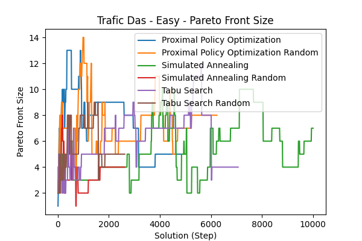 <em>Solution = Step</em></td><td><strong>Explored Solutions</strong> 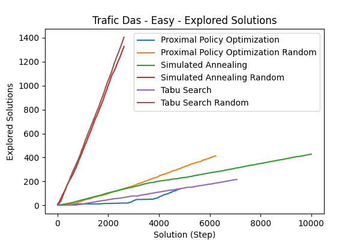 <em>Solution = Step</em></td><td><strong>New Base Solutions (Radius)</strong> 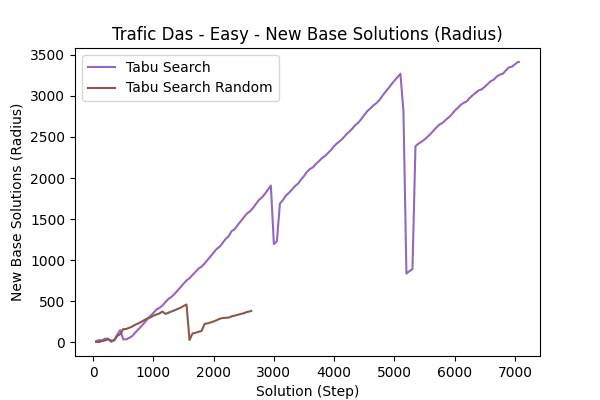 <em>Solution = Step</em></td></tr>
<tr><td><strong>New Base Solutions (Temperature)</strong> 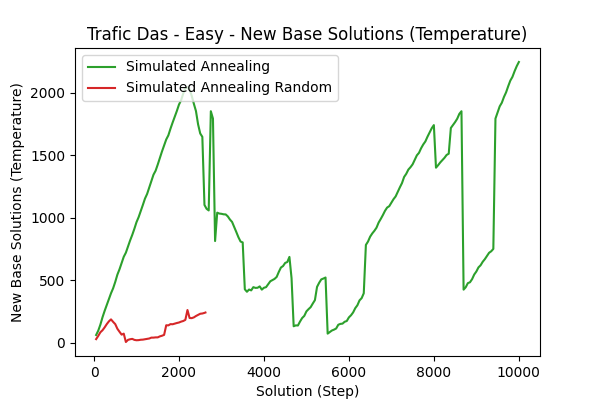 <em>Solution = Step</em></td><td><strong>Median Batch Processing Time</strong> 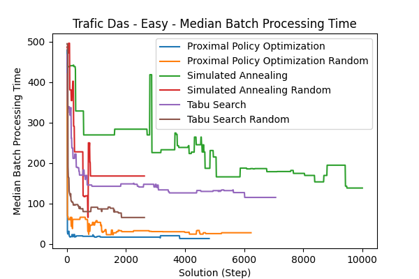 <em>Solution = Step</em></td><td><strong>Median Wait+Idle Time</strong> 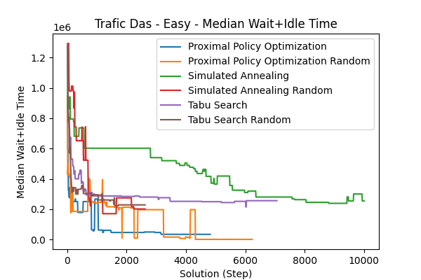 <em>Solution = Step</em></td></tr>
<tr><td><strong>Min Wait+Idle Time</strong> 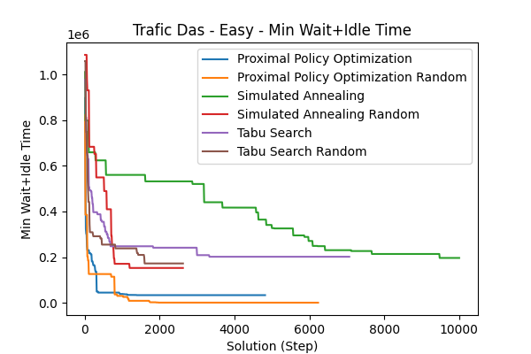 <em>Solution = Step</em></td><td><strong>Min Batch Processing Time</strong> 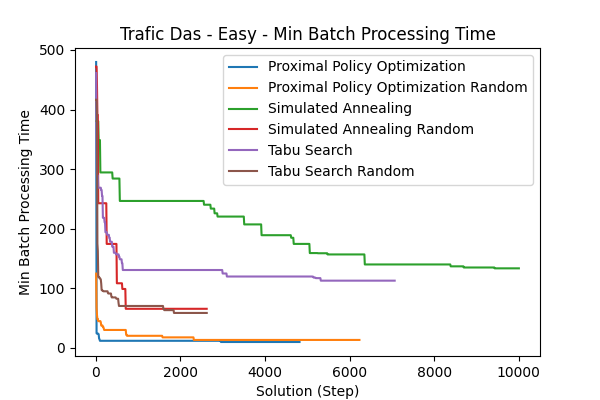 <em>Solution = Step</em></td><td><strong>Average Cycle Time</strong>  <em>Solution = Step</em></td></tr>
<tr><td><strong>Min Cycle Time</strong> 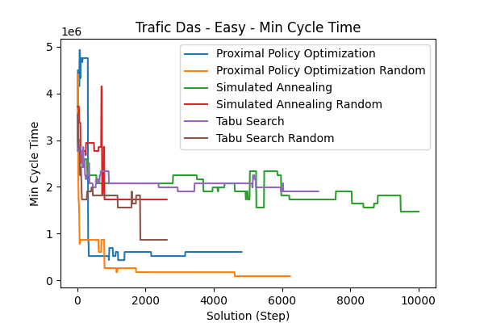 <em>Solution = Step</em></td><td><strong>Iteration Number</strong> 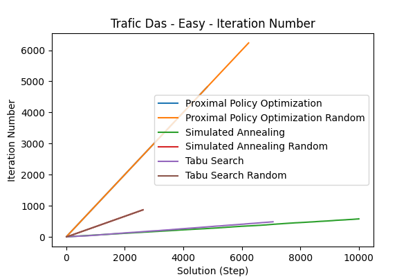 <em>Solution = Step</em></td><td></td></tr>
</table>

##### Summary Table (Final Values)

| Agent                               | Explored Solutions | New Base Solutions (Radius) | New Base Solutions (Temperature) | Median Batch Processing Time | Median Wait+Idle Time | Min Wait+Idle Time | Min Batch Processing Time | Average Cycle Time | Min Cycle Time | Iteration Number |
| :---------------------------------- | -----------------: | --------------------------: | -------------------------------: | ---------------------------: | --------------------: | -----------------: | ------------------------: | -----------------: | -------------: | ---------------: |
| Simulated Annealing                 |                427 |                             |                             2248 |                      138.144 |                254892 |             196662 |                   133.425 |        2.33455e+06 |    1.46994e+06 |              577 |
| Tabu Search                         |                216 |                        3412 |                                  |                      114.903 |                256695 |             201887 |                   112.741 |        2.31422e+06 |    1.90354e+06 |              485 |
| Proximal Policy Optimization Random |                414 |                             |                                  |                      27.4882 |               1525.28 |            923.534 |                   13.2331 |             832854 |        89304.5 |             6234 |
| Proximal Policy Optimization        |                136 |                             |                                  |                      13.1275 |               34954.4 |            33847.5 |                     9.772 |        2.55899e+06 |         607541 |             4818 |
| Tabu Search Random                  |               1405 |                         383 |                                  |                      65.2418 |                229093 |             172558 |                   58.5382 |        1.78164e+06 |         866616 |              868 |
| Simulated Annealing Random          |               1327 |                             |                              243 |                      167.926 |                202008 |             152807 |                    65.501 |        2.59429e+06 |    1.73049e+06 |              868 |

##### Pareto Front Images

<table><tr>
<th>Simulated Annealing</th>
<th>Tabu Search</th>
<th>Proximal Policy Optimization Random</th>
<th>Proximal Policy Optimization</th>
<th>Tabu Search Random</th>
<th>Simulated Annealing Random</th>
</tr><tr>
<td>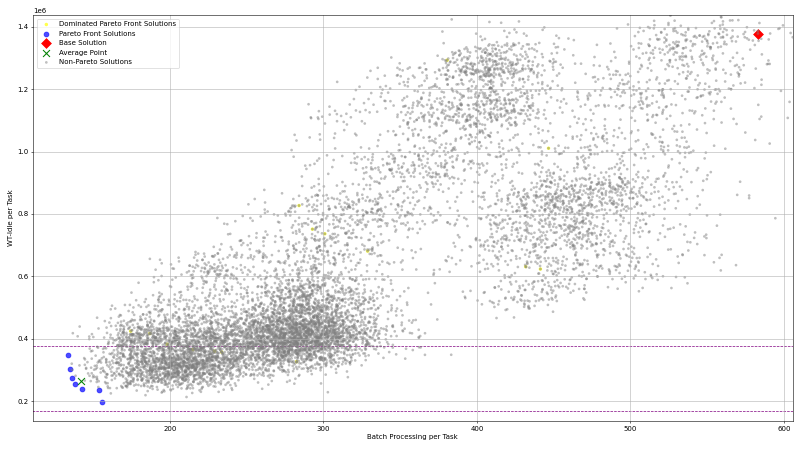</td>
<td>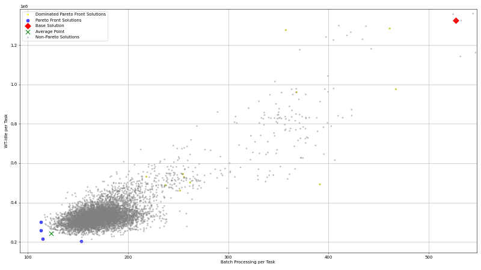</td>
<td>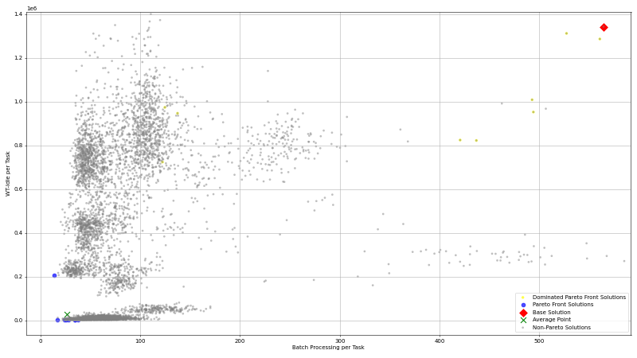</td>
<td></td>
<td>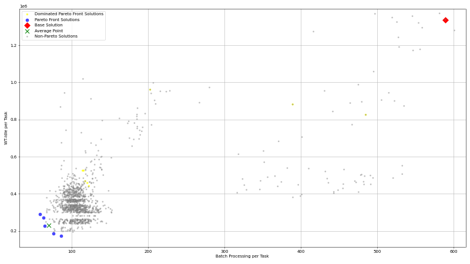</td>
<td>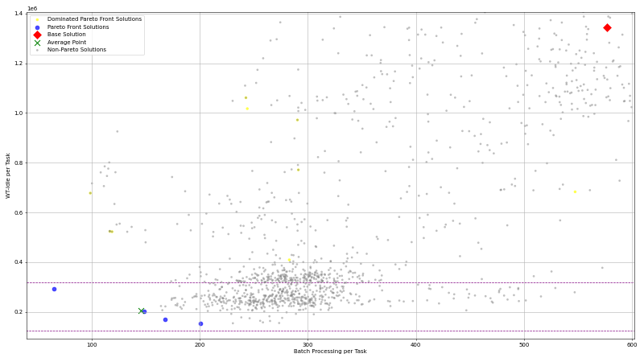</td>
</tr></table>

---

#### Hard

##### Metric Plots

<table>
<tr><td><strong>Pareto Front Size</strong> 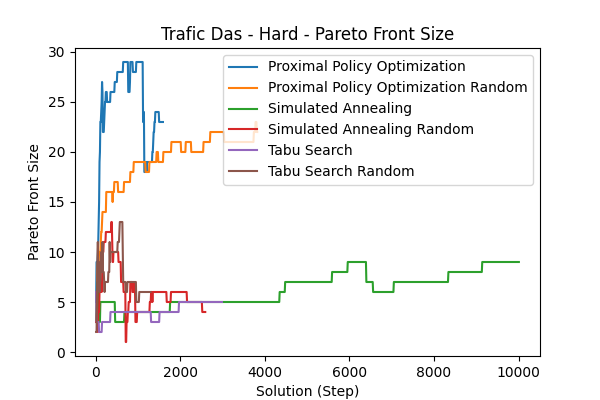 <em>Solution = Step</em></td><td><strong>Explored Solutions</strong> 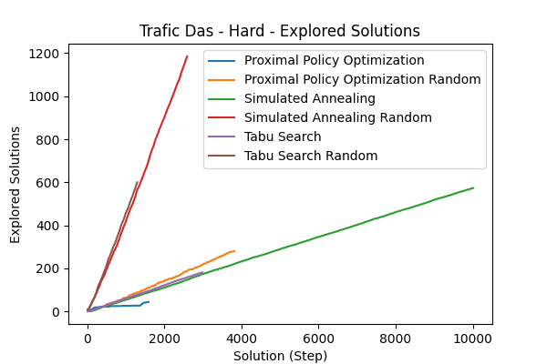 <em>Solution = Step</em></td><td><strong>New Base Solutions (Radius)</strong> 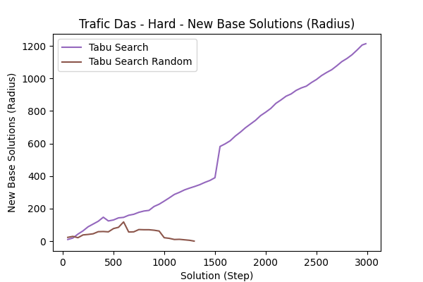 <em>Solution = Step</em></td></tr>
<tr><td><strong>New Base Solutions (Temperature)</strong> 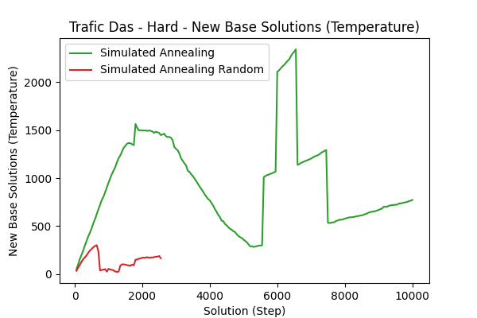 <em>Solution = Step</em></td><td><strong>Median Batch Processing Time</strong> 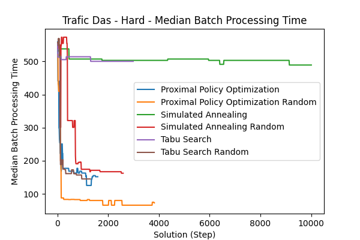 <em>Solution = Step</em></td><td><strong>Median Wait+Idle Time</strong> 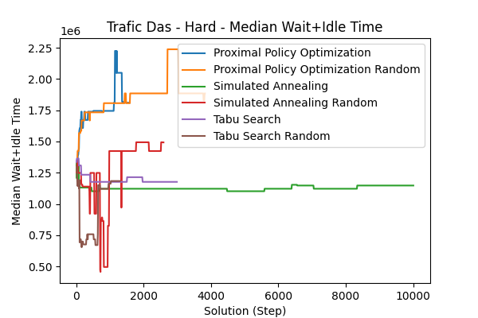 <em>Solution = Step</em></td></tr>
<tr><td><strong>Min Wait+Idle Time</strong> 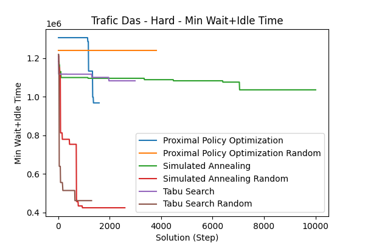 <em>Solution = Step</em></td><td><strong>Min Batch Processing Time</strong> 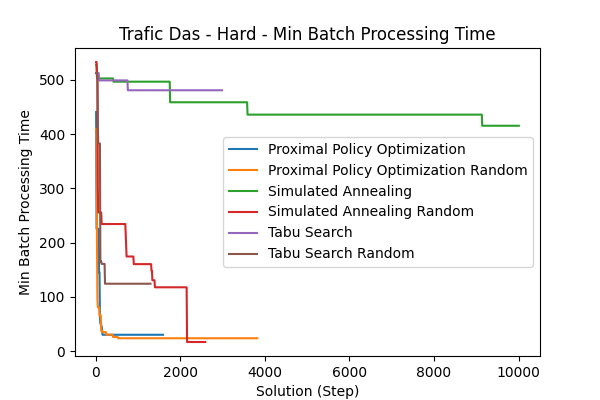 <em>Solution = Step</em></td><td><strong>Average Cycle Time</strong> 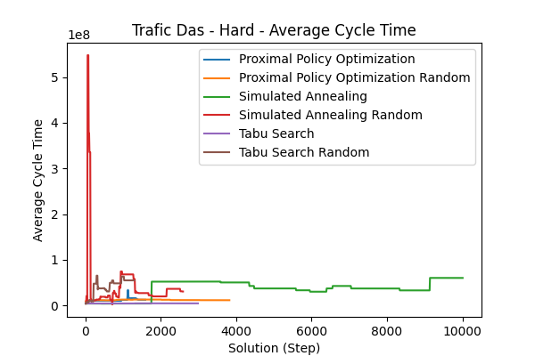 <em>Solution = Step</em></td></tr>
<tr><td><strong>Min Cycle Time</strong> 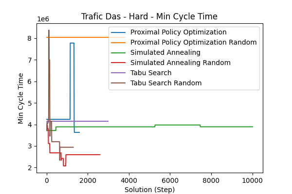 <em>Solution = Step</em></td><td><strong>Iteration Number</strong>  <em>Solution = Step</em></td><td></td></tr>
</table>

##### Summary Table (Final Values)

| Agent                               | Explored Solutions | New Base Solutions (Radius) | New Base Solutions (Temperature) | Median Batch Processing Time | Median Wait+Idle Time | Min Wait+Idle Time | Min Batch Processing Time | Average Cycle Time | Min Cycle Time | Iteration Number |
| :---------------------------------- | -----------------: | --------------------------: | -------------------------------: | ---------------------------: | --------------------: | -----------------: | ------------------------: | -----------------: | -------------: | ---------------: |
| Simulated Annealing                 |                573 |                             |                              773 |                      489.081 |           1.14739e+06 |        1.03638e+06 |                   415.338 |        6.02035e+07 |    3.89093e+06 |              598 |
| Tabu Search                         |                181 |                        1214 |                                  |                      500.202 |           1.17663e+06 |        1.08321e+06 |                   480.715 |        4.54628e+06 |    4.14764e+06 |              186 |
| Simulated Annealing Random          |               1185 |                             |                              165 |                      162.396 |           1.49264e+06 |             424451 |                   17.0185 |        3.05005e+07 |    2.59431e+06 |              857 |
| Proximal Policy Optimization Random |                280 |                             |                                  |                      72.8084 |           1.88497e+06 |        1.23931e+06 |                    23.913 |        1.14576e+07 |    8.03874e+06 |             3820 |
| Proximal Policy Optimization        |                 44 |                             |                                  |                      151.831 |           1.81056e+06 |             968508 |                   30.3375 |        1.23984e+07 |    3.63188e+06 |             1590 |
| Tabu Search Random                  |                600 |                           0 |                                  |                       145.09 |           1.18345e+06 |             461474 |                   124.361 |        5.49233e+07 |    2.94059e+06 |              426 |

##### Pareto Front Images

<table><tr>
<th>Simulated Annealing</th>
<th>Tabu Search</th>
<th>Simulated Annealing Random</th>
<th>Proximal Policy Optimization Random</th>
<th>Tabu Search Random</th>
</tr><tr>
<td></td>
<td>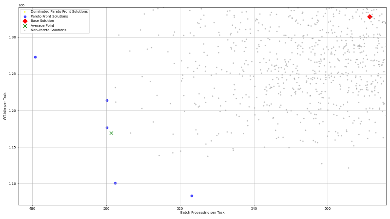</td>
<td>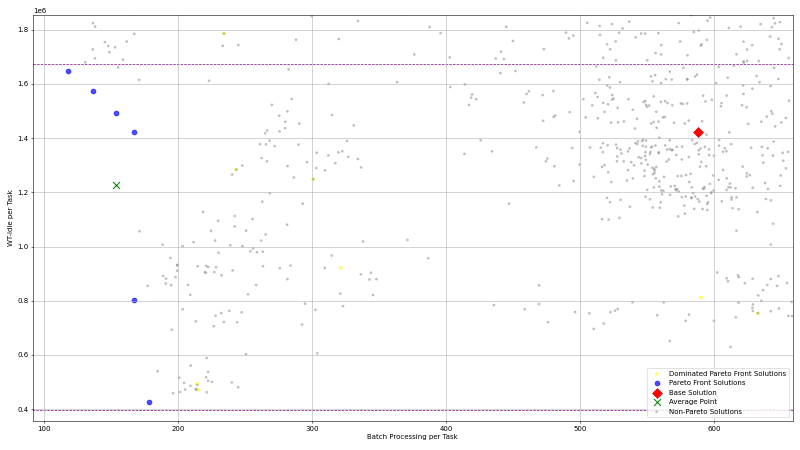</td>
<td>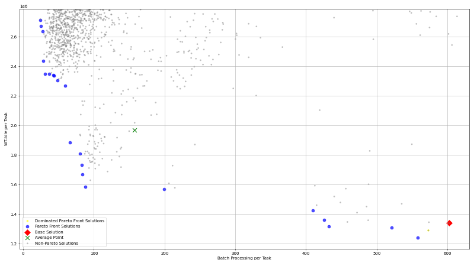</td>
<td>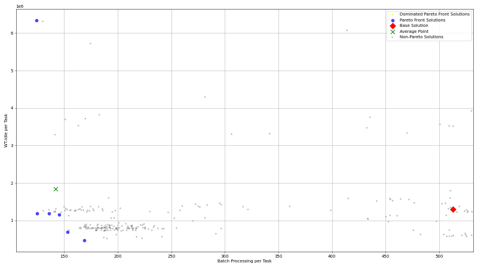</td>
</tr></table>

---

#### Mid

##### Metric Plots

<table>
<tr><td><strong>Pareto Front Size</strong> 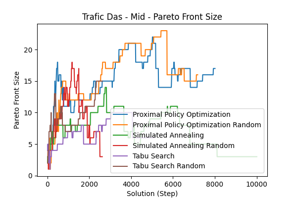 <em>Solution = Step</em></td><td><strong>Explored Solutions</strong> 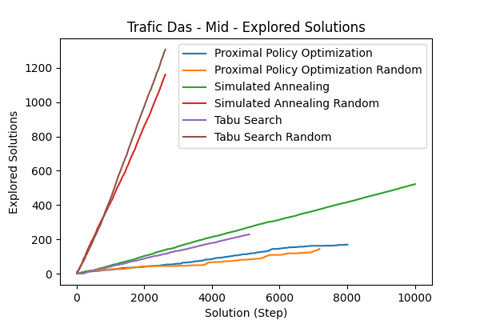 <em>Solution = Step</em></td><td><strong>New Base Solutions (Radius)</strong> 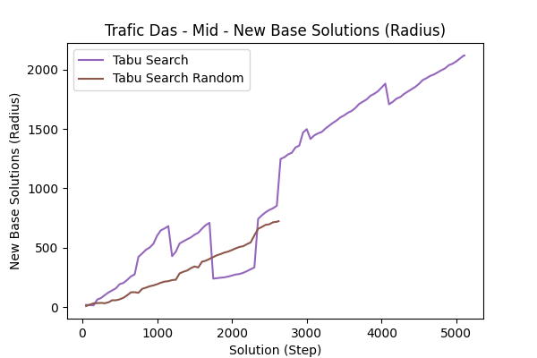 <em>Solution = Step</em></td></tr>
<tr><td><strong>New Base Solutions (Temperature)</strong> 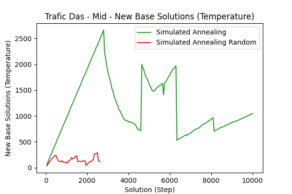 <em>Solution = Step</em></td><td><strong>Median Batch Processing Time</strong> 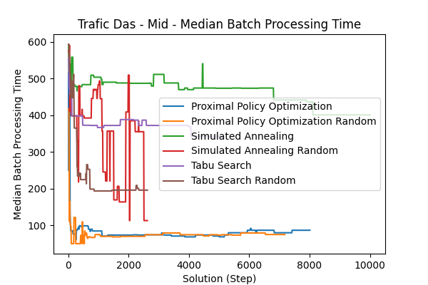 <em>Solution = Step</em></td><td><strong>Median Wait+Idle Time</strong> 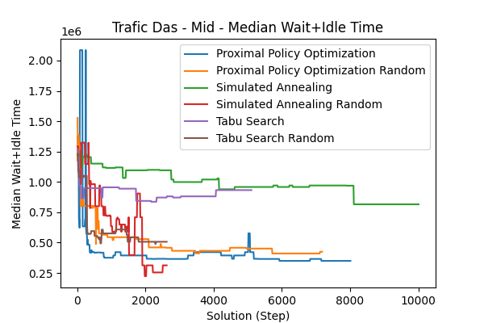 <em>Solution = Step</em></td></tr>
<tr><td><strong>Min Wait+Idle Time</strong> 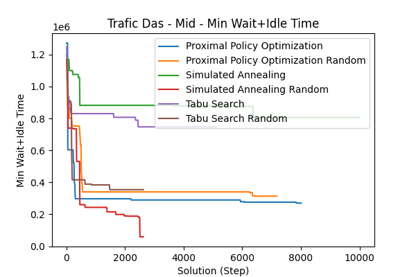 <em>Solution = Step</em></td><td><strong>Min Batch Processing Time</strong> 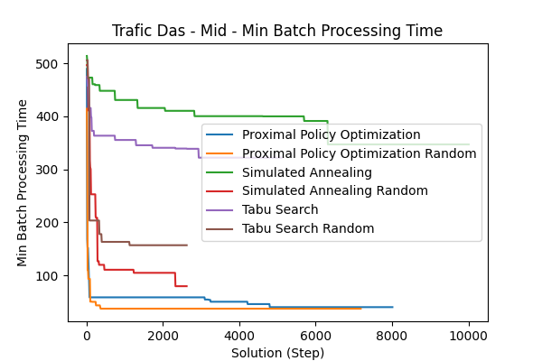 <em>Solution = Step</em></td><td><strong>Average Cycle Time</strong>  <em>Solution = Step</em></td></tr>
<tr><td><strong>Min Cycle Time</strong> 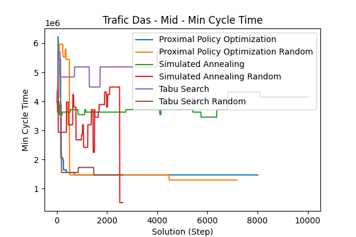 <em>Solution = Step</em></td><td><strong>Iteration Number</strong> 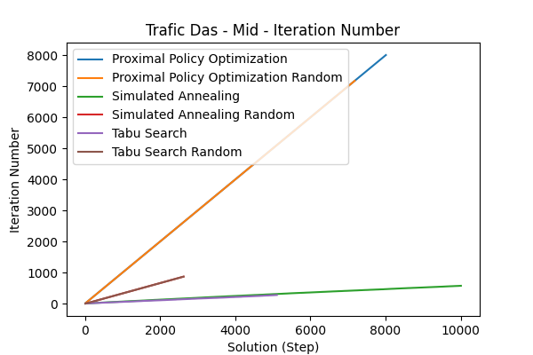 <em>Solution = Step</em></td><td></td></tr>
</table>

##### Summary Table (Final Values)

| Agent                               | Explored Solutions | New Base Solutions (Radius) | New Base Solutions (Temperature) | Median Batch Processing Time | Median Wait+Idle Time | Min Wait+Idle Time | Min Batch Processing Time | Average Cycle Time | Min Cycle Time | Iteration Number |
| :---------------------------------- | -----------------: | --------------------------: | -------------------------------: | ---------------------------: | --------------------: | -----------------: | ------------------------: | -----------------: | -------------: | ---------------: |
| Simulated Annealing                 |                522 |                             |                             1045 |                      400.801 |                815555 |             805885 |                   347.011 |        4.66844e+06 |    4.15021e+06 |              573 |
| Tabu Search                         |                229 |                        2118 |                                  |                      342.418 |                932627 |             747170 |                   322.015 |        1.15793e+07 |    5.70311e+06 |              276 |
| Simulated Annealing Random          |               1160 |                             |                              119 |                       113.19 |                312769 |            58861.4 |                    79.491 |        6.54016e+06 |         520078 |              868 |
| Proximal Policy Optimization        |                170 |                             |                                  |                      86.8867 |                349657 |             270279 |                   39.9835 |        1.15895e+07 |    1.47119e+06 |             8010 |
| Proximal Policy Optimization Random |                146 |                             |                                  |                       75.249 |                425069 |             313482 |                   37.1275 |        3.52303e+06 |    1.29862e+06 |             7180 |
| Tabu Search Random                  |               1306 |                         723 |                                  |                      196.057 |                507079 |             354092 |                   156.822 |        1.55542e+07 |    1.47197e+06 |              868 |

##### Pareto Front Images

<table><tr>
<th>Simulated Annealing</th>
<th>Tabu Search</th>
<th>Simulated Annealing Random</th>
<th>Proximal Policy Optimization</th>
<th>Proximal Policy Optimization Random</th>
<th>Tabu Search Random</th>
</tr><tr>
<td>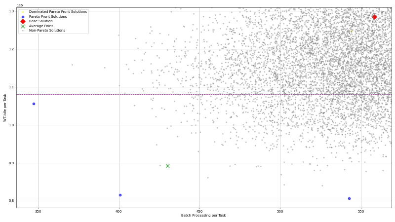</td>
<td>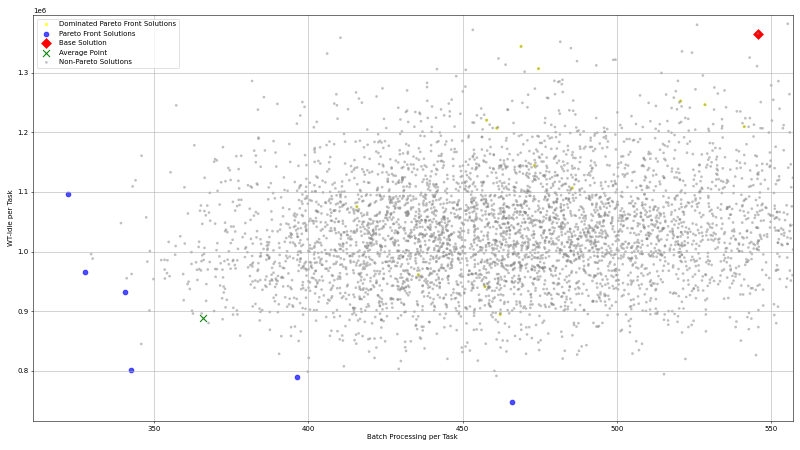</td>
<td>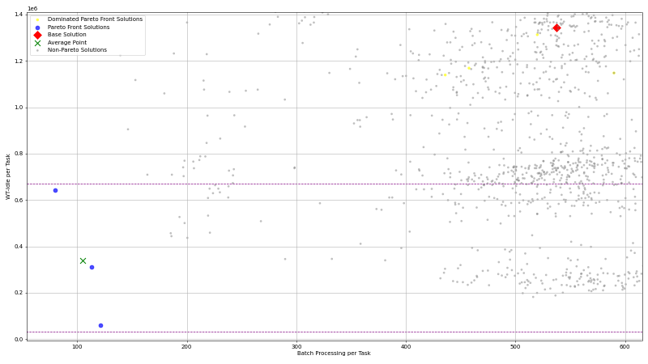</td>
<td>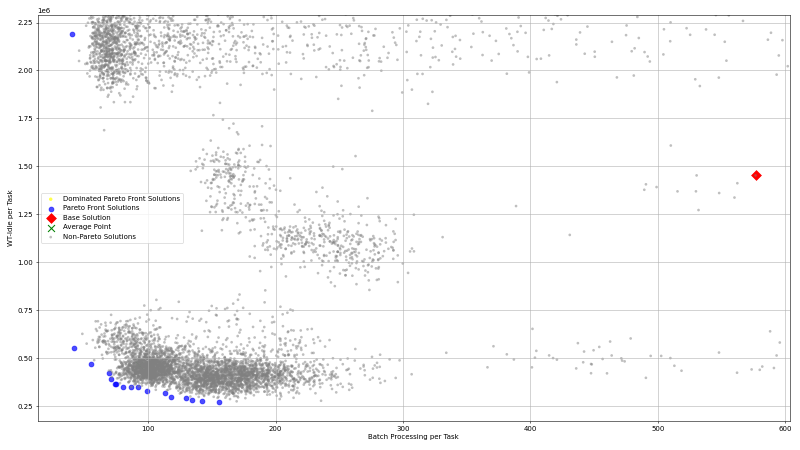</td>
<td>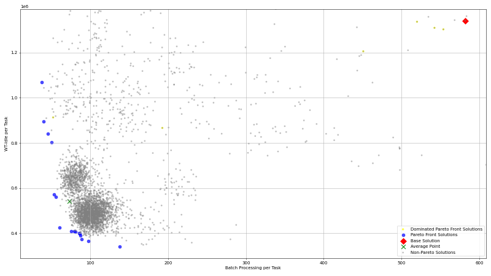</td>
<td>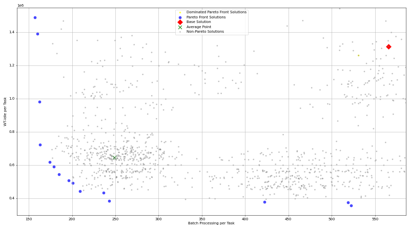</td>
</tr></table>

---

---

# Installation & Basic Usage

### Installation

1. Create a fresh Python 3.10 virtual environment, e.g. with `conda create --name optimos-python python=3.10`
1. Install `poetry` on your system by following the [offical guide](https://python-poetry.org/docs/#installation). Make sure, poetry is **NOT** installed in the virtual environment.
1. Activate the environment, e.g. with `conda activate optimos-python`
1. Run `poetry install` in the root directory of this repository

### Standalone Usage

_For now there is no CLI interface for the optimizer, so you have to modify the `main.py` script to your needs_

1. Open `main.py` in your editor
1. Change the `timetable_path`, `constraints_path` and `bpmn_path` to your needs.
   - _If you need a basic set of constraints for your model, you can use the `create_constraints.py` script_
1. Run `python main.py` to start the optimizer, you will see the output and process in the console
1. _If you want to change settings like the number of iterations you can do so in the `main.py` script as well_
1. **LEGACY OPTIMOS SUPPORT**: If you want optimos_v2 to behave like the old optimos, you can set the `optimos_legacy_mode` setting to True. This will disable all batching optimizations.

### Usage within PIX (docker)

1. Install Docker and Docker-Compose, refer to the [official website](https://docs.docker.com/get-docker/) for installation instructions
2. Clone the [pix-portal](https://github.com/AutomatedProcessImprovement/pix-portal) repository (`git clone https://github.com/AutomatedProcessImprovement/pix-portal.git`)
3. Checkout the `integrate-optimos-v2` branch (`git checkout integrate-optimos-v2`)
4. Create the following secrets:
   - `frontend/pix-web-ui/.session.secret`
   - `backend/services/api-server/.superuser_email.secret`
   - `backend/services/api-server/.system_email.secret`
   - `backend/services/api-server/.superuser_password.secret`
   - `backend/services/api-server/.key.secret`
   - `backend/services/api-server/.system_password.secret`
   - _For local development/testing you can just fill them with example values, e.g. "secret" or "secret@secret.secret"._
   - Furthermore create the following files: `backend/workers/mail/.secret_gmail_username` & `backend/workers/mail/.secret_gmail_app_password`;
     Those are the credentials for the gmail account that sends out mails. The Password is a [gmail app password](https://knowledge.workspace.google.com/kb/how-to-create-app-passwords-000009237), not the actual password. If you don't want to send out mails, you still need to create the files, but can enter any value.
5. Create the following `.env` files:
   - `backend/workers/mail/.env`
   - `backend/workers/kronos/.env`
   - `backend/workers/simulation-prosimos/.env`
   - `backend/workers/bps-discovery-simod/.env`
   - `backend/workers/optimos/.env`
   - `backend/services/api-server/.env`
   - `backend/services/kronos/.env`
   - _You will find a `.env.example` file in each of the folders, you can copy those file and rename them to `.env`_
6. Run `docker compose up --build` in the root directory of the pix-portal repository. You may add the `-d` flag to run it in detached mode, so you can close the terminal afterwards.
7. _This will take some time_
8. Open your browser and go to `localhost:9999`. You can use the credentials from the `.superuser_email.secret` and `.superuser_password.secret` files to login.

### Usage within PIX (local + debugging)

1. Do all of the **Usage within PIX (docker)** steps above
2. Stop the docker-based optimos: `docker compose stop optimos`
3. Modify the `backend/workers/optimos/.env` file to use the local host instead of the docker container, you can rename `.env.example-local` to `.env` for that
4. Create a new Python 3.10 virtual environment (e.g. with `conda create --name optimos-python python=3.10`)
5. Activate the environment, e.g. with `conda activate optimos-python`
6. Navigate to the `backend/workers/optimos` folder in the pix repo
7. Install the dependencies with `poetry install`
8. Start the optimos worker with `python python optimos_worker/main.py`
9. **Alteratively**: Start the optimos worker with the vs code debugger by running the `Launch Optimos Worker` configuration (most likely you'll need to adjust the python binary used there, you can do that in the `.vscode/launch.json` file)

## Development

### Updating the Optimos Version used by PIX

_If you have pushed commits to the master, this change needs to be picked up by PIX, to do that do the following:_

1. Navigate to the folder `backend/workers/optimos` in the pix project
1. Update the `poetry.lock` file: `poetry lock`
1. Rebuild & restart the optimos container: `docker compose up -d --build optimos`

### Running Tests

To run the tests, run `pytest`. The tests should also automatically show up in the test explorer of your IDE. (For VSCode, you need to install the [Python extension](https://marketplace.visualstudio.com/items?itemName=ms-python.python))

### Collecting Coverage

To collect coverage, run `pytest --cov --cov-report=lcov:lcov.info --cov-report=term`. You can display it e.g. with the vscode extension [Coverage Gutters](https://marketplace.visualstudio.com/items?itemName=ryanluker.vscode-coverage-gutters).

## Docs

While the code should be documented in most places, you can find additional information on e.g. the architecture in the [docs folder](./docs/)

## Improvements over Legacy Optimos

- **Support to optimize Batching**
- Fully Typed
- Unit Tested (with ~90% coverage)
- Follows a Action-Store-Reducer pattern, similar to Flux
- Multi-Threaded at important parts, takes cpu core count of host machine into account
- Almost all public interfaces are documented
- Class-Based (Not a huge monolithic script)
- No throwaway file creation; Everything in memory
- Immutable Data Structures, so no change to the timetable is ever unexpected
