# Optimos V2

The next generation of [Optimos](https://github.com/AutomatedProcessImprovement/roptimus-prime). A Resource, Roster and Batching optimizer using Prosimos simulator.

## Overview

This report includes data for the following **agents**, **models**, and **modes**. Click on a model to jump to its section.

### Agents

- Proximal Policy Optimization
- Proximal Policy Optimization Random
- Simulated Annealing
- Simulated Annealing Random
- Tabu Search
- Tabu Search Random

### Models

- [Bpi Challenge 2012](#bpi-challenge-2012)
- [Bpi Challenge 2017](#bpi-challenge-2017)
- [Bpic2019 Das](#bpic2019-das)
- [Callcentre](#callcentre)
- [Consulta Data Mining](#consulta-data-mining)
- [Gov](#gov)
- [Insurance](#insurance)
- [Production](#production)
- [Purchasing Example](#purchasing-example)
- [Sepsis Das](#sepsis-das)
- [Trafic Das](#trafic-das)

### Modes

- Easy
- Hard
- Mid

---

## Metrics Explanation

Below is an explanation of the metrics used in this report. Note that one simulation (or 'Solution') corresponds to one step on the x-axis.

<ul>
<li><strong>Pareto Front Size:</strong> Number of solutions in the current Pareto Front.</li>
<li><strong>Explored Solutions:</strong> Total number of solutions for which all neighbors have been explored.</li>
<li><strong>Potential New Base Solutions:</strong> Potential new base solution within a small error radius for Tabu Search or within the temperature radius for Simulated Annealing.</li>
<li><strong>Average Cycle Time:</strong> Average cycle time (from first enablement to the end of last activity) of all solutions in the current Pareto Front.</li>
<li><strong>Min Cycle Time:</strong> Minimum cycle time among all solutions in the current Pareto Front.</li>
<li><strong>Average Batch Size:</strong> Average number of tasks per batch (with a non batched task having a batch size of 1).</li>
<li><strong>Iteration Number:</strong> In one iteration, multiple mutations are performed. Depending on the agent, the solutions will be treated differently. Note that the number of solutions per iteration is not the same for all agents.</li>
<li><strong>Time per Step:</strong> Average wall time per simulation step computed from differences between consecutive steps.</li>
<li><strong>Total Optimization Time:</strong> Total wall clock time from the first to the last iteration (in minutes) </li>
</ul>

### Bpi Challenge 2012

#### Easy

##### Metric Plots

<table>
<tr><td><strong>Pareto Front Size</strong> </td><td><strong>Explored Solutions</strong> </td><td><strong>Potential New Base Solutions</strong> </td></tr>
<tr><td><strong>Average Cycle Time</strong> </td><td><strong>Min Cycle Time</strong> </td><td><strong>Average Batch Size</strong> </td></tr>
<tr><td><strong>Iteration Number</strong> 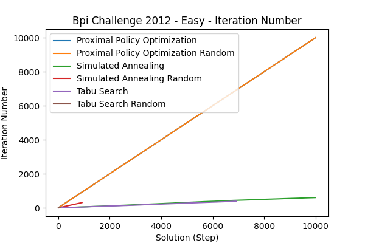</td><td><strong>Time per Step</strong> </td><td></td></tr>
</table>

##### Summary Table (Final Values)

| Agent                               | Steps | Explored Solutions | Potential New Base Solutions | Average Cycle Time | Min Cycle Time | Average Batch Size | Iteration Number | Time per Step | Total Optimization Time     |
| :---------------------------------- | ----: | -----------------: | ---------------------------: | -----------------: | -------------: | -----------------: | ---------------: | ------------: | :-------------------------- |
| Proximal Policy Optimization        |  9991 |               1020 |                              |        1.22262e+06 |     1.1635e+06 |            17.8497 |            10000 |       4.33396 | 549min (for 9991 Steps) |
| Proximal Policy Optimization Random |  9991 |               1347 |                              |        1.21544e+06 |    1.16689e+06 |            2.54891 |            10000 |       3.13432 | 383min (for 9991 Steps) |
| Simulated Annealing                 |  9993 |                454 |                           27 |        1.30261e+06 |    1.20913e+06 |            5.92322 |              602 |       3.59493 | 76min (for 9993 Steps)  |
| Simulated Annealing Random          |   915 |                459 |                            0 |         1.3469e+06 |    1.21027e+06 |            4.44316 |              307 |       1.45809 | 24min (for 915 Steps)   |
| Tabu Search                         |  6922 |                559 |                            0 |        1.23741e+06 |     1.2117e+06 |            5.03646 |              390 |       3.05839 | 43min (for 6922 Steps)  |
| Tabu Search Random                  |    60 |                 35 |                            0 |        1.27674e+06 |    1.21298e+06 |                  2 |               22 |       1.56687 | 1min (for 60 Steps)     |

##### Pareto Front Images

<table><tr>
<th>Tabu Search</th>
<th>Simulated Annealing</th>
<th>Proximal Policy Optimization</th>
<th>Proximal Policy Optimization Random</th>
<th>Tabu Search Random</th>
<th>Simulated Annealing Random</th>
</tr><tr>
<td></td>
<td></td>
<td></td>
<td></td>
<td></td>
<td></td>
</tr></table>

---

#### Hard

##### Metric Plots

<table>
<tr><td><strong>Pareto Front Size</strong> </td><td><strong>Explored Solutions</strong> </td><td><strong>Potential New Base Solutions</strong> 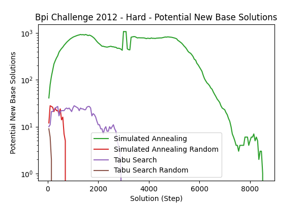</td></tr>
<tr><td><strong>Average Cycle Time</strong> </td><td><strong>Min Cycle Time</strong> </td><td><strong>Average Batch Size</strong> </td></tr>
<tr><td><strong>Iteration Number</strong> </td><td><strong>Time per Step</strong> </td><td></td></tr>
</table>

##### Summary Table (Final Values)

| Agent                               | Steps | Explored Solutions | Potential New Base Solutions | Average Cycle Time | Min Cycle Time | Average Batch Size | Iteration Number | Time per Step | Total Optimization Time     |
| :---------------------------------- | ----: | -----------------: | ---------------------------: | -----------------: | -------------: | -----------------: | ---------------: | ------------: | :-------------------------- |
| Proximal Policy Optimization        |  9991 |               1748 |                              |        7.74888e+06 |    1.17014e+06 |                  2 |            10000 |       2.76076 | 486min (for 9991 Steps) |
| Proximal Policy Optimization Random |  9991 |               1209 |                              |        4.82441e+06 |     1.1663e+06 |                  2 |            10000 |       5.43813 | 644min (for 9991 Steps) |
| Simulated Annealing                 |  8534 |                456 |                            0 |        1.41545e+06 |    1.21131e+06 |            5.39286 |              565 |      0.252189 | 91min (for 8534 Steps)  |
| Simulated Annealing Random          |   720 |                354 |                            0 |        1.58524e+06 |    1.21104e+06 |                  0 |              242 |       1.85308 | 20min (for 720 Steps)   |
| Tabu Search                         |  2933 |                297 |                            0 |        1.52894e+06 |    1.21731e+06 |            16.5698 |              168 |      0.572584 | 27min (for 2933 Steps)  |
| Tabu Search Random                  |   180 |                 65 |                            0 |         1.7864e+06 |    1.21133e+06 |                  0 |               62 |       1.41545 | 5min (for 180 Steps)    |

##### Pareto Front Images

<table><tr>
<th>Simulated Annealing Random</th>
<th>Simulated Annealing</th>
<th>Tabu Search</th>
<th>Tabu Search Random</th>
<th>Proximal Policy Optimization</th>
<th>Proximal Policy Optimization Random</th>
</tr><tr>
<td></td>
<td></td>
<td></td>
<td></td>
<td></td>
<td></td>
</tr></table>

---

#### Mid

##### Metric Plots

<table>
<tr><td><strong>Pareto Front Size</strong> </td><td><strong>Explored Solutions</strong> </td><td><strong>Potential New Base Solutions</strong> </td></tr>
<tr><td><strong>Average Cycle Time</strong> </td><td><strong>Min Cycle Time</strong> </td><td><strong>Average Batch Size</strong> </td></tr>
<tr><td><strong>Iteration Number</strong> </td><td><strong>Time per Step</strong> </td><td></td></tr>
</table>

##### Summary Table (Final Values)

| Agent                               | Steps | Explored Solutions | Potential New Base Solutions | Average Cycle Time | Min Cycle Time | Average Batch Size | Iteration Number | Time per Step | Total Optimization Time     |
| :---------------------------------- | ----: | -----------------: | ---------------------------: | -----------------: | -------------: | -----------------: | ---------------: | ------------: | :-------------------------- |
| Proximal Policy Optimization        |  9991 |               1754 |                              |        1.42909e+06 |       1.17e+06 |            5.55513 |            10000 |       2.50255 | 429min (for 9991 Steps) |
| Proximal Policy Optimization Random |  9991 |               1677 |                              |        1.46688e+06 |       1.17e+06 |            2.97665 |            10000 |       2.94587 | 471min (for 9991 Steps) |
| Simulated Annealing                 | 10006 |                696 |                            9 |        1.37587e+06 |    1.21377e+06 |                  2 |              642 |      0.275636 | 71min (for 10006 Steps) |
| Simulated Annealing Random          |   759 |                429 |                            0 |        1.39163e+06 |    1.21732e+06 |                  2 |              255 |        1.0461 | 18min (for 759 Steps)   |
| Tabu Search                         |  2496 |                146 |                            0 |        1.36132e+06 |    1.21358e+06 |            2.63385 |              133 |      0.264846 | 16min (for 2496 Steps)  |
| Tabu Search Random                  |   129 |                 50 |                            0 |        1.38085e+06 |    1.21129e+06 |            43.3714 |               45 |       1.22801 | 3min (for 129 Steps)    |

##### Pareto Front Images

<table><tr>
<th>Proximal Policy Optimization</th>
<th>Simulated Annealing</th>
<th>Tabu Search Random</th>
<th>Tabu Search</th>
<th>Simulated Annealing Random</th>
<th>Proximal Policy Optimization Random</th>
</tr><tr>
<td></td>
<td></td>
<td></td>
<td></td>
<td></td>
<td></td>
</tr></table>

---

---

### Bpi Challenge 2017

#### Easy

##### Metric Plots

<table>
<tr><td><strong>Pareto Front Size</strong> </td><td><strong>Explored Solutions</strong> </td><td><strong>Potential New Base Solutions</strong> </td></tr>
<tr><td><strong>Average Cycle Time</strong> 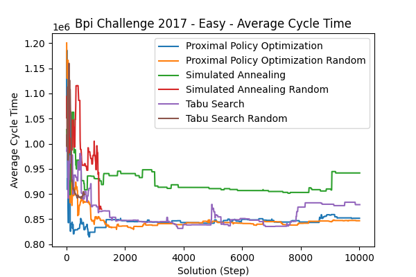</td><td><strong>Min Cycle Time</strong> </td><td><strong>Average Batch Size</strong> </td></tr>
<tr><td><strong>Iteration Number</strong> </td><td><strong>Time per Step</strong> </td><td></td></tr>
</table>

##### Summary Table (Final Values)

| Agent                               | Steps | Explored Solutions | Potential New Base Solutions | Average Cycle Time | Min Cycle Time | Average Batch Size | Iteration Number | Time per Step | Total Optimization Time      |
| :---------------------------------- | ----: | -----------------: | ---------------------------: | -----------------: | -------------: | -----------------: | ---------------: | ------------: | :--------------------------- |
| Proximal Policy Optimization        |  9991 |               2296 |                              |             851855 |         622342 |                  2 |            10000 |        4.0034 | 641min (for 9991 Steps)  |
| Proximal Policy Optimization Random |  9991 |               3480 |                              |             846913 |         773073 |            9.13759 |            10000 |       4.41904 | 579min (for 9991 Steps)  |
| Simulated Annealing                 |  9998 |               1495 |                          564 |             941853 |         847722 |                  2 |              655 |      0.717846 | 90min (for 9998 Steps)   |
| Simulated Annealing Random          |  1190 |                641 |                            0 |             869780 |         850046 |            2.01457 |              398 |        2.4041 | 44min (for 1190 Steps)   |
| Tabu Search                         | 10000 |               2778 |                          829 |             878877 |         696456 |            5.55401 |              548 |       1.09289 | 103min (for 10000 Steps) |
| Tabu Search Random                  |   620 |                285 |                            0 |             899299 |         851318 |            2.19473 |              208 |       2.49187 | 25min (for 620 Steps)    |

##### Pareto Front Images

<table><tr>
<th>Simulated Annealing</th>
<th>Proximal Policy Optimization</th>
<th>Tabu Search Random</th>
<th>Tabu Search</th>
<th>Simulated Annealing Random</th>
<th>Proximal Policy Optimization Random</th>
</tr><tr>
<td></td>
<td></td>
<td></td>
<td></td>
<td></td>
<td></td>
</tr></table>

---

#### Hard

##### Metric Plots

<table>
<tr><td><strong>Pareto Front Size</strong> </td><td><strong>Explored Solutions</strong> </td><td><strong>Potential New Base Solutions</strong> </td></tr>
<tr><td><strong>Average Cycle Time</strong> </td><td><strong>Min Cycle Time</strong> </td><td><strong>Average Batch Size</strong> </td></tr>
<tr><td><strong>Iteration Number</strong> </td><td><strong>Time per Step</strong> 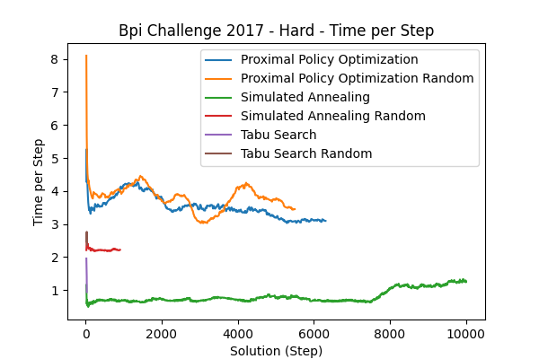</td><td></td></tr>
</table>

##### Summary Table (Final Values)

| Agent                               | Steps | Explored Solutions | Potential New Base Solutions | Average Cycle Time | Min Cycle Time | Average Batch Size | Iteration Number | Time per Step | Total Optimization Time     |
| :---------------------------------- | ----: | -----------------: | ---------------------------: | -----------------: | -------------: | -----------------: | ---------------: | ------------: | :-------------------------- |
| Proximal Policy Optimization        |  6299 |                734 |                              |         1.9778e+07 |         838174 |                  2 |             6309 |       2.62878 | 367min (for 6299 Steps) |
| Proximal Policy Optimization Random |  5489 |                649 |                              |        1.71763e+07 |         837243 |                  2 |             5499 |        3.2475 | 343min (for 5489 Steps) |
| Simulated Annealing                 |  9994 |               2069 |                          211 |             974249 |         845163 |                  2 |              698 |       1.04918 | 135min (for 9994 Steps) |
| Simulated Annealing Random          |   896 |                494 |                            0 |        1.04407e+06 |         851497 |                  2 |              300 |         2.024 | 32min (for 896 Steps)   |
| Tabu Search                         |    23 |                  5 |                            1 |             853221 |         852804 |                  0 |                4 |      0.012678 | 0min (for 23 Steps)     |
| Tabu Search Random                  |    26 |                 13 |                            0 |             884157 |         852467 |                  0 |               10 |        1.5919 | 1min (for 26 Steps)     |

##### Pareto Front Images

<table><tr>
<th>Proximal Policy Optimization</th>
<th>Proximal Policy Optimization Random</th>
<th>Tabu Search</th>
<th>Simulated Annealing Random</th>
<th>Tabu Search Random</th>
<th>Simulated Annealing</th>
</tr><tr>
<td></td>
<td></td>
<td></td>
<td></td>
<td></td>
<td></td>
</tr></table>

---

#### Mid

##### Metric Plots

<table>
<tr><td><strong>Pareto Front Size</strong> </td><td><strong>Explored Solutions</strong> </td><td><strong>Potential New Base Solutions</strong> </td></tr>
<tr><td><strong>Average Cycle Time</strong> 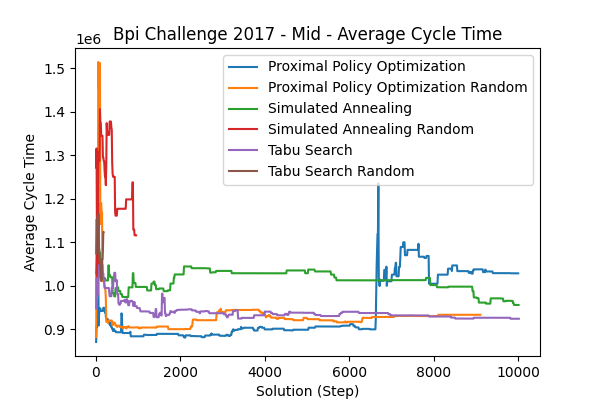</td><td><strong>Min Cycle Time</strong> </td><td><strong>Average Batch Size</strong> </td></tr>
<tr><td><strong>Iteration Number</strong> </td><td><strong>Time per Step</strong> </td><td></td></tr>
</table>

##### Summary Table (Final Values)

| Agent                               | Steps | Explored Solutions | Potential New Base Solutions | Average Cycle Time | Min Cycle Time | Average Batch Size | Iteration Number | Time per Step | Total Optimization Time      |
| :---------------------------------- | ----: | -----------------: | ---------------------------: | -----------------: | -------------: | -----------------: | ---------------: | ------------: | :--------------------------- |
| Proximal Policy Optimization        |  9991 |               1505 |                              |        1.02846e+06 |         825269 |                  2 |            10000 |       3.34574 | 518min (for 9991 Steps)  |
| Proximal Policy Optimization Random |  9095 |               1668 |                              |             933243 |         838151 |                  2 |             9105 |       3.33356 | 493min (for 9095 Steps)  |
| Simulated Annealing                 | 10000 |                835 |                          115 |             955819 |         846219 |                  0 |              684 |      0.568655 | 106min (for 10000 Steps) |
| Simulated Annealing Random          |   947 |                511 |                            0 |        1.11572e+06 |         850648 |                  2 |              317 |       2.13876 | 34min (for 947 Steps)    |
| Tabu Search                         | 10007 |               1426 |                          563 |             924136 |         846409 |            2.88612 |              599 |      0.756378 | 105min (for 10007 Steps) |
| Tabu Search Random                  |   173 |                 85 |                            0 |        1.12352e+06 |         852813 |             2.0259 |               59 |      0.090271 | 6min (for 173 Steps)     |

##### Pareto Front Images

<table><tr>
<th>Simulated Annealing Random</th>
<th>Tabu Search Random</th>
<th>Simulated Annealing</th>
<th>Tabu Search</th>
<th>Proximal Policy Optimization Random</th>
<th>Proximal Policy Optimization</th>
</tr><tr>
<td></td>
<td></td>
<td></td>
<td>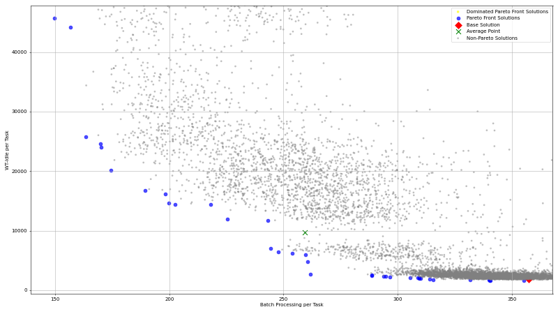</td>
<td></td>
<td></td>
</tr></table>

---

---

### Bpic2019 Das

#### Analyzer Overview

##### Pareto Size

| Agent / Reference | Easy  | Mid   | Hard  |
| ----------------- | ----- | ----- | ----- |
| Reference         | 22,00 | 23,00 | 12,00 |
| Reference Random  | 19,00 | 16,00 | 12,00 |
| Reference Optimos | 15,00 | 23,00 | 9,00  |
| SA                | 6,00  | 7,00  | 12,00 |
| Tabu Search       | 2,00  | 8,00  | 20,00 |
| PPO               | 19,00 | 23,00 | 3,00  |
| Tabu Random       | 1,00  | 1,00  | 5,00  |
| SA Random         | 8,00  | 9,00  | 2,00  |
| PPO Random        | 21,00 | 19,00 | 11,00 |

 

##### Hyperarea Ratio

| Agent / Reference | Easy | Mid  | Hard |
| ----------------- | ---- | ---- | ---- |
| Reference Random  | 1,00 | 1,00 | 1,00 |
| Reference Optimos | 1,00 | 1,00 | 1,00 |
| SA                | 0,98 | 0,96 | 1,00 |
| Tabu Search       | 0,99 | 0,97 | 1,00 |
| PPO               | 1,00 | 1,00 | 1,00 |
| Tabu Random       | 0,99 | 0,96 | 1,00 |
| SA Random         | 0,99 | 0,99 | 1,00 |
| PPO Random        | 1,00 | 1,00 | 1,00 |

 

##### Hausdorff

| Agent / Reference | Easy      | Mid        | Hard         |
| ----------------- | --------- | ---------- | ------------ |
| Reference Random  | 436,47    | 430.414,11 | 10.221,63    |
| Reference Optimos | 6.464,99  | 0,00       | 1.914.144,46 |
| SA                | 30.437,76 | 19.742,85  | 1.916.109,07 |
| Tabu Search       | 36.522,19 | 24.172,94  | 1.913.213,38 |
| PPO               | 7.252,59  | 0,00       | 1.912.100,68 |
| Tabu Random       | 36.850,45 | 22.667,19  | 1.913.565,79 |
| SA Random         | 20.186,07 | 545.936,82 | 1.916.106,86 |
| PPO Random        | 7.483,51  | 405.545,77 | 10.221,63    |

 

##### Delta

| Agent / Reference | Easy | Mid  | Hard |
| ----------------- | ---- | ---- | ---- |
| Reference Random  | 0,78 | 1,11 | 1,62 |
| Reference Optimos | 1,18 | 1,03 | 1,00 |
| SA                | 0,96 | 0,96 | 1,00 |
| Tabu Search       | 0,96 | 0,98 | 1,00 |
| PPO               | 1,07 | 1,03 | 1,00 |
| Tabu Random       | 0,00 | 0,00 | 1,00 |
| SA Random         | 1,08 | 1,33 | 1,00 |
| PPO Random        | 0,90 | 1,12 | 1,62 |

 

##### Purity

| Agent / Reference | Easy | Mid  | Hard |
| ----------------- | ---- | ---- | ---- |
| Reference Random  | 0,86 | 0,00 | 0,67 |
| Reference Optimos | 0,14 | 1,00 | 0,33 |
| SA                | 0,00 | 0,00 | 0,17 |
| Tabu Search       | 0,05 | 0,00 | 0,08 |
| PPO               | 0,09 | 1,00 | 0,33 |
| Tabu Random       | 0,05 | 0,00 | 0,17 |
| SA Random         | 0,14 | 0,00 | 0,08 |
| PPO Random        | 0,68 | 0,00 | 0,67 |

 

##### Avg Cycle Time

| Agent / Reference | Easy          | Mid            | Hard           |
| ----------------- | ------------- | -------------- | -------------- |
| Base              | 1.043.060,17  | 1.000.680,00   | 991.869,54     |
| Reference         | 13.254.654,93 | 8.620.197,31   | 657.315.714,08 |
| Reference Random  | 13.562.132,10 | 195.531.623,76 | 653.567.931,48 |
| Reference Optimos | 14.429.898,92 | 8.620.197,31   | 7.864.354,84   |
| SA                | 1.507.097,88  | 1.956.373,35   | 1.413.361,82   |
| Tabu Search       | 1.589.905,74  | 4.418.830,87   | 2.659.125,33   |
| PPO               | 11.638.988,73 | 8.620.197,31   | 15.876.716,15  |
| Tabu Random       | 1.746.895,25  | 2.076.818,41   | 1.044.893,23   |
| SA Random         | 2.499.499,15  | 199.021.926,37 | 4.707.934,03   |
| PPO Random        | 12.219.507,07 | 179.178.011,59 | 653.567.931,48 |

 

##### Best Cycle Time

| Agent / Reference | Easy         | Mid          | Hard         |
| ----------------- | ------------ | ------------ | ------------ |
| Base              | 1.043.060,17 | 1.000.680,00 | 991.869,54   |
| Reference         | 1.067.163,66 | 3.005.361,94 | 925.020,00   |
| Reference Random  | 1.067.163,66 | 2.048.507,77 | 925.020,00   |
| Reference Optimos | 1.371.193,29 | 3.005.361,94 | 1.000.620,00 |
| SA                | 1.063.109,41 | 1.544.374,98 | 925.020,00   |
| Tabu Search       | 1.371.193,29 | 3.042.646,84 | 925.020,00   |
| PPO               | 1.082.014,13 | 3.005.361,94 | 925.020,00   |
| Tabu Random       | 1.746.895,25 | 2.076.818,41 | 925.020,00   |
| SA Random         | 1.067.163,66 | 2.048.507,77 | 925.020,00   |
| PPO Random        | 1.690.399,18 | 2.151.928,20 | 925.020,00   |

 

#### Easy

##### Metric Plots

<table>
<tr><td><strong>Pareto Front Size</strong> </td><td><strong>Explored Solutions</strong> </td><td><strong>Potential New Base Solutions</strong> </td></tr>
<tr><td><strong>Average Cycle Time</strong> </td><td><strong>Min Cycle Time</strong> </td><td><strong>Average Batch Size</strong> </td></tr>
<tr><td><strong>Iteration Number</strong> </td><td><strong>Time per Step</strong> </td><td></td></tr>
</table>

##### Summary Table (Final Values)

| Agent                               | Steps | Explored Solutions | Potential New Base Solutions | Average Cycle Time | Min Cycle Time | Average Batch Size | Iteration Number | Time per Step | Total Optimization Time       |
| :---------------------------------- | ----: | -----------------: | ---------------------------: | -----------------: | -------------: | -----------------: | ---------------: | ------------: | :---------------------------- |
| Proximal Policy Optimization        |  2009 |                  2 |                              |         1.1639e+07 |    1.08201e+06 |            4.03617 |             2019 |        15.139 | 501min (for 2009 Steps)   |
| Proximal Policy Optimization Random |  4067 |                  2 |                              |        1.22195e+07 |     1.6904e+06 |            6.67055 |             4077 |        20.129 | 1,043min (for 4067 Steps) |
| Simulated Annealing                 |  9999 |                202 |                          938 |         1.5071e+06 |    1.06311e+06 |            2.78258 |              591 |       0.95725 | 419min (for 9999 Steps)   |
| Simulated Annealing Random          |  2633 |               1077 |                           20 |         2.4995e+06 |    1.06716e+06 |            3.92252 |              868 |       1.46477 | 454min (for 2633 Steps)   |
| Tabu Search                         |  3537 |                 38 |                         1255 |        1.58991e+06 |    1.37119e+06 |            3.50991 |              176 |       2.03933 | 137min (for 3537 Steps)   |
| Tabu Search Random                  |   473 |                153 |                            0 |         1.7469e+06 |     1.7469e+06 |            5.83961 |              155 |       2.20628 | 62min (for 473 Steps)     |

##### Pareto Front Images

<table><tr>
<th>Proximal Policy Optimization</th>
<th>Simulated Annealing</th>
<th>Simulated Annealing Random</th>
<th>Tabu Search</th>
<th>Tabu Search Random</th>
<th>Proximal Policy Optimization Random</th>
</tr><tr>
<td></td>
<td></td>
<td></td>
<td></td>
<td></td>
<td></td>
</tr></table>

---

#### Hard

##### Metric Plots

<table>
<tr><td><strong>Pareto Front Size</strong> </td><td><strong>Explored Solutions</strong> </td><td><strong>Potential New Base Solutions</strong> </td></tr>
<tr><td><strong>Average Cycle Time</strong> 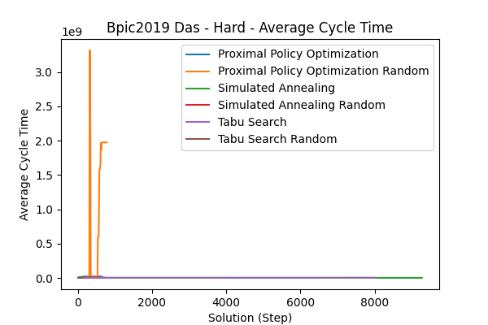</td><td><strong>Min Cycle Time</strong> </td><td><strong>Average Batch Size</strong> </td></tr>
<tr><td><strong>Iteration Number</strong> </td><td><strong>Time per Step</strong> </td><td></td></tr>
</table>

##### Summary Table (Final Values)

| Agent                               | Steps | Explored Solutions | Potential New Base Solutions | Average Cycle Time | Min Cycle Time | Average Batch Size | Iteration Number | Time per Step | Total Optimization Time      |
| :---------------------------------- | ----: | -----------------: | ---------------------------: | -----------------: | -------------: | -----------------: | ---------------: | ------------: | :--------------------------- |
| Proximal Policy Optimization        |   631 |                  8 |                              |        2.08606e+07 |    5.14389e+06 |            9.35763 |              640 |       111.327 | 773min (for 631 Steps)   |
| Proximal Policy Optimization Random |   771 |                  2 |                              |        1.97393e+09 |    3.22863e+06 |            9.58205 |              780 |       127.342 | 1,760min (for 771 Steps) |
| Simulated Annealing                 |  9270 |                193 |                         1695 |        2.19567e+06 |    1.00062e+06 |            3.10955 |              502 |      0.382867 | 358min (for 9270 Steps)  |
| Simulated Annealing Random          |   705 |                297 |                            0 |        6.59939e+06 |    3.35898e+06 |                  5 |              254 |       6.81138 | 314min (for 705 Steps)   |
| Tabu Search                         |  7986 |                161 |                         1055 |        3.98648e+06 |    1.42871e+06 |            3.54196 |              425 |       1.25507 | 333min (for 7986 Steps)  |
| Tabu Search Random                  |   128 |                 34 |                            0 |        2.48004e+06 |    1.00068e+06 |            3.72706 |               40 |       9.28795 | 25min (for 128 Steps)    |

##### Pareto Front Images

<table><tr>
<th>Simulated Annealing</th>
<th>Proximal Policy Optimization</th>
<th>Tabu Search</th>
<th>Simulated Annealing Random</th>
<th>Tabu Search Random</th>
</tr><tr>
<td></td>
<td></td>
<td></td>
<td>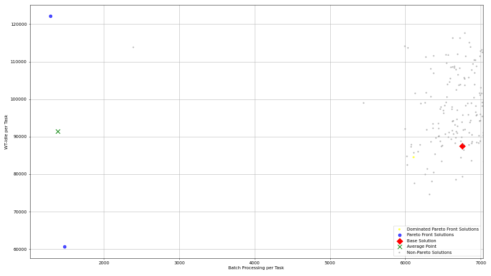</td>
<td></td>
</tr></table>

---

#### Mid

##### Metric Plots

<table>
<tr><td><strong>Pareto Front Size</strong> </td><td><strong>Explored Solutions</strong> </td><td><strong>Potential New Base Solutions</strong> </td></tr>
<tr><td><strong>Average Cycle Time</strong> </td><td><strong>Min Cycle Time</strong> </td><td><strong>Average Batch Size</strong> </td></tr>
<tr><td><strong>Iteration Number</strong> </td><td><strong>Time per Step</strong> 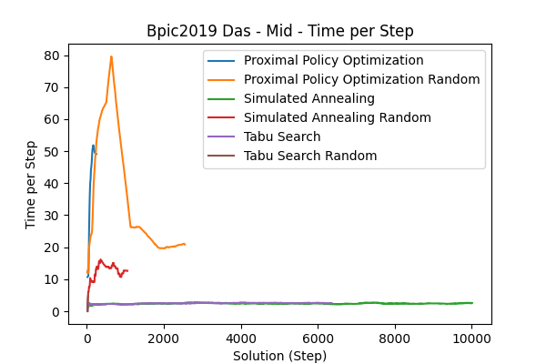</td><td></td></tr>
</table>

##### Summary Table (Final Values)

| Agent                               | Steps | Explored Solutions | Potential New Base Solutions | Average Cycle Time | Min Cycle Time | Average Batch Size | Iteration Number | Time per Step | Total Optimization Time       |
| :---------------------------------- | ----: | -----------------: | ---------------------------: | -----------------: | -------------: | -----------------: | ---------------: | ------------: | :---------------------------- |
| Proximal Policy Optimization        |   241 |                  1 |                              |        2.89777e+08 |    3.21102e+06 |            8.79699 |              250 |       44.0296 | 196min (for 241 Steps)    |
| Proximal Policy Optimization Random |  2541 |                  1 |                              |        1.79178e+08 |    2.15193e+06 |            5.65822 |             2550 |       20.6542 | 1,436min (for 2541 Steps) |
| Simulated Annealing                 | 10001 |                200 |                         2726 |        1.95637e+06 |    1.54438e+06 |            2.70882 |              593 |      0.388852 | 401min (for 10001 Steps)  |
| Simulated Annealing Random          |  1049 |                423 |                            0 |        1.77198e+08 |    2.04851e+06 |             4.1509 |              347 |       5.50982 | 225min (for 1049 Steps)   |
| Tabu Search                         |  6357 |                 96 |                          280 |        4.26219e+06 |    3.04265e+06 |            3.03069 |              346 |       1.85831 | 262min (for 6357 Steps)   |
| Tabu Search Random                  |    29 |                  5 |                            0 |        2.07682e+06 |    2.07682e+06 |            2.96169 |                7 |       7.34266 | 2min (for 29 Steps)       |

##### Pareto Front Images

<table><tr>
<th>Proximal Policy Optimization Random</th>
<th>Simulated Annealing Random</th>
<th>Tabu Search</th>
<th>Simulated Annealing</th>
<th>Tabu Search Random</th>
</tr><tr>
<td></td>
<td></td>
<td></td>
<td></td>
<td></td>
</tr></table>

---

---

### Callcentre

#### Easy

##### Metric Plots

<table>
<tr><td><strong>Pareto Front Size</strong> </td><td><strong>Explored Solutions</strong> </td><td><strong>Potential New Base Solutions</strong> </td></tr>
<tr><td><strong>Average Cycle Time</strong> </td><td><strong>Min Cycle Time</strong> </td><td><strong>Average Batch Size</strong> </td></tr>
<tr><td><strong>Iteration Number</strong> </td><td><strong>Time per Step</strong> </td><td></td></tr>
</table>

##### Summary Table (Final Values)

| Agent                               | Steps | Explored Solutions | Potential New Base Solutions | Average Cycle Time | Min Cycle Time | Average Batch Size | Iteration Number | Time per Step | Total Optimization Time     |
| :---------------------------------- | ----: | -----------------: | ---------------------------: | -----------------: | -------------: | -----------------: | ---------------: | ------------: | :-------------------------- |
| Proximal Policy Optimization        |  6600 |                405 |                              |            73793.5 |        1881.05 |            25.3167 |             6610 |       3.35217 | 361min (for 6600 Steps) |
| Proximal Policy Optimization Random |  5241 |                326 |                              |            12413.4 |        1951.83 |            4.70833 |             5250 |       9.54398 | 717min (for 5241 Steps) |
| Simulated Annealing                 | 10002 |                360 |                         1088 |         1.7386e+06 |     1.3876e+06 |            2.54301 |              664 |      0.907438 | 82min (for 10002 Steps) |
| Simulated Annealing Random          |  2600 |               1314 |                          542 |         1.5341e+07 |         191679 |            3.18854 |              868 |         2.347 | 104min (for 2600 Steps) |
| Tabu Search                         |   305 |                  4 |                            0 |        1.52795e+06 |    1.52795e+06 |            2.27386 |               21 |       1.54933 | 2min (for 305 Steps)    |
| Tabu Search Random                  |  2600 |               1536 |                          356 |        1.19836e+06 |    1.06623e+06 |            2.60242 |              868 |       1.45499 | 88min (for 2600 Steps)  |

##### Pareto Front Images

<table><tr>
<th>Proximal Policy Optimization Random</th>
<th>Simulated Annealing</th>
<th>Proximal Policy Optimization</th>
<th>Simulated Annealing Random</th>
<th>Tabu Search</th>
<th>Tabu Search Random</th>
</tr><tr>
<td></td>
<td></td>
<td></td>
<td></td>
<td></td>
<td></td>
</tr></table>

---

#### Hard

##### Metric Plots

<table>
<tr><td><strong>Pareto Front Size</strong> </td><td><strong>Explored Solutions</strong> </td><td><strong>Potential New Base Solutions</strong> </td></tr>
<tr><td><strong>Average Cycle Time</strong> </td><td><strong>Min Cycle Time</strong> </td><td><strong>Average Batch Size</strong> </td></tr>
<tr><td><strong>Iteration Number</strong> </td><td><strong>Time per Step</strong> </td><td></td></tr>
</table>

##### Summary Table (Final Values)

| Agent                               | Steps | Explored Solutions | Potential New Base Solutions | Average Cycle Time | Min Cycle Time | Average Batch Size | Iteration Number | Time per Step | Total Optimization Time     |
| :---------------------------------- | ----: | -----------------: | ---------------------------: | -----------------: | -------------: | -----------------: | ---------------: | ------------: | :-------------------------- |
| Proximal Policy Optimization        |  3511 |                349 |                              |            45649.9 |        4417.33 |            26.3333 |             3520 |        17.117 | 716min (for 3511 Steps) |
| Proximal Policy Optimization Random |  4347 |                590 |                              |            15676.6 |        4562.45 |            26.1556 |             4357 |       14.0817 | 601min (for 4347 Steps) |
| Simulated Annealing                 |  7152 |                311 |                            0 |        1.02421e+07 |    9.80554e+06 |            5.39037 |              468 |      0.367432 | 45min (for 7152 Steps)  |
| Simulated Annealing Random          |  2600 |               1339 |                          655 |             172392 |        4876.96 |            7.15138 |              868 |       3.11103 | 107min (for 2600 Steps) |
| Tabu Search                         |   103 |                  4 |                            0 |        1.02259e+07 |    1.02259e+07 |            3.53407 |                9 |       2.63266 | 0min (for 103 Steps)    |
| Tabu Search Random                  |    47 |                 16 |                            0 |        1.98113e+07 |    1.10522e+07 |            3.45809 |               18 |       2.05723 | 1min (for 47 Steps)     |

##### Pareto Front Images

<table><tr>
<th>Simulated Annealing</th>
<th>Simulated Annealing Random</th>
<th>Tabu Search Random</th>
<th>Proximal Policy Optimization Random</th>
<th>Tabu Search</th>
<th>Proximal Policy Optimization</th>
</tr><tr>
<td></td>
<td></td>
<td></td>
<td></td>
<td></td>
<td></td>
</tr></table>

---

#### Mid

##### Metric Plots

<table>
<tr><td><strong>Pareto Front Size</strong> </td><td><strong>Explored Solutions</strong> </td><td><strong>Potential New Base Solutions</strong> </td></tr>
<tr><td><strong>Average Cycle Time</strong> </td><td><strong>Min Cycle Time</strong> </td><td><strong>Average Batch Size</strong> </td></tr>
<tr><td><strong>Iteration Number</strong> </td><td><strong>Time per Step</strong> </td><td></td></tr>
</table>

##### Summary Table (Final Values)

| Agent                               | Steps | Explored Solutions | Potential New Base Solutions | Average Cycle Time | Min Cycle Time | Average Batch Size | Iteration Number | Time per Step | Total Optimization Time     |
| :---------------------------------- | ----: | -----------------: | ---------------------------: | -----------------: | -------------: | -----------------: | ---------------: | ------------: | :-------------------------- |
| Proximal Policy Optimization        |  2106 |                 84 |                              |            6096.85 |        5758.89 |            2.72419 |             2116 |       3.47716 | 140min (for 2106 Steps) |
| Proximal Policy Optimization Random |  8994 |                494 |                              |            80850.5 |        34311.6 |            8.81466 |             9004 |       4.83608 | 699min (for 8994 Steps) |
| Simulated Annealing                 | 10011 |                389 |                           52 |        7.95649e+06 |    7.09316e+06 |            2.88614 |              668 |   0.000984311 | 78min (for 10011 Steps) |
| Simulated Annealing Random          |  2600 |               1290 |                          671 |             191474 |        4281.56 |            10.7397 |              868 |       2.08443 | 98min (for 2600 Steps)  |
| Tabu Search                         |  3393 |                129 |                          323 |         9.4731e+06 |    8.71964e+06 |            3.07424 |              221 |      0.338917 | 31min (for 3393 Steps)  |
| Tabu Search Random                  |    35 |                 11 |                            0 |        9.01121e+06 |    8.77325e+06 |            2.24764 |               14 |       1.19283 | 1min (for 35 Steps)     |

##### Pareto Front Images

<table><tr>
<th>Tabu Search</th>
<th>Tabu Search Random</th>
<th>Proximal Policy Optimization Random</th>
<th>Simulated Annealing Random</th>
<th>Simulated Annealing</th>
<th>Proximal Policy Optimization</th>
</tr><tr>
<td></td>
<td></td>
<td></td>
<td></td>
<td></td>
<td></td>
</tr></table>

---

---

### Consulta Data Mining

#### Easy

##### Metric Plots

<table>
<tr><td><strong>Pareto Front Size</strong> </td><td><strong>Explored Solutions</strong> </td><td><strong>Potential New Base Solutions</strong> </td></tr>
<tr><td><strong>Average Cycle Time</strong> </td><td><strong>Min Cycle Time</strong> </td><td><strong>Average Batch Size</strong> </td></tr>
<tr><td><strong>Iteration Number</strong> </td><td><strong>Time per Step</strong> </td><td></td></tr>
</table>

##### Summary Table (Final Values)

| Agent                               | Steps | Explored Solutions | Potential New Base Solutions | Average Cycle Time | Min Cycle Time | Average Batch Size | Iteration Number | Time per Step | Total Optimization Time      |
| :---------------------------------- | ----: | -----------------: | ---------------------------: | -----------------: | -------------: | -----------------: | ---------------: | ------------: | :--------------------------- |
| Proximal Policy Optimization        |  6611 |               1806 |                              |        1.15599e+07 |    1.05594e+07 |            2.38727 |             6620 |       5.96561 | 717min (for 6611 Steps)  |
| Proximal Policy Optimization Random |  6951 |               1536 |                              |        1.16295e+07 |    1.07297e+07 |            2.25017 |             6960 |       6.38168 | 718min (for 6951 Steps)  |
| Simulated Annealing                 | 10012 |                897 |                         2623 |        1.15301e+07 |    1.08998e+07 |            2.65326 |              505 |       1.82837 | 112min (for 10012 Steps) |
| Simulated Annealing Random          |  1976 |                953 |                            0 |        1.15087e+07 |     1.0908e+07 |            2.86636 |              656 |       2.43394 | 92min (for 1976 Steps)   |
| Tabu Search                         | 10009 |               3770 |                         1811 |        1.14301e+07 |    1.06536e+07 |             3.1152 |              497 |        1.9764 | 135min (for 10009 Steps) |
| Tabu Search Random                  |   611 |                292 |                            0 |        1.19551e+07 |    1.10942e+07 |            2.72866 |              200 |       2.85947 | 30min (for 611 Steps)    |

##### Pareto Front Images

<table><tr>
<th>Tabu Search</th>
<th>Simulated Annealing</th>
<th>Simulated Annealing Random</th>
<th>Tabu Search Random</th>
<th>Proximal Policy Optimization</th>
<th>Proximal Policy Optimization Random</th>
</tr><tr>
<td></td>
<td></td>
<td></td>
<td></td>
<td></td>
<td></td>
</tr></table>

---

#### Hard

##### Metric Plots

<table>
<tr><td><strong>Pareto Front Size</strong> </td><td><strong>Explored Solutions</strong> </td><td><strong>Potential New Base Solutions</strong> </td></tr>
<tr><td><strong>Average Cycle Time</strong> </td><td><strong>Min Cycle Time</strong> </td><td><strong>Average Batch Size</strong> </td></tr>
<tr><td><strong>Iteration Number</strong> </td><td><strong>Time per Step</strong> </td><td></td></tr>
</table>

##### Summary Table (Final Values)

| Agent                               | Steps | Explored Solutions | Potential New Base Solutions | Average Cycle Time | Min Cycle Time | Average Batch Size | Iteration Number | Time per Step | Total Optimization Time      |
| :---------------------------------- | ----: | -----------------: | ---------------------------: | -----------------: | -------------: | -----------------: | ---------------: | ------------: | :--------------------------- |
| Proximal Policy Optimization        |  8191 |               1536 |                              |        1.25242e+07 |    1.12337e+07 |            4.74331 |             8200 |        5.6872 | 718min (for 8191 Steps)  |
| Proximal Policy Optimization Random |  9831 |                595 |                              |        1.18351e+07 |    1.08675e+07 |            3.41973 |             9840 |       3.92619 | 717min (for 9831 Steps)  |
| Simulated Annealing                 | 10011 |               1039 |                           61 |        1.13937e+07 |    1.11507e+07 |            3.20584 |              536 |     0.0011173 | 142min (for 10011 Steps) |
| Simulated Annealing Random          |  1084 |                480 |                            0 |        1.18439e+07 |    1.13304e+07 |            4.63462 |              357 |       2.51622 | 47min (for 1084 Steps)   |
| Tabu Search                         |  3893 |                156 |                          407 |        1.53945e+07 |    1.09086e+07 |            4.27273 |              210 |      0.696202 | 47min (for 3893 Steps)   |
| Tabu Search Random                  |    83 |                 26 |                            0 |        1.19013e+07 |    1.12509e+07 |            2.58917 |               25 |     0.0934325 | 3min (for 83 Steps)      |

##### Pareto Front Images

<table><tr>
<th>Simulated Annealing Random</th>
<th>Proximal Policy Optimization</th>
<th>Tabu Search</th>
<th>Proximal Policy Optimization Random</th>
<th>Simulated Annealing</th>
<th>Tabu Search Random</th>
</tr><tr>
<td></td>
<td></td>
<td></td>
<td></td>
<td></td>
<td></td>
</tr></table>

---

#### Mid

##### Metric Plots

<table>
<tr><td><strong>Pareto Front Size</strong> </td><td><strong>Explored Solutions</strong> </td><td><strong>Potential New Base Solutions</strong> </td></tr>
<tr><td><strong>Average Cycle Time</strong> </td><td><strong>Min Cycle Time</strong> </td><td><strong>Average Batch Size</strong> </td></tr>
<tr><td><strong>Iteration Number</strong> </td><td><strong>Time per Step</strong> </td><td></td></tr>
</table>

##### Summary Table (Final Values)

| Agent                               | Steps | Explored Solutions | Potential New Base Solutions | Average Cycle Time | Min Cycle Time | Average Batch Size | Iteration Number | Time per Step | Total Optimization Time     |
| :---------------------------------- | ----: | -----------------: | ---------------------------: | -----------------: | -------------: | -----------------: | ---------------: | ------------: | :-------------------------- |
| Proximal Policy Optimization        |  8401 |               2371 |                              |        1.18794e+07 |    1.12483e+07 |            4.20479 |             8410 |       4.76213 | 717min (for 8401 Steps) |
| Proximal Policy Optimization Random |  8621 |               2491 |                              |        1.15323e+07 |    1.08673e+07 |             2.2739 |             8630 |        5.6891 | 717min (for 8621 Steps) |
| Simulated Annealing                 |  9993 |               1028 |                         1435 |        1.17937e+07 |    1.13394e+07 |            3.71206 |              538 |       1.57184 | 121min (for 9993 Steps) |
| Simulated Annealing Random          |  1433 |                755 |                            0 |        1.14658e+07 |    1.10758e+07 |            3.30315 |              475 |      0.267463 | 63min (for 1433 Steps)  |
| Tabu Search                         |  9994 |               1443 |                         1374 |        1.14417e+07 |    1.09137e+07 |            2.24465 |              508 |       3.14961 | 115min (for 9994 Steps) |
| Tabu Search Random                  |    95 |                 29 |                            0 |        1.16251e+07 |    1.12549e+07 |            3.58079 |               29 |       1.82635 | 3min (for 95 Steps)     |

##### Pareto Front Images

<table><tr>
<th>Proximal Policy Optimization Random</th>
<th>Tabu Search</th>
<th>Tabu Search Random</th>
<th>Simulated Annealing</th>
<th>Simulated Annealing Random</th>
<th>Proximal Policy Optimization</th>
</tr><tr>
<td></td>
<td></td>
<td></td>
<td></td>
<td></td>
<td></td>
</tr></table>

---

---

### Gov

#### Easy

##### Metric Plots

<table>
<tr><td><strong>Pareto Front Size</strong> </td><td><strong>Explored Solutions</strong> </td><td><strong>Potential New Base Solutions</strong> </td></tr>
<tr><td><strong>Average Cycle Time</strong> </td><td><strong>Min Cycle Time</strong> </td><td><strong>Average Batch Size</strong> </td></tr>
<tr><td><strong>Iteration Number</strong> </td><td><strong>Time per Step</strong> </td><td></td></tr>
</table>

##### Summary Table (Final Values)

| Agent                               | Steps | Explored Solutions | Potential New Base Solutions | Average Cycle Time | Min Cycle Time | Average Batch Size | Iteration Number | Time per Step | Total Optimization Time       |
| :---------------------------------- | ----: | -----------------: | ---------------------------: | -----------------: | -------------: | -----------------: | ---------------: | ------------: | :---------------------------- |
| Proximal Policy Optimization        |  2951 |               1513 |                              |        2.29747e+07 |    1.65511e+07 |            3.71509 |             2960 |       27.4838 | 1,431min (for 2951 Steps) |
| Proximal Policy Optimization Random |    40 |               1292 |                              |        1.97086e+07 |    1.66394e+07 |            3.69476 |             2141 |       6664.29 | 1,016min (for 40 Steps)   |
| Simulated Annealing                 |  9996 |                380 |                         5397 |        1.98933e+07 |    1.57884e+07 |            2.13291 |              436 |       1.81164 | 513min (for 9996 Steps)   |
| Simulated Annealing Random          |   680 |                283 |                            0 |        1.77299e+07 |    1.48118e+07 |            2.02718 |              224 |       16.4456 | 178min (for 680 Steps)    |
| Tabu Search                         |  2105 |                279 |                            0 |        1.96246e+07 |    1.66557e+07 |            2.11111 |              107 |       1.12742 | 89min (for 2105 Steps)    |
| Tabu Search Random                  |    35 |                  9 |                            0 |        1.63184e+07 |    1.44806e+07 |            2.11628 |                9 |       13.3734 | 4min (for 35 Steps)       |

##### Pareto Front Images

<table><tr>
<th>Simulated Annealing Random</th>
<th>Proximal Policy Optimization</th>
<th>Proximal Policy Optimization Random</th>
<th>Simulated Annealing</th>
<th>Tabu Search</th>
<th>Tabu Search Random</th>
</tr><tr>
<td></td>
<td></td>
<td></td>
<td></td>
<td></td>
<td></td>
</tr></table>

---

#### Hard

##### Metric Plots

<table>
<tr><td><strong>Pareto Front Size</strong> 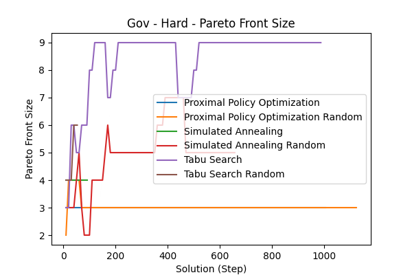</td><td><strong>Explored Solutions</strong> </td><td><strong>Potential New Base Solutions</strong> </td></tr>
<tr><td><strong>Average Cycle Time</strong> </td><td><strong>Min Cycle Time</strong> </td><td><strong>Average Batch Size</strong> 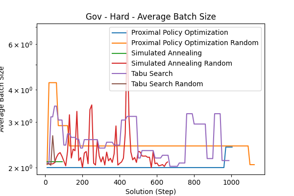</td></tr>
<tr><td><strong>Iteration Number</strong> </td><td><strong>Time per Step</strong> 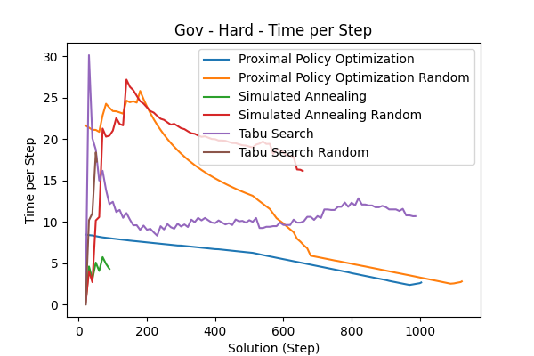</td><td></td></tr>
</table>

##### Summary Table (Final Values)

| Agent                               | Steps | Explored Solutions | Potential New Base Solutions | Average Cycle Time | Min Cycle Time | Average Batch Size | Iteration Number | Time per Step | Total Optimization Time     |
| :---------------------------------- | ----: | -----------------: | ---------------------------: | -----------------: | -------------: | -----------------: | ---------------: | ------------: | :-------------------------- |
| Proximal Policy Optimization        |   995 |               1002 |                              |        1.70208e+07 |    1.58872e+07 |                2.4 |             1005 |       8.21465 | 73min (for 995 Steps)   |
| Proximal Policy Optimization Random |  1114 |                955 |                              |        2.02035e+07 |    1.72073e+07 |            2.05263 |             1124 |       8.24061 | 141min (for 1114 Steps) |
| Simulated Annealing                 |    81 |                  2 |                           57 |         2.2491e+07 |    1.57653e+07 |            2.10574 |                4 |      0.001033 | 5min (for 81 Steps)     |
| Simulated Annealing Random          |   648 |                260 |                            0 |        1.68972e+07 |     1.4582e+07 |            2.10256 |              208 |        12.569 | 198min (for 648 Steps)  |
| Tabu Search                         |   978 |                 21 |                            0 |         1.8935e+07 |    1.49147e+07 |            2.12903 |               47 |      0.361706 | 167min (for 978 Steps)  |
| Tabu Search Random                  |    44 |                 10 |                            0 |        1.86589e+07 |    1.57566e+07 |            2.09605 |               12 |       12.8511 | 12min (for 44 Steps)    |

##### Pareto Front Images

<table><tr>
<th>Simulated Annealing Random</th>
<th>Tabu Search</th>
<th>Proximal Policy Optimization</th>
<th>Tabu Search Random</th>
<th>Proximal Policy Optimization Random</th>
</tr><tr>
<td></td>
<td></td>
<td></td>
<td></td>
<td></td>
</tr></table>

---

#### Mid

##### Metric Plots

<table>
<tr><td><strong>Pareto Front Size</strong> </td><td><strong>Explored Solutions</strong> </td><td><strong>Potential New Base Solutions</strong> </td></tr>
<tr><td><strong>Average Cycle Time</strong> </td><td><strong>Min Cycle Time</strong> </td><td><strong>Average Batch Size</strong> </td></tr>
<tr><td><strong>Iteration Number</strong> </td><td><strong>Time per Step</strong> </td><td></td></tr>
</table>

##### Summary Table (Final Values)

| Agent                               | Steps | Explored Solutions | Potential New Base Solutions | Average Cycle Time | Min Cycle Time | Average Batch Size | Iteration Number | Time per Step | Total Optimization Time       |
| :---------------------------------- | ----: | -----------------: | ---------------------------: | -----------------: | -------------: | -----------------: | ---------------: | ------------: | :---------------------------- |
| Proximal Policy Optimization        |  1731 |                311 |                              |        5.06741e+07 |    1.63572e+07 |            4.92711 |             1740 |       57.1054 | 1,424min (for 1731 Steps) |
| Proximal Policy Optimization Random |    31 |                  2 |                              |        2.06983e+07 |    1.87449e+07 |            2.46479 |               40 |       28.9958 | 14min (for 31 Steps)      |
| Simulated Annealing                 |  9996 |                261 |                         5965 |        2.84575e+07 |    1.37349e+07 |            4.65205 |              436 |       1.25878 | 736min (for 9996 Steps)   |
| Simulated Annealing Random          |   760 |                329 |                            0 |        2.25602e+07 |    1.55232e+07 |            2.03125 |              245 |       13.5362 | 220min (for 760 Steps)    |
| Tabu Search                         |  5119 |                251 |                            0 |        1.33973e+07 |    1.05218e+07 |            2.53326 |              263 |       5.93512 | 297min (for 5119 Steps)   |
| Tabu Search Random                  |   125 |                 35 |                            0 |        3.18784e+07 |    1.67235e+07 |             2.0061 |               39 |       10.9127 | 35min (for 125 Steps)     |

##### Pareto Front Images

<table><tr>
<th>Simulated Annealing</th>
<th>Tabu Search</th>
<th>Tabu Search Random</th>
<th>Simulated Annealing Random</th>
</tr><tr>
<td></td>
<td></td>
<td></td>
<td></td>
</tr></table>

---

---

### Insurance

#### Easy

##### Metric Plots

<table>
<tr><td><strong>Pareto Front Size</strong> </td><td><strong>Explored Solutions</strong> </td><td><strong>Potential New Base Solutions</strong> </td></tr>
<tr><td><strong>Average Cycle Time</strong> </td><td><strong>Min Cycle Time</strong> </td><td><strong>Average Batch Size</strong> </td></tr>
<tr><td><strong>Iteration Number</strong> </td><td><strong>Time per Step</strong> </td><td></td></tr>
</table>

##### Summary Table (Final Values)

| Agent                               | Steps | Explored Solutions | Potential New Base Solutions | Average Cycle Time | Min Cycle Time | Average Batch Size | Iteration Number | Time per Step | Total Optimization Time     |
| :---------------------------------- | ----: | -----------------: | ---------------------------: | -----------------: | -------------: | -----------------: | ---------------: | ------------: | :-------------------------- |
| Proximal Policy Optimization        |  7031 |               2074 |                              |        2.18687e+07 |    2.07091e+07 |             2.2981 |             7040 |       5.88667 | 718min (for 7031 Steps) |
| Proximal Policy Optimization Random |  6371 |                576 |                              |        2.18484e+07 |    2.11148e+07 |             2.0819 |             6380 |       7.42354 | 718min (for 6371 Steps) |
| Simulated Annealing                 |  9996 |                331 |                          531 |        2.20013e+07 |    2.09449e+07 |                  2 |              675 |       1.37837 | 147min (for 9996 Steps) |
| Simulated Annealing Random          |  1592 |                609 |                            0 |        2.26663e+07 |    2.12654e+07 |            5.37885 |              532 |       2.87519 | 99min (for 1592 Steps)  |
| Tabu Search                         |  9992 |                261 |                          539 |        2.19604e+07 |    2.10721e+07 |                  2 |              582 |       25.6315 | 159min (for 9992 Steps) |
| Tabu Search Random                  |   266 |                 96 |                            0 |        2.20979e+07 |    2.15495e+07 |                  2 |               90 |       2.74988 | 16min (for 266 Steps)   |

##### Pareto Front Images

<table><tr>
<th>Proximal Policy Optimization Random</th>
<th>Simulated Annealing Random</th>
<th>Proximal Policy Optimization</th>
<th>Simulated Annealing</th>
<th>Tabu Search Random</th>
<th>Tabu Search</th>
</tr><tr>
<td></td>
<td></td>
<td></td>
<td></td>
<td></td>
<td></td>
</tr></table>

---

#### Hard

##### Metric Plots

<table>
<tr><td><strong>Pareto Front Size</strong> </td><td><strong>Explored Solutions</strong> </td><td><strong>Potential New Base Solutions</strong> </td></tr>
<tr><td><strong>Average Cycle Time</strong> </td><td><strong>Min Cycle Time</strong> </td><td><strong>Average Batch Size</strong> </td></tr>
<tr><td><strong>Iteration Number</strong> </td><td><strong>Time per Step</strong> </td><td></td></tr>
</table>

##### Summary Table (Final Values)

| Agent                               | Steps | Explored Solutions | Potential New Base Solutions | Average Cycle Time | Min Cycle Time | Average Batch Size | Iteration Number | Time per Step | Total Optimization Time      |
| :---------------------------------- | ----: | -----------------: | ---------------------------: | -----------------: | -------------: | -----------------: | ---------------: | ------------: | :--------------------------- |
| Proximal Policy Optimization        |  3259 |                388 |                              |        2.23003e+07 |    2.15172e+07 |                  2 |             3269 |       6.66236 | 287min (for 3259 Steps)  |
| Proximal Policy Optimization Random |  7361 |                650 |                              |        2.22657e+07 |    2.18403e+07 |                  2 |             7370 |       6.16649 | 718min (for 7361 Steps)  |
| Simulated Annealing                 | 10008 |                385 |                           33 |         2.1984e+07 |    2.12211e+07 |                  2 |              693 |     0.0935161 | 162min (for 10008 Steps) |
| Simulated Annealing Random          |   704 |                355 |                            0 |        2.21125e+07 |     2.1791e+07 |            2.99432 |              236 |       3.75098 | 44min (for 704 Steps)    |
| Tabu Search                         |  3862 |                117 |                         1117 |        2.21161e+07 |    2.17764e+07 |                  2 |              257 |       0.96359 | 60min (for 3862 Steps)   |
| Tabu Search Random                  |     8 |                  2 |                            0 |         2.2355e+07 |    2.20561e+07 |                  0 |                4 |       3.28029 | 0min (for 8 Steps)       |

##### Pareto Front Images

<table><tr>
<th>Proximal Policy Optimization</th>
<th>Tabu Search Random</th>
<th>Proximal Policy Optimization Random</th>
<th>Simulated Annealing</th>
<th>Simulated Annealing Random</th>
<th>Tabu Search</th>
</tr><tr>
<td></td>
<td></td>
<td></td>
<td></td>
<td></td>
<td></td>
</tr></table>

---

#### Mid

##### Metric Plots

<table>
<tr><td><strong>Pareto Front Size</strong> </td><td><strong>Explored Solutions</strong> </td><td><strong>Potential New Base Solutions</strong> </td></tr>
<tr><td><strong>Average Cycle Time</strong> </td><td><strong>Min Cycle Time</strong> </td><td><strong>Average Batch Size</strong> </td></tr>
<tr><td><strong>Iteration Number</strong> </td><td><strong>Time per Step</strong> </td><td></td></tr>
</table>

##### Summary Table (Final Values)

| Agent                               | Steps | Explored Solutions | Potential New Base Solutions | Average Cycle Time | Min Cycle Time | Average Batch Size | Iteration Number | Time per Step | Total Optimization Time      |
| :---------------------------------- | ----: | -----------------: | ---------------------------: | -----------------: | -------------: | -----------------: | ---------------: | ------------: | :--------------------------- |
| Proximal Policy Optimization        |  5891 |                213 |                              |        2.25286e+07 |    2.12507e+07 |            2.27108 |             5900 |       5.97208 | 718min (for 5891 Steps)  |
| Proximal Policy Optimization Random |  2741 |                 81 |                              |        2.24371e+07 |    2.12094e+07 |            2.11444 |             2750 |       18.2748 | 716min (for 2741 Steps)  |
| Simulated Annealing                 | 10006 |                372 |                          135 |        2.19224e+07 |    2.14326e+07 |                  2 |              691 |      0.402094 | 145min (for 10006 Steps) |
| Simulated Annealing Random          |   821 |                389 |                            0 |        2.30258e+07 |    2.19076e+07 |            2.95062 |              274 |       3.65792 | 51min (for 821 Steps)    |
| Tabu Search                         |  7908 |                250 |                          973 |        2.21005e+07 |    2.12882e+07 |                  2 |              521 |       2.20827 | 125min (for 7908 Steps)  |
| Tabu Search Random                  |   173 |                 56 |                            0 |         2.2328e+07 |    2.15111e+07 |                  2 |               59 |      0.200568 | 10min (for 173 Steps)    |

##### Pareto Front Images

<table><tr>
<th>Proximal Policy Optimization</th>
<th>Proximal Policy Optimization Random</th>
<th>Tabu Search</th>
<th>Tabu Search Random</th>
<th>Simulated Annealing</th>
<th>Simulated Annealing Random</th>
</tr><tr>
<td></td>
<td></td>
<td></td>
<td></td>
<td></td>
<td></td>
</tr></table>

---

---

### Production

#### Easy

##### Metric Plots

<table>
<tr><td><strong>Pareto Front Size</strong> </td><td><strong>Explored Solutions</strong> </td><td><strong>Potential New Base Solutions</strong> </td></tr>
<tr><td><strong>Average Cycle Time</strong> </td><td><strong>Min Cycle Time</strong> </td><td><strong>Average Batch Size</strong> </td></tr>
<tr><td><strong>Iteration Number</strong> </td><td><strong>Time per Step</strong> 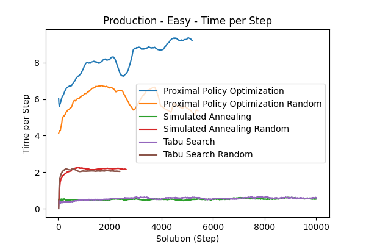</td><td></td></tr>
</table>

##### Summary Table (Final Values)

| Agent                               | Steps | Explored Solutions | Potential New Base Solutions | Average Cycle Time | Min Cycle Time | Average Batch Size | Iteration Number | Time per Step | Total Optimization Time     |
| :---------------------------------- | ----: | -----------------: | ---------------------------: | -----------------: | -------------: | -----------------: | ---------------: | ------------: | :-------------------------- |
| Proximal Policy Optimization        |  5181 |                433 |                              |        4.22143e+07 |     4.0297e+07 |            2.51078 |             5190 |       8.38344 | 718min (for 5181 Steps) |
| Proximal Policy Optimization Random |  5407 |                715 |                              |        4.25095e+07 |    4.10983e+07 |            2.15238 |             5417 |       6.30004 | 538min (for 5407 Steps) |
| Simulated Annealing                 | 10001 |                909 |                         4850 |        4.24021e+07 |    4.12154e+07 |                  2 |              510 |       0.18976 | 85min (for 10001 Steps) |
| Simulated Annealing Random          |  2626 |               1076 |                           22 |        4.23852e+07 |      4.115e+07 |            3.20748 |              868 |       1.39887 | 94min (for 2626 Steps)  |
| Tabu Search                         |  9991 |               1613 |                         1150 |        4.21807e+07 |    4.08895e+07 |            2.91931 |              470 |     0.0067332 | 92min (for 9991 Steps)  |
| Tabu Search Random                  |  2378 |                967 |                            0 |        4.22467e+07 |    4.05114e+07 |            2.42581 |              790 |       1.83766 | 82min (for 2378 Steps)  |

##### Pareto Front Images

<table><tr>
<th>Tabu Search</th>
<th>Tabu Search Random</th>
<th>Proximal Policy Optimization Random</th>
<th>Proximal Policy Optimization</th>
<th>Simulated Annealing</th>
<th>Simulated Annealing Random</th>
</tr><tr>
<td></td>
<td></td>
<td></td>
<td></td>
<td></td>
<td></td>
</tr></table>

---

#### Hard

##### Metric Plots

<table>
<tr><td><strong>Pareto Front Size</strong> </td><td><strong>Explored Solutions</strong> </td><td><strong>Potential New Base Solutions</strong> </td></tr>
<tr><td><strong>Average Cycle Time</strong> </td><td><strong>Min Cycle Time</strong> </td><td><strong>Average Batch Size</strong> </td></tr>
<tr><td><strong>Iteration Number</strong> </td><td><strong>Time per Step</strong> </td><td></td></tr>
</table>

##### Summary Table (Final Values)

| Agent                               | Steps | Explored Solutions | Potential New Base Solutions | Average Cycle Time | Min Cycle Time | Average Batch Size | Iteration Number | Time per Step | Total Optimization Time     |
| :---------------------------------- | ----: | -----------------: | ---------------------------: | -----------------: | -------------: | -----------------: | ---------------: | ------------: | :-------------------------- |
| Proximal Policy Optimization        |  5999 |                198 |                              |        4.26699e+07 |    4.14482e+07 |            2.69663 |             6009 |        4.8629 | 501min (for 5999 Steps) |
| Proximal Policy Optimization Random |  9991 |                454 |                              |        4.27135e+07 |    4.15109e+07 |            2.83544 |            10000 |       4.04198 | 683min (for 9991 Steps) |
| Simulated Annealing                 | 10006 |               1142 |                          478 |          4.275e+07 |    4.14388e+07 |            13.5676 |              478 |      0.131001 | 77min (for 10006 Steps) |
| Simulated Annealing Random          |   839 |                363 |                            0 |        4.25681e+07 |    4.18752e+07 |            16.7407 |              274 |       1.79834 | 30min (for 839 Steps)   |
| Tabu Search                         |  6988 |                421 |                         1607 |        4.27518e+07 |    4.12227e+07 |                2.6 |              349 |      0.196693 | 51min (for 6988 Steps)  |
| Tabu Search Random                  |   128 |                 38 |                            0 |        4.20802e+07 |    4.10975e+07 |            2.61017 |               40 |       1.43653 | 3min (for 128 Steps)    |

##### Pareto Front Images

<table><tr>
<th>Tabu Search</th>
<th>Simulated Annealing Random</th>
<th>Proximal Policy Optimization</th>
<th>Proximal Policy Optimization Random</th>
<th>Tabu Search Random</th>
<th>Simulated Annealing</th>
</tr><tr>
<td></td>
<td></td>
<td></td>
<td></td>
<td></td>
<td></td>
</tr></table>

---

#### Mid

##### Metric Plots

<table>
<tr><td><strong>Pareto Front Size</strong> </td><td><strong>Explored Solutions</strong> </td><td><strong>Potential New Base Solutions</strong> </td></tr>
<tr><td><strong>Average Cycle Time</strong> </td><td><strong>Min Cycle Time</strong> </td><td><strong>Average Batch Size</strong> </td></tr>
<tr><td><strong>Iteration Number</strong> </td><td><strong>Time per Step</strong> </td><td></td></tr>
</table>

##### Summary Table (Final Values)

| Agent                               | Steps | Explored Solutions | Potential New Base Solutions | Average Cycle Time | Min Cycle Time | Average Batch Size | Iteration Number | Time per Step | Total Optimization Time     |
| :---------------------------------- | ----: | -----------------: | ---------------------------: | -----------------: | -------------: | -----------------: | ---------------: | ------------: | :-------------------------- |
| Proximal Policy Optimization        |  8051 |               2676 |                              |        4.27068e+07 |    4.09376e+07 |            3.06264 |             8060 |       5.65617 | 718min (for 8051 Steps) |
| Proximal Policy Optimization Random |  8751 |               1528 |                              |        4.25273e+07 |     4.0404e+07 |             2.1759 |             8760 |       4.94335 | 718min (for 8751 Steps) |
| Simulated Annealing                 | 10008 |               1185 |                         4965 |        4.21387e+07 |    4.06497e+07 |            3.35955 |              533 |      0.151647 | 84min (for 10008 Steps) |
| Simulated Annealing Random          |  1067 |                494 |                            0 |        4.25709e+07 |     4.1036e+07 |            2.73571 |              353 |       2.06465 | 35min (for 1067 Steps)  |
| Tabu Search                         |  9996 |               2104 |                         1121 |        4.27049e+07 |    4.08916e+07 |            2.44721 |              528 |       1.03266 | 83min (for 9996 Steps)  |
| Tabu Search Random                  |   272 |                107 |                            0 |        4.21376e+07 |    4.09571e+07 |            2.53165 |               88 |      0.154355 | 8min (for 272 Steps)    |

##### Pareto Front Images

<table><tr>
<th>Proximal Policy Optimization</th>
<th>Tabu Search Random</th>
<th>Proximal Policy Optimization Random</th>
<th>Simulated Annealing</th>
<th>Simulated Annealing Random</th>
<th>Tabu Search</th>
</tr><tr>
<td></td>
<td></td>
<td></td>
<td></td>
<td></td>
<td></td>
</tr></table>

---

---

### Purchasing Example

#### Easy

##### Metric Plots

<table>
<tr><td><strong>Pareto Front Size</strong> </td><td><strong>Explored Solutions</strong> </td><td><strong>Potential New Base Solutions</strong> </td></tr>
<tr><td><strong>Average Cycle Time</strong> </td><td><strong>Min Cycle Time</strong> </td><td><strong>Average Batch Size</strong> </td></tr>
<tr><td><strong>Iteration Number</strong> </td><td><strong>Time per Step</strong> </td><td></td></tr>
</table>

##### Summary Table (Final Values)

| Agent                               | Steps | Explored Solutions | Potential New Base Solutions | Average Cycle Time | Min Cycle Time | Average Batch Size | Iteration Number | Time per Step | Total Optimization Time      |
| :---------------------------------- | ----: | -----------------: | ---------------------------: | -----------------: | -------------: | -----------------: | ---------------: | ------------: | :--------------------------- |
| Proximal Policy Optimization        |  2421 |                  8 |                              |        3.58564e+07 |    3.34401e+07 |            2.11585 |             2430 |        19.487 | 714min (for 2421 Steps)  |
| Proximal Policy Optimization Random |  2321 |                  6 |                              |        3.54005e+07 |    3.37608e+07 |            2.35095 |             2330 |       18.1589 | 716min (for 2321 Steps)  |
| Simulated Annealing                 | 10008 |                231 |                          791 |        3.54894e+07 |     3.4329e+07 |            2.01172 |              493 |      0.226194 | 297min (for 10008 Steps) |
| Simulated Annealing Random          |  1421 |                555 |                          106 |        3.55237e+07 |    3.36685e+07 |            3.26184 |              468 |       9.54707 | 291min (for 1421 Steps)  |
| Tabu Search                         |  9201 |                100 |                         6024 |        3.49465e+07 |    3.32426e+07 |            2.00156 |              460 |     0.0010273 | 297min (for 9201 Steps)  |
| Tabu Search Random                  |  2111 |                868 |                          395 |        3.54891e+07 |     3.4227e+07 |            2.11141 |              700 |       7.96246 | 298min (for 2111 Steps)  |

##### Pareto Front Images

<table><tr>
<th>Tabu Search</th>
<th>Simulated Annealing</th>
<th>Tabu Search Random</th>
<th>Proximal Policy Optimization Random</th>
<th>Proximal Policy Optimization</th>
</tr><tr>
<td></td>
<td></td>
<td></td>
<td></td>
<td></td>
</tr></table>

---

#### Hard

##### Metric Plots

<table>
<tr><td><strong>Pareto Front Size</strong> </td><td><strong>Explored Solutions</strong> </td><td><strong>Potential New Base Solutions</strong> </td></tr>
<tr><td><strong>Average Cycle Time</strong> </td><td><strong>Min Cycle Time</strong> </td><td><strong>Average Batch Size</strong> </td></tr>
<tr><td><strong>Iteration Number</strong> 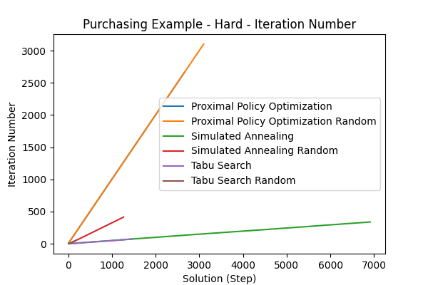</td><td><strong>Time per Step</strong> </td><td></td></tr>
</table>

##### Summary Table (Final Values)

| Agent                               | Steps | Explored Solutions | Potential New Base Solutions | Average Cycle Time | Min Cycle Time | Average Batch Size | Iteration Number | Time per Step | Total Optimization Time     |
| :---------------------------------- | ----: | -----------------: | ---------------------------: | -----------------: | -------------: | -----------------: | ---------------: | ------------: | :-------------------------- |
| Proximal Policy Optimization        |  2657 |                 19 |                              |         3.5661e+07 |    3.48879e+07 |            2.14517 |             2667 |        11.759 | 620min (for 2657 Steps) |
| Proximal Policy Optimization Random |  3091 |                 18 |                              |        3.55581e+07 |    3.47432e+07 |            2.31857 |             3100 |       10.7695 | 716min (for 3091 Steps) |
| Simulated Annealing                 |  6901 |                162 |                         1696 |        3.60005e+07 |    3.39881e+07 |            2.10809 |              338 |       3.16321 | 298min (for 6901 Steps) |
| Simulated Annealing Random          |  1258 |                541 |                            0 |        3.69597e+07 |    3.48729e+07 |            2.23595 |              414 |       6.03285 | 293min (for 1258 Steps) |
| Tabu Search                         |  1451 |                 19 |                          110 |         3.6573e+07 |    3.49784e+07 |            3.11605 |               73 |   0.000914311 | 297min (for 1451 Steps) |
| Tabu Search Random                  |   164 |                 50 |                            0 |        3.65412e+07 |    3.47237e+07 |            2.41566 |               52 |       7.24261 | 37min (for 164 Steps)   |

##### Pareto Front Images

<table><tr>
<th>Proximal Policy Optimization Random</th>
<th>Tabu Search Random</th>
<th>Simulated Annealing</th>
<th>Proximal Policy Optimization</th>
<th>Simulated Annealing Random</th>
</tr><tr>
<td></td>
<td></td>
<td></td>
<td></td>
<td></td>
</tr></table>

---

#### Mid

##### Metric Plots

<table>
<tr><td><strong>Pareto Front Size</strong> </td><td><strong>Explored Solutions</strong> </td><td><strong>Potential New Base Solutions</strong> </td></tr>
<tr><td><strong>Average Cycle Time</strong> </td><td><strong>Min Cycle Time</strong> </td><td><strong>Average Batch Size</strong> </td></tr>
<tr><td><strong>Iteration Number</strong> </td><td><strong>Time per Step</strong> </td><td></td></tr>
</table>

##### Summary Table (Final Values)

| Agent                               | Steps | Explored Solutions | Potential New Base Solutions | Average Cycle Time | Min Cycle Time | Average Batch Size | Iteration Number | Time per Step | Total Optimization Time     |
| :---------------------------------- | ----: | -----------------: | ---------------------------: | -----------------: | -------------: | -----------------: | ---------------: | ------------: | :-------------------------- |
| Proximal Policy Optimization        |  3121 |                 17 |                              |        3.57782e+07 |    3.45443e+07 |            2.02787 |             3130 |       13.5479 | 716min (for 3121 Steps) |
| Proximal Policy Optimization Random |  3121 |                 65 |                              |        3.66452e+07 |    3.46787e+07 |            2.11246 |             3130 |       10.9197 | 716min (for 3121 Steps) |
| Simulated Annealing                 |  9998 |                217 |                         5387 |         3.5673e+07 |    3.37916e+07 |            2.00307 |              480 |      0.819206 | 255min (for 9998 Steps) |
| Simulated Annealing Random          |  2231 |                983 |                           74 |        3.55964e+07 |    3.42911e+07 |             2.3916 |              738 |       10.7407 | 297min (for 2231 Steps) |
| Tabu Search                         |  9621 |                124 |                         4583 |        3.52817e+07 |    3.39773e+07 |            2.01115 |              498 |      0.001052 | 298min (for 9621 Steps) |
| Tabu Search Random                  |   197 |                 75 |                            0 |        3.54491e+07 |    3.45946e+07 |             2.0785 |               63 |       8.48498 | 25min (for 197 Steps)   |

##### Pareto Front Images

<table><tr>
<th>Proximal Policy Optimization Random</th>
<th>Simulated Annealing Random</th>
<th>Proximal Policy Optimization</th>
<th>Simulated Annealing</th>
<th>Tabu Search Random</th>
<th>Tabu Search</th>
</tr><tr>
<td></td>
<td>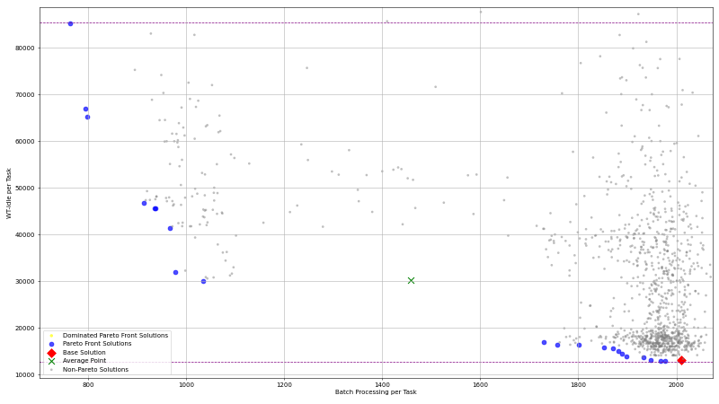</td>
<td></td>
<td></td>
<td></td>
<td></td>
</tr></table>

---

---

### Sepsis Das

#### Easy

##### Metric Plots

<table>
<tr><td><strong>Pareto Front Size</strong> </td><td><strong>Explored Solutions</strong> </td><td><strong>Potential New Base Solutions</strong> </td></tr>
<tr><td><strong>Average Cycle Time</strong> </td><td><strong>Min Cycle Time</strong> </td><td><strong>Average Batch Size</strong> </td></tr>
<tr><td><strong>Iteration Number</strong> </td><td><strong>Time per Step</strong> </td><td></td></tr>
</table>

##### Summary Table (Final Values)

| Agent                               | Steps | Explored Solutions | Potential New Base Solutions | Average Cycle Time | Min Cycle Time | Average Batch Size | Iteration Number | Time per Step | Total Optimization Time     |
| :---------------------------------- | ----: | -----------------: | ---------------------------: | -----------------: | -------------: | -----------------: | ---------------: | ------------: | :-------------------------- |
| Proximal Policy Optimization        |  4821 |                  7 |                              |        4.88522e+07 |    4.54373e+07 |            2.65374 |             4830 |        8.7928 | 716min (for 4821 Steps) |
| Proximal Policy Optimization Random |  2839 |                 18 |                              |        4.88577e+07 |    4.68795e+07 |            2.28247 |             2849 |       10.2445 | 445min (for 2839 Steps) |
| Simulated Annealing                 |    81 |                  1 |                           69 |        4.98798e+07 |    4.98798e+07 |             2.1224 |                4 |     0.0010123 | 1min (for 81 Steps)     |
| Simulated Annealing Random          |  2622 |               1180 |                         1008 |         5.0022e+07 |    4.72417e+07 |            3.66416 |              868 |      0.631759 | 280min (for 2622 Steps) |
| Tabu Search                         |   101 |                  1 |                           30 |        4.93868e+07 |    4.81111e+07 |            2.46034 |                5 |    0.00157211 | 1min (for 101 Steps)    |
| Tabu Search Random                  |  2501 |               1126 |                         1136 |        4.91912e+07 |    4.70545e+07 |            2.37901 |              830 |       6.26755 | 298min (for 2501 Steps) |

##### Pareto Front Images

<table><tr>
<th>Proximal Policy Optimization Random</th>
<th>Proximal Policy Optimization</th>
<th>Tabu Search Random</th>
<th>Simulated Annealing Random</th>
</tr><tr>
<td></td>
<td></td>
<td></td>
<td></td>
</tr></table>

---

#### Hard

##### Metric Plots

<table>
<tr><td><strong>Pareto Front Size</strong> </td><td><strong>Explored Solutions</strong> </td><td><strong>Potential New Base Solutions</strong> </td></tr>
<tr><td><strong>Average Cycle Time</strong> </td><td><strong>Min Cycle Time</strong> </td><td><strong>Average Batch Size</strong> </td></tr>
<tr><td><strong>Iteration Number</strong> </td><td><strong>Time per Step</strong> </td><td></td></tr>
</table>

##### Summary Table (Final Values)

| Agent                               | Steps | Explored Solutions | Potential New Base Solutions | Average Cycle Time | Min Cycle Time | Average Batch Size | Iteration Number | Time per Step | Total Optimization Time     |
| :---------------------------------- | ----: | -----------------: | ---------------------------: | -----------------: | -------------: | -----------------: | ---------------: | ------------: | :-------------------------- |
| Proximal Policy Optimization        |  2945 |                  9 |                              |        8.00567e+07 |    7.97912e+07 |            2.32697 |             2955 |       7.66747 | 403min (for 2945 Steps) |
| Proximal Policy Optimization Random |  3855 |                 15 |                              |        7.93788e+07 |    7.79051e+07 |            2.81407 |             3865 |       9.76478 | 510min (for 3855 Steps) |
| Simulated Annealing                 |   131 |                  2 |                          114 |        7.80104e+07 |    7.74798e+07 |            2.10698 |                7 |     0.0012939 | 2min (for 131 Steps)    |
| Simulated Annealing Random          |  2231 |                926 |                           36 |        1.16187e+08 |    9.51691e+07 |            3.42619 |              740 |       6.37437 | 297min (for 2231 Steps) |
| Tabu Search                         |   121 |                  1 |                           20 |        8.00764e+07 |    7.80771e+07 |             2.1309 |                6 |    0.00122361 | 2min (for 121 Steps)    |
| Tabu Search Random                  |    17 |                  1 |                            0 |        7.79835e+07 |    7.79835e+07 |            2.11549 |                3 |       3.10532 | 0min (for 17 Steps)     |

##### Pareto Front Images

<table><tr>
<th>Tabu Search Random</th>
<th>Simulated Annealing Random</th>
<th>Proximal Policy Optimization Random</th>
<th>Proximal Policy Optimization</th>
</tr><tr>
<td></td>
<td></td>
<td></td>
<td></td>
</tr></table>

---

#### Mid

##### Metric Plots

<table>
<tr><td><strong>Pareto Front Size</strong> </td><td><strong>Explored Solutions</strong> </td><td><strong>Potential New Base Solutions</strong> </td></tr>
<tr><td><strong>Average Cycle Time</strong> </td><td><strong>Min Cycle Time</strong> </td><td><strong>Average Batch Size</strong> </td></tr>
<tr><td><strong>Iteration Number</strong> </td><td><strong>Time per Step</strong> 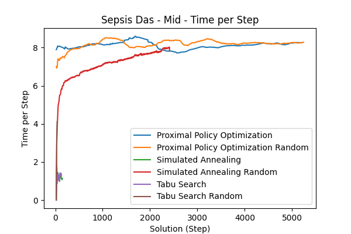</td><td></td></tr>
</table>

##### Summary Table (Final Values)

| Agent                               | Steps | Explored Solutions | Potential New Base Solutions | Average Cycle Time | Min Cycle Time | Average Batch Size | Iteration Number | Time per Step | Total Optimization Time     |
| :---------------------------------- | ----: | -----------------: | ---------------------------: | -----------------: | -------------: | -----------------: | ---------------: | ------------: | :-------------------------- |
| Proximal Policy Optimization        |  5207 |                 20 |                              |        9.44429e+07 |     8.5317e+07 |            2.51837 |             5217 |        8.0266 | 705min (for 5207 Steps) |
| Proximal Policy Optimization Random |  5231 |                 47 |                              |        7.47033e+07 |    7.14556e+07 |            2.55251 |             5240 |       8.67956 | 717min (for 5231 Steps) |
| Simulated Annealing                 |   141 |                  2 |                          152 |         7.4814e+07 |     7.4814e+07 |             2.7255 |                8 |       2.00736 | 2min (for 141 Steps)    |
| Simulated Annealing Random          |  2402 |               1045 |                            0 |        1.00127e+08 |    9.36153e+07 |            3.30269 |              798 |      0.234691 | 293min (for 2402 Steps) |
| Tabu Search                         |   121 |                  1 |                           18 |        7.27851e+07 |    7.11963e+07 |            2.30249 |                6 |     0.0011708 | 2min (for 121 Steps)    |
| Tabu Search Random                  |    29 |                  4 |                            0 |        7.50737e+07 |    7.50737e+07 |            3.06194 |                7 |       5.81616 | 1min (for 29 Steps)     |

##### Pareto Front Images

<table><tr>
<th>Simulated Annealing Random</th>
<th>Tabu Search Random</th>
<th>Proximal Policy Optimization</th>
<th>Proximal Policy Optimization Random</th>
</tr><tr>
<td></td>
<td></td>
<td></td>
<td></td>
</tr></table>

---

---

### Trafic Das

#### Easy

##### Metric Plots

<table>
<tr><td><strong>Pareto Front Size</strong> </td><td><strong>Explored Solutions</strong> </td><td><strong>Potential New Base Solutions</strong> </td></tr>
<tr><td><strong>Average Cycle Time</strong> </td><td><strong>Min Cycle Time</strong> </td><td><strong>Average Batch Size</strong> </td></tr>
<tr><td><strong>Iteration Number</strong> </td><td><strong>Time per Step</strong> </td><td></td></tr>
</table>

##### Summary Table (Final Values)

| Agent                               | Steps | Explored Solutions | Potential New Base Solutions | Average Cycle Time | Min Cycle Time | Average Batch Size | Iteration Number | Time per Step | Total Optimization Time     |
| :---------------------------------- | ----: | -----------------: | ---------------------------: | -----------------: | -------------: | -----------------: | ---------------: | ------------: | :-------------------------- |
| Proximal Policy Optimization        |  4808 |                136 |                              |        2.55899e+06 |         607541 |            21.3091 |             4818 |       5.81425 | 415min (for 4808 Steps) |
| Proximal Policy Optimization Random |  6224 |                414 |                              |             832854 |        89304.5 |            6.77143 |             6234 |       5.06246 | 427min (for 6224 Steps) |
| Simulated Annealing                 |  9992 |                427 |                         2248 |        2.33455e+06 |    1.46994e+06 |            2.56383 |              577 |       4.71075 | 119min (for 9992 Steps) |
| Simulated Annealing Random          |  2614 |               1327 |                          243 |        2.59429e+06 |    1.73049e+06 |            3.97904 |              868 |       4.64431 | 186min (for 2614 Steps) |
| Tabu Search                         |  7057 |                216 |                         3412 |        2.31422e+06 |    1.90354e+06 |            3.61417 |              485 |       2.00739 | 101min (for 7057 Steps) |
| Tabu Search Random                  |  2615 |               1405 |                          383 |        1.78164e+06 |         866616 |            4.03289 |              868 |       2.71143 | 153min (for 2615 Steps) |

##### Pareto Front Images

<table><tr>
<th>Simulated Annealing</th>
<th>Tabu Search</th>
<th>Proximal Policy Optimization Random</th>
<th>Proximal Policy Optimization</th>
<th>Tabu Search Random</th>
<th>Simulated Annealing Random</th>
</tr><tr>
<td></td>
<td></td>
<td></td>
<td></td>
<td></td>
<td></td>
</tr></table>

---

#### Hard

##### Metric Plots

<table>
<tr><td><strong>Pareto Front Size</strong> </td><td><strong>Explored Solutions</strong> </td><td><strong>Potential New Base Solutions</strong> </td></tr>
<tr><td><strong>Average Cycle Time</strong> </td><td><strong>Min Cycle Time</strong> </td><td><strong>Average Batch Size</strong> </td></tr>
<tr><td><strong>Iteration Number</strong> 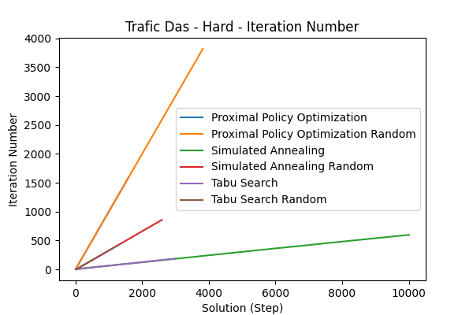</td><td><strong>Time per Step</strong> </td><td></td></tr>
</table>

##### Summary Table (Final Values)

| Agent                               | Steps | Explored Solutions | Potential New Base Solutions | Average Cycle Time | Min Cycle Time | Average Batch Size | Iteration Number | Time per Step | Total Optimization Time     |
| :---------------------------------- | ----: | -----------------: | ---------------------------: | -----------------: | -------------: | -----------------: | ---------------: | ------------: | :-------------------------- |
| Proximal Policy Optimization        |  1581 |                 44 |                              |        1.23984e+07 |    3.63188e+06 |            7.29797 |             1590 |         46.16 | 712min (for 1581 Steps) |
| Proximal Policy Optimization Random |  3811 |                280 |                              |        1.14576e+07 |    8.03874e+06 |            9.57933 |             3820 |       12.2776 | 716min (for 3811 Steps) |
| Simulated Annealing                 |  9997 |                573 |                          773 |        6.02035e+07 |    3.89093e+06 |            2.17771 |              598 |      0.238621 | 142min (for 9997 Steps) |
| Simulated Annealing Random          |  2581 |               1185 |                          165 |        3.05005e+07 |    2.59431e+06 |            2.08344 |              857 |       5.73251 | 298min (for 2581 Steps) |
| Tabu Search                         |  2977 |                181 |                         1214 |        4.54628e+06 |    4.14764e+06 |            2.01762 |              186 |     0.0343043 | 47min (for 2977 Steps)  |
| Tabu Search Random                  |  1286 |                600 |                            0 |        5.49233e+07 |    2.94059e+06 |                2.5 |              426 |       3.56618 | 184min (for 1286 Steps) |

##### Pareto Front Images

<table><tr>
<th>Simulated Annealing</th>
<th>Tabu Search</th>
<th>Simulated Annealing Random</th>
<th>Proximal Policy Optimization Random</th>
<th>Tabu Search Random</th>
</tr><tr>
<td></td>
<td></td>
<td></td>
<td></td>
<td></td>
</tr></table>

---

#### Mid

##### Metric Plots

<table>
<tr><td><strong>Pareto Front Size</strong> </td><td><strong>Explored Solutions</strong> </td><td><strong>Potential New Base Solutions</strong> </td></tr>
<tr><td><strong>Average Cycle Time</strong> 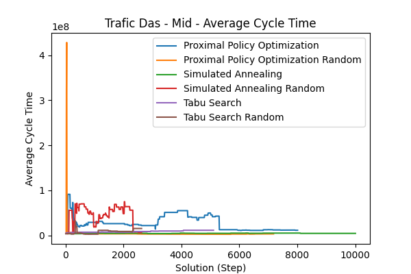</td><td><strong>Min Cycle Time</strong> </td><td><strong>Average Batch Size</strong> 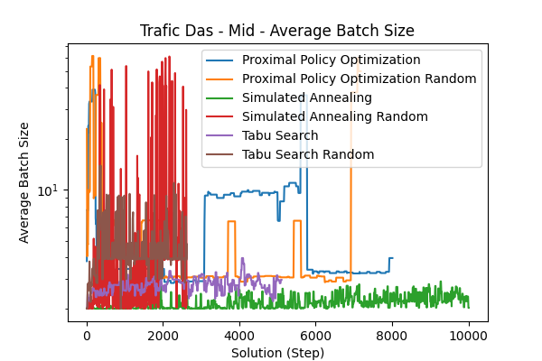</td></tr>
<tr><td><strong>Iteration Number</strong> </td><td><strong>Time per Step</strong> </td><td></td></tr>
</table>

##### Summary Table (Final Values)

| Agent                               | Steps | Explored Solutions | Potential New Base Solutions | Average Cycle Time | Min Cycle Time | Average Batch Size | Iteration Number | Time per Step | Total Optimization Time     |
| :---------------------------------- | ----: | -----------------: | ---------------------------: | -----------------: | -------------: | -----------------: | ---------------: | ------------: | :-------------------------- |
| Proximal Policy Optimization        |  8001 |                170 |                              |        1.15895e+07 |    1.47119e+06 |            3.97139 |             8010 |       5.28506 | 717min (for 8001 Steps) |
| Proximal Policy Optimization Random |  7171 |                146 |                              |        3.52303e+06 |    1.29862e+06 |            49.9739 |             7180 |       5.20373 | 717min (for 7171 Steps) |
| Simulated Annealing                 |  9998 |                522 |                         1045 |        4.66844e+06 |    4.15021e+06 |            2.02184 |              573 |      0.437328 | 197min (for 9998 Steps) |
| Simulated Annealing Random          |  2614 |               1160 |                          119 |        6.54016e+06 |         520078 |              2.102 |              868 |       6.59526 | 258min (for 2614 Steps) |
| Tabu Search                         |  5098 |                229 |                         2118 |        1.15793e+07 |    5.70311e+06 |            2.95782 |              276 |      0.121986 | 61min (for 5098 Steps)  |
| Tabu Search Random                  |  2615 |               1306 |                          723 |        1.55542e+07 |    1.47197e+06 |            3.90977 |              868 |       4.81121 | 188min (for 2615 Steps) |

##### Pareto Front Images

<table><tr>
<th>Simulated Annealing</th>
<th>Tabu Search</th>
<th>Simulated Annealing Random</th>
<th>Proximal Policy Optimization</th>
<th>Proximal Policy Optimization Random</th>
<th>Tabu Search Random</th>
</tr><tr>
<td></td>
<td></td>
<td></td>
<td></td>
<td></td>
<td></td>
</tr></table>

---

---

# Installation & Basic Usage

### Installation

1. Create a fresh Python 3.10 virtual environment, e.g. with `conda create --name optimos-python python=3.10`
1. Install `poetry` on your system by following the [offical guide](https://python-poetry.org/docs/#installation). Make sure, poetry is **NOT** installed in the virtual environment.
1. Activate the environment, e.g. with `conda activate optimos-python`
1. Run `poetry install` in the root directory of this repository

### Standalone Usage

_For now there is no CLI interface for the optimizer, so you have to modify the `main.py` script to your needs_

1. Open `main.py` in your editor
1. Change the `timetable_path`, `constraints_path` and `bpmn_path` to your needs.
   - _If you need a basic set of constraints for your model, you can use the `create_constraints.py` script_
1. Run `python main.py` to start the optimizer, you will see the output and process in the console
1. _If you want to change settings like the number of iterations you can do so in the `main.py` script as well_
1. **LEGACY OPTIMOS SUPPORT**: If you want optimos_v2 to behave like the old optimos, you can set the `optimos_legacy_mode` setting to True. This will disable all batching optimizations.

### Usage within PIX (docker)

1. Install Docker and Docker-Compose, refer to the [official website](https://docs.docker.com/get-docker/) for installation instructions
2. Clone the [pix-portal](https://github.com/AutomatedProcessImprovement/pix-portal) repository (`git clone https://github.com/AutomatedProcessImprovement/pix-portal.git`)
3. Checkout the `integrate-optimos-v2` branch (`git checkout integrate-optimos-v2`)
4. Create the following secrets:
   - `frontend/pix-web-ui/.session.secret`
   - `backend/services/api-server/.superuser_email.secret`
   - `backend/services/api-server/.system_email.secret`
   - `backend/services/api-server/.superuser_password.secret`
   - `backend/services/api-server/.key.secret`
   - `backend/services/api-server/.system_password.secret`
   - _For local development/testing you can just fill them with example values, e.g. "secret" or "secret@secret.secret"._
   - Furthermore create the following files: `backend/workers/mail/.secret_gmail_username` & `backend/workers/mail/.secret_gmail_app_password`;
     Those are the credentials for the gmail account that sends out mails. The Password is a [gmail app password](https://knowledge.workspace.google.com/kb/how-to-create-app-passwords-000009237), not the actual password. If you don't want to send out mails, you still need to create the files, but can enter any value.
5. Create the following `.env` files:
   - `backend/workers/mail/.env`
   - `backend/workers/kronos/.env`
   - `backend/workers/simulation-prosimos/.env`
   - `backend/workers/bps-discovery-simod/.env`
   - `backend/workers/optimos/.env`
   - `backend/services/api-server/.env`
   - `backend/services/kronos/.env`
   - _You will find a `.env.example` file in each of the folders, you can copy those file and rename them to `.env`_
6. Run `docker compose up --build` in the root directory of the pix-portal repository. You may add the `-d` flag to run it in detached mode, so you can close the terminal afterwards.
7. _This will take some time_
8. Open your browser and go to `localhost:9999`. You can use the credentials from the `.superuser_email.secret` and `.superuser_password.secret` files to login.

### Usage within PIX (local + debugging)

1. Do all of the **Usage within PIX (docker)** steps above
2. Stop the docker-based optimos: `docker compose stop optimos`
3. Modify the `backend/workers/optimos/.env` file to use the local host instead of the docker container, you can rename `.env.example-local` to `.env` for that
4. Create a new Python 3.10 virtual environment (e.g. with `conda create --name optimos-python python=3.10`)
5. Activate the environment, e.g. with `conda activate optimos-python`
6. Navigate to the `backend/workers/optimos` folder in the pix repo
7. Install the dependencies with `poetry install`
8. Start the optimos worker with `python python optimos_worker/main.py`
9. **Alteratively**: Start the optimos worker with the vs code debugger by running the `Launch Optimos Worker` configuration (most likely you'll need to adjust the python binary used there, you can do that in the `.vscode/launch.json` file)

## Development

### Updating the Optimos Version used by PIX

_If you have pushed commits to the master, this change needs to be picked up by PIX, to do that do the following:_

1. Navigate to the folder `backend/workers/optimos` in the pix project
1. Update the `poetry.lock` file: `poetry lock`
1. Rebuild & restart the optimos container: `docker compose up -d --build optimos`

### Running Tests

To run the tests, run `pytest`. The tests should also automatically show up in the test explorer of your IDE. (For VSCode, you need to install the [Python extension](https://marketplace.visualstudio.com/items?itemName=ms-python.python))

### Collecting Coverage

To collect coverage, run `pytest --cov --cov-report=lcov:lcov.info --cov-report=term`. You can display it e.g. with the vscode extension [Coverage Gutters](https://marketplace.visualstudio.com/items?itemName=ryanluker.vscode-coverage-gutters).

## Docs

While the code should be documented in most places, you can find additional information on e.g. the architecture in the [docs folder](./docs/)

## Improvements over Legacy Optimos

- **Support to optimize Batching**
- Fully Typed
- Unit Tested (with ~90% coverage)
- Follows a Action-Store-Reducer pattern, similar to Flux
- Multi-Threaded at important parts, takes cpu core count of host machine into account
- Almost all public interfaces are documented
- Class-Based (Not a huge monolithic script)
- No throwaway file creation; Everything in memory
- Immutable Data Structures, so no change to the timetable is ever unexpected
